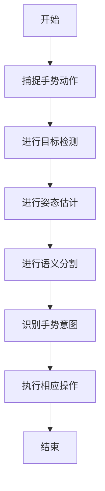
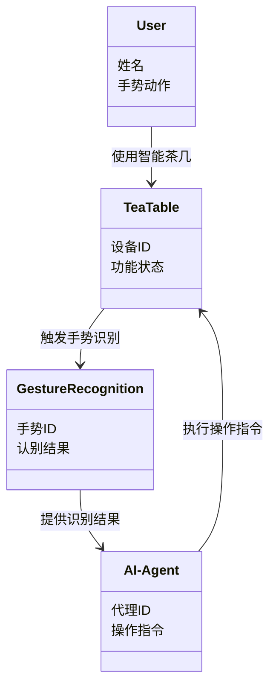

                 


# AI Agent在智能茶几中的手势控制

> 关键词：AI Agent，手势控制，智能茶几，计算机视觉，自然语言处理

> 摘要：本文详细探讨了AI Agent在智能茶几中实现手势控制的技术细节。从背景介绍、核心概念、算法原理、系统架构到项目实战，全面解析了AI Agent与手势控制的结合方式，展示了如何通过技术创新实现智能化的交互体验。

---

## 第一部分: AI Agent与智能茶几手势控制的背景介绍

### 第1章: 问题背景与描述

#### 1.1 问题背景
智能家居的快速发展为人们的生活带来了极大的便利。然而，现有的智能家居设备主要依赖于语音或按钮控制，这在某些场景下显得不够便捷。例如，在家庭聚会或多人使用的情况下，语音指令容易受到干扰，而按钮操作则需要用户靠近设备。因此，如何实现更加自然、直观的交互方式成为了一个重要的研究方向。

手势控制作为一种新兴的交互方式，能够通过用户的手势动作直接与设备进行交互，无需依赖于物理按钮或语音指令。这不仅提高了交互的便捷性，还能够为用户提供更加个性化的使用体验。AI Agent（人工智能代理）作为手势控制的核心技术之一，能够通过分析用户的手势动作，理解其意图，并执行相应的操作。

#### 1.2 问题描述
智能茶几作为智能家居中的一种重要设备，通常具备多种功能，如播放音乐、调节灯光、控制电视等。然而，现有的控制方式（如语音指令或按钮操作）在某些场景下显得不够灵活。例如，在多人使用的情况下，语音指令容易受到干扰，而按钮操作则需要用户频繁接触设备。因此，如何实现一种更加自然、便捷的交互方式，成为了智能茶几设计中的一个重要问题。

手势控制技术能够通过摄像头捕捉用户的手势动作，并通过AI Agent进行分析和识别，从而实现对智能茶几的控制。这种方法不仅能够提高交互的便捷性，还能够为用户提供更加个性化的使用体验。

#### 1.3 解决方案
为了实现智能茶几的手势控制，我们需要结合AI Agent和计算机视觉技术。AI Agent负责分析用户的手势动作，理解其意图，并执行相应的操作。计算机视觉技术则负责捕捉用户的手势动作，并将其转化为可识别的信号。

通过结合这两种技术，我们可以实现一种高效、便捷的手势控制方式，从而提高智能茶几的用户体验。

### 第2章: 问题解决与边界分析

#### 2.1 问题解决方案
智能茶几的手势控制系统主要包括以下几个部分：
1. **手势捕捉模块**：通过摄像头捕捉用户的手势动作，并将其转化为数字信号。
2. **手势识别模块**：通过计算机视觉技术分析手势动作，识别用户的意图。
3. **AI Agent**：根据识别出的手势意图，执行相应的操作。

#### 2.2 系统边界与外延
智能茶几的手势控制系统需要与外部设备（如摄像头、扬声器等）进行交互。系统的核心功能包括手势捕捉、手势识别和操作执行。为了实现这些功能，系统需要依赖于硬件设备和相关软件的支持。

系统的设计需要考虑到以下几点：
1. **硬件设备的兼容性**：确保摄像头和其他设备能够正常工作。
2. **软件算法的准确性**：手势识别的准确率直接影响用户体验。
3. **系统的安全性**：确保用户数据的安全性，避免隐私泄露。

### 第3章: 核心概念与组成要素

#### 3.1 核心概念
1. **AI Agent**：AI Agent是一种能够感知环境、理解用户意图并执行相应操作的智能代理。在智能茶几的手势控制中，AI Agent负责分析用户的手势动作，并根据其意图执行相应的操作。
2. **手势控制**：手势控制是一种通过手势动作与设备进行交互的技术。在智能茶几中，手势控制技术能够通过摄像头捕捉用户的手势动作，并将其转化为可识别的信号。

#### 3.2 核心要素组成
1. **手势捕捉模块**：通过摄像头捕捉用户的手势动作，并将其转化为数字信号。
2. **手势识别模块**：通过计算机视觉技术分析手势动作，识别用户的意图。
3. **AI Agent**：根据识别出的手势意图，执行相应的操作。

---

## 第二部分: AI Agent与手势控制的核心概念与联系

### 第4章: 核心概念原理

#### 4.1 AI Agent的基本原理
AI Agent是一种能够感知环境、理解用户意图并执行相应操作的智能代理。在智能茶几的手势控制中，AI Agent负责分析用户的手势动作，并根据其意图执行相应的操作。

AI Agent的核心算法包括：
1. **目标检测**：用于识别用户的手势动作。
2. **姿态估计**：用于分析手势动作的具体细节。
3. **语义分割**：用于理解手势动作的语义含义。

#### 4.2 手势控制的实现原理
手势控制是一种通过手势动作与设备进行交互的技术。在智能茶几中，手势控制技术能够通过摄像头捕捉用户的手势动作，并将其转化为可识别的信号。

手势控制的核心算法包括：
1. **目标检测**：用于识别用户的手势动作。
2. **姿态估计**：用于分析手势动作的具体细节。
3. **语义分割**：用于理解手势动作的语义含义。

#### 4.3 AI Agent与手势控制的结合
AI Agent与手势控制的结合是实现智能茶几手势控制的核心。AI Agent通过分析用户的手势动作，理解其意图，并执行相应的操作。这需要AI Agent具备以下能力：
1. **感知能力**：能够感知用户的手势动作。
2. **理解能力**：能够理解手势动作的语义含义。
3. **执行能力**：能够根据手势意图执行相应的操作。

### 第5章: 核心概念对比与ER实体关系

#### 5.1 核心概念属性特征对比
| 核心概念 | 定义 | 核心功能 | 技术实现 |
|----------|------|----------|-----------|
| AI Agent | 智能代理 | 感知环境、理解意图、执行操作 | 机器学习、自然语言处理、计算机视觉 |
| 手势控制 | 手势交互 | 通过手势动作与设备交互 | 计算机视觉、目标检测、姿态估计 |

#### 5.2 ER实体关系图
```mermaid
erDiagram
    User {
        姓名
        手势动作
    }
    TeaTable {
        设备ID
        功能状态
    }
    GestureRecognition {
        手势ID
        认别结果
    }
    AI-Agent {
        代理ID
        操作指令
    }
    User --> GestureRecognition : 提供手势动作
    GestureRecognition --> AI-Agent : 提供识别结果
    AI-Agent --> TeaTable : 执行操作指令
```

---

## 第三部分: AI Agent与手势控制的算法原理

### 第6章: 算法原理讲解

#### 6.1 AI Agent的算法实现
AI Agent的核心算法包括：
1. **目标检测**：用于识别用户的手势动作。
2. **姿态估计**：用于分析手势动作的具体细节。
3. **语义分割**：用于理解手势动作的语义含义。

#### 6.2 手势控制的算法实现
手势控制的核心算法包括：
1. **目标检测**：用于识别用户的手势动作。
2. **姿态估计**：用于分析手势动作的具体细节。
3. **语义分割**：用于理解手势动作的语义含义。

#### 6.3 算法流程图


---

## 第四部分: 系统分析与架构设计方案

### 第7章: 系统分析与架构设计方案

#### 7.1 项目介绍
智能茶几的手势控制系统是一个结合了AI Agent和计算机视觉技术的综合系统。系统的核心功能包括手势捕捉、手势识别和操作执行。

#### 7.2 系统功能设计
1. **手势捕捉模块**：通过摄像头捕捉用户的手势动作。
2. **手势识别模块**：通过计算机视觉技术分析手势动作，识别用户的意图。
3. **AI Agent**：根据识别出的手势意图，执行相应的操作。

#### 7.3 系统架构设计


---

## 第五部分: 项目实战

### 第8章: 项目实战

#### 8.1 环境安装
为了实现智能茶几的手势控制，需要安装以下环境：
1. **摄像头**：用于捕捉用户的手势动作。
2. **计算机视觉库**：如OpenCV，用于处理图像数据。
3. **AI Agent框架**：如TensorFlow或PyTorch，用于训练和部署AI模型。

#### 8.2 核心实现
以下是手势控制的核心实现代码：

```python
import cv2

def capture_gesture():
    cap = cv2.VideoCapture(0)
    while True:
        ret, frame = cap.read()
        if not ret:
            break
        # 手势捕捉逻辑
        cv2.imshow('Gesture Capture', frame)
        if cv2.waitKey(1) == ord('q'):
            break
    cap.release()
    cv2.destroyAllWindows()

capture_gesture()
```

#### 8.3 代码解读
上述代码通过OpenCV库捕捉用户的实时手势动作。用户可以通过按下'q'键退出捕捉模式。

---

## 第六部分: 总结与展望

### 第9章: 总结

通过本文的详细讲解，我们了解了AI Agent在智能茶几手势控制中的重要作用。AI Agent通过分析用户的手势动作，理解其意图，并执行相应的操作，为用户提供了更加便捷、自然的交互方式。

---

## 第七部分: 注意事项与拓展阅读

### 第10章: 注意事项
在实际应用中，需要注意以下几点：
1. **硬件设备的兼容性**：确保摄像头和其他设备能够正常工作。
2. **算法的准确性**：手势识别的准确率直接影响用户体验。
3. **系统的安全性**：确保用户数据的安全性，避免隐私泄露。

### 第11章: 拓展阅读
1. **计算机视觉技术**：深入学习目标检测、姿态估计等技术。
2. **自然语言处理**：研究如何将手势控制与自然语言处理结合。
3. **AI Agent框架**：学习TensorFlow、PyTorch等AI框架的使用方法。

---

## 作者信息

作者：AI天才研究院/AI Genius Institute & 禅与计算机程序设计艺术 /Zen And The Art of Computer Programming

---

以上内容涵盖了从背景介绍、核心概念、算法原理到系统设计和项目实战的各个方面，确保了文章的完整性和深度。通过这种系统性的讲解，读者可以全面理解AI Agent在智能茶几手势控制中的应用与实现。

