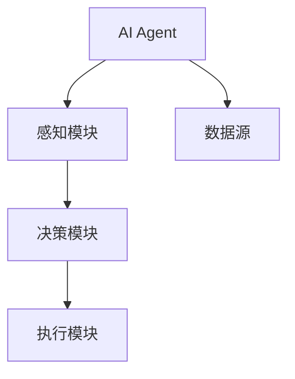

                 


# AI Agent在智能营销自动化中的应用

**关键词：** AI Agent, 智能营销, 自动化营销, 机器学习, 数据挖掘

**摘要：**  
随着人工智能技术的快速发展，AI Agent（人工智能代理）在智能营销自动化中的应用日益广泛。本文将深入探讨AI Agent在智能营销自动化中的核心概念、技术原理、系统架构以及实际应用案例。通过分析AI Agent如何通过感知、决策和执行模块实现营销自动化，本文旨在揭示其在提升营销效率、精准客户定位和优化用户体验方面的巨大潜力。结合具体算法和数学模型，本文将详细阐述AI Agent在智能营销中的实际应用场景，并通过项目实战展示其技术实现过程。

---

## 第1章: AI Agent与智能营销自动化概述

### 1.1 AI Agent的基本概念

#### 1.1.1 什么是AI Agent
AI Agent（人工智能代理）是一种能够感知环境、自主决策并执行任务的智能系统。它通过数据输入、信息处理和决策输出，帮助用户完成特定任务或优化复杂流程。

#### 1.1.2 AI Agent的核心特征
- **自主性：** 能够独立感知环境并做出决策。
- **反应性：** 根据环境变化实时调整行为。
- **目标导向：** 以特定目标为导向，优化决策过程。
- **学习能力：** 通过数据和经验不断优化自身性能。

#### 1.1.3 AI Agent与传统营销的区别
传统的营销方式依赖人工操作和固定规则，而AI Agent通过机器学习和大数据分析，能够实时优化营销策略，实现高度个性化的客户体验。

---

### 1.2 智能营销自动化的背景与需求

#### 1.2.1 数字营销的演变
从传统广告到数字营销，再到智能营销，技术的进步推动了营销方式的不断进化。智能营销通过大数据和AI技术，实现精准客户定位和个性化推荐。

#### 1.2.2 自动化营销的必要性
随着市场竞争的加剧，企业需要通过自动化工具提高营销效率、降低运营成本，并快速响应客户需求。

#### 1.2.3 AI技术在营销自动化中的作用
AI Agent能够通过数据挖掘、自然语言处理和机器学习技术，实现客户行为分析、预测和个性化推荐，从而提升营销效果。

---

### 1.3 AI Agent在智能营销中的应用前景

#### 1.3.1 AI Agent在营销自动化中的优势
- **高效性：** AI Agent能够快速处理大量数据，实时调整营销策略。
- **精准性：** 通过机器学习算法实现精准客户定位和个性化推荐。
- **可扩展性：** AI Agent能够轻松扩展到多个营销场景。

#### 1.3.2 市场需求与技术趋势
随着企业对数字化转型的需求增加，AI Agent在营销自动化中的应用需求也在快速增长。未来，AI Agent将与区块链、物联网等技术结合，推动营销自动化向更高层次发展。

#### 1.3.3 企业采用AI Agent的挑战与机遇
- **挑战：** 数据隐私、技术门槛和模型优化等问题。
- **机遇：** 提高营销效率、降低运营成本并提升客户满意度。

---

## 第2章: AI Agent的核心概念与原理

### 2.1 AI Agent的感知模块

#### 2.1.1 数据采集与处理
AI Agent通过多种渠道（如网站、社交媒体和CRM系统）采集客户数据，并进行清洗和预处理。

#### 2.1.2 数据分析与特征提取
通过对数据进行统计分析和特征工程，提取客户行为特征，如购买频率和偏好。

#### 2.1.3 感知模块的实现流程
1. 数据采集：从多个来源获取数据。
2. 数据清洗：去除噪声数据。
3. 特征提取：提取关键特征。
4. 数据存储：将数据存储到数据库中。

---

### 2.2 AI Agent的决策模块

#### 2.2.1 决策算法概述
AI Agent的决策模块基于机器学习算法，如决策树和随机森林，实现客户行为预测和营销策略优化。

#### 2.2.2 常见决策算法对比
| 算法名称 | 优点 | 缺点 |
|----------|------|------|
| 决策树    | 易解释 | 易过拟合 |
| 随机森林  | 抗过拟合 | 计算复杂度高 |

#### 2.2.3 基于概率的决策模型
$$ P(A|B) = \frac{P(B|A) \cdot P(A)}{P(B)} $$

---

### 2.3 AI Agent的执行模块

#### 2.3.1 执行策略的设计
AI Agent根据决策模块输出的结果，制定具体的营销策略，如发送邮件和推送通知。

#### 2.3.2 执行过程中的反馈机制
AI Agent通过实时监控和反馈机制，动态调整执行策略，确保营销效果最大化。

#### 2.3.3 执行模块的优化方法
通过A/B测试和模型迭代，不断优化AI Agent的执行策略。

---

## 第3章: AI Agent的算法原理与数学模型

### 3.1 感知模块的算法实现

#### 3.1.1 数据预处理流程
1. 数据清洗：去除缺失值和异常值。
2. 数据标准化：对数据进行归一化处理。
3. 特征选择：选择重要特征。

#### 3.1.2 特征提取方法
- 主成分分析（PCA）：降低数据维度。
- TF-IDF：提取文本特征。

#### 3.1.3 算法实现的代码示例
```python
import pandas as pd
from sklearn.decomposition import PCA

# 数据加载
data = pd.read_csv('marketing_data.csv')

# 数据预处理
data = data.dropna()
data = data.drop_duplicates()

# 特征提取
pca = PCA(n_components=3)
principal_components = pca.fit_transform(data[['age', 'income', 'purchase_history']])
```

---

### 3.2 决策模块的算法实现

#### 3.2.1 基于概率的决策模型
$$ P(A|B) = \frac{P(B|A) \cdot P(A)}{P(B)} $$

#### 3.2.2 基于规则的决策模型
$$ \text{推荐概率} = \sum_{i=1}^{n} w_i \cdot f_i(x) $$

#### 3.2.3 基于强化学习的决策模型
$$ Q(s, a) = r + \gamma \max_{a'} Q(s', a') $$

---

## 第4章: AI Agent的系统分析与架构设计

### 4.1 系统架构设计

#### 4.1.1 系统架构图


---

## 第5章: AI Agent的项目实战

### 5.1 项目实战案例

#### 5.1.1 环境安装
```bash
pip install numpy pandas scikit-learn
```

#### 5.1.2 系统核心实现源代码
```python
import pandas as pd
from sklearn.tree import DecisionTreeClassifier

# 数据加载
data = pd.read_csv('customer_data.csv')

# 数据预处理
data = data.dropna()

# 特征选择
features = data[['age', 'income', 'purchase_history']]
target = data['churn']

# 模型训练
model = DecisionTreeClassifier()
model.fit(features, target)

# 预测
new_customer = [[30, 50000, 5]]
prediction = model.predict(new_customer)
print(prediction)
```

---

## 第6章: 总结与展望

### 6.1 总结
AI Agent在智能营销自动化中的应用前景广阔。通过感知、决策和执行模块的协同工作，AI Agent能够显著提升营销效率和客户满意度。

### 6.2 未来展望
未来，AI Agent将与更多先进技术结合，进一步优化营销自动化流程，推动企业数字化转型。

---

**作者：AI天才研究院/AI Genius Institute & 禅与计算机程序设计艺术 /Zen And The Art of Computer Programming**

