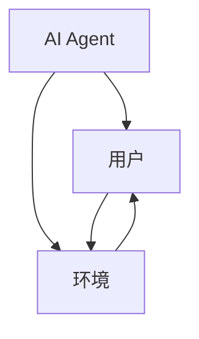
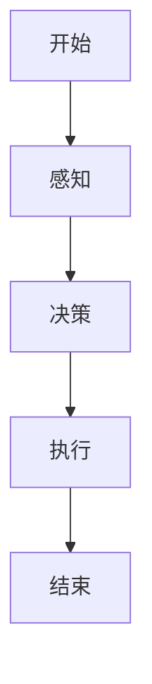
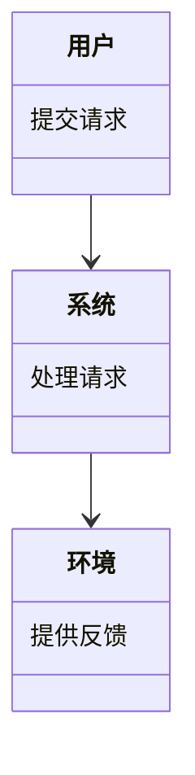
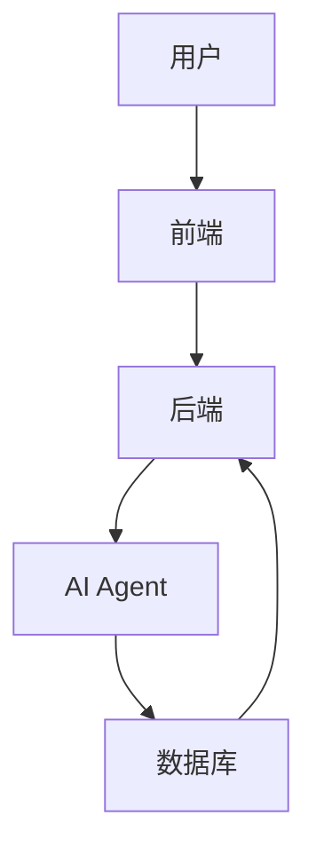
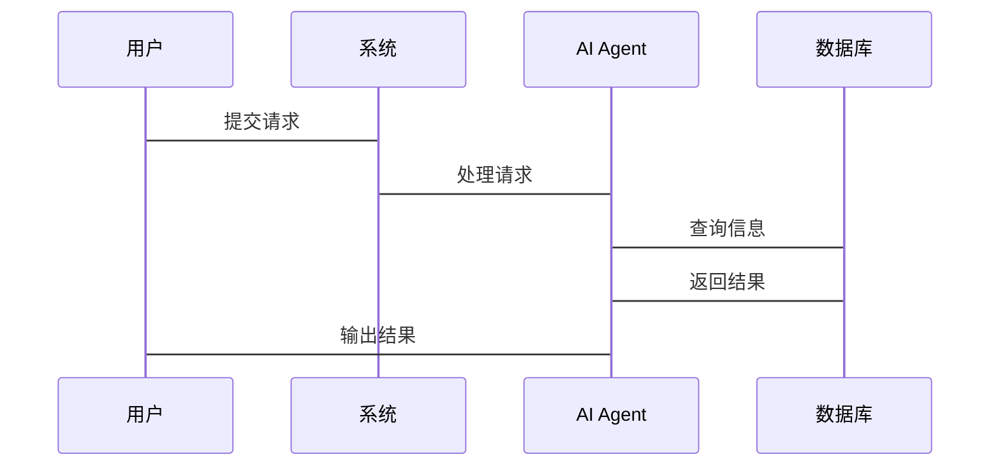

                 


# AI Agent 在智能虚拟助理中的角色

## 关键词：
AI Agent, 智能虚拟助理, 人工智能, 强化学习, 自然语言处理, 机器学习

## 摘要：
AI Agent（人工智能代理）在智能虚拟助理中的角色至关重要，它通过感知、决策和执行能力，为用户提供高效、个性化的服务。本文详细探讨了AI Agent的核心概念、算法原理、系统架构设计及实际应用案例，帮助读者全面理解AI Agent在智能虚拟助理中的作用。

---

# 第一部分: AI Agent 的基础与核心概念

## 第1章: AI Agent 的背景与问题背景

### 1.1 AI Agent 的定义与核心概念
#### 1.1.1 AI Agent 的定义
AI Agent 是一种能够感知环境、自主决策并执行任务的智能实体，旨在通过算法和数据为用户提供服务。

#### 1.1.2 AI Agent 的核心要素
- **感知**：通过传感器或数据输入获取信息。
- **决策**：基于感知信息进行推理和选择。
- **执行**：通过行动影响环境或输出结果。

#### 1.1.3 AI Agent 的问题背景与问题描述
智能虚拟助理面临用户需求多样化、信息处理复杂化等挑战，AI Agent 通过智能化手段解决问题。

#### 1.1.4 AI Agent 的边界与外延
AI Agent 不仅限于虚拟助理，还可应用于自动驾驶、智能客服等领域。

### 1.2 AI Agent 的核心概念与联系
#### 1.2.1 AI Agent 的核心原理
AI Agent 通过感知、决策、执行循环实现任务。

#### 1.2.2 AI Agent 的属性特征对比表
| 属性 | 基于规则 | 基于模型 | 基于强化学习 |
|------|----------|----------|--------------|
| 决策方式 | 预定义规则 | 动态推理 | 奖励驱动优化 |

#### 1.2.3 AI Agent 的ER实体关系图


---

# 第二部分: AI Agent 的算法原理与数学模型

## 第2章: AI Agent 的算法原理

### 2.1 AI Agent 的核心算法
#### 2.1.1 基于规则的 AI Agent
通过预定义规则处理简单任务，适用于用户查询。

#### 2.1.2 基于模型的 AI Agent
利用知识图谱和逻辑推理处理复杂任务。

#### 2.1.3 基于强化学习的 AI Agent
通过试错优化决策策略。

### 2.2 AI Agent 的算法流程


### 2.3 AI Agent 的数学模型
#### 2.3.1 概率论模型
$$ P(A|B) = \frac{P(B|A)P(A)}{P(B)} $$

#### 2.3.2 逻辑推理模型
$$ \text{结论} = \text{前提}_1 \land \text{前提}_2 $$

#### 2.3.3 强化学习模型
$$ Q(s, a) = r + \gamma \max Q(s', a') $$

---

# 第三部分: AI Agent 的系统分析与架构设计

## 第3章: AI Agent 的系统架构设计

### 3.1 问题场景介绍
以智能虚拟助理的对话系统为例，分析其架构设计。

### 3.2 系统功能设计


### 3.3 系统架构设计


### 3.4 系统接口设计


---

# 第四部分: AI Agent 的项目实战

## 第4章: AI Agent 的项目实战

### 4.1 环境安装
安装Python和必要的库，如numpy、pandas、scikit-learn。

### 4.2 核心代码实现
```python
class AIAssistant:
    def __init__(self):
        self.rules = {}

    def add_rule(self, condition, action):
        self.rules[condition] = action

    def decide(self, input):
        for condition, action in self.rules.items():
            if condition(input):
                return action(input)
        return None
```

### 4.3 实际案例分析
分析智能客服虚拟助理，讨论实现细节和优化方法。

---

# 第五部分: 最佳实践与总结

## 第5章: 最佳实践与总结

### 5.1 本章小结
AI Agent 在智能虚拟助理中的应用显著提升了用户体验。

### 5.2 实践中的注意事项
- 数据隐私保护
- 算法选择与优化
- 系统维护与迭代

### 5.3 拓展阅读
建议深入学习强化学习和自然语言处理技术。

---

作者：AI天才研究院 & 禅与计算机程序设计艺术

