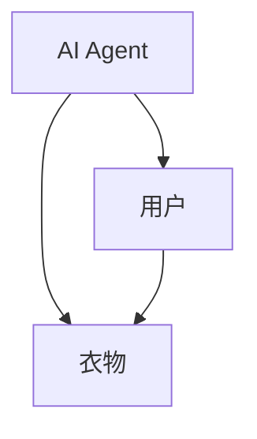
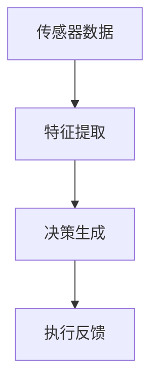
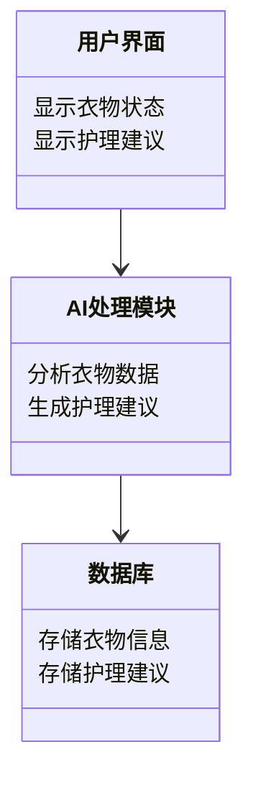
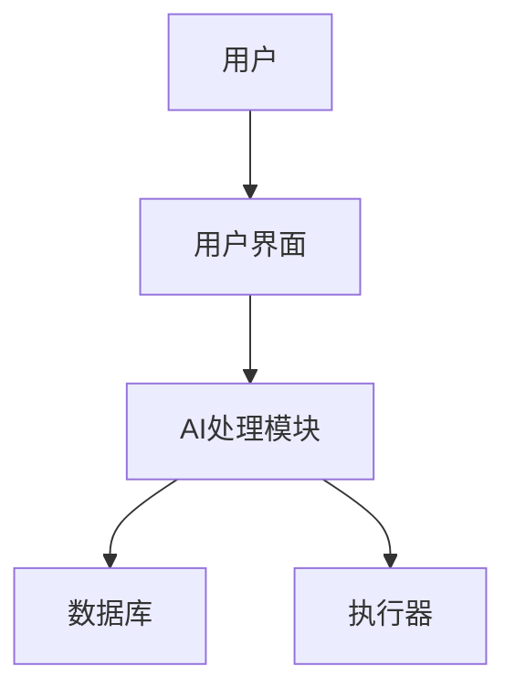

                 


# AI Agent在智能衣架中的衣物护理建议

> 关键词：AI Agent, 智能衣架, 衣物护理, 人工智能, 物联网

> 摘要：本文详细探讨了AI Agent在智能衣架中的应用，分析了其在衣物护理中的作用，包括衣物识别、环境感知、决策生成和执行反馈等核心环节。通过算法和系统架构的设计，展示了AI Agent如何优化衣物护理流程，提升用户体验。

---

## 第一部分：背景介绍

### 第1章：AI Agent的基本概念与应用场景

#### 1.1 AI Agent的定义与核心概念

AI Agent（人工智能代理）是指能够感知环境、自主决策并执行任务的智能体。它通过传感器获取信息，利用算法进行分析，做出决策，并通过执行器完成目标。AI Agent的核心特征包括自主性、反应性、目标导向和学习能力。

#### 1.2 AI Agent在智能衣架中的应用背景

智能衣架是一种结合物联网和人工智能技术的衣物管理设备，旨在帮助用户高效管理衣物并提供护理建议。AI Agent在其中扮演关键角色，通过感知环境、分析数据，为用户提供智能化的衣物护理方案。

---

## 第二部分：核心概念与联系

### 第2章：AI Agent的核心原理与功能模块

#### 2.1 AI Agent的核心原理

AI Agent在智能衣架中的工作流程包括感知、决策和执行三个步骤：

1. **感知**：通过传感器或摄像头获取衣物状态和环境信息。
2. **决策**：基于感知数据，利用算法生成护理建议。
3. **执行**：通过反馈机制优化建议并执行。

#### 2.2 AI Agent的功能模块对比

以下是几种常见AI Agent的功能对比：

| 功能模块       | 基于规则的AI Agent | 基于机器学习的AI Agent | 基于深度学习的AI Agent |
|----------------|---------------------|--------------------------|--------------------------|
| 衣物识别       | 预定义规则          | 分析历史数据            | 使用CNN进行识别          |
| 决策生成       | 固定决策树          | 基于概率模型            | 端到端模型优化决策       |
| 学习能力       | 无                  | 增量学习                | 端到端深度学习          |

#### 2.3 实体关系图

以下是AI Agent在智能衣架中的实体关系图：



---

## 第三部分：算法原理讲解

### 第3章：AI Agent的衣物识别算法

#### 3.1 图像识别算法

AI Agent通过摄像头采集衣物图像，并利用卷积神经网络（CNN）进行分类。以下是识别流程图：



以下是CNN的实现代码：

```python
import tensorflow as tf
from tensorflow.keras import layers

model = tf.keras.Sequential([
    layers.Conv2D(32, (3,3), activation='relu', input_shape=(100, 100, 3)),
    layers.MaxPooling2D((2,2)),
    layers.Conv2D(64, (3,3), activation='relu'),
    layers.MaxPooling2D((2,2)),
    layers.Flatten(),
    layers.Dense(64, activation='relu'),
    layers.Dense(10, activation='softmax')
])
```

#### 3.2 决策生成算法

AI Agent基于衣物状态和环境数据，利用概率模型生成护理建议。以下是决策生成流程：


决策生成的数学模型：

$$ P(action|data) = \frac{e^{w \cdot data}}{\sum e^{w \cdot data_j}} $$

---

## 第四部分：数学模型与公式

### 第4章：AI Agent的数学模型

AI Agent在决策过程中，常用概率模型和优化算法。以下是一些关键公式：

1. **马尔可夫决策过程**：
   $$ P(s' | s, a) = \text{概率从状态} s \text{执行动作} a \text{到状态} s' $$

2. **Q-learning算法**：
   $$ Q(s, a) = Q(s, a) + \alpha [r + \gamma Q(s', a') - Q(s, a)] $$

3. **线性回归模型**：
   $$ y = \beta x + \epsilon $$

4. **支持向量机（SVM）**：
   $$ \text{最大化} \ \min_{i} (y_i - \text{预测值}) $$

---

## 第五部分：系统分析与架构设计方案

### 第5章：系统架构设计

#### 5.1 系统功能设计

以下是系统功能模块的类图：



#### 5.2 系统架构设计

以下是系统架构的架构图：



---

## 第六部分：项目实战

### 第6章：AI Agent的实现与应用

#### 6.1 环境配置

以下是项目环境配置示例：

```bash
pip install tensorflow
pip install numpy
pip install mermaid
```

#### 6.2 核心代码实现

以下是AI Agent的核心代码：

```python
import tensorflow as tf
import numpy as np

# 加载预训练模型
model = tf.keras.models.load_model('ai_agent_model.h5')

# 获取衣物状态
def get_clothing_status(image):
    prediction = model.predict(image)
    return np.argmax(prediction, axis=1)

# 生成护理建议
def generate_care_recommendation(status):
    if status == 0:
        return "建议清洗"
    elif status == 1:
        return "建议晾干"
    else:
        return "建议熨烫"
```

#### 6.3 案例分析

以下是AI Agent在智能衣架中的实际应用案例：

1. **衣物识别**：用户将衣服挂在智能衣架上，AI Agent通过摄像头识别衣物类型。
2. **环境感知**：AI Agent检测到衣物有褶皱，建议熨烫。
3. **决策生成**：AI Agent分析环境湿度，建议在阴凉处晾干。
4. **执行反馈**：AI Agent通过手机App通知用户最佳洗涤温度。

---

## 第七部分：总结与展望

### 第7章：总结与展望

#### 7.1 小结

本文详细探讨了AI Agent在智能衣架中的应用，分析了其在衣物护理中的核心环节，包括感知、决策和执行。通过算法和系统架构的设计，展示了AI Agent如何优化衣物护理流程。

#### 7.2 最佳实践 tips

- 数据是AI Agent的核心，确保数据的多样性和准确性。
- 选择合适的算法模型，确保系统的实时性和准确性。
- 定期更新模型，提升系统的适应性和用户体验。

#### 7.3 展望

随着人工智能和物联网技术的不断发展，AI Agent在智能衣架中的应用将更加智能化和个性化。未来，AI Agent将能够实现更复杂的衣物护理任务，如自动洗涤和智能存储。

---

作者：AI天才研究院/AI Genius Institute & 禅与计算机程序设计艺术 /Zen And The Art of Computer Programming

