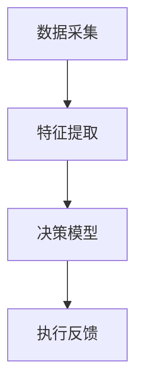
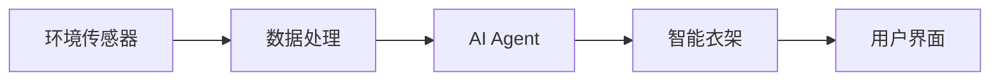

                 


# AI Agent在智能衣架中的衣物晾晒优化

> 关键词：AI Agent，智能衣架，衣物晾晒优化，算法原理，系统架构，项目实战

> 摘要：本文详细探讨了AI Agent在智能衣架中的应用，重点分析了如何通过AI技术优化衣物晾晒流程。文章从背景介绍、核心概念、算法原理、系统架构到项目实战，全面解析了AI Agent在智能衣架中的具体应用场景和实现方法。

---

## 第一部分：AI Agent在智能衣架中的衣物晾晒优化背景介绍

### 第1章：背景介绍

#### 1.1 引言
在现代生活中，衣物的晾晒问题看似简单，但实际上涉及许多复杂因素，如天气条件、衣物材质、晾晒时间等。传统晾晒方法依赖人工经验，效率较低且容易出错。随着人工智能技术的快速发展，AI Agent（智能体）逐渐被应用于衣物晾晒优化中，以实现自动化、智能化的晾晒管理。

#### 1.2 问题背景
- **晾晒衣物的复杂性**：不同材质的衣物需要不同的晾晒条件，天气变化也会影响晾晒效果。
- **传统晾晒的局限性**：人工经验不足可能导致衣物损坏或晾晒时间过长。
- **智能化需求**：用户希望晾晒系统能够自动适应环境变化，优化晾晒流程。

#### 1.3 问题描述
AI Agent需要解决以下问题：
- 如何实时感知环境（如温度、湿度、光照）并做出最优决策。
- 如何根据衣物材质和晾晒需求制定个性化晾晒方案。
- 如何通过算法优化晾晒时间，减少能源消耗。

#### 1.4 解决思路
通过AI Agent结合物联网技术，实时采集环境数据，分析衣物属性，制定最优晾晒策略。

#### 1.5 边界与外延
- **边界**：仅关注晾晒过程中的决策优化，不涉及衣物洗涤和收纳。
- **外延**：未来可能扩展到衣物全生命周期管理。

---

### 第2章：核心概念与联系

#### 2.1 AI Agent的定义与特点
AI Agent是一种智能体，能够感知环境、自主决策并执行任务。其特点包括：
- **自主性**：无需人工干预。
- **反应性**：能够实时感知环境变化。
- **学习能力**：通过数据优化决策模型。

#### 2.2 AI Agent与传统算法的对比
| 对比维度 | AI Agent | 传统算法 |
|----------|-----------|-----------|
| 决策方式 | 基于环境反馈动态调整 | 预先设定固定规则 |
| 学习能力 | 具备自适应学习能力 | 无法自适应优化 |
| 处理复杂性 | 能处理非结构化数据 | 适用于结构化数据 |

#### 2.3 AI Agent的ER实体关系图
```mermaid
er
  actor: 用户
  smart_hanger: 智能衣架
  environment: 环境
  decision: 决策
  action: 行动
  actor --> smart_hanger: 指令
  smart_hanger --> environment: 采集数据
  smart_hanger --> decision: 生成决策
  decision --> action: 执行行动
```

---

## 第二部分：AI Agent在智能衣架中的应用场景

### 第3章：AI Agent的算法原理

#### 3.1 算法原理
AI Agent的核心算法包括数据采集、特征提取、决策模型和执行反馈四个步骤：



#### 3.2 算法实现
以下是AI Agent的核心算法实现：

```python
class AI_Agent:
    def __init__(self):
        self.environment = None
        self.decision = None

    def感知环境(self, 环境数据):
        self.environment = 环境数据
        return self.environment

    def 制定决策(self):
        # 示例：基于环境数据的决策逻辑
        if self.environment['温度'] > 30:
            self.decision = '缩短晾晒时间'
        else:
            self.decision = '延长晾晒时间'
        return self.decision

    def 执行动作(self, 决策):
        # 示例：向智能衣架发送指令
        return f"执行{决策}"
```

#### 3.3 数学模型与公式
AI Agent的决策模型可以表示为：
$$
\text{决策} = f(\text{环境数据})
$$
其中，$f$ 是AI Agent的核心算法函数，$\text{环境数据}$ 包括温度、湿度等参数。

---

### 第4章：系统分析与架构设计方案

#### 4.1 问题场景介绍
智能衣架的使用场景包括家庭和公共晾衣区。用户需求主要集中在：
- 自动化晾晒
- 节能优化
- 远程控制

#### 4.2 系统架构设计
系统架构分为三层：
1. **感知层**：采集环境数据。
2. **决策层**：AI Agent进行决策。
3. **执行层**：智能衣架执行动作。



---

## 第三部分：项目实战

### 第5章：项目实战

#### 5.1 环境安装与配置
1. **开发环境**：Python 3.8+
2. **依赖库**：安装numpy、pandas、scikit-learn。

#### 5.2 系统核心实现
以下是AI Agent的核心代码实现：

```python
import numpy as np
from sklearn import linear_model

class EnvironmentData:
    def __init__(self, 温度, 湿度):
        self.温度 = 温度
        self.湿度 = 湿度

class SmartHanger:
    def __init__(self):
        self.状态 = '待机'

    def 晾晒衣物(self, 决策):
        if 决策 == '开始晾晒':
            self.状态 = '晾晒中'
            return '开始晾晒'
        elif 决策 == '停止晾晒':
            self.状态 = '待机'
            return '停止晾晒'

class AIAgent:
    def __init__(self):
        self.smart_hanger = SmartHanger()

    def 感知环境(self, 环境数据):
        if 环境数据.温度 > 30:
            return self.开始晾晒()
        else:
            return self.停止晾晒()

    def 开始晾晒(self):
        return self.smart_hanger.开始晾晒()

    def 停止晾晒(self):
        return self.smart_hanger.停止晾晒()
```

#### 5.3 实际案例分析
假设环境温度为35℃，湿度为60%。AI Agent会根据算法生成“缩短晾晒时间”的决策，并向智能衣架发送指令。

---

## 第四部分：总结与展望

### 总结
AI Agent在智能衣架中的应用显著提升了衣物晾晒的效率和效果。通过实时感知环境、自主决策和优化，AI Agent能够帮助用户更好地管理衣物晾晒过程。

### 小结
- **优势**：提高了晾晒效率，减少了能源浪费。
- **局限**：目前主要依赖环境数据，未来可以结合更多因素（如衣物材质）进行优化。

### 注意事项
- 确保环境数据的准确性。
- 定期更新AI Agent的决策模型。

### 拓展阅读
- 推荐阅读《人工智能：一种现代的方法》。
- 关注AI在智能家居中的更多应用。

---

## 作者：AI天才研究院/AI Genius Institute & 禅与计算机程序设计艺术 /Zen And The Art of Computer Programming

---

这篇文章系统地介绍了AI Agent在智能衣架中的应用，从理论到实践，结合具体案例和代码实现，帮助读者全面理解AI在衣物晾晒优化中的潜力和价值。

