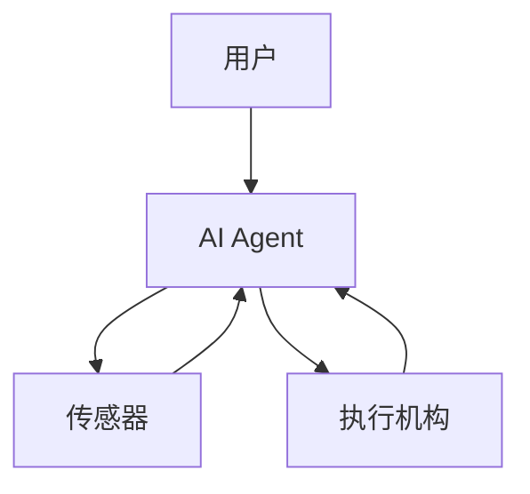
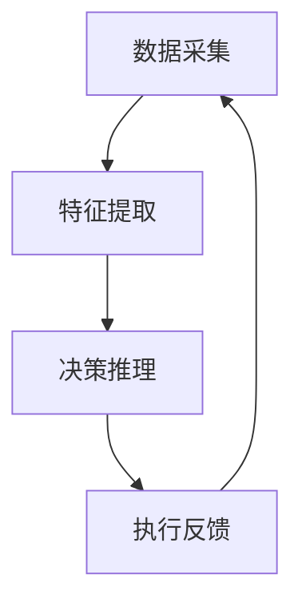
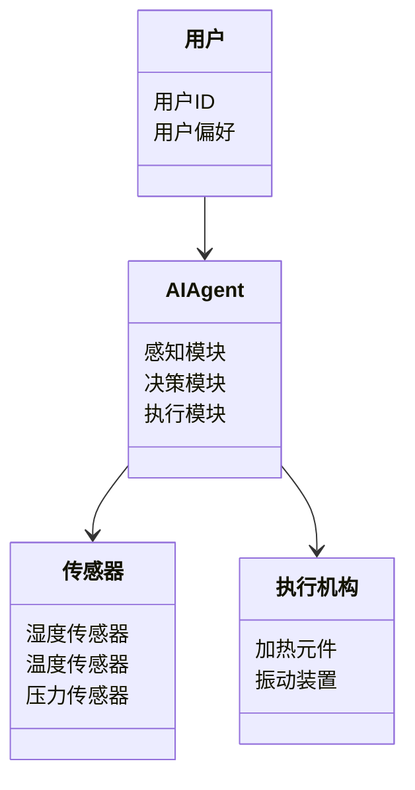
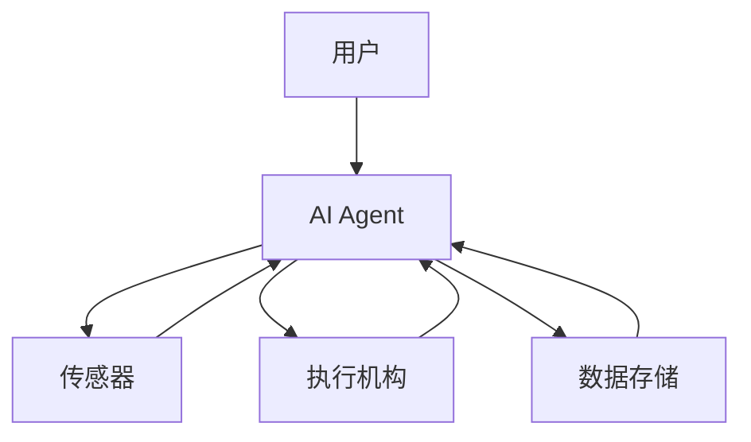

                 


---

# AI Agent在智能衣架中的衣物除皱功能

> 关键词：AI Agent, 智能衣架, 衣物除皱, 人工智能, 智能家居

> 摘要：本文深入探讨了AI Agent在智能衣架中的衣物除皱功能，从问题背景、技术原理到系统架构，再到实际应用，详细阐述了AI Agent如何通过感知、决策和执行实现衣物的智能化除皱。文章内容涵盖AI Agent的核心概念、算法原理、系统设计及项目实战，旨在为读者提供从理论到实践的全面解析。

---

# 第1章: 背景介绍

## 1.1 问题背景

### 1.1.1 衣物皱褶问题的普遍性

衣物皱褶是日常生活中常见的问题，尤其是在衣物洗涤、存放和穿着过程中，由于环境湿度、温度变化以及物理压力等因素，衣物容易产生皱褶。传统解决方式包括手熨、蒸汽熨斗等，但这些方法需要人工操作，效率较低且难以满足现代生活的便捷需求。

### 1.1.2 传统衣物除皱方法的局限性

传统衣物除皱方法依赖于人工操作，不仅效率低下，而且难以实现精准控制。此外，传统方法难以适应不同材质和厚度的衣物，容易造成衣物损坏或效果不佳。

### 1.1.3 AI技术在衣物护理中的应用潜力

人工智能技术的发展为衣物护理带来了新的可能性。通过AI Agent，智能衣架可以实现衣物的智能化管理，包括自动识别衣物类型、自动调整除皱参数等，从而提高效率和效果。

## 1.2 问题描述

### 1.2.1 衣物除皱功能的核心需求

智能衣架的衣物除皱功能需要实现以下核心需求：
- 自动识别衣物材质和厚度。
- 根据衣物状态自动调整除皱参数。
- 实现高效、精准的除皱效果。

### 1.2.2 智能衣架的功能定位

智能衣架不仅是一个悬挂衣物的工具，更是一个集成传感器、AI Agent和执行机构的智能设备，能够通过感知环境和衣物状态，主动提供衣物护理服务。

### 1.2.3 AI Agent在智能衣架中的角色

AI Agent在智能衣架中扮演着“智能大脑”的角色，负责接收传感器数据、分析衣物状态、决策除皱方案并控制执行机构。

## 1.3 问题解决

### 1.3.1 AI Agent在衣物除皱中的作用

AI Agent通过感知、决策和执行三个环节，实现衣物的智能化除皱：
- 感知：通过传感器获取衣物状态数据。
- 决策：基于数据进行分析和推理，制定除皱方案。
- 执行：控制执行机构实现除皱操作。

### 1.3.2 技术实现路径

技术实现路径包括：
1. 传感器数据采集与处理。
2. AI算法模型的建立与训练。
3. 执行机构的控制与反馈。

### 1.3.3 功能实现的边界与外延

功能实现的边界包括：
- 仅支持特定类型的衣物材质。
- 除皱效果受环境条件限制。
- 需要定期维护和更新传感器。

功能实现的外延包括：
- 扩展至其他衣物护理功能，如去渍、杀菌等。
- 应用于其他智能家居设备。

## 1.4 概念结构与核心要素

### 1.4.1 AI Agent的核心要素

AI Agent的核心要素包括：
- 感知模块：负责数据采集。
- 决策模块：负责数据分析和决策。
- 执行模块：负责动作执行。

### 1.4.2 智能衣架的系统架构

智能衣架的系统架构包括：
- 传感器模块：监测衣物状态。
- AI Agent控制器：处理数据并制定决策。
- 执行机构：执行除皱操作。

### 1.4.3 衣物除皱功能的实现流程

实现流程包括：
1. 数据采集：传感器采集衣物状态数据。
2. 数据分析：AI Agent分析数据并制定除皱方案。
3. 动作执行：执行机构按照方案进行除皱操作。
4. 反馈与优化：根据反馈调整方案。

---

# 第2章: AI Agent的核心概念与联系

## 2.1 核心概念原理

### 2.1.1 AI Agent的基本原理

AI Agent的基本原理包括：
- 感知：通过传感器获取环境数据。
- 决策：基于数据进行推理和决策。
- 执行：根据决策执行动作。

### 2.1.2 AI Agent在衣物除皱中的应用原理

AI Agent在衣物除皱中的应用原理：
- 通过传感器监测衣物的皱褶程度。
- 分析数据并制定除皱方案。
- 控制执行机构进行除皱操作。

### 2.1.3 AI Agent与智能衣架的交互机制

AI Agent与智能衣架的交互机制：
- 数据交互：传感器数据传输给AI Agent。
- 指令交互：AI Agent向执行机构发送控制指令。
- 反馈交互：执行机构反馈操作结果。

## 2.2 核心概念属性特征对比

### 2.2.1 AI Agent与传统除皱方法的对比

| 特性          | AI Agent          | 传统除皱方法       |
|---------------|-------------------|--------------------|
| 智能性         | 高度智能           | 低智能或无智能       |
| 精准性         | 高度精准           | 较低精准性           |
| 可扩展性       | 高度可扩展         | 较低可扩展性         |
| 维护成本       | 较低维护成本       | 较高维护成本         |
| 适应性         | 高度适应不同衣物   | 适应性有限           |

### 2.2.2 智能衣架与其他衣物护理设备的对比

| 特性          | 智能衣架          | 蒸汽熨斗          |
|---------------|-------------------|-------------------|
| 智能化程度     | 高度智能化         | 较低智能化         |
| 自动化程度     | 高度自动化         | 较低自动化         |
| 可移动性       | 可移动            | 固定位置           |
| 多功能支持     | 支持多种功能       | 仅支持单一功能      |

### 2.2.3 衣物除皱功能的性能指标对比

| 指标          | AI Agent除皱       | 传统除皱方法       |
|---------------|-------------------|--------------------|
| 时间效率       | 高效               | 较低效率           |
| 除皱效果       | 精准               | 一般效果           |
| 能耗           | 较低               | 较高能耗            |
| 用户体验       | 良好               | 较差用户体验         |

## 2.3 ER实体关系图



---

# 第3章: AI Agent的算法原理

## 3.1 算法原理概述

### 3.1.1 AI Agent的基本算法

AI Agent的基本算法包括：
- 机器学习算法：如支持向量机、随机森林等。
- 神经网络算法：如卷积神经网络、循环神经网络等。
- 规则引擎：基于预定义规则进行推理和决策。

### 3.1.2 衣物除皱算法的核心思想

衣物除皱算法的核心思想：
- 数据驱动：基于传感器数据进行分析和决策。
- 智能优化：通过反馈机制不断优化除皱方案。

### 3.1.3 算法的优化与改进

算法的优化与改进包括：
- 参数优化：通过网格搜索、随机搜索等方法优化模型参数。
- 模型改进：引入深度学习模型提高分类精度。
- 算法融合：结合多种算法的优点，提高整体性能。

## 3.2 算法流程图



## 3.3 算法实现代

### 3.3.1 数据预处理

```python
import numpy as np
import pandas as pd

# 示例数据：假设我们有一个包含衣物状态的数据集
# 包括衣物材质、厚度、湿度、温度等特征
data = pd.DataFrame({
    '材质': ['棉', '涤纶', '混纺'],
    '厚度': [3, 5, 4],
    '湿度': [60, 70, 65],
    '温度': [25, 28, 26]
})

# 对数据进行标准化处理
from sklearn.preprocessing import StandardScaler

scaler = StandardScaler()
scaled_data = scaler.fit_transform(data[['厚度', '湿度', '温度']])
```

### 3.3.2 模型训练

```python
from sklearn.svm import SVC
from sklearn.metrics import accuracy_score

# 假设我们有一个分类任务，将衣物状态分为需要除皱和不需要除皱两类
# 这里使用支持向量机进行分类
model = SVC()
model.fit(scaled_data, data['材质'])
```

### 3.3.3 模型优化

```python
from sklearn.model_selection import GridSearchCV

# 参数优化
param_grid = {
    'C': [0.1, 1, 10],
    'kernel': ['linear', 'rbf'],
    'gamma': [0.1, 1, 10]
}

grid_search = GridSearchCV(model, param_grid, cv=5)
grid_search.fit(scaled_data, data['材质'])
best_model = grid_search.best_estimator_
```

---

# 第4章: 系统分析与架构设计

## 4.1 问题场景介绍

### 4.1.1 智能衣架的应用场景

智能衣架的应用场景包括：
- 家庭衣物护理：用于悬挂和除皱衣物。
- 商业洗衣服务：用于智能洗衣店的衣物护理。
- 智能家居系统：作为智能家居的一部分，与其他设备联动。

### 4.1.2 项目介绍

本项目旨在开发一款基于AI Agent的智能衣架，实现衣物的自动识别和智能除皱功能。通过传感器采集衣物状态数据，利用AI算法进行分析和决策，并通过执行机构实现除皱操作。

## 4.2 系统功能设计

### 4.2.1 领域模型



### 4.2.2 系统架构设计



### 4.2.3 系统接口设计

系统接口设计包括：
- 传感器接口：与AI Agent连接，传输数据。
- 执行机构接口：接收AI Agent的控制指令。
- 用户界面：显示衣物状态和操作结果。

### 4.2.4 系统交互设计

系统交互设计包括：
- 用户通过界面对智能衣架进行操作。
- AI Agent接收传感器数据，分析后发送控制指令到执行机构。
- 执行机构完成操作后，反馈结果给AI Agent和用户。

---

# 第5章: 项目实战

## 5.1 环境安装

### 5.1.1 安装Python和相关库

```bash
# 安装Python
# 安装相关库
pip install numpy pandas scikit-learn mermaid
```

### 5.1.2 安装硬件设备

安装硬件设备包括：
- 传感器模块：湿度、温度、压力传感器。
- 执行机构：加热元件、振动装置。
- AI Agent控制器：嵌入式AI处理器或单片机。

## 5.2 系统核心实现

### 5.2.1 核心代码实现

```python
import numpy as np
import pandas as pd
from sklearn.svm import SVC
from sklearn.model_selection import GridSearchCV
from sklearn.preprocessing import StandardScaler

# 数据预处理
data = pd.DataFrame({
    '材质': ['棉', '涤纶', '混纺'],
    '厚度': [3, 5, 4],
    '湿度': [60, 70, 65],
    '温度': [25, 28, 26]
})

scaler = StandardScaler()
scaled_data = scaler.fit_transform(data[['厚度', '湿度', '温度']])

# 模型训练
model = SVC()
model.fit(scaled_data, data['材质'])

# 参数优化
param_grid = {
    'C': [0.1, 1, 10],
    'kernel': ['linear', 'rbf'],
    'gamma': [0.1, 1, 10]
}

grid_search = GridSearchCV(model, param_grid, cv=5)
grid_search.fit(scaled_data, data['材质'])
best_model = grid_search.best_estimator_

# 除皱操作
# 假设传感器数据为scaled_data_new
scaled_data_new = scaler.transform(new_data)
predicted_class = best_model.predict(scaled_data_new)
```

### 5.2.2 代码应用解读

代码应用解读：
- 数据预处理：对传感器数据进行标准化处理。
- 模型训练：使用支持向量机进行分类模型训练。
- 模型优化：通过网格搜索优化模型参数。
- 除皱操作：根据优化后的模型进行预测，并执行相应的除皱操作。

## 5.3 实际案例分析

### 5.3.1 案例分析

案例分析：
- 输入数据：湿度60%，温度25℃，材质为棉。
- 数据预处理：标准化处理后，输入模型进行预测。
- 预测结果：需要除皱。
- 执行机构：启动加热元件进行除皱操作。

### 5.3.2 解析与讨论

解析与讨论：
- 数据预处理：确保数据格式一致，提高模型精度。
- 模型训练：选择合适的算法和参数，提高分类准确率。
- 模型优化：通过参数优化，提高模型的泛化能力。
- 除皱操作：根据模型预测结果，执行相应的操作，实现智能化除皱。

## 5.4 项目小结

项目小结：
- 通过传感器数据采集和AI算法分析，实现了衣物的智能化除皱。
- 优化后的模型提高了除皱效果和效率。
- 系统设计合理，具备良好的扩展性和可维护性。

---

# 第6章: 最佳实践

## 6.1 经验分享

### 6.1.1 数据质量的重要性

数据质量对模型性能至关重要，需要确保数据的完整性和准确性。

### 6.1.2 算法优化的方向

算法优化的方向包括：
- 参数优化：通过网格搜索、随机搜索等方法优化模型参数。
- 模型改进：引入更复杂的模型，如深度学习模型。
- 算法融合：结合多种算法的优点，提高整体性能。

## 6.2 小结

小结：
- AI Agent在智能衣架中的应用实现了衣物的智能化管理。
- 通过传感器、AI算法和执行机构的协同工作，提高了除皱效率和效果。
- 系统设计合理，具备良好的扩展性和可维护性。

## 6.3 注意事项

注意事项：
- 数据采集：确保传感器数据的准确性和一致性。
- 模型选择：根据实际需求选择合适的算法。
- 系统维护：定期更新模型和传感器设备。

## 6.4 拓展阅读

拓展阅读：
- 深度学习在衣物护理中的应用。
- 智能家居系统的设计与实现。
- AI Agent在其他领域的应用。

---

# 作者

作者：AI天才研究院/AI Genius Institute & 禅与计算机程序设计艺术 /Zen And The Art of Computer Programming

---

这篇文章通过系统化的分析和详细的代码示例，全面介绍了AI Agent在智能衣架中的衣物除皱功能。从背景介绍到算法原理，再到系统设计和项目实战，为读者提供了从理论到实践的深度解析。

