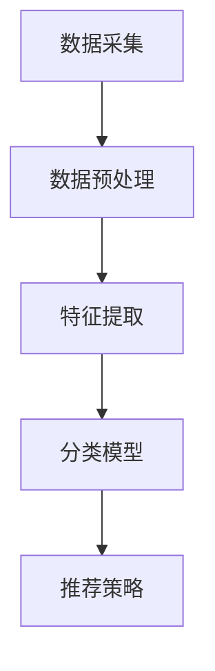
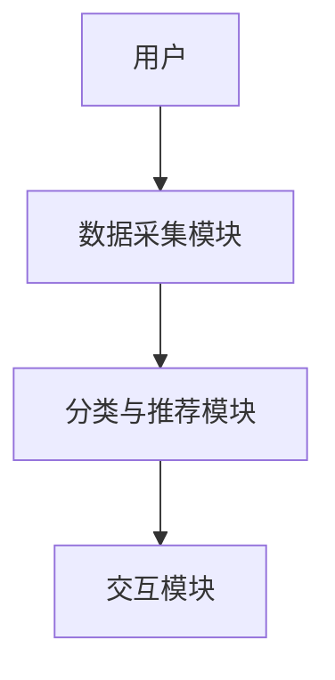

                 


# AI Agent在智能衣柜中的衣物循环使用建议

**关键词**：AI Agent, 智能衣柜, 衣物循环使用, 可持续发展, 技术实现

**摘要**：  
本文探讨了AI Agent在智能衣柜中的应用，重点分析了如何通过AI技术优化衣物的循环使用，减少资源浪费。文章从背景介绍、核心概念、算法原理、系统设计到项目实战，详细阐述了AI Agent在衣物管理中的潜力与实现方式。通过具体的技术分析和案例展示，本文为智能衣柜的可持续发展提供了新的思路。

---

# 第一部分：背景介绍

## 第1章：问题背景

### 1.1 衣物资源浪费的现状
- **全球衣物浪费问题**：每年全球产生的衣物垃圾超过1300万吨，其中大部分未被有效利用。
- **资源消耗**：生产衣物所需的水、能源和原材料资源消耗巨大，尤其是快时尚产业的快速发展加剧了这一问题。
- **环保压力**：衣物生产过程中产生的污染和碳排放对环境造成严重负担。

### 1.2 AI Agent在衣物管理中的潜力
- **智能化管理**：AI Agent可以通过数据分析和机器学习算法，优化衣物的使用和分配。
- **个性化推荐**：通过分析用户的穿衣习惯和偏好，AI Agent可以推荐合适的衣物组合，减少不必要的购买。
- **循环使用促进**：通过AI Agent的智能匹配，用户可以更高效地共享或交换衣物，延长衣物生命周期。

### 1.3 衣物循环使用的必要性
- **减少浪费**：通过智能衣柜，用户可以更好地管理衣物，避免因过时或不使用而导致的浪费。
- **环保目标**：衣物循环使用是实现可持续发展目标的重要一环，有助于减少对环境的负担。
- **经济价值**：通过延长衣物的使用周期，用户可以节省开支，同时减少对新衣物的依赖。

---

# 第二部分：核心概念与联系

## 第2章：AI Agent的核心概念

### 2.1 AI Agent的定义与特征
- **定义**：AI Agent是一种能够感知环境、自主决策并执行任务的智能实体。
- **特征**：
  - 智能性：能够理解和分析数据。
  - 自主性：能够在没有外部干预的情况下执行任务。
  - 适应性：能够根据环境变化调整行为。

### 2.2 核心概念对比表
| 概念         | 描述                                                                 |
|--------------|----------------------------------------------------------------------|
| 衣物分类     | 根据材质、颜色、用途等属性对衣物进行分类。                            |
| 使用频率     | 衣物在一定时间内的使用次数，用于判断其是否需要被推荐或替换。          |
| 用户偏好     | 用户对衣物的个人偏好，如颜色、品牌、风格等，影响推荐策略。            |

### 2.3 ER实体关系图
```mermaid
er
    衣物
    用户
    使用记录
    推荐规则
    衣物分类
    使用频率
    用户偏好
    衣物状态
```

---

# 第三部分：算法原理讲解

## 第3章：算法流程与实现

### 3.1 算法流程


### 3.2 数据处理与分类
- **数据采集**：通过智能衣柜的传感器和用户输入收集衣物的使用记录和状态。
- **数据预处理**：清洗数据，去除异常值和冗余信息。
- **特征提取**：提取关键特征，如衣物的使用频率、用户偏好等。
- **分类模型**：使用机器学习算法（如随机森林或K-近邻）对衣物进行分类。

### 3.3 推荐策略
- **基于使用频率的推荐**：优先推荐使用频率低的衣物，以减少浪费。
- **基于用户偏好的推荐**：根据用户的穿衣习惯推荐合适的衣物组合。

### 3.4 数学模型
- **分类模型**：
  $$ y = f(x) $$
  其中，$x$ 是输入特征，$y$ 是输出类别。
- **推荐模型**：
  $$ p(y|x) = \prod_{i=1}^{n} p(y|x_i) $$
  其中，$x_i$ 是第$i$个特征，$y$ 是推荐结果。

---

# 第四部分：系统分析与架构设计

## 第4章：系统设计

### 4.1 系统功能设计
- **数据采集模块**：收集用户的衣物使用记录和偏好。
- **分类与推荐模块**：对衣物进行分类并生成推荐策略。
- **交互模块**：用户与智能衣柜的交互界面，展示推荐结果。

### 4.2 系统架构设计


### 4.3 接口与交互设计
- **API接口**：系统通过RESTful API与其他设备或平台进行通信。
- **用户交互**：通过移动应用或网页界面与用户互动，展示推荐结果和衣物状态。

---

# 第五部分：项目实战

## 第5章：环境与实现

### 5.1 环境安装
- **工具**：Python 3.8及以上版本，TensorFlow、Scikit-learn等库。
- **依赖安装**：
  ```bash
  pip install numpy pandas scikit-learn
  ```

### 5.2 核心代码实现
```python
# 示例代码：衣物分类与推荐
from sklearn.ensemble import RandomForestClassifier
import pandas as pd

# 数据加载
data = pd.read_csv('clothes.csv')

# 特征提取
features = data[['color', 'material', 'usage_frequency']]
labels = data['category']

# 模型训练
model = RandomForestClassifier()
model.fit(features, labels)

# 推荐策略
def recommend_clothes(user_preference):
    predicted_category = model.predict([user_preference])
    return predicted_category
```

### 5.3 案例分析
- **案例1**：用户偏好深色系衣物，AI Agent推荐低使用频率的深色T恤。
- **案例2**：用户经常穿着运动服，AI Agent推荐新的运动裤以延长使用周期。

---

# 第六部分：总结与展望

## 第6章：总结

### 6.1 核心内容回顾
- AI Agent在智能衣柜中的应用能够有效优化衣物的使用和循环。
- 通过数据分析和机器学习算法，AI Agent可以为用户提供个性化的推荐和管理方案。

### 6.2 注意事项
- 数据隐私保护：确保用户数据的安全性和隐私性。
- 系统可扩展性：设计时需考虑未来功能的扩展和升级。

### 6.3 拓展阅读
- 推荐阅读《人工智能：一种现代的方法》和《机器学习实战》。

---

**作者**：AI天才研究院/AI Genius Institute & 禅与计算机程序设计艺术 /Zen And The Art of Computer Programming

