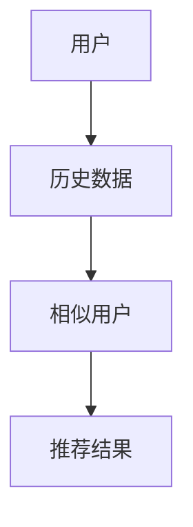
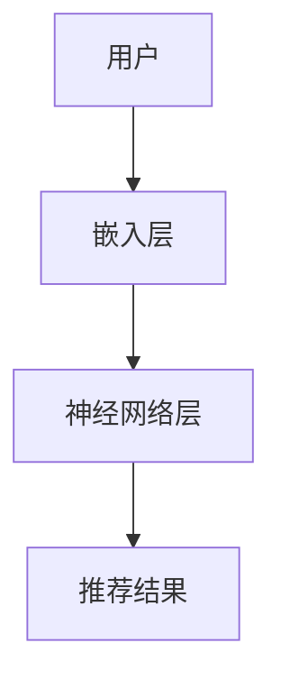
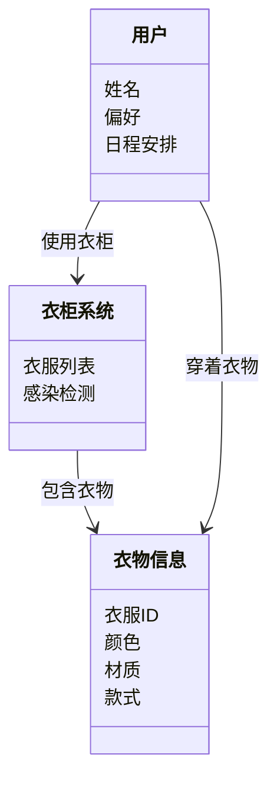
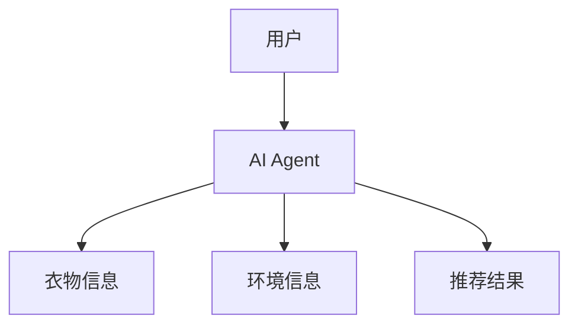
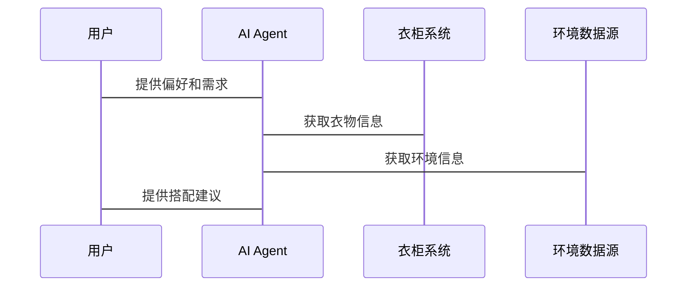

                 


# AI Agent在智能衣柜中的衣物搭配建议

> 关键词：AI Agent、智能衣柜、衣物搭配、推荐系统、深度学习

> 摘要：本文将探讨AI Agent在智能衣柜中的应用，重点分析AI Agent如何通过感知、决策和执行三个阶段实现衣物的智能化搭配建议。文章从背景介绍、核心概念、算法原理、系统架构到项目实战，全面解析AI Agent在智能衣柜中的实现过程，并通过实际案例展示其在提升用户体验中的潜力。

---

## 第一部分: AI Agent在智能衣柜中的背景与概念

### 第1章: AI Agent的基本概念与应用背景

#### 1.1 问题背景与描述

##### 1.1.1 传统衣柜管理的痛点
传统衣柜管理中，用户常常面临以下问题：
- **衣物搭配效率低**：用户需要花费大量时间从衣柜中挑选合适的衣物组合。
- **搭配建议缺乏个性化**：传统推荐系统通常基于用户的历史行为，难以实时结合天气、场合等因素提供个性化建议。
- **数据孤岛问题**：衣柜中的衣物信息分散，难以形成统一的数据库，导致难以实现智能化管理。

##### 1.1.2 AI Agent在衣柜管理中的应用潜力
AI Agent（人工智能代理）是一种能够感知环境、做出决策并执行任务的智能实体。在智能衣柜中，AI Agent可以通过以下方式提升用户体验：
- **实时感知环境**：结合天气预报、用户日程安排等信息，提供个性化的衣物搭配建议。
- **智能化推荐**：通过分析用户的偏好和行为模式，主动推荐适合的衣物组合。
- **数据整合与优化**：将衣柜中的衣物信息与外部数据（如天气、场合）相结合，提供更加精准的推荐。

##### 1.1.3 衣物搭配建议的核心问题
衣物搭配的核心问题在于如何根据用户的个性化需求、环境信息和衣物本身的属性，生成合理的搭配建议。这需要AI Agent具备以下能力：
- **感知能力**：能够获取用户的偏好、环境信息（如天气、场合）以及衣物的属性（如颜色、材质）。
- **决策能力**：基于获取的信息，生成合理的衣物搭配建议。
- **执行能力**：通过与智能衣柜的交互，帮助用户完成衣物的选择和搭配。

#### 1.2 问题解决与边界

##### 1.2.1 AI Agent如何解决衣物搭配问题
AI Agent通过以下步骤解决衣物搭配问题：
1. **感知环境**：获取用户的行为数据、环境信息（如天气、场合）以及衣柜中的衣物信息。
2. **分析数据**：基于获取的数据，分析用户的偏好和衣物的属性。
3. **生成建议**：结合用户的偏好和环境信息，生成个性化的衣物搭配建议。
4. **反馈优化**：根据用户的反馈不断优化推荐算法，提升推荐的准确性。

##### 1.2.2 解决方案的边界与限制
AI Agent在智能衣柜中的应用存在以下限制：
- **数据隐私问题**：用户的行为数据和衣物信息可能涉及隐私问题，需要确保数据的安全性和隐私性。
- **数据完整性**：AI Agent需要依赖完整的衣物信息和环境数据，数据的缺失可能影响推荐的准确性。
- **模型泛化能力**：推荐算法的泛化能力可能受到训练数据和模型复杂度的限制。

##### 1.2.3 衣物搭配建议的外延与扩展
AI Agent在智能衣柜中的应用不仅仅局限于衣物搭配，还可以扩展到以下方面：
- **衣物管理**：帮助用户整理衣柜，优化衣物存储空间。
- **购物建议**：根据用户的搭配需求，推荐适合的衣物购买建议。
- **健康监测**：结合用户的健康数据（如体温、运动量）提供衣物选择建议。

#### 1.3 核心概念与要素

##### 1.3.1 AI Agent的定义与特征
AI Agent是一种能够感知环境、做出决策并执行任务的智能实体。其核心特征包括：
- **自主性**：能够在没有人工干预的情况下自主运行。
- **反应性**：能够实时感知环境并做出相应的反应。
- **学习能力**：能够通过学习提升自身的推荐能力。

##### 1.3.2 智能衣柜的系统架构
智能衣柜的系统架构通常包括以下组成部分：
- **用户界面**：用户与智能衣柜交互的界面，如手机APP或智能镜子。
- **传感器**：用于采集环境信息（如温度、湿度）和衣物信息（如材质、颜色）。
- **AI Agent**：负责处理数据并生成衣物搭配建议。
- **执行机构**：如智能衣柜的机械臂，用于辅助用户选择衣物。

##### 1.3.3 衣物搭配的核心要素
衣物搭配的核心要素包括：
- **用户偏好**：用户的穿衣风格、颜色偏好等。
- **环境信息**：天气、场合、时间等。
- **衣物属性**：颜色、材质、款式、品牌等。

---

## 第2章: AI Agent的核心概念与联系

### 2.1 核心概念原理

#### 2.1.1 AI Agent的基本原理
AI Agent通过感知、决策和执行三个阶段实现衣物搭配建议：
1. **感知阶段**：通过传感器和用户输入获取环境信息和衣物信息。
2. **决策阶段**：基于获取的信息，分析用户的偏好和衣物属性，生成衣物搭配建议。
3. **执行阶段**：通过智能衣柜的执行机构帮助用户完成衣物选择。

#### 2.1.2 衣物搭配的算法逻辑
衣物搭配的算法逻辑可以分为以下几个步骤：
1. **数据采集**：获取用户的偏好、环境信息和衣物信息。
2. **数据预处理**：对获取的数据进行清洗和归一化处理。
3. **数据分析**：分析用户的偏好和衣物属性，生成初步的衣物搭配建议。
4. **结果优化**：根据用户的反馈不断优化推荐算法，提升推荐的准确性。

#### 2.1.3 用户行为分析与偏好预测
用户行为分析与偏好预测是AI Agent实现个性化推荐的核心。通过分析用户的购物记录、搭配历史和行为数据，可以预测用户的穿衣风格和偏好。

### 2.2 核心概念属性对比表

| 属性           | 传统推荐系统 | AI Agent在衣物搭配中的应用 |
|----------------|--------------|----------------------------|
| 数据来源       | 用户历史数据 | 用户行为、天气、场合等多维度数据 |
| 推荐依据       | 协同过滤     | 综合分析用户需求与场景 |
| 个性化程度     | 基于群体数据 | 高度个性化，基于用户实时需求 |
| 推荐实时性     | 延时较长     | 实时响应，基于环境信息 |
| 数据隐私保护   | 数据可能泄露 | 数据加密传输，保护用户隐私 |

### 2.3 ER实体关系图

```mermaid
er
  actor: 用户
  衣柜: 衣柜系统
  衣物: 衣物信息
  actor -|> 衣柜: 使用衣柜
  衣柜 -|> 衣物: 包含衣物
  actor -|> 衣物: 穿着衣物
```

---

## 第3章: AI Agent的算法原理与数学模型

### 3.1 算法原理

#### 3.1.1 协同过滤算法

##### 协同过滤算法原理
协同过滤是一种基于用户相似性推荐算法。通过分析用户的相似性，推荐与相似用户喜欢的物品。

##### 协同过滤算法流程图



##### 协同过滤算法实现步骤

1. **数据预处理**：对用户行为数据进行清洗和归一化处理。
2. **计算相似度**：使用余弦相似度或欧式距离计算用户之间的相似度。
3. **生成推荐**：基于相似用户的偏好，生成推荐结果。

##### 协同过滤算法代码实现

```python
import numpy as np

def cosine_similarity(user_profiles, target_profile):
    similarity = []
    for profile in user_profiles:
        dot_product = np.dot(target_profile, profile)
        magnitude = np.linalg.norm(target_profile) * np.linalg.norm(profile)
        if magnitude == 0:
            similarity.append(0.0)
        else:
            similarity.append(dot_product / magnitude)
    return similarity

# 示例数据
user_profiles = [
    [1, 2, 3],
    [4, 5, 6],
    [7, 8, 9]
]
target_profile = [2, 3, 4]

similarity = cosine_similarity(user_profiles, target_profile)
print(similarity)
```

#### 3.1.2 基于深度学习的推荐模型

##### 基于深度学习的推荐模型原理
基于深度学习的推荐模型（如神经网络协同过滤模型）通过学习用户和物品的嵌入表示，生成推荐结果。

##### 基于深度学习的推荐模型流程图



##### 基于深度学习的推荐模型实现步骤

1. **数据预处理**：对用户和物品进行编码，构建嵌入层。
2. **模型训练**：通过反向传播算法优化模型参数。
3. **生成推荐**：基于模型预测结果生成推荐列表。

##### 基于深度学习的推荐模型代码实现

```python
import tensorflow as tf

# 定义模型
class DeepLearningModel(tf.keras.Model):
    def __init__(self, user_embedding_dim, item_embedding_dim):
        super(DeepLearningModel, self).__init__()
        self.user_embedding = tf.keras.layers.Embedding(
            input_dim=user_embedding_dim, output_dim=user_embedding_dim
        )
        self.item_embedding = tf.keras.layers.Embedding(
            input_dim=item_embedding_dim, output_dim=item_embedding_dim
        )
        self.dnn = tf.keras.Sequential([
            tf.keras.layers.Dense(64, activation='relu'),
            tf.keras.layers.Dense(1, activation='sigmoid')
        ])
    
    def call(self, inputs):
        user_input, item_input = inputs
        user_emb = self.user_embedding(user_input)
        item_emb = self.item_embedding(item_input)
        concat_layer = tf.keras.layers.Concatenate()([user_emb, item_emb])
        output = self.dnn(concat_layer)
        return output

# 模型训练
model = DeepLearningModel(user_embedding_dim=10, item_embedding_dim=10)
model.compile(optimizer='adam', loss='binary_crossentropy', metrics=['accuracy'])
model.fit(x, y, epochs=10, batch_size=32)
```

---

## 第4章: 系统分析与架构设计

### 4.1 问题场景介绍

#### 4.1.1 问题场景
智能衣柜中的AI Agent需要解决以下问题：
- **如何获取用户的偏好和环境信息？**
- **如何实现衣物的智能化推荐？**
- **如何保证推荐结果的实时性和准确性？**

### 4.2 项目介绍

#### 4.2.1 项目目标
本项目的目标是开发一个基于AI Agent的智能衣柜系统，能够根据用户的偏好和环境信息，提供个性化的衣物搭配建议。

#### 4.2.2 系统功能设计

##### 4.2.2.1 领域模型



##### 4.2.2.2 系统架构设计



##### 4.2.2.3 系统接口设计
系统接口设计包括：
- **用户输入接口**：用户输入偏好和需求。
- **数据接口**：获取环境信息和衣物信息。
- **推荐接口**：输出衣物搭配建议。

##### 4.2.2.4 系统交互设计



---

## 第5章: 项目实战

### 5.1 环境安装与配置

#### 5.1.1 Python环境安装
安装Python和必要的库：
```bash
pip install numpy tensorflow pandas scikit-learn
```

#### 5.1.2 系统架构实现

##### 5.1.2.1 核心代码实现

```python
import numpy as np
import pandas as pd
from sklearn.metrics.pairwise import cosine_similarity

# 示例数据：用户偏好和衣物信息
users = pd.DataFrame({
    '用户ID': [1, 2, 3],
    '偏好': ['正式', '休闲', '运动']
})

items = pd.DataFrame({
    '衣物ID': [1, 2, 3],
    '颜色': ['蓝色', '红色', '绿色'],
    '材质': ['棉', '聚酯纤维', '羊毛']
})

# 计算相似度
item_features = items[['颜色', '材质']].values
similarity_matrix = cosine_similarity(item_features, item_features)

# 推荐算法
def recommend_items(user_preference, similarity_matrix, items):
    # 找到与用户偏好最相似的衣物
    similar_items = np.argmax(similarity_matrix, axis=1)
    recommended_items = items.iloc[similar_items]
    return recommended_items

# 示例推荐
user_preference = '休闲'
recommended_items = recommend_items(user_preference, similarity_matrix, items)
print(recommended_items)
```

##### 5.1.2.2 代码解读与分析
- **数据预处理**：将用户偏好和衣物信息转换为数值形式。
- **相似度计算**：使用余弦相似度计算衣物之间的相似度。
- **推荐算法**：基于相似度生成推荐结果。

##### 5.1.2.3 实际案例分析
假设用户偏好为“休闲”，推荐系统会基于衣物的颜色和材质生成推荐结果。

##### 5.1.2.4 项目小结
通过以上代码实现，我们可以看到AI Agent在智能衣柜中的潜力。推荐算法可以根据用户的偏好和环境信息，生成个性化的衣物搭配建议。

---

## 第6章: 最佳实践与注意事项

### 6.1 小结

AI Agent在智能衣柜中的应用可以帮助用户实现智能化的衣物管理，提升用户体验。通过感知、决策和执行三个阶段，AI Agent可以实时分析用户的偏好和环境信息，生成个性化的衣物搭配建议。

### 6.2 注意事项

- **数据隐私**：确保用户的偏好和衣物信息的安全性。
- **模型优化**：不断优化推荐算法，提升推荐的准确性。
- **用户体验**：确保推荐结果的实时性和易用性。

### 6.3 拓展阅读

- **相关技术**：协同过滤、深度学习、自然语言处理。
- **应用场景**：智能衣柜、智能穿衣助手、个性化购物推荐。

---

## 作者：AI天才研究院/AI Genius Institute & 禅与计算机程序设计艺术 /Zen And The Art of Computer Programming

