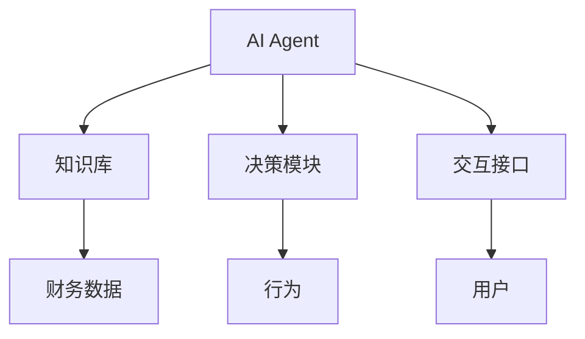
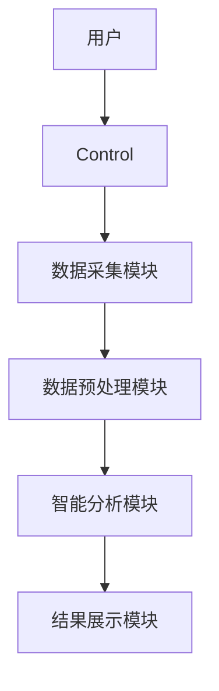

                 

# AI Agent在智能财务分析中的应用

**关键词**: AI Agent, 智能财务分析, 深度学习, 强化学习, 财务数据, 系统架构

**摘要**: 本文探讨AI Agent在智能财务分析中的应用，分析其核心概念、算法原理、系统架构及实际案例，展示如何通过AI技术提升财务分析的效率和准确性。

---

# 第1章: AI Agent与智能财务分析的背景介绍

## 1.1 AI Agent的基本概念

### 1.1.1 什么是AI Agent

AI Agent（人工智能代理）是能够感知环境、自主决策并执行任务的智能体。它通过传感器接收信息，利用算法处理数据，做出决策并采取行动。

### 1.1.2 AI Agent的核心特点

| 特性 | 描述 |
|------|------|
| 自主性 | 能够独立执行任务，无需外部干预 |
| 反应性 | 能够实时感知环境变化并做出反应 |
| 智能性 | 具备学习和推理能力，能够优化决策 |
| 社交性 | 可与其他系统或用户进行交互和协作 |

### 1.1.3 AI Agent与传统财务分析的对比

| 方面 | 传统财务分析 | AI Agent驱动的智能财务分析 |
|------|--------------|---------------------------|
| 数据处理 | 手动或半自动 | 完全自动化 |
| 决策速度 | 较慢 | 实时决策 |
| 分析深度 | 有限 | 高度智能化和深度分析 |

## 1.2 智能财务分析的定义与特点

### 1.2.1 智能财务分析的定义

智能财务分析是利用人工智能技术，通过数据采集、处理、建模、分析和可视化，提供智能化的财务洞察和决策支持的过程。

### 1.2.2 智能财务分析的核心特点

| 特性 | 描述 |
|------|------|
| 数据驱动 | 基于大量数据进行分析 |
| 实时性 | 可实时处理财务数据 |
| 智能性 | 具备自主学习和优化能力 |
| 可扩展性 | 能够处理不同规模和类型的数据 |

## 1.3 AI Agent在智能财务分析中的应用前景

### 1.3.1 AI Agent的潜在应用领域

- **财务报表分析**：识别财务异常、预测财务趋势。
- **风险评估**：评估企业信用风险、市场风险。
- **投资决策**：辅助投资组合优化、股票预测。
- **财务规划**：生成财务预算、现金流预测。

### 1.3.2 企业采用AI Agent的优势

- **提高效率**：自动化处理财务数据，减少人工干预。
- **增强准确性**：通过算法优化分析结果，降低人为错误。
- **实时决策**：快速响应市场变化，提升企业竞争力。

### 1.3.3 AI Agent应用的挑战与机遇

- **挑战**：数据隐私问题、算法的可解释性、技术实施成本。
- **机遇**：提升企业智能化水平、推动财务转型、创造新的商业价值。

## 1.4 本章小结

本章介绍了AI Agent的基本概念及其在智能财务分析中的应用前景，强调了AI Agent在提升财务分析效率和准确性方面的潜力，同时也指出了应用中的挑战和机遇。

---

# 第2章: AI Agent的核心概念与联系

## 2.1 AI Agent的原理

### 2.1.1 感知模块

AI Agent通过传感器或API接口获取财务数据，包括财务报表、市场数据等。数据预处理包括清洗、转换和特征提取。

### 2.1.2 决策模块

基于感知到的数据，AI Agent利用算法进行分析和推理，生成决策策略。例如，使用强化学习算法优化投资组合。

### 2.1.3 执行模块

根据决策模块生成的指令，AI Agent执行具体操作，如发出买卖指令、生成财务报告。

## 2.2 AI Agent的核心要素

### 2.2.1 知识库

存储财务知识、市场规则和历史数据，为AI Agent提供决策依据。

### 2.2.2 行为决策机制

包括规则引擎和机器学习模型，用于制定和优化决策策略。

### 2.2.3 交互接口

提供与用户或系统的交互界面，支持命令输入和结果输出。

## 2.3 AI Agent与智能财务分析的实体关系图

## 2.4 本章小结

本章详细阐述了AI Agent的核心概念和工作原理，通过实体关系图展示了AI Agent与智能财务分析系统的交互关系。

---

# 第3章: AI Agent的算法原理与数学模型

## 3.1 概率论基础

### 3.1.1 概率的基本概念

概率是事件发生的可能性，用于描述数据的不确定性。例如，P(A)表示事件A发生的概率。

### 3.1.2 条件概率与贝叶斯定理

贝叶斯定理用于计算在已知条件下某事件发生的概率：

$$ P(A|B) = \frac{P(B|A) \cdot P(A)}{P(B)} $$

### 3.1.3 马尔可夫链

马尔可夫链描述了系统随时间变化的状态转移过程，适用于时间序列分析。

## 3.2 深度学习模型

### 3.2.1 神经网络基础

神经网络通过多层结构模拟人脑，用于特征提取和模式识别。

### 3.2.2 Transformer架构

Transformer模型通过自注意力机制，擅长处理序列数据，广泛应用于自然语言处理和时间序列分析。

### 3.2.3 注意力机制

注意力机制通过加权计算，关注输入数据中重要的部分：

$$ \text{Attention}(Q, K, V) = \text{softmax}\left(\frac{QK^T}{\sqrt{d_k}}\right)V $$

## 3.3 AI Agent的决策算法

### 3.3.1 Q-learning算法

Q-learning通过状态-动作价值函数优化决策策略：

$$ Q(s, a) = r + \gamma \max_{a'} Q(s', a') $$

### 3.3.2 策略梯度算法

策略梯度算法通过优化策略参数直接最大化动作的期望回报：

$$ \theta_{t+1} = \theta_t + \alpha \nabla_\theta \mathbb{E}[R] $$

### 3.3.3 基于强化学习的决策过程

强化学习通过奖励机制，训练AI Agent在复杂环境中做出最优决策。

## 3.4 本章小结

本章介绍了AI Agent的核心算法原理，包括概率论、深度学习模型和强化学习算法，为后续的系统设计和实现奠定了基础。

---

# 第4章: AI Agent在智能财务分析中的系统架构

## 4.1 系统功能设计

### 4.1.1 数据采集模块

通过API接口获取财务数据，包括股票价格、财务报表等。

### 4.1.2 数据处理模块

对数据进行清洗、转换和特征提取，为后续分析提供干净的数据集。

### 4.1.3 智能分析模块

利用AI算法进行数据分析、风险评估和投资决策。

### 4.1.4 结果展示模块

将分析结果以可视化形式呈现，便于用户理解和决策。

## 4.2 系统架构设计

## 4.3 本章小结

本章描述了AI Agent在智能财务分析中的系统架构，包括功能模块和整体架构设计，展示了如何将AI技术应用于实际财务分析场景。

---

# 作者：AI天才研究院/AI Genius Institute & 禅与计算机程序设计艺术 /Zen And The Art of Computer Programming

