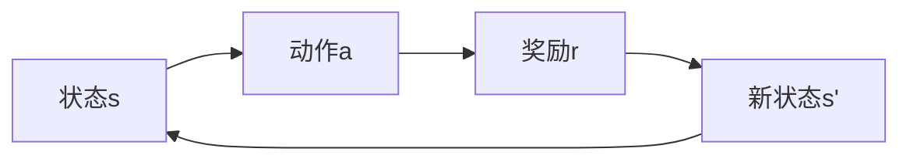
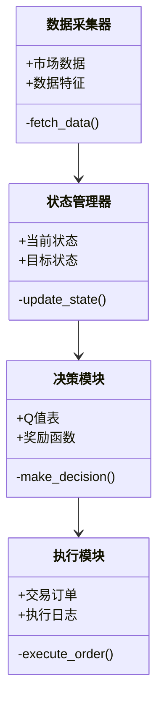
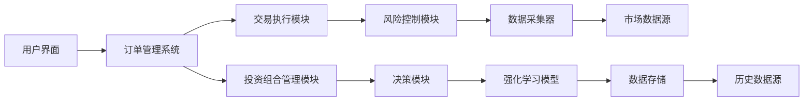
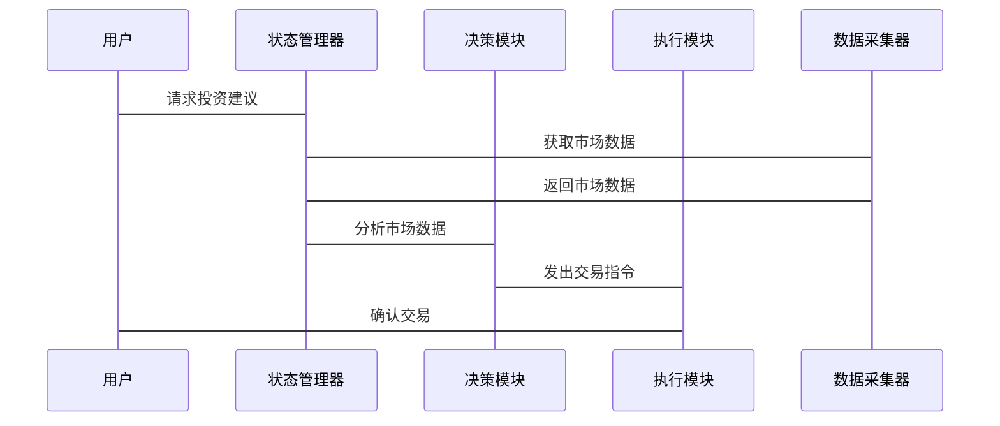

                 


# AI Agent在智能资产管理中的实践

**关键词**：AI Agent, 智能资产管理, 强化学习, 量化投资, 金融风险管理, 自动化交易系统

**摘要**：  
本文深入探讨了AI Agent在智能资产管理中的应用，从理论基础到实践案例，系统性地分析了AI Agent如何在金融市场的复杂环境中实现智能化投资决策。通过强化学习算法、系统架构设计以及实际项目案例，展示了AI Agent在智能资产管理中的技术优势与实现路径。本文旨在为技术与金融领域的从业者提供有价值的参考，帮助他们理解并应用AI Agent技术优化资产管理流程。

---

## 第一部分：AI Agent在智能资产管理中的背景与概念

### 第1章：AI Agent与智能资产管理概述

#### 1.1 AI Agent的基本概念

- **AI Agent的定义**：AI Agent（人工智能代理）是一种能够感知环境、自主决策并采取行动的智能实体。它通过传感器获取信息，利用算法处理信息，并通过执行器与环境交互。
  
- **AI Agent的特点**：
  - **自主性**：无需外部干预，自主完成任务。
  - **反应性**：能够实时感知环境变化并做出响应。
  - **学习能力**：通过数据和经验不断优化决策策略。
  - **可扩展性**：适用于多种场景和任务。

- **AI Agent与传统算法的区别**：AI Agent不仅能够处理静态数据，还能动态适应环境变化，具有更强的自主决策能力和学习优化能力。

#### 1.2 智能资产管理的背景与现状

- **传统资产管理模式**：依赖人工分析和经验判断，效率低、风险高，难以应对复杂多变的市场环境。
  
- **智能化转型的必要性**：随着金融市场的复杂化和数据量的爆炸式增长，传统方法已难以满足需求，智能化转型成为必然趋势。

- **当前智能资产管理的技术挑战**：
  - 数据质量与处理的复杂性。
  - 模型训练与优化的难度。
  - 系统性能与稳定性的要求。

#### 1.3 AI Agent在智能资产管理中的应用前景

- **AI Agent的核心优势**：
  - **高效性**：快速处理海量数据，实时做出决策。
  - **准确性**：通过算法优化，提高投资决策的科学性。
  - **适应性**：能够动态调整策略，应对市场变化。

- **应用场景**：
  - **智能投资组合管理**：根据市场变化动态调整资产配置。
  - **自动化交易**：基于算法快速执行交易指令。
  - **风险预警与控制**：实时监控市场风险，提前发出预警。

- **未来发展趋势与挑战**：
  - **算法优化**：进一步提升强化学习算法的效率与稳定性。
  - **数据隐私**：如何在保证数据隐私的前提下，充分利用数据资源。
  - **伦理与监管**：AI Agent的应用需符合相关法律法规，避免伦理问题。

---

## 第二部分：AI Agent的核心原理与技术实现

### 第2章：AI Agent的核心原理

#### 2.1 AI Agent的感知模块

- **数据采集与处理**：通过API接口获取市场数据（如股票价格、成交量等），并对数据进行清洗、特征提取和标准化处理。
  
- **市场数据的特征提取**：利用技术指标（如移动平均线、RSI等）和机器学习模型（如LSTM）提取数据特征，为决策提供依据。

#### 2.2 AI Agent的决策模块

- **基于强化学习的决策机制**：
  - **Q-Learning算法**：通过状态-动作-奖励的循环，不断优化策略。
  - **DQN（Deep Q-Network）算法**：结合深度学习，进一步提升决策能力。

- **基于监督学习的策略优化**：
  - 利用历史数据训练模型，预测未来市场走势，指导投资决策。

#### 2.3 AI Agent的执行模块

- **交易策略的自动化执行**：根据决策模块的指令，自动执行买卖操作，减少人为干扰。
  
- **风险控制与止损机制**：设定止损点，避免重大损失，确保投资组合的稳定性。

---

## 第三部分：AI Agent在智能资产管理中的技术挑战与解决方案

### 第3章：技术挑战与解决方案

#### 3.1 数据质量与处理的挑战

- **市场数据的多样性与复杂性**：金融市场数据具有高频性、非线性等特点，难以用传统方法处理。
  
- **数据清洗与特征工程的难点**：如何从海量数据中提取有效特征，避免信息冗余和噪声干扰。

#### 3.2 模型训练与优化的挑战

- **强化学习中的探索与利用平衡**：在模型训练过程中，如何在探索新策略和利用已知策略之间找到平衡，避免过度探索或过早收敛。

- **模型的过拟合与泛化能力**：如何通过正则化、交叉验证等方法，提升模型的泛化能力，避免过拟合。

#### 3.3 系统性能与稳定性挑战

- **高频交易中的延迟问题**：如何优化系统性能，减少交易延迟，确保交易的实时性。

- **系统容错与容灾设计**：如何设计高可用性系统，确保在部分节点故障时，系统仍能正常运行。

#### 3.4 解决方案与优化策略

- **数据驱动的优化方法**：利用大数据技术，提升数据处理效率和质量。
  
- **模型迭代与持续优化**：通过持续收集新数据，优化模型参数，提升决策能力。
  
- **系统架构的高可用性设计**：采用分布式架构，确保系统在高负载和故障情况下的稳定性。

---

## 第四部分：AI Agent的数学模型与算法实现

### 第4章：基于强化学习的AI Agent算法

#### 4.1 Q-Learning算法原理

- **Q-Learning的基本原理**：通过状态-动作-奖励的循环，更新Q值表，优化决策策略。
  
- **Q-Learning的数学模型**：
  $$ Q(s,a) = Q(s,a) + \alpha [r + \gamma \max Q(s',a') - Q(s,a)] $$
  
  其中：
  - \( Q(s,a) \) 表示在状态 \( s \) 下采取动作 \( a \) 的价值。
  - \( \alpha \) 是学习率。
  - \( r \) 是奖励。
  - \( \gamma \) 是折扣因子。
  - \( Q(s',a') \) 是下一个状态下的最大价值。

- **算法流程图（Mermaid）**：



---

## 第五部分：系统架构设计与项目实战

### 第5章：系统架构设计

#### 5.1 项目介绍

- **项目名称**：智能投资组合管理系统。
- **项目目标**：基于AI Agent技术，实现智能资产配置和风险控制。

#### 5.2 系统功能设计

- **领域模型（Mermaid类图）**：



- **系统架构设计（Mermaid架构图）**：



- **系统交互流程（Mermaid序列图）**：



#### 5.3 项目实战：智能投资组合管理

- **环境配置**：安装必要的Python库（如TensorFlow、Pandas、Matplotlib）和金融数据API接口。
  
- **核心代码实现**：

```python
import numpy as np
import pandas as pd
import gym

# 定义市场环境
class StockEnv(gym.Env):
    def __init__(self):
        super(StockEnv, self).__init__()
        self.states = ['buy', 'hold', 'sell']
        self.actions = ['buy', 'sell']
        self.current_state = 'hold'
    
    def step(self, action):
        # 模拟市场变化
        reward = np.random.uniform(-1, 1)
        next_state = self.current_state
        if action == 'buy':
            next_state = 'buy'
        elif action == 'sell':
            next_state = 'sell'
        self.current_state = next_state
        return self.current_state, reward, False, {}
    
    def reset(self):
        self.current_state = 'hold'
        return self.current_state

# 初始化环境
env = StockEnv()

# 定义强化学习策略
class QLearningAgent:
    def __init__(self, env):
        self.env = env
        self.Q = {state: {action: 0 for action in env.actions} for state in env.states}
    
    def take_action(self, state):
        return max(self.Q[state], key=lambda k: self.Q[state][k])
    
    def update_Q(self, state, action, reward, next_state):
        alpha = 0.1
        gamma = 0.9
        self.Q[state][action] += alpha * (reward + gamma * max(self.Q[next_state].values()) - self.Q[state][action])

# 训练过程
agent = QLearningAgent(env)
for _ in range(100):
    state = env.reset()
    while True:
        action = agent.take_action(state)
        next_state, reward, done, _ = env.step(action)
        agent.update_Q(state, action, reward, next_state)
        if done:
            break
```

- **实际案例分析与效果展示**：
  - 通过模拟市场环境，训练AI Agent进行股票交易。
  - 记录交易历史和收益情况，分析模型的表现。
  - 根据实验结果，优化模型参数和交易策略。

---

## 第六部分：最佳实践与总结

### 第6章：最佳实践

#### 6.1 小结

- AI Agent在智能资产管理中的应用前景广阔，通过强化学习算法和自动化系统，能够显著提升投资决策的效率和准确性。
  
- 在实际应用中，需要结合具体场景，选择合适的算法和系统架构，确保模型的稳定性和高效性。

#### 6.2 注意事项

- 数据质量是模型性能的关键，需重视数据清洗和特征工程。
  
- 模型的优化需要结合市场变化和交易成本，避免过度优化。

- 系统设计需考虑高可用性和容错性，确保交易的实时性和稳定性。

#### 6.3 扩展阅读

- 建议深入学习强化学习的相关算法（如DQN、PPO）。
  
- 关注金融市场的最新动态和技术趋势，探索AI Agent的更多应用场景。

---

## 作者信息

**作者**：AI天才研究院/AI Genius Institute & 禅与计算机程序设计艺术/Zen And The Art of Computer Programming

---

通过本文的详细讲解，读者可以系统性地理解AI Agent在智能资产管理中的技术原理和实现方法，并能够在实际应用中灵活运用这些知识，优化资产管理流程，提升投资决策的智能化水平。

