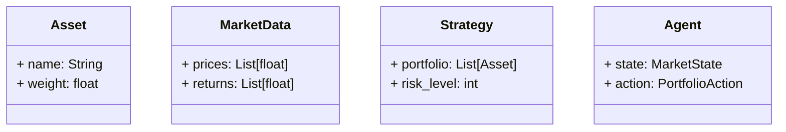
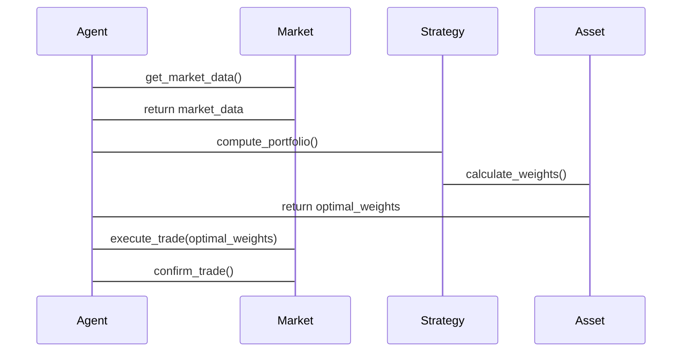

                 


# AI Agent在智能资产组合优化中的应用

## 关键词：AI Agent、智能资产组合优化、强化学习、投资组合优化、风险管理、动态优化、收益最大化

## 摘要：  
随着人工智能技术的快速发展，AI Agent（智能体）在金融领域的应用日益广泛。本文探讨了AI Agent在智能资产组合优化中的应用，分析了其在风险控制、收益最大化、动态调整等方面的优势。通过结合强化学习、多目标优化等技术，AI Agent能够有效解决传统资产组合优化的局限性，为投资者提供更智能、更高效的决策支持。本文从理论基础、算法原理、系统架构到实际案例，全面阐述了AI Agent在智能资产组合优化中的应用，并展望了未来的发展方向。

---

# 第1章: AI Agent与智能资产组合优化概述

## 1.1 AI Agent的基本概念

### 1.1.1 AI Agent的定义与特点  
AI Agent（智能体）是指能够感知环境、做出决策并执行动作的智能系统。它具有以下特点：  
- **自主性**：能够在没有外部干预的情况下自主运行。  
- **反应性**：能够实时感知环境并做出响应。  
- **目标导向性**：基于目标驱动决策和行动。  
- **学习能力**：能够通过经验改进性能。  

### 1.1.2 AI Agent的核心功能与应用场景  
AI Agent的核心功能包括感知、决策、执行和学习。它广泛应用于金融投资、自动驾驶、机器人控制等领域。在金融领域，AI Agent主要用于资产管理和投资决策。

### 1.1.3 AI Agent与传统投资组合优化的区别  
传统投资组合优化方法通常基于静态模型，难以应对市场波动和不确定性。而AI Agent能够通过动态感知和学习，实时调整资产配置，显著提高了优化的灵活性和适应性。

---

## 1.2 资产组合优化的基本概念

### 1.2.1 资产组合优化的定义  
资产组合优化是指在给定风险水平下，寻找能够实现最大收益的资产配置方式。它是金融投资中的核心问题之一。

### 1.2.2 资产组合优化的常见方法  
传统资产组合优化方法包括：  
- **均值-方差模型**：优化收益与风险的平衡。  
- **马科维茨有效前沿**：寻找最优资产组合。  
- **多因子模型**：基于多个因子进行优化。  

### 1.2.3 资产组合优化的挑战与目标  
资产组合优化的挑战包括市场波动、数据噪声、多目标冲突等。其目标是在复杂市场环境中实现收益与风险的最优平衡。

---

## 1.3 AI Agent在资产组合优化中的应用背景

### 1.3.1 传统资产组合优化的局限性  
传统方法难以应对动态市场环境和复杂目标函数。  

### 1.3.2 AI Agent在优化中的优势  
AI Agent能够实时感知市场变化，动态调整资产配置，支持多目标优化。  

### 1.3.3 资产组合优化的未来趋势  
随着AI技术的发展，资产组合优化将更加智能化和个性化。

---

## 1.4 本章小结  
本章介绍了AI Agent的基本概念、资产组合优化的核心原理及其在金融领域的应用背景。AI Agent通过动态感知和学习，为资产组合优化提供了新的解决方案。

---

# 第2章: AI Agent的核心概念与原理

## 2.1 AI Agent的核心概念

### 2.1.1 状态空间与动作空间  
**状态空间**：环境中的所有可能状态集合。  
**动作空间**：智能体在给定状态下可以执行的所有动作。

### 2.1.2 策略与价值函数  
**策略**：智能体在给定状态下选择动作的规则。  
**价值函数**：评估某个状态下动作的价值。

### 2.1.3 探索与利用的平衡  
智能体需要在探索新策略和利用已知策略之间找到平衡，以避免陷入局部最优。

---

## 2.2 AI Agent的决策机制

### 2.2.1 基于模型的决策  
智能体基于环境模型做出决策，适用于环境可建模的情况。

### 2.2.2 基于数据驱动的决策  
智能体通过历史数据学习决策策略，适用于复杂且不可建模的环境。

### 2.2.3 多目标优化的决策过程  
智能体在多个目标之间寻找折中，例如在收益与风险之间找到平衡。

---

## 2.3 AI Agent在资产组合优化中的应用

### 2.3.1 资产组合优化的动态性与不确定性  
市场环境动态变化，传统优化方法难以应对。

### 2.3.2 AI Agent在风险控制中的作用  
智能体能够实时监控风险指标，动态调整资产配置。

### 2.3.3 AI Agent在收益最大化中的应用  
通过强化学习，智能体能够在复杂市场中找到最优收益策略。

---

## 2.4 本章小结  
本章深入探讨了AI Agent的核心概念及其在资产组合优化中的应用。AI Agent通过动态决策和多目标优化，显著提升了资产组合的优化效果。

---

# 第3章: 资产组合优化的数学模型与算法

## 3.1 资产组合优化的数学模型

### 3.1.1 均值-方差模型  
目标是最小化投资组合的方差（风险），在给定收益下。  
公式：  
$$\min_{w} w^T \Sigma w$$  
$$s.t. \quad w^T \mu = r, \quad 1^T w = 1$$  

### 3.1.2 马科维茨有效前沿  
寻找收益与风险的最优平衡点。  
公式：  
$$\min_{w} w^T \Sigma w$$  
$$s.t. \quad w^T \mu = r, \quad 1^T w = 1, \quad r \geq r_{min}$$  

### 3.1.3 多目标优化模型  
在收益、风险、流动性等多目标之间寻求平衡。  

---

## 3.2 常见的资产组合优化算法

### 3.2.1 遗传算法  
通过模拟自然选择和遗传机制，寻找最优解。

### 3.2.2 模拟退火算法  
通过随机搜索和降温过程，避免陷入局部最优。

### 3.2.3 粒子群优化算法  
通过群体协作，寻找全局最优解。

---

## 3.3 AI Agent驱动的优化算法

### 3.3.1 强化学习在资产组合优化中的应用  
通过状态-动作-奖励机制，学习最优投资策略。

### 3.3.2 基于Q-learning的优化流程  
- 状态：市场环境（如收益率、波动率）。  
- 动作：资产配置比例。  
- 奖励：投资收益减去惩罚项。

---

## 3.4 本章小结  
本章详细介绍了资产组合优化的数学模型和常见算法，并探讨了AI Agent驱动的强化学习在优化中的应用。

---

# 第4章: AI Agent驱动的资产组合优化系统架构

## 4.1 系统功能设计

### 4.1.1 数据采集模块  
从金融市场获取实时数据，包括收益率、波动率等。

### 4.1.2 状态识别模块  
识别市场状态，例如牛市、熊市。

### 4.1.3 决策模块  
基于当前状态，生成资产配置策略。

### 4.1.4 执行模块  
根据决策结果，执行交易指令。

---

## 4.2 系统架构设计

### 4.2.1 领域模型（类图）  


### 4.2.2 系统架构（架构图）  
```mermaid
client
    /     \
   /       \
  Agent    Database
   \     /
    Market
```

---

## 4.3 系统接口设计

### 4.3.1 数据接口  
- 获取市场数据：`get_market_data()`
- 更新资产权重：`update_asset_weights()`

### 4.3.2 交易接口  
- 下达交易指令：`execute_trade()`
- 查询交易状态：`get_trade_status()`

---

## 4.4 系统交互流程（序列图）  


---

## 4.5 本章小结  
本章详细描述了AI Agent驱动的资产组合优化系统的功能设计、架构设计和接口设计，为后续的实现提供了基础。

---

# 第5章: 项目实战：基于AI Agent的资产组合优化系统

## 5.1 项目环境配置

### 5.1.1 环境要求  
- Python 3.8+
- NumPy, Pandas, Scikit-learn
- TensorFlow或PyTorch

### 5.1.2 数据准备  
- 历史市场数据（如股票价格、指数等）
- 市场状态标签（如牛市、熊市）

---

## 5.2 系统核心实现

### 5.2.1 数据预处理  
- 数据清洗：处理缺失值和异常值。
- 数据归一化：将数据标准化为统一范围。

### 5.2.2 状态识别  
- 使用机器学习模型识别市场状态。

### 5.2.3 决策模块实现  
- 基于强化学习的Q-learning算法，实现资产配置决策。

### 5.2.4 交易执行  
- 根据决策结果，生成交易指令并执行。

---

## 5.3 代码实现

### 5.3.1 数据预处理代码  
```python
import pandas as pd
import numpy as np

# 读取数据
data = pd.read_csv('market_data.csv')

# 数据清洗
data.dropna(inplace=True)
data = data[~data.isin([np.nan, np.inf, -np.inf]).any(axis=1)]

# 数据归一化
from sklearn.preprocessing import MinMaxScaler
scaler = MinMaxScaler()
data_scaled = scaler.fit_transform(data)
```

### 5.3.2 强化学习算法实现  
```python
class Agent:
    def __init__(self, state_space, action_space):
        self.state_space = state_space
        self.action_space = action_space
        self.q_table = pd.DataFrame(columns=self.action_space, dtype=float)

    def take_action(self, state):
        if state not in self.q_table.index:
            self.q_table.loc[state] = [0.0]*len(self.action_space)
        max_action = self.action_space[np.argmax(self.q_table.loc[state])]
        return max_action

    def learn(self, state, action, reward):
        self.q_table.loc[state, action] = reward
```

---

## 5.4 案例分析

### 5.4.1 实验结果  
通过回测验证系统在不同市场环境下的表现。

### 5.4.2 性能分析  
比较传统方法与AI Agent驱动方法的收益和风险指标。

---

## 5.5 本章小结  
本章通过实际项目展示了AI Agent在资产组合优化中的应用，并通过代码实现和案例分析，验证了其有效性。

---

# 第6章: 总结与扩展

## 6.1 本章总结  
本文详细探讨了AI Agent在智能资产组合优化中的应用，从理论到实践，全面分析了其优势和实现方法。

## 6.2 最佳实践 tips  
- 定期更新模型参数，适应市场变化。  
- 结合多目标优化，平衡收益与风险。  
- 注意风险管理，避免过度优化。

## 6.3 未来研究方向  
- 更复杂的市场建模。  
- 更高效的强化学习算法。  
- 多智能体协作优化。

## 6.4 拓展阅读  
推荐阅读《Reinforcement Learning: Theory and Algorithms》和《Modern Portfolio Theory and Investment Analysis》。

---

## 作者：AI天才研究院 & 禅与计算机程序设计艺术  

---

以上是《AI Agent在智能资产组合优化中的应用》的完整目录和内容框架。接下来可以按照这个大纲开始撰写每一章的具体内容。

