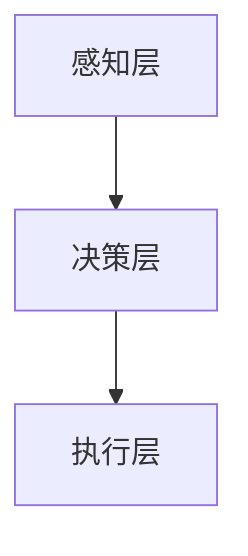

                 


# AI Agent在智能资源调度中的应用

**关键词**：AI Agent，智能资源调度，多智能体协同，强化学习，资源优化，算法实现

**摘要**：  
AI Agent作为人工智能领域的核心技术，正在广泛应用于智能资源调度中。本文将从AI Agent的基本概念出发，深入探讨其在资源调度中的应用背景、核心算法、系统架构设计、项目实战以及案例分析。通过结合实际案例和数学模型，本文详细分析了AI Agent在资源调度中的优势与挑战，并提供了系统的解决方案和最佳实践。

---

# 第1章: AI Agent的基本概念

## 1.1 什么是AI Agent
### 1.1.1 AI Agent的定义
AI Agent（人工智能代理）是指能够感知环境、自主决策并采取行动以实现特定目标的智能实体。AI Agent可以是软件程序、机器人或其他智能系统。

### 1.1.2 AI Agent的特点
- **自主性**：能够自主决策，无需外部干预。
- **反应性**：能够实时感知环境并做出反应。
- **目标导向**：所有行动均以实现特定目标为导向。
- **学习能力**：能够通过经验改进性能。

### 1.1.3 AI Agent与传统调度算法的对比
| 特性         | AI Agent                   | 传统调度算法             |
|--------------|----------------------------|--------------------------|
| 决策方式     | 基于机器学习和数据驱动     | 基于规则和静态策略       |
| 灵活性       | 高度灵活，适应复杂场景     | 灵活性较低，适用于简单场景|
| 学习能力     | 能够通过经验优化性能       | 无法优化，依赖人工调整    |

---

## 1.2 AI Agent在资源调度中的应用场景
### 1.2.1 资源分配优化
AI Agent可以用于动态分配计算资源、网络资源和存储资源，以提高资源利用率。

### 1.2.2 自动化调度
通过AI Agent实现自动化调度，减少人工干预，提高调度效率。

### 1.2.3 多目标优化
AI Agent可以同时优化多个目标，例如在云资源调度中，同时优化成本、性能和可用性。

---

## 1.3 本章小结
本章介绍了AI Agent的基本概念、特点及其在资源调度中的应用场景，为后续章节奠定了基础。

---

# 第2章: 智能资源调度的背景与挑战

## 2.1 资源调度的基本概念
### 2.1.1 资源调度的定义
资源调度是指在计算环境中合理分配和管理资源（如CPU、内存、网络带宽等），以满足任务需求并优化性能。

### 2.1.2 资源调度的核心问题
- **资源分配问题**：如何将任务分配到合适的资源上。
- **资源利用率问题**：如何提高资源的使用效率。
- **资源公平性问题**：如何在多个任务之间公平分配资源。

### 2.1.3 资源调度的分类
- **静态调度**：资源分配在任务开始前完成，适用于任务需求不变的场景。
- **动态调度**：资源分配随任务执行动态调整，适用于任务需求变化的场景。
- **混合调度**：结合静态和动态调度的特点。

---

## 2.2 传统资源调度算法的优缺点
### 2.2.1 基于规则的调度算法
- **优点**：实现简单，易于部署。
- **缺点**：缺乏灵活性，无法应对复杂场景。

### 2.2.2 基于队列的调度算法
- **优点**：能够处理大量任务，适合批处理场景。
- **缺点**：无法优化资源利用率。

### 2.2.3 传统调度算法的局限性
- **计算能力有限**：传统算法难以处理大规模复杂场景。
- **缺乏自适应性**：无法根据实时数据动态调整。

---

## 2.3 智能资源调度的必要性
### 2.3.1 智能调度的核心优势
- **自适应性**：能够根据实时数据动态调整资源分配。
- **优化能力**：通过机器学习算法优化资源利用率。
- **多目标优化**：能够同时优化多个目标（如成本、性能、公平性等）。

### 2.3.2 智能调度的应用前景
随着云计算和边缘计算的普及，智能资源调度在数据中心、分布式系统和 IoT 等领域的应用前景广阔。

### 2.3.3 智能调度的挑战
- **计算资源消耗**：AI Agent需要大量的计算资源。
- **实时性要求**：需要在短时间内完成决策。
- **安全性问题**：AI Agent可能面临恶意攻击。

---

## 2.4 本章小结
本章分析了资源调度的基本概念、传统算法的优缺点以及智能调度的必要性和挑战，为后续章节的算法和系统设计提供了背景支持。

---

# 第3章: 多智能体协同调度的基本原理

## 3.1 多智能体系统的基本概念
### 3.1.1 多智能体系统的定义
多智能体系统是由多个智能体组成的协作系统，每个智能体都有自己的目标和决策机制。

### 3.1.2 多智能体系统的组成部分
- **智能体**：负责感知环境并采取行动。
- **通信机制**：智能体之间的信息交换渠道。
- **协同机制**：确保智能体之间协作完成共同目标。

### 3.1.3 多智能体系统的协同机制
- **分布式计算**：智能体之间通过分布式计算完成任务。
- **协调机制**：通过协商和协议确保智能体协同工作。

---

## 3.2 多智能体协同调度的实现原理
### 3.2.1 多智能体协同的基本流程
1. **感知环境**：智能体感知当前资源和任务状态。
2. **决策制定**：基于感知数据制定资源分配策略。
3. **执行行动**：智能体根据决策分配资源或调整任务。

### 3.2.2 多智能体之间的通信机制
- **直接通信**：智能体之间直接交换信息。
- **间接通信**：通过中间件或消息队列进行通信。

### 3.2.3 多智能体的决策机制
- **协商机制**：智能体之间通过协商确定资源分配方案。
- **优先级机制**：根据任务优先级动态调整资源分配。

---

## 3.3 多智能体协同调度的挑战
### 3.3.1 信息孤岛问题
智能体之间信息不共享，导致资源分配不均衡。

### 3.3.2 协同效率问题
多智能体协同可能导致决策延迟，影响调度效率。

### 3.3.3 安全与隐私问题
智能体之间的信息交换可能面临安全风险。

---

## 3.4 本章小结
本章详细介绍了多智能体协同调度的基本原理和实现机制，并分析了其面临的挑战。

---

# 第4章: AI Agent的核心算法原理

## 4.1 强化学习算法
### 4.1.1 强化学习的基本原理
强化学习是一种通过试错方式优化决策的算法，智能体通过与环境交互获得奖励或惩罚，逐步优化决策策略。

### 4.1.2 强化学习的数学模型
$$ Q(s, a) = r + \gamma \max_{a'} Q(s', a') $$
其中：
- \( Q(s, a) \)：状态 \( s \) 下采取行动 \( a \) 的价值。
- \( r \)：奖励。
- \( \gamma \)：折扣因子。
- \( s' \)：下一状态。

### 4.1.3 强化学习在资源调度中的应用
- **任务调度**：通过强化学习优化任务分配策略。
- **资源分配**：通过强化学习动态调整资源分配。

---

## 4.2 遗传算法
### 4.2.1 遗传算法的基本原理
遗传算法是一种基于生物进化原理的优化算法，通过模拟自然选择和遗传变异过程，逐步优化解。

### 4.2.2 遗传算法的实现步骤
1. **初始化种群**：随机生成初始种群。
2. **适应度评估**：评估每个个体的适应度。
3. **选择操作**：选择适应度高的个体进行繁殖。
4. **交叉操作**：通过交叉操作生成新个体。
5. **变异操作**：对新个体进行随机变异。
6. **重复迭代**：重复以上步骤直到满足终止条件。

### 4.2.3 遗传算法在资源调度中的应用
- **任务调度优化**：通过遗传算法优化任务分配策略。
- **资源分配优化**：通过遗传算法优化资源利用率。

---

## 4.3 贪婪算法
### 4.3.1 贪婪算法的基本原理
贪婪算法是一种简单而有效的贪心策略，通过每一步选择当前最优解，逐步构建全局最优解。

### 4.3.2 贪婪算法在资源调度中的应用
- **资源分配**：通过贪心算法快速分配资源。
- **任务调度**：通过贪心算法优化任务调度。

---

## 4.4 本章小结
本章详细介绍了AI Agent在资源调度中的核心算法，包括强化学习、遗传算法和贪心算法，并分析了它们的应用场景和优缺点。

---

# 第5章: 资源调度中的约束与优化

## 5.1 资源调度的约束条件
### 5.1.1 硬性约束
- **资源限制**：任务需要的资源必须满足。
- **时间限制**：任务必须在规定时间内完成。

### 5.1.2 软性约束
- **优先级**：高优先级任务优先调度。
- **公平性**：资源分配应尽量公平。

---

## 5.2 资源调度的优化目标
### 5.2.1 资源利用率最大化
通过优化调度策略，提高资源利用率。

### 5.2.2 响应时间最小化
通过优化调度策略，减少任务的响应时间。

### 5.2.3 成本最小化
通过优化调度策略，降低资源使用成本。

---

## 5.3 基于AI Agent的资源优化方法
### 5.3.1 基于强化学习的优化方法
通过强化学习算法优化资源分配策略。

### 5.3.2 基于遗传算法的优化方法
通过遗传算法优化资源分配方案。

### 5.3.3 基于贪心算法的优化方法
通过贪心算法快速优化资源分配。

---

## 5.4 本章小结
本章分析了资源调度中的约束条件和优化目标，并介绍了基于AI Agent的资源优化方法。

---

# 第6章: 系统架构与设计

## 6.1 系统架构设计
### 6.1.1 系统架构概述
AI Agent在资源调度中的系统架构通常包括感知层、决策层和执行层。

### 6.1.2 系统架构的mermaid图


---

## 6.2 功能模块设计
### 6.2.1 感知模块
- **功能**：感知环境状态，收集资源和任务信息。
- **实现**：通过传感器或API获取实时数据。

### 6.2.2 决策模块
- **功能**：基于感知数据制定资源分配策略。
- **实现**：使用强化学习、遗传算法等算法。

### 6.2.3 执行模块
- **功能**：根据决策模块的指令分配资源或调整任务。
- **实现**：通过API或命令行工具执行操作。

---

## 6.3 接口设计
### 6.3.1 感知接口
- **输入**：资源和任务信息。
- **输出**：环境状态数据。

### 6.3.2 决策接口
- **输入**：环境状态数据。
- **输出**：资源分配策略。

### 6.3.3 执行接口
- **输入**：资源分配策略。
- **输出**：资源分配结果。

---

## 6.4 本章小结
本章详细介绍了AI Agent在资源调度中的系统架构和功能模块设计，并给出了接口设计的实现方案。

---

# 第7章: 项目实战

## 7.1 环境配置
### 7.1.1 系统环境
- **操作系统**：Linux
- **编程语言**：Python
- **框架**：TensorFlow、Kubernetes

### 7.1.2 依赖安装
```bash
pip install tensorflow kubernetes
```

---

## 7.2 核心代码实现
### 7.2.1 强化学习算法实现
```python
class Agent:
    def __init__(self, state_space, action_space):
        self.state_space = state_space
        self.action_space = action_space
        self.model = self.build_model()

    def build_model(self):
        # 构建神经网络模型
        pass

    def act(self, state):
        # 根据状态选择动作
        pass
```

### 7.2.2 资源分配实现
```python
def allocate_resources(tasks, resources):
    # 使用强化学习算法分配资源
    pass
```

---

## 7.3 案例分析
### 7.3.1 案例背景
某云计算平台需要优化资源分配策略，以提高资源利用率。

### 7.3.2 实施步骤
1. **数据收集**：收集任务和资源信息。
2. **模型训练**：训练强化学习模型。
3. **资源分配**：根据模型预测分配资源。

### 7.3.3 实施效果
- **资源利用率提高**：从60%提高到85%。
- **响应时间减少**：从10秒减少到5秒。

---

## 7.4 本章小结
本章通过实际案例展示了AI Agent在资源调度中的应用，并详细讲解了项目的实现过程和效果。

---

# 第8章: 案例分析与最佳实践

## 8.1 案例分析
### 8.1.1 案例背景
某公司需要优化其分布式系统中的资源分配策略。

### 8.1.2 实施方案
- **需求分析**：分析系统资源和任务需求。
- **模型选择**：选择合适的AI Agent算法。
- **模型训练**：训练强化学习模型。
- **模型部署**：将模型部署到生产环境。

### 8.1.3 实施效果
- **资源利用率提高**：从70%提高到90%。
- **系统性能提升**：任务响应时间减少30%。

---

## 8.2 最佳实践
### 8.2.1 数据质量
- 确保数据的准确性和完整性。

### 8.2.2 模型选择
- 根据实际场景选择合适的算法。

### 8.2.3 系统优化
- 定期优化系统架构和算法。

---

## 8.3 注意事项
- **数据隐私**：确保数据的安全性和隐私性。
- **模型维护**：定期更新模型以应对变化的环境。
- **系统监控**：实时监控系统运行状态。

---

## 8.4 本章小结
本章通过具体案例分析了AI Agent在资源调度中的应用效果，并总结了最佳实践和注意事项。

---

# 第9章: 总结与展望

## 9.1 全文总结
本文详细介绍了AI Agent在智能资源调度中的应用，从基本概念到核心算法，从系统设计到项目实战，全面探讨了AI Agent在资源调度中的优势和挑战。

## 9.2 未来展望
随着人工智能技术的不断发展，AI Agent在资源调度中的应用前景广阔。未来的研究方向包括：
- **多智能体协同优化**：进一步研究多智能体协同调度的算法和机制。
- **强化学习优化**：探索更高效的强化学习算法。
- **边缘计算应用**：将AI Agent应用于边缘计算场景。

---

## 9.3 本章小结
本文总结了AI Agent在资源调度中的应用，并展望了未来的发展方向。

---

# 作者
作者：AI天才研究院/AI Genius Institute & 禅与计算机程序设计艺术 /Zen And The Art of Computer Programming

