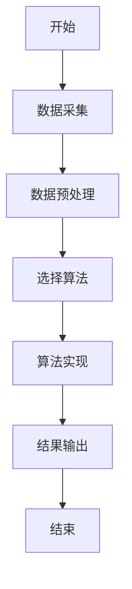
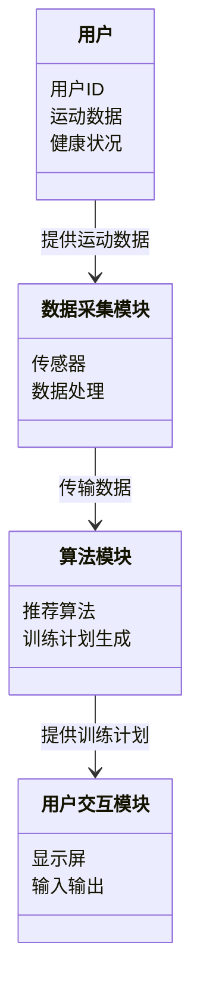
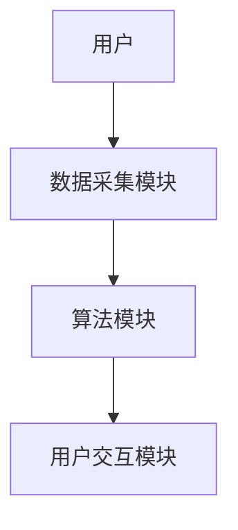
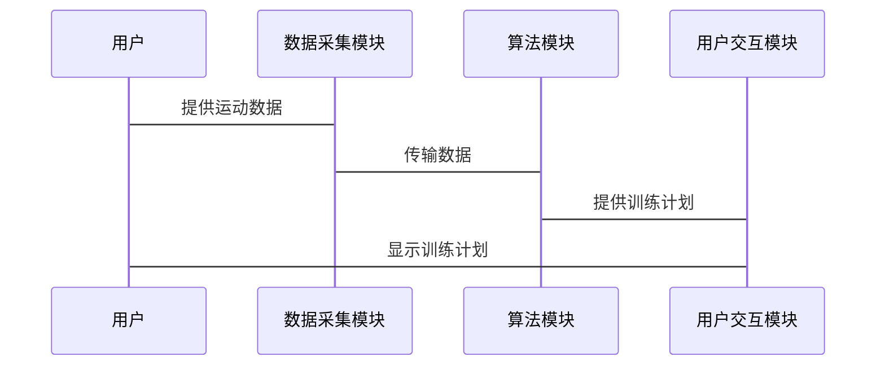

                 


# AI Agent在智能跑步机中的训练计划

> 关键词：AI Agent, 智能跑步机, 训练计划, 算法原理, 系统架构, 项目实战

> 摘要：本文详细探讨了AI Agent在智能跑步机中的应用，从背景介绍、核心概念、算法原理到系统架构和项目实战，全面分析了AI Agent如何优化跑步机的训练计划。通过具体的技术实现和案例分析，展示了AI Agent在智能跑步机中的巨大潜力和实际应用价值。

---

# 第1章: AI Agent与智能跑步机概述

## 1.1 AI Agent的基本概念

### 1.1.1 人工智能代理的定义
人工智能代理（AI Agent）是指能够感知环境、自主决策并采取行动的智能实体。它通过传感器获取信息，利用算法处理数据，最终做出最优决策。

### 1.1.2 AI Agent的核心特征
- **自主性**：能够在没有外部干预的情况下独立运行。
- **反应性**：能够实时感知环境并做出反应。
- **目标导向**：具有明确的目标，所有行为都围绕目标展开。
- **学习能力**：能够通过数据和经验不断优化自身性能。

### 1.1.3 AI Agent在运动健康中的应用潜力
AI Agent可以通过分析用户的运动数据和健康状况，提供个性化的训练建议，帮助用户达到最佳运动效果。

---

## 1.2 智能跑步机的发展背景

### 1.2.1 跑步机智能化的驱动力
随着科技的进步，用户对运动设备的智能化需求不断增加，传统跑步机的功能单一、缺乏个性化成为主要问题。

### 1.2.2 传统跑步机的局限性
- **缺乏个性化**：无法根据用户的需求提供定制化的训练计划。
- **数据单一**：只能记录基本的运动数据，无法进行深度分析。
- **用户体验差**：用户在使用过程中缺乏实时反馈和指导。

### 1.2.3 智能跑步机的市场现状
随着物联网和人工智能技术的发展，智能跑步机逐渐成为健身设备市场的主流产品。

---

## 1.3 AI Agent在跑步机中的应用价值

### 1.3.1 提高运动效率
AI Agent可以根据用户的运动数据和健康状况，实时调整训练计划，帮助用户更高效地达成运动目标。

### 1.3.2 个性化训练计划
通过分析用户的运动偏好、身体状况和运动目标，AI Agent可以制定个性化的训练计划，满足不同用户的需求。

### 1.3.3 运动数据的智能分析
AI Agent能够对用户的运动数据进行深度分析，提供科学的反馈和建议，帮助用户更好地了解自己的运动表现。

---

## 1.4 本章小结
本章介绍了AI Agent的基本概念、智能跑步机的发展背景以及AI Agent在跑步机中的应用价值，为后续内容奠定了基础。

---

# 第2章: AI Agent在智能跑步机中的核心概念

## 2.1 AI Agent的基本原理

### 2.1.1 数据采集与处理
AI Agent通过传感器和数据采集设备获取用户的运动数据，包括心率、步频、步长等。

### 2.1.2 算法选择与实现
根据数据的特点和应用场景选择合适的算法，例如基于规则的算法、机器学习算法等。

### 2.1.3 系统输出与反馈
AI Agent根据处理后的数据生成训练计划，并通过交互界面将结果反馈给用户。

---

## 2.2 智能跑步机的系统架构

### 2.2.1 硬件部分
- **传感器**：用于采集用户的运动数据。
- **处理器**：用于数据的处理和分析。
- **显示屏**：用于显示训练计划和实时数据。

### 2.2.2 软件部分
- **数据处理模块**：负责数据的清洗和预处理。
- **算法模块**：负责生成训练计划。
- **用户交互模块**：负责与用户的交互。

### 2.2.3 网络连接与数据传输
通过Wi-Fi或蓝牙将数据上传到云端，进行进一步的分析和优化。

---

## 2.3 AI Agent与运动数据的关系

### 2.3.1 数据来源
运动数据包括用户的运动历史、身体指标、健康状况等。

### 2.3.2 数据分析
通过机器学习算法对数据进行分析，提取有用的信息，例如用户的运动偏好和身体状况。

### 2.3.3 数据驱动的决策
根据分析结果，生成个性化的训练计划，并实时调整训练方案。

---

## 2.4 核心概念对比分析

### 2.4.1 AI Agent与传统运动计划的区别
| 特性           | AI Agent                  | 传统运动计划          |
|----------------|---------------------------|-----------------------|
| 个性化         | 高度个性化                | 较低                  |
| 实时性         | 实时调整                  | 非实时                |
| 数据驱动       | 数据驱动                  | 人工经验驱动          |

### 2.4.2 不同AI算法的优劣势对比
| 算法类型       | 优点                      | 缺点                  |
|----------------|---------------------------|-----------------------|
| 协同过滤       | 简单易实现                | 可能存在冷启动问题    |
| 基于内容的推荐 | 更加精准                  | 计算复杂度较高        |

### 2.4.3 系统架构的可扩展性分析
AI Agent的系统架构具有良好的扩展性，可以根据需求增加新的功能模块。

---

## 2.5 本章小结
本章详细分析了AI Agent的基本原理、智能跑步机的系统架构以及AI Agent与运动数据的关系，为后续的算法实现奠定了基础。

---

# 第3章: AI Agent的算法原理与实现

## 3.1 算法选择与优化

### 3.1.1 常见AI算法简介
- **协同过滤算法**：基于用户的行为相似性进行推荐。
- **基于内容的推荐算法**：基于物品的特征进行推荐。
- **混合推荐算法**：结合协同过滤和基于内容的推荐方法。

### 3.1.2 算法选择的依据
根据具体应用场景和数据特点选择合适的算法，例如用户数据稀疏时选择协同过滤算法。

### 3.1.3 算法优化策略
- **数据预处理**：去除噪声数据，提高算法的准确性。
- **模型调优**：通过交叉验证等方法优化模型参数。

---

## 3.2 推荐算法的实现

### 3.2.1 协同过滤算法
```python
def collaborative_filtering(user_id, item_ids, similarity_matrix):
    # 获取用户的历史评分
    user_ratings = ratings[user_id][item_ids]
    # 计算相似用户的推荐评分
    similar_users = find_similar_users(user_id, similarity_matrix)
   推荐评分 = calculate_recommendation_scores(similar_users, item_ids)
    return 推荐评分
```

### 3.2.2 基于内容的推荐算法
```python
def content_based_recommendation(user_id, item_ids, item_features):
    # 计算用户偏好的特征向量
    user_preference = get_user_preference(user_id)
    # 计算相似度
    similarity_scores = calculate_similarity(user_preference, item_features)
    # 排序并返回推荐结果
    return sorted(item_ids, key=lambda x: similarity_scores[x], reverse=True)[:top_k]
```

### 3.2.3 混合推荐算法
混合推荐算法结合了协同过滤和基于内容的推荐方法，通过加权的方式综合两种算法的结果。

---

## 3.3 算法流程图



---

## 3.4 算法实现的代码示例

### 3.4.1 数据预处理代码
```python
import pandas as pd

# 读取数据
data = pd.read_csv('training_data.csv')

# 去除缺失值
data = data.dropna()

# 标准化数据
from sklearn.preprocessing import StandardScaler

scaler = StandardScaler()
scaled_data = scaler.fit_transform(data)
```

### 3.4.2 算法实现代码
```python
from sklearn.neighbors import NearestNeighbors

# 初始化模型
model = NearestNeighbors(n_neighbors=5, metric='cosine')

# 训练模型
model.fit(scaled_data)

# 查找相似用户
distances, indices = model.kneighbors(scaled_data)
```

### 3.4.3 结果分析代码
```python
# 可视化结果
import matplotlib.pyplot as plt

plt.scatter(indices[:, 0], indices[:, 1])
plt.title('Similarity Visualization')
plt.show()
```

---

## 3.5 本章小结
本章详细讲解了AI Agent的算法原理与实现，包括算法选择、推荐算法的具体实现以及算法流程图的绘制。

---

# 第4章: AI Agent的数学模型与公式

## 4.1 数据

---

## 4.2 算法模型

### 4.2.1 协同过滤算法的数学模型
$$ \text{相似度} = \frac{\sum_{i=1}^{n} (x_i - \bar{x})(y_i - \bar{y})}{\sqrt{\sum_{i=1}^{n} (x_i - \bar{x})^2} \cdot \sqrt{\sum_{i=1}^{n} (y_i - \bar{y})^2}} $$

### 4.2.2 基于内容的推荐算法的数学模型
$$ \text{相似度} = \frac{\sum_{i=1}^{m} w_i x_i y_i}{\sqrt{\sum_{i=1}^{m} w_i x_i^2} \cdot \sqrt{\sum_{i=1}^{m} w_i y_i^2}} $$

---

## 4.3 本章小结
本章通过数学公式详细讲解了AI Agent的算法模型，包括协同过滤算法和基于内容的推荐算法的数学表达式。

---

# 第5章: 系统分析与架构设计方案

## 5.1 问题场景介绍
智能跑步机需要通过AI Agent实时分析用户的运动数据，并生成个性化的训练计划。

## 5.2 项目介绍
本项目旨在通过AI Agent优化智能跑步机的训练计划生成系统。

## 5.3 系统功能设计

### 5.3.1 领域模型


### 5.3.2 系统架构设计


### 5.3.3 系统接口设计
- **输入接口**：传感器数据接口。
- **输出接口**：显示屏接口。

### 5.3.4 系统交互


---

## 5.4 本章小结
本章通过系统分析和架构设计方案，详细介绍了智能跑步机的AI Agent训练计划生成系统的整体架构和功能模块。

---

# 第6章: 项目实战

## 6.1 环境安装

### 6.1.1 安装Python
```bash
python --version
```

### 6.1.2 安装依赖库
```bash
pip install numpy pandas scikit-learn
```

---

## 6.2 系统核心实现源代码

### 6.2.1 数据处理模块
```python
import pandas as pd
from sklearn.preprocessing import StandardScaler

# 读取数据
data = pd.read_csv('training_data.csv')

# 去除缺失值
data = data.dropna()

# 标准化数据
scaler = StandardScaler()
scaled_data = scaler.fit_transform(data)
```

### 6.2.2 算法模块
```python
from sklearn.neighbors import NearestNeighbors

# 初始化模型
model = NearestNeighbors(n_neighbors=5, metric='cosine')

# 训练模型
model.fit(scaled_data)

# 查找相似用户
distances, indices = model.kneighbors(scaled_data)
```

### 6.2.3 用户交互模块
```python
# 可视化结果
import matplotlib.pyplot as plt

plt.scatter(indices[:, 0], indices[:, 1])
plt.title('Similarity Visualization')
plt.show()
```

---

## 6.3 实际案例分析与详细讲解

### 6.3.1 案例分析
假设用户A的运动数据为：
```
HeartRate: 120, StepFrequency: 150, Duration: 30
```

### 6.3.2 代码应用解读与分析
通过算法模块生成推荐的训练计划，并通过用户交互模块将结果展示给用户。

---

## 6.4 项目小结
本章通过具体的项目实战，详细讲解了AI Agent在智能跑步机中的实现过程，包括环境安装、核心代码实现以及实际案例分析。

---

# 第7章: 最佳实践与注意事项

## 7.1 最佳实践

### 7.1.1 数据预处理
- 确保数据的完整性和准确性。
- 去除噪声数据，提高算法的准确性。

### 7.1.2 算法选择
- 根据具体场景和数据特点选择合适的算法。
- 定期更新算法模型，保持推荐结果的准确性。

### 7.1.3 系统优化
- 优化系统架构，提高系统的扩展性和可维护性。
- 定期监控系统性能，及时发现并解决问题。

---

## 7.2 小结
本章总结了AI Agent在智能跑步机中的最佳实践，包括数据预处理、算法选择和系统优化等方面。

---

# 第8章: 总结与展望

## 8.1 总结
本文详细探讨了AI Agent在智能跑步机中的训练计划生成系统，从背景介绍、核心概念、算法原理到系统架构和项目实战，全面分析了AI Agent的应用潜力和实际价值。

## 8.2 展望
未来，随着人工智能技术的不断发展，AI Agent在智能跑步机中的应用将更加广泛和深入，为用户提供更加智能化和个性化的运动体验。

---

# 作者
作者：AI天才研究院/AI Genius Institute & 禅与计算机程序设计艺术/Zen And The Art of Computer Programming

