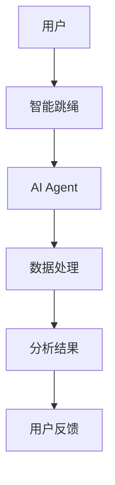
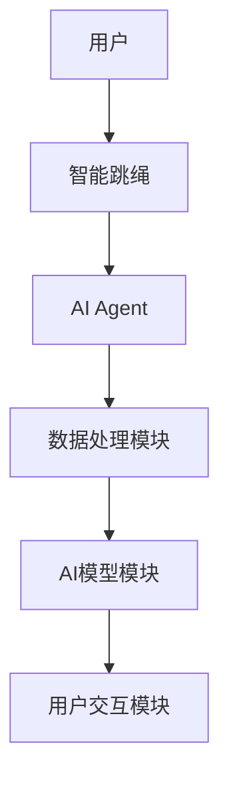
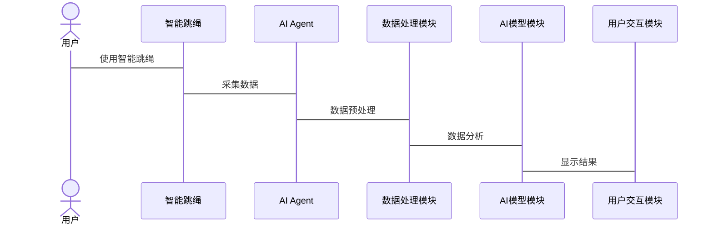

                 


# AI Agent在智能跳绳中的运动数据追踪

> 关键词：AI Agent，智能跳绳，运动数据追踪，算法原理，系统架构设计

> 摘要：本文详细探讨了AI Agent在智能跳绳中的运动数据追踪技术，从背景介绍、核心概念、算法原理、系统架构设计到项目实战，全面分析了AI Agent在智能跳绳中的应用及其对运动数据追踪的深远影响。本文将为您提供从理论到实践的全面指导。

---

## 第一部分: 背景介绍

### 第1章: 问题背景

#### 1.1 运动数据追踪的重要性
运动数据追踪是现代健康管理的重要组成部分。通过实时记录用户的运动数据，可以帮助用户了解自己的运动状态，制定科学的锻炼计划，并预防运动损伤。在智能跳绳中，运动数据追踪可以帮助用户掌握跳绳的速度、节奏、持续时间等关键指标，从而提升运动效果。

#### 1.2 智能跳绳的市场需求
随着人们对健康生活的追求，智能跳绳作为一种便捷的运动工具，市场需求日益增长。传统的跳绳仅能记录跳绳次数，而智能跳绳通过集成传感器和AI技术，能够实时追踪用户的运动数据，满足用户对运动数据深度分析的需求。

#### 1.3 AI Agent在运动数据追踪中的作用
AI Agent（人工智能代理）是一种能够感知环境、自主决策并执行任务的智能实体。在智能跳绳中，AI Agent可以实时采集跳绳数据，分析用户的运动状态，并提供个性化的反馈和建议，从而优化用户的运动体验。

### 第2章: 核心概念与联系

#### 2.1 AI Agent的核心概念
- **感知能力**：AI Agent能够通过传感器实时采集跳绳数据，包括跳绳速度、节奏、持续时间等。
- **决策能力**：AI Agent能够根据采集的数据，分析用户的运动状态，并提出优化建议。
- **执行能力**：AI Agent能够通过用户界面反馈分析结果，并协助用户调整运动计划。

#### 2.2 AI Agent与运动数据的关系
- **数据输入**：AI Agent通过传感器采集跳绳数据，作为分析的基础。
- **数据处理**：AI Agent对数据进行预处理、特征提取和模型训练，生成有意义的分析结果。
- **结果输出**：AI Agent将分析结果反馈给用户，指导用户优化运动计划。

### 第3章: 问题描述

#### 3.1 智能跳绳数据追踪的痛点
- **数据准确性**：传统跳绳只能记录跳绳次数，无法捕捉跳绳速度和节奏等关键数据。
- **用户反馈延迟**：用户无法实时获得运动数据的反馈，影响运动体验。
- **个性化建议缺乏**：用户需要个性化的运动建议，但传统跳绳无法提供。

#### 3.2 AI Agent如何解决这些问题
- **实时数据采集**：AI Agent通过传感器实时采集跳绳数据，确保数据的准确性。
- **实时反馈**：AI Agent能够实时分析数据，并通过用户界面提供反馈，提升用户体验。
- **个性化建议**：AI Agent可以根据用户的历史数据，提供个性化的运动建议，帮助用户优化运动计划。

#### 3.3 运动数据追踪的边界与外延
- **边界**：智能跳绳的数据追踪仅限于跳绳相关的数据，不涉及其他运动形式。
- **外延**：AI Agent的数据分析能力可以扩展到其他运动形式，为用户提供更全面的运动数据追踪服务。

---

## 第二部分: 核心概念与联系

### 第4章: AI Agent的原理

#### 4.1 AI Agent的基本原理
AI Agent通过感知环境、处理数据和执行任务来实现运动数据的实时追踪。在智能跳绳中，AI Agent通过传感器采集跳绳数据，分析用户的运动状态，并提供实时反馈和个性化建议。

#### 4.2 AI Agent的核心属性特征对比
| 属性 | 特征 | 描述 |
|------|------|------|
| 感知能力 | 高 | AI Agent能够实时采集跳绳数据，包括速度、节奏等关键指标。 |
| 决策能力 | 高 | AI Agent能够根据数据生成个性化的运动建议。 |
| 执行能力 | 高 | AI Agent能够通过用户界面反馈分析结果，并协助用户调整运动计划。 |

#### 4.3 AI Agent的ER实体关系图
```mermaid
erd
actor: 用户
smart_跳绳: 智能跳绳设备
ai_agent: AI Agent
data: 数据
interface: 用户界面

actor --> smart_跳绳: 使用智能跳绳
smart_跳绳 --> ai_agent: 采集数据
ai_agent --> data: 数据分析
data --> interface: 显示结果
```

### 第5章: AI Agent与运动数据的关系

#### 5.1 数据输入与AI Agent的处理流程


#### 5.2 数据分析与AI Agent的反馈机制
AI Agent通过分析用户的跳绳数据，生成个性化的反馈建议。例如，如果用户跳绳速度过快，AI Agent会建议用户降低速度以避免受伤。

#### 5.3 数据可视化与AI Agent的用户交互
AI Agent通过用户界面实时显示跳绳数据和分析结果，帮助用户更好地理解自己的运动状态。

---

## 第三部分: 算法原理讲解

### 第6章: AI Agent的算法流程

#### 6.1 数据采集与预处理
跳绳数据包括跳绳速度、节奏、持续时间等。AI Agent通过传感器采集这些数据，并进行预处理，去除噪声，提取有效特征。

#### 6.2 数据分析与特征提取
AI Agent使用机器学习算法对数据进行分析，提取关键特征，例如跳绳速度的标准差、节奏的变化率等。

#### 6.3 AI模型的训练与优化
AI Agent使用训练好的机器学习模型对数据进行分类、回归或聚类分析，生成个性化的反馈建议。

#### 6.4 结果输出与反馈
AI Agent将分析结果通过用户界面反馈给用户，帮助用户优化运动计划。

### 第7章: 算法实现的Python代码

#### 7.1 数据采集代码
```python
import numpy as np

def collect_data(samples=100):
    # 生成模拟跳绳数据
    np.random.seed(42)
    speed = np.random.normal(80, 10, samples)
    rhythm = np.random.randint(60, 120, samples)
    return speed, rhythm
```

#### 7.2 数据处理代码
```python
def preprocess_data(speed, rhythm):
    # 数据预处理
    from sklearn.preprocessing import StandardScaler
    scaler = StandardScaler()
    scaled_speed = scaler.fit_transform(speed.reshape(-1, 1))
    scaled_rhythm = scaler.fit_transform(rhythm.reshape(-1, 1))
    return scaled_speed, scaled_rhythm
```

#### 7.3 AI模型训练代码
```python
def train_model(speed, rhythm):
    # 使用机器学习模型进行训练
    from sklearn.ensemble import RandomForestRegressor
    model = RandomForestRegressor(n_estimators=100, random_state=42)
    model.fit(speed, rhythm)
    return model
```

#### 7.4 结果输出代码
```python
def display_results(predicted_rhythm):
    # 反馈结果显示
    print(f"预测的节奏为：{predicted_rhythm}")
```

### 第8章: 数学模型与公式

#### 8.1 数据预处理公式
$$
\text{标准化} = \frac{x - \mu}{\sigma}
$$

#### 8.2 AI模型训练公式
$$
\text{随机森林} = \sum_{i=1}^{n} \text{决策树}(x_i)
$$

#### 8.3 结果计算公式
$$
\text{预测节奏} = \text{模型预测}(x)
$$

---

## 第四部分: 系统分析与架构设计

### 第9章: 问题场景介绍

#### 9.1 智能跳绳运动数据追踪的场景
用户使用智能跳绳进行跳绳运动，AI Agent实时采集跳绳数据，并通过用户界面反馈分析结果。

#### 9.2 AI Agent在系统中的角色
AI Agent作为系统的核心模块，负责数据采集、分析和反馈。

#### 9.3 系统的目标与功能
系统的目标是通过AI Agent实现智能跳绳的运动数据追踪，帮助用户优化运动计划。

### 第10章: 系统功能设计

#### 10.1 数据采集模块
负责采集跳绳数据，包括速度和节奏。

#### 10.2 数据处理模块
对采集的数据进行预处理和特征提取。

#### 10.3 AI模型模块
使用机器学习模型对数据进行分析，生成反馈建议。

#### 10.4 用户交互模块
通过用户界面显示分析结果，并与用户进行交互。

### 第11章: 系统架构设计

#### 11.1 系统架构图


#### 11.2 模块之间的关系
模块之间通过数据接口进行交互，确保系统的高效运行。

### 第12章: 系统接口设计

#### 12.1 数据接口
模块之间的数据接口定义了数据格式和传输协议。

#### 12.2 AI模型接口
AI模型接口定义了模型输入和输出的格式。

#### 12.3 用户接口
用户接口定义了用户与系统之间的交互方式，例如用户界面的布局和功能。

### 第13章: 系统交互流程

#### 13.1 系统交互流程图


---

## 第五部分: 项目实战

### 第14章: 环境安装

#### 14.1 安装Python
安装Python 3.8或更高版本。

#### 14.2 安装依赖库
安装所需的依赖库，例如numpy、scikit-learn等。

### 第15章: 系统核心实现源代码

#### 15.1 数据采集代码
```python
import numpy as np

def collect_data(samples=100):
    np.random.seed(42)
    speed = np.random.normal(80, 10, samples)
    rhythm = np.random.randint(60, 120, samples)
    return speed, rhythm
```

#### 15.2 数据处理代码
```python
def preprocess_data(speed, rhythm):
    from sklearn.preprocessing import StandardScaler
    scaler = StandardScaler()
    scaled_speed = scaler.fit_transform(speed.reshape(-1, 1))
    scaled_rhythm = scaler.fit_transform(rhythm.reshape(-1, 1))
    return scaled_speed, scaled_rhythm
```

#### 15.3 AI模型训练代码
```python
def train_model(speed, rhythm):
    from sklearn.ensemble import RandomForestRegressor
    model = RandomForestRegressor(n_estimators=100, random_state=42)
    model.fit(speed, rhythm)
    return model
```

#### 15.4 结果输出代码
```python
def display_results(predicted_rhythm):
    print(f"预测的节奏为：{predicted_rhythm}")
```

### 第16章: 实际案例分析

#### 16.1 案例分析
用户进行跳绳运动，AI Agent实时采集数据并分析用户的运动状态，生成个性化的反馈建议。

#### 16.2 分析结果
AI Agent根据分析结果，建议用户调整跳绳速度和节奏，以达到最佳运动效果。

### 第17章: 项目总结

#### 17.1 项目总结
AI Agent在智能跳绳中的应用，显著提升了运动数据追踪的准确性和实时性，为用户提供了个性化的运动建议。

#### 17.2 项目意义
通过AI Agent实现智能跳绳的运动数据追踪，帮助用户更好地进行健康管理，提升运动体验。

---

## 第六部分: 总结与展望

### 第18章: 总结

#### 18.1 核心内容总结
AI Agent在智能跳绳中的运动数据追踪，通过实时采集、分析和反馈，优化了用户的运动体验。

#### 18.2 最佳实践
在实际应用中，建议结合用户的具体需求，进一步优化AI Agent的算法和系统架构。

### 第19章: 小结

#### 19.1 本章小结
本文详细探讨了AI Agent在智能跳绳中的运动数据追踪技术，从理论到实践，全面分析了AI Agent的应用及其对运动数据追踪的深远影响。

### 第20章: 注意事项

#### 20.1 使用注意事项
在实际使用中，建议用户定期校准设备，确保数据的准确性。

### 第21章: 拓展阅读

#### 21.1 拓展阅读建议
建议读者进一步学习AI Agent的相关技术，探索其在其他运动形式中的应用。

---

## 作者

作者：AI天才研究院/AI Genius Institute & 禅与计算机程序设计艺术 /Zen And The Art of Computer Programming

---

这篇文章详细探讨了AI Agent在智能跳绳中的运动数据追踪技术，从背景介绍、核心概念、算法原理、系统架构设计到项目实战，全面分析了AI Agent在智能跳绳中的应用及其对运动数据追踪的深远影响。希望对您有所帮助！

