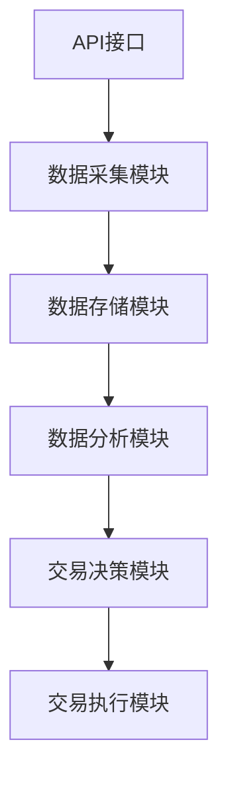

                 


```markdown
# AI Agent在智能金融市场分析中的应用

> 关键词：AI Agent，智能金融市场，机器学习，强化学习，自动化交易，金融数据分析

> 摘要：本文探讨AI Agent在智能金融市场分析中的应用，从AI Agent的基本概念到其在金融市场的核心技术，再到实际案例分析，系统地阐述其在金融市场中的作用和实现方法。文章结合理论与实践，详细分析了AI Agent在金融数据处理、预测与决策中的应用，探讨了其在金融市场中的算法原理、系统架构设计及项目实现。

---

## 第一部分：AI Agent与智能金融市场的基本概念

### 第1章：AI Agent的基本概念

#### 1.1 AI Agent的定义与特点
AI Agent（智能代理）是指能够感知环境并采取行动以实现目标的智能实体。其特点包括自主性、反应性、目标导向和学习能力。AI Agent在金融市场中的应用广泛，从数据处理到交易决策，都能看到其身影。

#### 1.2 AI Agent的核心技术
- **感知能力**：通过传感器或数据接口获取金融市场数据。
- **决策能力**：基于感知的数据，运用机器学习模型做出决策。
- **执行能力**：通过API或其他接口执行交易指令。

#### 1.3 AI Agent在金融市场中的作用
AI Agent能够帮助投资者快速分析市场数据、制定交易策略并执行交易，从而提高投资效率和收益。

---

### 第2章：智能金融市场的基本概念

#### 2.1 金融市场的定义与特点
金融市场是资金供需双方进行交易的场所，具有流动性高、信息透明度高、风险高等特点。

#### 2.2 智能金融市场的特点
- **数据驱动**：依赖大数据分析进行决策。
- **自动化**：通过AI Agent实现自动化的交易和管理。
- **智能化**：利用人工智能技术提高市场分析的精准度。

#### 2.3 AI Agent在智能金融市场中的应用
AI Agent可以用于金融数据分析、风险评估、交易策略制定等场景。

---

## 第二部分：AI Agent的核心技术与算法原理

### 第3章：AI Agent的核心技术

#### 3.1 数据采集与处理技术
- **数据源**：包括股票价格、交易量、新闻等。
- **数据清洗**：去除噪声数据，确保数据质量。
- **数据预处理**：标准化、归一化等处理。

#### 3.2 数据分析与建模技术
- **机器学习模型**：如线性回归、支持向量机、神经网络等。
- **深度学习模型**：如LSTM用于时间序列预测。

#### 3.3 自动化交易与决策技术
- **交易策略**：基于模型预测的结果，制定买入或卖出策略。
- **风险管理**：通过AI Agent实时监控市场风险，调整交易策略。

---

### 第4章：AI Agent的核心算法原理

#### 4.1 机器学习算法
- **线性回归**：用于预测股票价格的趋势。
  $$ y = \beta_0 + \beta_1x + \epsilon $$
- **支持向量机**：用于分类问题，如判断股票涨跌。

#### 4.2 深度学习算法
- **LSTM**：用于处理时间序列数据，捕捉长期依赖关系。
  ```python
  import tensorflow as tf
  model = tf.keras.Sequential()
  model.add(tf.keras.layers.LSTM(64, input_shape=(timesteps, features)))
  model.add(tf.keras.layers.Dense(1))
  model.compile(optimizer='adam', loss='mean_squared_error')
  ```

#### 4.3 强化学习算法
- **Q-learning**：通过状态-动作-奖励机制，优化交易策略。
  $$ Q(s, a) = Q(s, a) + \alpha (r + \gamma \max Q(s', a') - Q(s, a)) $$

---

## 第三部分：AI Agent在金融市场分析中的应用实例

### 第5章：项目实战

#### 5.1 项目背景
以某股票交易平台为例，设计一个基于AI Agent的股票价格预测系统。

#### 5.2 系统设计
- **数据采集模块**：实时采集股票价格数据。
- **数据分析模块**：使用LSTM模型进行预测。
- **交易执行模块**：根据预测结果执行买入或卖出指令。

#### 5.3 代码实现
```python
import pandas as pd
import numpy as np
from sklearn.preprocessing import MinMaxScaler
from tensorflow.keras.models import Sequential
from tensorflow.keras.layers import LSTM, Dense

# 数据预处理
data = pd.read_csv('stock_data.csv')
data = data['Close'].values
data = data.reshape(-1, 1)
scaler = MinMaxScaler()
scaled_data = scaler.fit_transform(data)

# 划分训练集和测试集
train_size = int(len(scaled_data) * 0.8)
test_size = len(scaled_data) - train_size
train_data = scaled_data[:train_size]
test_data = scaled_data[train_size:]

# 构建数据集
X_train = []
Y_train = []
for i in range(60, len(train_data)):
    X_train.append(train_data[i-60:i])
    Y_train.append(train_data[i])
X_train = np.array(X_train)
Y_train = np.array(Y_train)

# 模型训练
model = Sequential()
model.add(LSTM(128, return_sequences=True, input_shape=(60, 1)))
model.add(LSTM(64, return_sequences=False))
model.add(Dense(1))
model.compile(loss='mean_squared_error', optimizer='adam')
model.fit(X_train, Y_train, epochs=50, batch_size=32)

# 模型预测
X_test = []
for i in range(60, len(test_data)):
    X_test.append(test_data[i-60:i])
X_test = np.array(X_test)
预测结果 = model.predict(X_test)
```

#### 5.4 实际案例分析
以某只股票为例，展示AI Agent如何预测股票价格并执行交易。

---

## 第四部分：系统架构与实现

### 第6章：系统架构设计

#### 6.1 项目介绍
设计一个基于AI Agent的股票交易系统，实现股票价格预测和自动化交易。

#### 6.2 系统功能设计
- **数据采集**：从股票交易API获取实时数据。
- **数据分析**：使用机器学习模型进行预测。
- **交易执行**：根据预测结果执行交易指令。

#### 6.3 系统架构图


---

## 第五部分：最佳实践与总结

### 第7章：最佳实践与总结

#### 7.1 最佳实践
- **数据质量**：确保数据的准确性和及时性。
- **模型调优**：通过网格搜索优化模型参数。
- **风险管理**：设置止损点，避免重大损失。

#### 7.2 总结
AI Agent在智能金融市场分析中具有重要的应用价值。通过结合机器学习、深度学习和强化学习技术，AI Agent能够显著提高金融市场的分析效率和决策准确性。

---

## 作者信息

作者：AI天才研究院/AI Genius Institute & 禅与计算机程序设计艺术 /Zen And The Art of Computer Programming
```

