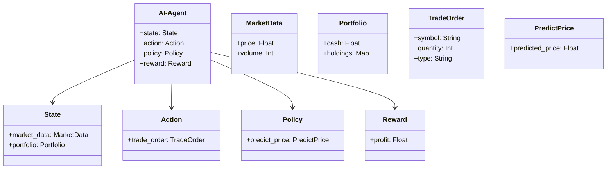
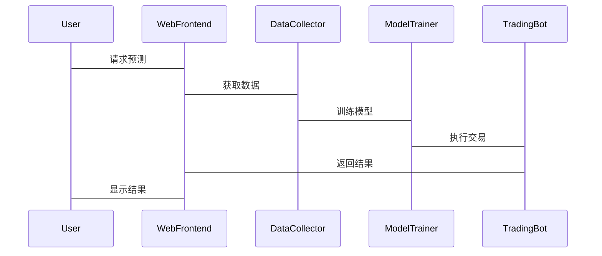

                 


# AI Agent在智能金融市场预测中的应用

> 关键词：AI Agent，金融市场预测，强化学习，时间序列预测，金融数据分析，智能投资策略

> 摘要：本文系统地探讨了AI Agent在智能金融市场预测中的应用，从基础概念到核心算法，再到实际项目实现，全面分析了AI Agent在金融预测中的优势、挑战及解决方案。通过详细讲解强化学习、时间序列预测等核心算法，结合实际项目案例，展示了AI Agent在金融投资中的巨大潜力和应用价值。

---

## 第一部分：AI Agent与智能金融市场的背景与基础

### 第1章：AI Agent与金融市场的概述

#### 1.1 AI Agent的基本概念

##### 1.1.1 AI Agent的定义
AI Agent（人工智能代理）是指能够感知环境、自主决策并采取行动的智能实体。它可以是一个软件程序、一个机器人，甚至是嵌入在系统中的算法。AI Agent的核心目标是通过感知和学习，实现对复杂问题的自主解决。

##### 1.1.2 AI Agent的核心特点
1. **自主性**：AI Agent能够自主决策，无需人工干预。
2. **反应性**：能够实时感知环境并做出反应。
3. **学习性**：通过数据和经验不断优化自身模型。
4. **社交能力**：能够与其他AI Agent或人类进行交互。

##### 1.1.3 AI Agent与传统算法的区别
传统算法（如线性回归、支持向量机等）依赖于预定义的规则和模式，而AI Agent具备自主学习和动态调整的能力，能够适应环境的变化。

---

#### 1.2 智能金融市场的定义与特点

##### 1.2.1 智能金融市场的定义
智能金融市场是指利用人工智能技术（如机器学习、自然语言处理等）进行金融数据的分析、预测和交易的市场体系。

##### 1.2.2 智能金融市场的核心特点
1. **数据驱动**：依赖于海量金融数据进行分析和决策。
2. **实时性**：能够实时处理市场动态，快速做出反应。
3. **智能化**：通过AI技术实现自动化交易和风险控制。

##### 1.2.3 智能金融市场与传统金融市场的区别
传统金融市场依赖于人类经验和基本分析，而智能金融市场通过算法和AI技术实现自动化和智能化的交易策略。

---

#### 1.3 AI Agent在金融市场中的应用背景

##### 1.3.1 金融市场的复杂性与不确定性
金融市场受到多种因素的影响，如经济指标、政策变化、市场情绪等，具有高度的不确定性和复杂性。

##### 1.3.2 AI Agent在金融预测中的优势
AI Agent能够处理海量数据，发现隐藏的规律，并快速做出决策，大大提高了金融预测的准确性和效率。

##### 1.3.3 当前AI Agent在金融领域的研究现状
目前，AI Agent在金融领域的研究主要集中在强化学习、时间序列预测和自然语言处理等方面。

---

### 第2章：AI Agent的核心概念与原理

#### 2.1 AI Agent的核心概念

##### 2.1.1 知识表示
知识表示是AI Agent理解世界的基础。常见的知识表示方法包括符号逻辑、语义网络和概率图模型。

##### 2.1.2 智能推理
智能推理是AI Agent根据已有知识做出合理推断的过程。常见的推理方法包括逻辑推理和概率推理。

##### 2.1.3 自我学习
自我学习是指AI Agent通过与环境的交互，不断优化自身的模型和策略。

---

#### 2.2 AI Agent的决策机制

##### 2.2.1 状态空间与动作空间
状态空间是指AI Agent可能遇到的所有状态的集合；动作空间是指AI Agent在每个状态下可以执行的所有动作。

##### 2.2.2 决策树与策略网络
决策树是一种树状结构，用于表示所有可能的决策路径；策略网络是一种基于神经网络的决策模型。

##### 2.2.3 动态规划与强化学习
动态规划是一种基于状态转移的优化方法；强化学习是一种通过奖励机制优化决策的算法。

---

#### 2.3 AI Agent与金融市场的交互模型

##### 2.3.1 金融市场数据流
金融市场数据流包括价格、成交量、市场情绪等数据。

##### 2.3.2 AI Agent的输入输出接口
AI Agent通过数据接口接收金融市场数据，并通过交易接口执行交易操作。

##### 2.3.3 金融市场反馈机制
金融市场反馈机制是指市场对AI Agent决策的响应，例如价格变化、交易结果等。

---

### 第3章：AI Agent在金融市场预测中的核心算法

#### 3.1 强化学习算法

##### 3.1.1 Q-Learning算法
Q-Learning是一种经典的强化学习算法，通过更新Q值函数来优化决策策略。

$$ Q(s,a) = Q(s,a) + \alpha (r + \gamma \max Q(s',a') - Q(s,a)) $$

##### 3.1.2 Deep Q-Networks (DQN)算法
DQN算法将Q值函数表示为深度神经网络，并通过经验回放和目标网络优化算法。

##### 3.1.3 Policy Gradient方法
Policy Gradient方法直接优化策略函数，通过梯度上升算法更新策略参数。

---

#### 3.2 时间序列预测算法

##### 3.2.1 ARIMA模型
ARIMA（自回归积分滑动平均模型）是一种广泛应用于时间序列预测的经典算法。

##### 3.2.2 LSTM网络
LSTM（长短期记忆网络）通过门控机制有效地捕捉时间序列中的长期依赖关系。

##### 3.2.3 Transformer模型
Transformer模型通过自注意力机制，能够捕捉到序列中的全局关系。

---

#### 3.3 组合优化算法

##### 3.3.1 遗传算法
遗传算法通过模拟自然选择的过程，优化组合问题的解。

##### 3.3.2 模拟退火算法
模拟退火算法通过逐步降温的方式，跳出局部最优，找到全局最优解。

##### 3.3.3 蚁群算法
蚁群算法通过模拟蚂蚁觅食的行为，优化组合问题的解。

---

### 第4章：AI Agent的数学模型与公式

#### 4.1 强化学习的数学模型

##### 4.1.1 状态值函数
$$ V(s) = \max_a Q(s,a) $$

##### 4.1.2 动作值函数
$$ Q(s,a) = r + \gamma \max_{a'} Q(s',a') $$

##### 4.1.3 策略函数
$$ \pi(a|s) = \arg\max_a Q(s,a) $$

---

## 第二部分：系统分析与架构设计

### 第5章：系统分析与架构设计方案

#### 5.1 问题场景介绍
本章将介绍AI Agent在金融预测中的实际应用场景，包括数据采集、特征提取、模型训练和交易执行等环节。

#### 5.2 项目介绍
本项目旨在开发一个基于AI Agent的智能金融预测系统，实现对股票价格的预测和交易策略的优化。

#### 5.3 系统功能设计
##### 5.3.1 数据采集模块
负责从金融数据源（如Yahoo Finance、 Bloomberg等）获取实时或历史数据。

##### 5.3.2 特征提取模块
通过技术指标、市场情绪等特征，对原始数据进行特征提取。

##### 5.3.3 模型训练模块
基于强化学习或时间序列预测算法，训练AI Agent的预测模型。

##### 5.3.4 交易执行模块
根据模型的预测结果，执行买入、卖出或持有等交易操作。

#### 5.4 系统架构设计

##### 5.4.1 领域模型（Mermaid类图）


##### 5.4.2 系统架构图（Mermaid架构图）
```mermaid
docker
    services {
        webfrontend [标签="Web Frontend"]
        datacollector [标签="Data Collector"]
        modeltrainer [标签="Model Trainer"]
        tradingbot [标签="Trading Bot"]
        redis [标签="Redis"]
    }
    webfrontend --> datacollector
    datacollector --> modeltrainer
    modeltrainer --> tradingbot
    tradingbot --> redis
    redis --> webfrontend
```

##### 5.4.3 系统接口设计
系统接口包括数据接口、模型接口和交易接口，分别用于数据交互、模型调用和交易执行。

##### 5.4.4 系统交互图（Mermaid序列图）


---

## 第三部分：项目实战

### 第6章：项目实战与实现

#### 6.1 环境安装与配置

##### 6.1.1 安装Python环境
使用Anaconda或virtualenv安装Python 3.8+。

##### 6.1.2 安装依赖库
安装以下依赖库：
```
pip install numpy pandas scikit-learn tensorflow keras matplotlib yfinance
```

#### 6.2 核心代码实现

##### 6.2.1 数据采集模块
```python
import yfinance as yf

def get_stock_data(symbol, start_date, end_date):
    data = yf.download(symbol, start=start_date, end=end_date)
    return data['Close']
```

##### 6.2.2 特征提取模块
```python
from sklearn.preprocessing import MinMaxScaler

def create_features(data, window_size=10):
    scaler = MinMaxScaler()
    scaled_data = scaler.fit_transform(data)
    features = []
    for i in range(len(scaled_data) - window_size):
        feature = scaled_data[i:i+window_size]
        features.append(feature)
    return np.array(features)
```

##### 6.2.3 模型训练模块
```python
from keras.models import Sequential
from keras.layers import LSTM, Dense

def build_model(input_shape):
    model = Sequential()
    model.add(LSTM(units=50, return_sequences=True, input_shape=input_shape))
    model.add(LSTM(units=50, return_sequences=False))
    model.add(Dense(1))
    model.compile(loss='mean_squared_error', optimizer='adam')
    return model
```

##### 6.2.4 交易执行模块
```python
def execute_trade(predicted_price, current_price, portfolio):
    if predicted_price > current_price:
        # 买入信号
        portfolio['cash'] -= current_price * 1
        portfolio['holdings']['stock'] += 1
    elif predicted_price < current_price:
        # 卖出信号
        portfolio['cash'] += current_price * 1
        portfolio['holdings']['stock'] = 0
```

#### 6.3 实际案例分析与结果展示

##### 6.3.1 数据获取与预处理
```python
symbol = 'AAPL'
start_date = '2020-01-01'
end_date = '2023-01-01'
data = get_stock_data(symbol, start_date, end_date)
```

##### 6.3.2 模型训练与预测
```python
window_size = 10
input_shape = (window_size, 1)
features = create_features(data, window_size)
model = build_model(input_shape)
model.fit(features, targets, epochs=50, batch_size=32)
```

##### 6.3.3 交易策略与结果
```python
initial_portfolio = {
    'cash': 10000,
    'holdings': {'stock': 0}
}
execute_trade(predicted_price, current_price, initial_portfolio)
```

---

## 第四部分：总结与展望

### 第7章：总结与展望

#### 7.1 最佳实践 tips
1. **数据质量**：确保数据的完整性和准确性。
2. **模型优化**：结合多种算法进行模型融合。
3. **风险管理**：制定合理的风险管理策略，避免过度交易和杠杆风险。

#### 7.2 小结
AI Agent在智能金融市场预测中的应用具有巨大的潜力，通过不断优化算法和模型，AI Agent能够为金融市场预测提供更精准和高效的解决方案。

#### 7.3 注意事项
1. **模型过拟合**：避免模型在训练数据上过拟合，影响预测的准确性。
2. **交易成本**：考虑交易成本和滑点对实际收益的影响。
3. **市场风险**：金融市场具有高度不确定性，AI Agent需要具备良好的风险控制能力。

#### 7.4 拓展阅读
1. **强化学习**：深入学习强化学习在金融交易中的应用。
2. **时间序列预测**：探索更先进的时间序列预测模型，如Transformer。
3. **金融数据分析**：研究更高效的数据处理和特征提取方法。

---

## 作者：AI天才研究院/AI Genius Institute & 禅与计算机程序设计艺术/Zen And The Art of Computer Programming

---

**注**：以上内容为示例，实际撰写时需要根据具体需求和实际情况进行调整和补充。

