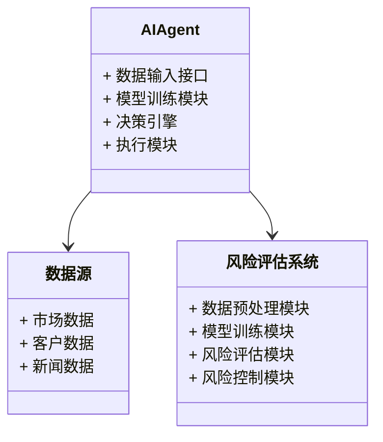

                 


# AI Agent在智能金融风险评估中的应用

> 关键词：AI Agent、智能金融、风险评估、机器学习、金融风险

> 摘要：随着人工智能技术的快速发展，AI Agent在金融领域的应用日益广泛。本文深入探讨了AI Agent在智能金融风险评估中的应用，从基本概念、核心原理到实际案例，全面分析了其在风险识别、量化和控制中的作用，结合数学模型和算法，展示了如何通过AI技术提升金融风险管理的效率和准确性。

---

## 第一部分: AI Agent与智能金融风险评估基础

### 第1章: AI Agent与智能金融风险评估概述

#### 1.1 AI Agent的基本概念

##### 1.1.1 AI Agent的定义与特点

AI Agent（人工智能代理）是指能够感知环境、自主决策并执行任务的智能实体。它具备以下特点：

- **自主性**：能够在没有外部干预的情况下独立运行。
- **反应性**：能够实时感知环境变化并做出反应。
- **目标导向**：具有明确的目标，并根据目标优化行动。
- **学习能力**：能够通过数据和经验不断优化自身的算法和决策能力。

##### 1.1.2 AI Agent的核心原理

AI Agent的核心原理包括感知、决策和执行三个主要环节：

1. **感知**：通过传感器或数据输入接口获取环境信息。
2. **决策**：基于获取的信息，利用算法和模型进行分析和决策。
3. **执行**：根据决策结果，执行相应的操作或输出结果。

##### 1.1.3 AI Agent在金融领域的应用潜力

在金融领域，AI Agent可以应用于股票交易、风险管理、客户行为分析等多个方面。其在金融风险评估中的潜力主要体现在：

- **实时监控**：能够实时监测市场波动和客户行为，及时发现潜在风险。
- **精准预测**：通过机器学习算法，对金融数据进行建模和预测，提高风险评估的准确性。
- **自动化决策**：基于模型结果，自动化执行风险控制措施，减少人为干预。

#### 1.2 金融风险评估的基本概念

##### 1.2.1 金融风险的定义与分类

金融风险是指在金融活动中，由于各种不确定性因素导致的损失可能性。常见的金融风险类型包括：

- **市场风险**：由于市场波动导致的资产价值损失。
- **信用风险**：由于债务人或交易对手违约导致的损失。
- **流动性风险**：无法及时以合理价格买卖资产的风险。
- **操作风险**：由于内部流程、系统或人员失误导致的风险。

##### 1.2.2 传统金融风险评估方法

传统的金融风险评估方法主要包括：

1. **VaR（Value at Risk）模型**：用于衡量在给定置信水平下的潜在损失。
2. **信用评分模型**：基于客户的信用历史和财务状况，评估其违约概率。
3. **情景分析法**：通过模拟不同市场情景，评估资产组合在不同条件下的表现。

##### 1.2.3 金融风险评估的挑战与需求

金融风险评估的挑战主要在于数据的复杂性、市场的不确定性以及模型的局限性。传统的评估方法往往依赖于历史数据和线性假设，难以捕捉复杂的市场动态和非线性关系。因此，需要引入更加智能化的工具和方法，如AI Agent，以提高评估的准确性和实时性。

#### 1.3 AI Agent在金融风险评估中的结合

##### 1.3.1 AI Agent与金融风险评估的结合背景

随着大数据和人工智能技术的快速发展，金融行业逐渐从传统的方法转向智能化、数据驱动的决策模式。AI Agent作为一种智能实体，能够实时处理大量数据，具备强大的分析和决策能力，为金融风险评估提供了新的可能性。

##### 1.3.2 AI Agent在金融风险评估中的优势

AI Agent在金融风险评估中的优势主要体现在以下几个方面：

1. **实时性**：能够实时监测市场动态和客户行为，及时发现潜在风险。
2. **准确性**：通过机器学习算法，能够捕捉复杂的市场动态和非线性关系，提高风险评估的准确性。
3. **自动化**：能够自动化执行风险控制措施，减少人为干预，提高效率。

##### 1.3.3 未来发展趋势与应用前景

未来，AI Agent在金融风险评估中的应用将更加广泛和深入。随着技术的进步，AI Agent将具备更强的自主决策能力和学习能力，能够更好地应对复杂的金融市场环境。同时，AI Agent的应用也将推动金融行业的数字化转型，提高整体风险管理水平。

---

### 第2章: AI Agent的核心原理与技术

#### 2.1 AI Agent的核心原理

##### 2.1.1 AI Agent的感知、决策与执行机制

AI Agent的感知、决策与执行机制是其工作的核心流程：

1. **感知**：通过传感器或数据接口获取环境信息，如市场数据、客户行为数据等。
2. **决策**：基于感知到的信息，利用机器学习算法和模型进行分析，生成决策方案。
3. **执行**：根据决策结果，执行相应的操作，如买卖股票、调整投资组合等。

##### 2.1.2 AI Agent的自主性与智能性

AI Agent的自主性体现在其能够在没有外部干预的情况下独立运行。其智能性则体现在其能够通过学习和优化算法，不断提高自身的分析和决策能力。

##### 2.1.3 AI Agent的多智能体协作

在复杂的金融市场环境中，单个AI Agent往往难以独立完成所有任务。因此，多智能体协作成为一种重要的实现方式。多个AI Agent可以通过协作，共同完成更复杂的任务，如资产分配、风险分散等。

#### 2.2 AI Agent的关键技术

##### 2.2.1 机器学习与深度学习

机器学习和深度学习是AI Agent的核心技术之一。通过训练模型，AI Agent能够从大量数据中提取特征和模式，从而做出更准确的决策。

##### 2.2.2 自然语言处理

自然语言处理技术使AI Agent能够理解和分析非结构化数据，如新闻报道、社交媒体信息等。这在金融风险评估中尤为重要，因为市场情绪和新闻事件往往对资产价格产生重要影响。

##### 2.2.3 强化学习与决策优化

强化学习是一种通过试错机制优化决策的技术。在金融风险评估中，强化学习可以用于优化投资组合和风险控制策略。

#### 2.3 AI Agent在金融领域的技术实现

##### 2.3.1 数据采集与处理

数据采集与处理是AI Agent工作的第一步。需要从多种来源获取数据，如市场数据、财务报表、新闻等，并进行清洗和预处理。

##### 2.3.2 模型训练与优化

通过机器学习算法对模型进行训练和优化，以提高其预测能力和准确性。常用的算法包括随机森林、支持向量机（SVM）、神经网络等。

##### 2.3.3 结果解释与可视化

模型的输出结果需要进行解释和可视化，以便人类分析师能够理解和应用。常见的可视化方法包括图表、热力图等。

---

### 第3章: 金融风险评估的核心概念与联系

#### 3.1 金融风险评估的核心概念

##### 3.1.1 风险来源与分类

金融风险的主要来源包括市场波动、信用违约、流动性问题等。不同类型的金融风险需要采取不同的评估方法。

##### 3.1.2 金融风险评估的指标体系

常用的金融风险评估指标包括VaR、信用评分、流动性比率等。这些指标能够从不同角度反映金融风险的大小和类型。

##### 3.1.3 金融风险评估的流程与方法

金融风险评估的流程通常包括数据收集、模型选择、参数设置、结果分析等步骤。不同的评估方法适用于不同的风险类型和场景。

#### 3.2 AI Agent与金融风险评估的关联

##### 3.2.1 AI Agent在风险识别中的作用

AI Agent能够通过机器学习算法，从海量数据中识别潜在风险信号，帮助分析师发现传统方法难以察觉的风险点。

##### 3.2.2 AI Agent在风险量化中的应用

通过训练模型，AI Agent能够量化不同风险因素的影响程度，从而为风险管理和决策提供数据支持。

##### 3.2.3 AI Agent在风险控制中的价值

AI Agent能够自动化执行风险控制措施，如动态调整投资组合、设置止损点等，从而有效降低风险敞口。

#### 3.3 核心概念

金融风险评估的核心概念包括风险来源、风险类型、风险指标等。AI Agent通过分析这些核心概念，能够更准确地识别和量化风险，并制定有效的风险控制策略。

---

## 第二部分: AI Agent在金融风险评估中的技术实现

### 第4章: 金融风险评估的核心算法与数学模型

#### 4.1 金融风险评估的核心算法

##### 4.1.1 线性回归模型

线性回归是一种常用的统计模型，用于预测因变量与自变量之间的线性关系。在金融风险评估中，线性回归可以用于预测资产收益或违约概率。

##### 4.1.2 支持向量机（SVM）

支持向量机是一种监督学习算法，适用于分类和回归问题。在金融风险评估中，SVM可以用于信用评分和市场趋势预测。

##### 4.1.3 随机森林

随机森林是一种基于决策树的集成学习算法，具有较高的准确性和鲁棒性。在金融风险评估中，随机森林可以用于风险分类和特征选择。

#### 4.2 金融风险评估的数学模型

##### 4.2.1 VaR模型

VaR（Value at Risk）是一种常用的市场风险度量方法。它表示在给定置信水平下，资产组合的最大潜在损失。

数学表达式：
$$ VaR_{\alpha} = \text{最小的损失值，使得在}\alpha\text{置信水平下，损失不超过该值} $$

##### 4.2.2 信用评分模型

信用评分模型用于评估客户的信用风险。常用的模型包括逻辑回归、概率神经网络等。

##### 4.2.3 风险价值模型

风险价值模型是另一种常用的市场风险度量方法，与VaR类似，但更加注重资产组合的风险特征。

---

### 第5章: AI Agent在金融风险评估中的系统设计

#### 5.1 系统需求分析

##### 5.1.1 功能需求

- 实时数据采集与处理
- 风险识别与量化
- 自动化风险控制

##### 5.1.2 性能需求

- 高可用性
- 高实时性
- 高扩展性

#### 5.2 系统功能设计

##### 5.2.1 领域模型



##### 5.2.2 系统架构设计


##### 5.2.3 接口设计

- 数据接口：用于数据的输入和输出。
- 模型接口：用于模型的训练和部署。
- 决策接口：用于生成风险评估结果和控制策略。

#### 5.3 项目实战

##### 5.3.1 环境配置

- Python 3.8+
- Jupyter Notebook
- 机器学习库（如Scikit-learn、TensorFlow）
- 数据处理库（如Pandas、NumPy）

##### 5.3.2 核心代码实现

```python
import pandas as pd
import numpy as np
from sklearn.ensemble import RandomForestClassifier
from sklearn.metrics import accuracy_score

# 数据加载
data = pd.read_csv('financial_data.csv')

# 特征选择
features = data[['feature1', 'feature2', 'feature3']]
target = data['target']

# 模型训练
model = RandomForestClassifier()
model.fit(features, target)

# 预测与评估
predictions = model.predict(features)
print("Accuracy:", accuracy_score(target, predictions))
```

##### 5.3.3 系统部署与测试

- 部署环境：云服务器、Docker容器
- 测试方法：单元测试、集成测试、压力测试

##### 5.3.4 实际案例分析

通过实际案例分析，验证AI Agent在金融风险评估中的有效性。例如，使用AI Agent预测某公司的信用违约风险，评估模型的准确性和稳定性。

---

## 第三部分: 总结与展望

### 第6章: 总结与展望

#### 6.1 本章总结

本文详细探讨了AI Agent在智能金融风险评估中的应用，从基本概念、核心原理到实际案例，全面分析了其在风险识别、量化和控制中的作用。通过结合机器学习、深度学习等技术，展示了如何通过AI Agent提升金融风险管理的效率和准确性。

#### 6.2 未来展望

未来，AI Agent在金融风险评估中的应用将更加广泛和深入。随着技术的进步，AI Agent将具备更强的自主决策能力和学习能力，能够更好地应对复杂的金融市场环境。同时，AI Agent的应用也将推动金融行业的数字化转型，提高整体风险管理水平。

---

## 附录

### 附录A: 术语表

- AI Agent：人工智能代理
- VaR：Value at Risk
- 随机森林：Random Forest

### 附录B: 工具安装指南

- Python安装指南
- 机器学习库安装指南
- 数据处理库安装指南

### 附录C: 参考文献

- [1] 书籍1
- [2] 书籍2
- [3] 网站1
- [4] 网站2

---

## 作者

作者：AI天才研究院/AI Genius Institute & 禅与计算机程序设计艺术 /Zen And The Art of Computer Programming

