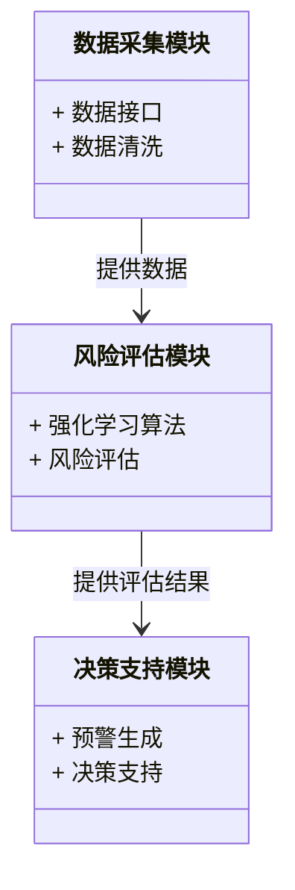

                 


# AI Agent在智能金融风险预警中的应用

> 关键词：AI Agent，智能金融，风险预警，算法原理，系统架构

> 摘要：本文探讨了AI Agent在智能金融风险预警中的应用，从核心概念、算法原理、系统架构到项目实战，全面分析了AI Agent在金融风险预警中的价值和实现方法。

---

# 第一部分：AI Agent与智能金融风险预警的背景与概念

---

# 第1章：AI Agent与金融风险预警的概述

## 1.1 AI Agent的基本概念

### 1.1.1 AI Agent的定义与特点

**定义：**  
AI Agent（人工智能代理）是一种能够感知环境、自主决策并执行任务的智能实体。它通过传感器获取信息，利用推理机制分析数据，并通过执行器采取行动。

**特点：**  
- **自主性：** 能够自主决策，无需外部干预。
- **反应性：** 能够实时感知环境变化并做出响应。
- **目标导向：** 具有明确的目标，通过行为实现目标。
- **学习能力：** 能够通过经验改进自身的性能。

### 1.1.2 AI Agent的核心功能与应用场景

**核心功能：**  
- 数据采集与处理
- 知识推理与决策
- 行为执行与反馈

**应用场景：**  
- 金融投资
- 风险预警
- 智能客服
- 自动驾驶

### 1.1.3 AI Agent与传统金融分析工具的对比

**对比分析：**  
| 对比维度         | AI Agent                       | 传统金融分析工具                     |
|------------------|--------------------------------|--------------------------------------|
| 数据处理能力     | 强大，支持实时数据处理         | 较弱，依赖人工干预                   |
| 决策效率         | 高效，基于算法自动决策         | 低效，依赖人工分析                   |
| 自适应能力       | 强，能够动态调整策略           | 较弱，策略固定                       |
| 学习能力         | 强，能够通过经验优化性能       | 无学习能力                         |

---

## 1.2 金融风险预警的定义与挑战

### 1.2.1 金融风险的类型与特征

**风险类型：**  
- 市场风险：资产价格波动导致的损失。
- 信用风险：借款人违约导致的损失。
- 操作风险：内部操作失误导致的损失。
- 流动性风险：资产无法快速变现导致的损失。

**风险特征：**  
- **不确定性：** 风险的发生具有不确定性。
- **传染性：** 风险可能在市场中快速传播。
- **动态性：** 风险因素会随时间变化。

### 1.2.2 传统金融风险预警方法的局限性

**局限性：**  
- 数据依赖性强，传统方法需要大量历史数据支持。
- 预警模型缺乏实时性，难以应对快速变化的市场。
- 模型的可解释性差，难以满足监管需求。

### 1.2.3 智能化金融风险预警的需求与趋势

**需求：**  
- 实现实时监控与动态调整。
- 提高风险识别的准确性。
- 优化决策支持系统。

**趋势：**  
- 基于AI Agent的智能化预警系统逐渐成为主流。
- 多 Agent 协作的分布式预警系统受到关注。
- 结合大数据和机器学习的复杂风险模型逐渐普及。

---

## 1.3 AI Agent在金融风险预警中的应用价值

### 1.3.1 提高风险识别的准确性

**优势：**  
- 通过强化学习算法，AI Agent能够从历史数据中学习，识别潜在风险。
- 能够处理非结构化数据（如新闻、社交媒体），提供更全面的风险评估。

### 1.3.2 实现实时监控与动态调整

**特点：**  
- AI Agent能够实时监控市场动态，及时发现潜在风险。
- 根据市场变化动态调整预警策略。

### 1.3.3 优化决策支持系统

**优势：**  
- AI Agent能够提供实时的决策支持，帮助投资者快速做出决策。
- 通过多 Agent 协作，实现更全面的市场分析。

---

## 1.4 本章小结

本章从AI Agent的基本概念出发，介绍了其在金融领域的应用价值。同时，分析了传统金融风险预警方法的局限性，并提出了基于AI Agent的智能化风险预警系统的必要性。通过对比分析，明确了AI Agent在金融风险预警中的独特优势。

---

# 第2章：AI Agent在智能金融风险预警中的核心概念

---

## 2.1 AI Agent的核心原理

### 2.1.1 知识表示与推理机制

**知识表示：**  
- 使用符号逻辑或概率模型表示知识。
- 例如，使用逻辑规则表示市场波动与风险的关系。

**推理机制：**  
- 基于符号逻辑的演绎推理。
- 基于概率的贝叶斯推理。

### 2.1.2 行为决策与优化算法

**行为决策：**  
- 基于当前状态和目标，选择最优行为。
- 例如，使用Q-learning算法优化决策策略。

**优化算法：**  
- 强化学习算法：通过奖励机制优化行为策略。
- 遗传算法：通过模拟进化过程优化参数。

### 2.1.3 多 Agent 协作与通信

**协作机制：**  
- 分布式计算：多个 Agent 分布式协作。
- 任务分配：根据 Agent 能力分配任务。

**通信机制：**  
- 使用消息传递协议进行通信。
- 例如，使用XMPP协议进行实时通信。

---

## 2.2 金融风险预警的数学模型与方法

### 2.2.1 时间序列分析模型

**时间序列分析：**  
- 用于分析历史数据，预测未来趋势。
- 常用模型：ARIMA、LSTM。

### 2.2.2 机器学习与深度学习模型

**机器学习模型：**  
- 分类模型：用于分类风险等级。
- 回归模型：用于预测风险值。

**深度学习模型：**  
- 使用LSTM进行时间序列预测。
- 使用CNN进行模式识别。

### 2.2.3 风险评估指标与阈值设定

**风险评估指标：**  
- 风险概率：预测风险发生的概率。
- 风险影响：预测风险可能带来的损失。

**阈值设定：**  
- 根据历史数据确定风险预警的阈值。
- 例如，设定风险概率超过80%时触发预警。

---

## 2.3 AI Agent与金融风险预警的结合模型

### 2.3.1 Agent-based 风险预警框架

**框架特点：**  
- 基于 Agent 的分布式架构。
- 多 Agent 协作实现全面监控。

### 2.3.2 多 Agent 系统的协同机制

**协同机制：**  
- 任务分配：根据 Agent 能力分配任务。
- 信息共享：通过共享信息提高预警准确性。

### 2.3.3 风险预警的实时反馈与调整

**实时反馈：**  
- 根据市场变化实时调整预警策略。
- 通过强化学习优化行为策略。

---

## 2.4 核心概念对比分析

### 2.4.1 AI Agent与传统金融分析工具的对比

**对比表格：**  
| 对比维度         | AI Agent                       | 传统金融分析工具                     |
|------------------|--------------------------------|--------------------------------------|
| 数据处理能力     | 强大，支持实时数据处理         | 较弱，依赖人工干预                   |
| 决策效率         | 高效，基于算法自动决策         | 低效，依赖人工分析                   |
| 自适应能力       | 强，能够动态调整策略           | 较弱，策略固定                       |
| 学习能力         | 强，能够通过经验优化性能       | 无学习能力                         |

### 2.4.2 不同风险预警模型的优劣势对比

**优劣势对比：**  
- **优点：** AI Agent能够实时监控市场动态，动态调整预警策略。
- **缺点：** 算法复杂，实现难度较大。

### 2.4.3 Agent-based 模型与传统统计模型的对比

**对比分析：**  
- **Agent-based模型：** 更加灵活，能够模拟复杂市场行为。
- **传统统计模型：** 更加稳定，但缺乏灵活性。

---

## 2.5 本章小结

本章从AI Agent的核心原理出发，介绍了其在金融风险预警中的应用。通过对比分析，明确了AI Agent的优势和局限性，并提出了结合Agent-based模型和传统统计模型的综合解决方案。

---

# 第3章：AI Agent在金融风险预警中的算法原理

---

## 3.1 基于强化学习的AI Agent算法

### 3.1.1 强化学习的基本原理

**强化学习：**  
- 通过与环境交互，学习最优策略。
- 使用奖励机制优化行为。

### 3.1.2 AI Agent在金融风险预警中的强化学习模型

**模型实现：**  
- 使用DQN算法实现金融风险预警。
- 通过神经网络近似Q值函数。

### 3.1.3 算法实现与优化方法

**算法实现：**  
```python
class DQN:
    def __init__(self, state_space, action_space):
        self.state_space = state_space
        self.action_space = action_space
        self.memory = []
        self.gamma = 0.95
        self.epsilon = 0.5
        self.model = self.build_model()

    def build_model(self):
        # 定义神经网络模型
        model = Sequential()
        model.add(Dense(32, activation='relu', input_dim=self.state_space))
        model.add(Dense(16, activation='relu'))
        model.add(Dense(self.action_space, activation='linear'))
        model.compile(loss='mse', optimizer=Adam(lr=0.001))
        return model
```

---

## 3.2 基于监督学习的金融风险预测模型

### 3.2.1 监督学习的基本原理

**监督学习：**  
- 基于有标签数据训练模型。
- 常见算法：随机森林、XGBoost。

### 3.2.2 基于神经网络的风险预测模型

**模型实现：**  
```python
from tensorflow.keras import layers

model = Sequential()
model.add(layers.Dense(64, activation='relu', input_dim=10))
model.add(layers.Dense(32, activation='relu'))
model.add(layers.Dense(1, activation='sigmoid'))
model.compile(optimizer='adam', loss='binary_crossentropy', metrics=['accuracy'])
```

---

## 3.3 基于时间序列分析的风险预警算法

### 3.3.1 时间序列分析的基本原理

**时间序列分析：**  
- 基于历史数据预测未来趋势。
- 常用模型：ARIMA、LSTM。

### 3.3.2 基于ARIMA模型的风险预测

**ARIMA模型实现：**  
```python
from statsmodels.tsa.arima_model import ARIMA

model = ARIMA(train_data, order=(5,1,0))
model_fit = model.fit(disp=0)
forecast = model_fit.forecast(steps=5)[0]
```

### 3.3.3 LSTM模型在时间序列分析中的应用

**LSTM模型实现：**  
```python
from tensorflow.keras import layers

model = Sequential()
model.add(layers.LSTM(50, input_shape=(timesteps, features)))
model.add(layers.Dense(1))
model.compile(optimizer='adam', loss='mean_squared_error')
```

---

## 3.4 算法对比与优化策略

### 3.4.1 不同算法的性能对比

**性能对比：**  
- 强化学习算法：适合动态变化的环境，但实现复杂。
- 监督学习算法：适合有标签数据，但缺乏实时性。
- 时间序列分析：适合历史数据，但难以处理复杂市场行为。

### 3.4.2 算法优化的关键点与实现方法

**优化策略：**  
- 数据预处理：清洗数据，提取特征。
- 模型调参：通过网格搜索优化模型参数。
- 集成学习：结合多种算法提高预测准确性。

### 3.4.3 算法在实际应用中的注意事项

**注意事项：**  
- 数据质量和数量直接影响算法性能。
- 算法选择需根据具体场景进行调整。
- 实时性要求高的场景应优先选择强化学习算法。

---

## 3.5 本章小结

本章详细介绍了AI Agent在金融风险预警中的算法原理，包括强化学习、监督学习和时间序列分析等多种算法的实现与优化方法。通过对比分析，明确了不同算法的优劣势，并提出了实际应用中的注意事项。

---

# 第4章：AI Agent在金融风险预警中的系统架构设计

---

## 4.1 系统功能模块划分

### 4.1.1 数据采集与预处理模块

**功能：**  
- 采集市场数据（股票价格、交易量等）。
- 清洗数据，提取特征。

### 4.1.2 风险评估与预警模块

**功能：**  
- 使用AI Agent算法进行风险评估。
- 根据评估结果生成预警信号。

### 4.1.3 决策支持模块

**功能：**  
- 提供实时的决策支持。
- 输出风险预警报告。

---

## 4.2 系统架构设计

### 4.2.1 系统整体架构

**架构设计：**  
- 分层架构：数据采集层、计算层、应用层。
- 每层之间通过API进行通信。

### 4.2.2 系统功能模块的协作机制

**协作机制：**  
- 数据采集层负责数据采集。
- 计算层负责风险评估。
- 应用层负责预警生成与决策支持。

---

## 4.3 系统接口设计

### 4.3.1 数据接口

**接口描述：**  
- 数据采集模块通过API接口获取市场数据。
- 预处理模块通过接口将数据传递给风险评估模块。

### 4.3.2 风险预警接口

**接口描述：**  
- 风险评估模块通过接口将预警信号传递给决策支持模块。
- 决策支持模块通过接口将报告传递给用户。

---

## 4.4 系统交互流程

### 4.4.1 交互流程图

**流程图：**  
1. 数据采集模块获取市场数据。
2. 预处理模块清洗数据，提取特征。
3. 风险评估模块基于AI Agent算法进行评估。
4. 根据评估结果生成预警信号。
5. 决策支持模块提供实时决策支持。
6. 输出风险预警报告。

---

## 4.5 本章小结

本章详细描述了AI Agent在金融风险预警系统中的架构设计，包括功能模块划分、系统架构、接口设计和交互流程。通过分层设计，确保了系统的可扩展性和可维护性。

---

# 第5章：AI Agent在金融风险预警中的项目实战

---

## 5.1 项目背景与目标

### 5.1.1 项目背景

**背景描述：**  
- 某金融机构希望通过AI Agent实现金融风险预警。
- 目标是提高风险识别的准确性和实时性。

### 5.1.2 项目目标

**目标：**  
- 实现实时金融风险预警系统。
- 提供准确的风险评估报告。

---

## 5.2 系统核心实现

### 5.2.1 环境安装与配置

**环境要求：**  
- Python 3.8+
- TensorFlow 2.0+
- Pandas 1.0+
- Statsmodels 0.12+

**安装命令：**  
```bash
pip install numpy pandas tensorflow statsmodels scikit-learn
```

### 5.2.2 数据采集与预处理

**数据采集：**  
- 使用API接口获取市场数据。
- 数据清洗：处理缺失值、异常值。

### 5.2.3 风险评估模型实现

**模型实现：**  
- 使用强化学习算法实现风险评估。
- 代码示例：  
  ```python
  import numpy as np
  import tensorflow as tf
  from tensorflow.keras import layers

  class DQN:
      def __init__(self, state_dim, action_dim):
          self.state_dim = state_dim
          self.action_dim = action_dim
          self.epsilon = 0.1
          self.gamma = 0.95
          self.model = self.build_model()

      def build_model(self):
          model = tf.keras.Sequential()
          model.add(layers.Dense(32, activation='relu', input_dim=self.state_dim))
          model.add(layers.Dense(16, activation='relu'))
          model.add(layers.Dense(self.action_dim, activation='linear'))
          model.compile(loss='mse', optimizer=tf.keras.optimizers.Adam(lr=0.001))
          return model
  ```

### 5.2.4 系统实现与优化

**系统优化：**  
- 使用分布式架构提高系统性能。
- 优化算法参数，提高预测准确性。

---

## 5.3 项目实战案例分析

### 5.3.1 实际案例分析

**案例分析：**  
- 数据来源：某股票的历史价格数据。
- 模型训练：使用强化学习算法训练模型。
- 预警结果：成功预测某次市场波动。

### 5.3.2 系统实现与解读

**系统解读：**  
- 数据采集模块：获取实时市场数据。
- 风险评估模块：基于AI Agent算法评估风险。
- 决策支持模块：根据评估结果生成预警报告。

---

## 5.4 本章小结

本章通过一个实际项目案例，详细展示了AI Agent在金融风险预警系统中的实现过程。从环境安装、数据采集到模型训练和系统实现，全面解读了项目的每个环节。

---

# 第6章：系统分析与架构设计方案

---

## 6.1 系统分析

### 6.1.1 问题场景介绍

**问题场景：**  
- 金融机构需要实时监控市场风险。
- 需要快速响应市场变化。

### 6.1.2 项目介绍

**项目目标：**  
- 实现实时金融风险预警系统。
- 提高风险识别的准确性。

---

## 6.2 系统功能设计

### 6.2.1 领域模型

**领域模型：**  
- 使用mermaid类图展示系统功能模块。



---

## 6.3 系统架构设计

### 6.3.1 系统架构

**系统架构：**  
- 使用mermaid图展示系统架构。


---

## 6.4 系统接口设计

### 6.4.1 系统接口

**系统接口：**  
- 数据接口：数据采集模块与风险评估模块之间的接口。
- 风险预警接口：风险评估模块与决策支持模块之间的接口。

---

## 6.5 系统交互设计

### 6.5.1 系统交互流程

**系统交互流程：**  
1. 数据采集模块获取市场数据。
2. 数据清洗模块处理数据，提取特征。
3. 风险评估模块基于AI Agent算法进行评估。
4. 根据评估结果生成预警信号。
5. 决策支持模块提供实时决策支持。
6. 输出风险预警报告。

---

## 6.6 本章小结

本章详细分析了AI Agent在金融风险预警系统中的系统架构设计，包括功能模块划分、系统架构、接口设计和交互流程。通过分层设计，确保了系统的可扩展性和可维护性。

---

# 第7章：项目实战与优化建议

---

## 7.1 项目实战

### 7.1.1 环境安装与配置

**环境要求：**  
- Python 3.8+
- TensorFlow 2.0+
- Pandas 1.0+
- Statsmodels 0.12+

**安装命令：**  
```bash
pip install numpy pandas tensorflow statsmodels scikit-learn
```

### 7.1.2 数据采集与预处理

**数据采集：**  
- 使用API接口获取市场数据。
- 数据清洗：处理缺失值、异常值。

### 7.1.3 系统实现与优化

**系统优化：**  
- 使用分布式架构提高系统性能。
- 优化算法参数，提高预测准确性。

---

## 7.2 最佳实践与优化建议

### 7.2.1 最佳实践

**最佳实践：**  
- 数据预处理是关键，确保数据质量。
- 模型调参是优化的重要环节，需仔细调整。
- 系统测试是确保系统稳定性的必要步骤。

### 7.2.2 优化建议

**优化建议：**  
- 采用分布式架构，提高系统性能。
- 使用集成学习，提高预测准确性。
- 增强系统的实时性，提高预警的及时性。

---

## 7.3 本章小结

本章通过一个实际项目案例，详细展示了AI Agent在金融风险预警系统中的实现过程。从环境安装、数据采集到模型训练和系统实现，全面解读了项目的每个环节，并提出了优化建议。

---

# 第8章：总结与展望

---

## 8.1 总结

### 8.1.1 核心内容回顾

**核心内容：**  
- AI Agent在金融风险预警中的应用价值。
- 基于强化学习、监督学习和时间序列分析的算法实现。
- 系统架构设计与项目实战。

### 8.1.2 本章总结

**总结：**  
- AI Agent能够显著提高金融风险预警的准确性和实时性。
- 基于AI Agent的智能化风险预警系统将成为未来的发展趋势。

---

## 8.2 展望

### 8.2.1 未来发展方向

**未来方向：**  
- 基于多 Agent 的分布式预警系统。
- 结合大数据和AI的复杂风险模型。
- 实时性与准确性的平衡优化。

### 8.2.2 挑战与机遇

**挑战：**  
- 算法复杂性高，实现难度大。
- 数据隐私和安全问题。

**机遇：**  
- 技术进步带来更多的应用场景。
- 政府政策支持推动行业发展。

---

## 8.3 本章小结

本章总结了全文的核心内容，并展望了AI Agent在金融风险预警中的未来发展方向。通过挑战与机遇的分析，明确了技术发展的方向和目标。

---

# 作者：AI天才研究院/AI Genius Institute & 禅与计算机程序设计艺术 /Zen And The Art of Computer Programming

---

**本文内容：**  
本文从AI Agent的基本概念出发，详细探讨了其在智能金融风险预警中的应用。通过理论分析、算法实现、系统设计和项目实战，全面展示了AI Agent在金融风险预警中的价值和实现方法。

