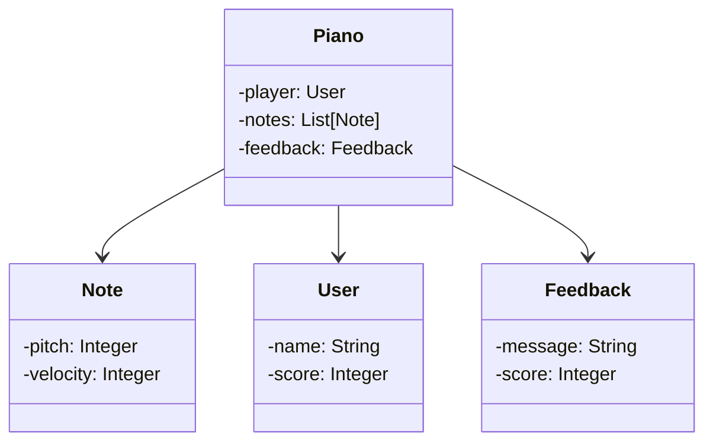
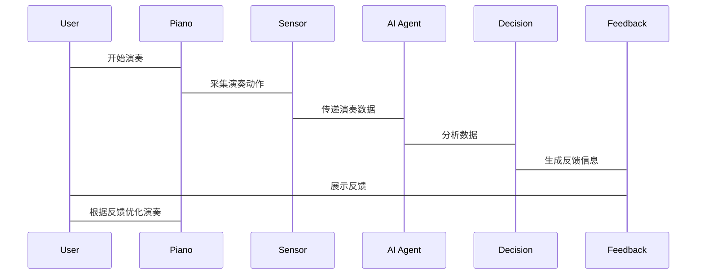

                 


# AI Agent在智能钢琴中的演奏技巧指导

**关键词：AI Agent, 智能钢琴, 演奏技巧, 算法原理, 系统架构, 项目实战**

**摘要：**  
本文旨在探讨AI Agent在智能钢琴中的应用，特别是其如何通过算法和系统架构实现演奏技巧的智能化指导。文章首先介绍AI Agent和智能钢琴的基本概念，接着分析AI Agent的核心原理和算法，随后详细讲解系统的架构设计和接口设计，最后通过项目实战展示AI Agent在智能钢琴中的具体实现。文章内容涵盖理论与实践，旨在为音乐爱好者和科技爱好者提供深入的技术见解。

---

# 第1章 AI Agent与智能钢琴的背景与概念

## 1.1 问题背景与问题描述  
### 1.1.1 智能钢琴的发展现状  
智能钢琴是一种结合了计算机技术与音乐艺术的新型乐器，它能够通过传感器和AI技术感知演奏者的动作，并实时提供反馈和指导。传统的钢琴演奏依赖演奏者的个人技巧和经验，而智能钢琴通过AI Agent的引入，能够显著提升学习效率和演奏质量。

### 1.1.2 AI Agent在音乐领域的应用潜力  
AI Agent（智能体）是一种能够感知环境并采取行动以实现目标的实体。在音乐领域，AI Agent可以用于音乐生成、演奏指导、音乐分析等多个方面。特别是在智能钢琴中，AI Agent可以通过分析演奏者的动作和音乐表现，提供个性化的演奏技巧指导。

### 1.1.3 传统钢琴演奏与智能钢琴演奏的对比  
传统钢琴演奏主要依赖演奏者的个人技巧和经验，而智能钢琴演奏通过AI Agent的实时反馈和指导，能够帮助演奏者更快地掌握技巧，优化演奏表现。

## 1.2 AI Agent的核心概念与属性  
### 1.2.1 AI Agent的定义与核心要素  
AI Agent是一种能够感知环境、做出决策并采取行动的智能实体。其核心要素包括感知能力、决策能力、行动能力和学习能力。

### 1.2.2 AI Agent的属性特征对比表  
| 属性 | 特征 |  
|------|------|  
| 感知能力 | 能够通过传感器或数据输入感知环境 |  
| 决策能力 | 能够基于感知信息做出决策 |  
| 行动能力 | 能够通过执行器或输出模块采取行动 |  
| 学习能力 | 能够通过数据反馈不断优化自身性能 |

### 1.2.3 AI Agent与传统计算机程序的对比分析  
AI Agent与传统计算机程序的主要区别在于其自主性和适应性。AI Agent能够自主决策并适应环境变化，而传统程序通常基于固定的规则执行任务。

## 1.3 AI Agent在智能钢琴中的应用边界  
### 1.3.1 AI Agent在音乐生成中的边界  
AI Agent在音乐生成中的应用主要集中在旋律生成、和声编配等方面，但其创作能力受限于训练数据和算法模型。

### 1.3.2 AI Agent在钢琴演奏指导中的边界  
AI Agent在钢琴演奏指导中的应用主要集中在技巧指导和表现优化，但其无法完全替代人类的情感表达。

### 1.3.3 AI Agent在智能钢琴中的功能外延  
AI Agent在智能钢琴中的功能外延包括音乐分析、演奏反馈、学习计划制定等。

## 1.4 本章小结  
本章通过介绍AI Agent和智能钢琴的基本概念，分析了AI Agent在智能钢琴中的应用潜力及其与传统钢琴演奏的对比，明确了AI Agent在智能钢琴中的核心概念和应用边界。

---

# 第2章 AI Agent的核心原理与技术实现

## 2.1 AI Agent的核心原理  
### 2.1.1 AI Agent的基本工作原理  
AI Agent通过感知环境、分析信息、做出决策并采取行动来实现其目标。其核心原理包括感知、决策、行动和反馈四个环节。

### 2.1.2 AI Agent的感知与决策机制  
AI Agent的感知机制通过传感器或数据输入获取环境信息，决策机制基于感知信息和目标函数做出最优决策。

### 2.1.3 AI Agent的行动与反馈循环  
AI Agent通过执行器或输出模块采取行动，并通过反馈机制不断优化自身的决策和行动。

## 2.2 AI Agent的算法原理  
### 2.2.1 基于强化学习的AI Agent算法  
强化学习是一种通过奖励机制优化AI Agent行为的算法。其核心公式为：  
$$ Q(s,a) = r + \gamma \max_a Q(s',a') $$  
其中，$Q(s,a)$表示状态-动作对的期望奖励，$r$表示即时奖励，$\gamma$表示折扣因子，$s'$表示下一个状态。

### 2.2.2 基于神经网络的AI Agent算法  
神经网络是一种通过多层神经元模拟人脑神经网络的算法。其数学模型为：  
$$ y = f(x) = \sigma(w x + b) $$  
其中，$x$表示输入，$w$表示权重，$b$表示偏置，$\sigma$表示激活函数。

### 2.2.3 AI Agent算法的数学模型与公式  
强化学习和神经网络的结合是AI Agent算法的核心。其数学模型如下：  
$$ V(s) = \max_a Q(s,a) $$  
其中，$V(s)$表示状态值函数，$Q(s,a)$表示状态-动作值函数。

## 2.3 AI Agent的数学模型与公式  
### 2.3.1 强化学习的数学模型  
强化学习的数学模型包括状态空间、动作空间、奖励函数和策略函数。其核心公式为：  
$$ Q(s,a) = r + \gamma \max_a Q(s',a') $$  

### 2.3.2 神经网络的数学模型  
神经网络的数学模型包括输入层、隐藏层和输出层。其核心公式为：  
$$ y = f(x) = \sigma(w x + b) $$  

## 2.4 本章小结  
本章通过分析AI Agent的核心原理和算法，详细讲解了强化学习和神经网络的数学模型，为后续章节的系统架构设计奠定了理论基础。

---

# 第3章 AI Agent在智能钢琴中的系统架构设计

## 3.1 智能钢琴系统的功能需求  
### 3.1.1 音乐生成与演奏指导功能  
智能钢琴系统需要能够生成音乐并提供演奏指导，帮助演奏者优化技巧和表现。

### 3.1.2 用户交互与反馈功能  
智能钢琴系统需要与用户进行实时交互，并根据用户反馈优化自身的指导策略。

### 3.1.3 系统配置与管理功能  
智能钢琴系统需要具备基本的系统配置和管理功能，例如参数调整和数据存储。

## 3.2 智能钢琴系统的领域模型设计  
### 3.2.1 领域模型的类图设计  
以下是智能钢琴系统的领域模型类图：  


### 3.2.2 领域模型的交互流程  
智能钢琴系统的交互流程如下：  
1. 用户开始演奏钢琴。  
2. 智能钢琴系统感知用户的演奏动作。  
3. 系统分析用户的演奏动作，生成反馈信息。  
4. 用户根据反馈信息优化演奏技巧。  

### 3.2.3 领域模型的用例分析  
智能钢琴系统的用例包括演奏反馈、技巧优化和系统配置等。

## 3.3 智能钢琴系统的架构设计  
### 3.3.1 系统架构的分层设计  
智能钢琴系统的架构分为感知层、决策层和执行层。  
- 感知层：负责感知用户的演奏动作。  
- 决策层：负责分析感知数据并生成反馈信息。  
- 执行层：负责将反馈信息传递给用户。  

### 3.3.2 系统架构的模块划分  
智能钢琴系统的模块包括传感器模块、AI Agent模块和用户界面模块。  
- 传感器模块：负责采集用户的演奏动作。  
- AI Agent模块：负责分析数据并生成反馈信息。  
- 用户界面模块：负责与用户进行交互并展示反馈信息。  

### 3.3.3 系统架构的通信机制  
智能钢琴系统的通信机制包括传感器数据的传递、AI Agent的决策输出和用户界面的反馈展示。

## 3.4 系统接口设计与交互流程  
### 3.4.1 系统接口的设计规范  
智能钢琴系统的接口设计需要遵循标准化协议，例如MIDI协议。  
- MIDI协议：用于传感器与计算机之间的数据传输。  

### 3.4.2 系统交互的流程图设计  
以下是智能钢琴系统的交互流程图：  


### 3.4.3 系统接口的实现方式  
智能钢琴系统的接口实现需要结合硬件和软件，例如通过MIDI接口连接传感器和计算机。

## 3.5 本章小结  
本章通过分析智能钢琴系统的功能需求和架构设计，详细讲解了系统的领域模型、模块划分和通信机制，为后续章节的项目实战奠定了基础。

---

# 第4章 项目实战：AI Agent在智能钢琴中的实现

## 4.1 环境安装与配置  
### 4.1.1 系统环境的安装  
- 操作系统：Windows/Mac/Linux  
- 开发工具：Python、Jupyter Notebook、PyTorch  

### 4.1.2 传感器与硬件的配置  
- 传感器类型：MIDI传感器  
- 硬件连接：通过USB连接传感器和计算机  

## 4.2 系统核心实现  
### 4.2.1 AI Agent的核心代码实现  
以下是AI Agent的核心代码：  
```python
import torch
import torch.nn as nn
import torch.optim as optim

class AI_Agent(nn.Module):
    def __init__(self, input_size, output_size):
        super(AI_Agent, self).__init__()
        self.fc1 = nn.Linear(input_size, 64)
        self.fc2 = nn.Linear(64, output_size)
    
    def forward(self, x):
        x = torch.relu(self.fc1(x))
        x = torch.sigmoid(self.fc2(x))
        return x

# 初始化模型
input_size = 88  # 钢琴键数
output_size = 1  # 反馈强度
model = AI_Agent(input_size, output_size)

# 定义损失函数和优化器
criterion = nn.MSELoss()
optimizer = optim.Adam(model.parameters(), lr=0.001)
```

### 4.2.2 演奏反馈与优化算法实现  
以下是演奏反馈与优化算法的实现：  
```python
# 训练AI Agent
for epoch in range(num_epochs):
    for inputs, labels in dataloader:
        # 前向传播
        outputs = model(inputs)
        # 计算损失
        loss = criterion(outputs, labels)
        # 反向传播与优化
        optimizer.zero_grad()
        loss.backward()
        optimizer.step()
```

## 4.3 项目实战案例分析  
### 4.3.1 案例1：基础音符演奏指导  
用户演奏C大调音阶，系统通过AI Agent分析用户的演奏动作，生成反馈信息并优化演奏技巧。  

### 4.3.2 案例2：复杂乐曲演奏指导  
用户演奏贝多芬的《月光奏鸣曲》，系统通过AI Agent分析用户的演奏动作，生成反馈信息并优化演奏技巧。  

## 4.4 本章小结  
本章通过项目实战展示了AI Agent在智能钢琴中的具体实现，包括环境安装、核心代码实现和案例分析，帮助读者更好地理解AI Agent在智能钢琴中的应用。

---

# 第5章 最佳实践与未来展望

## 5.1 最佳实践  
### 5.1.1 系统优化建议  
- 提高AI Agent的学习能力  
- 优化系统交互的实时性  
- 提升系统的用户体验  

### 5.1.2 项目部署与维护  
- 系统的部署与扩展  
- 系统的维护与更新  

## 5.2 小结  
本章通过总结AI Agent在智能钢琴中的应用，提出了系统的优化建议和未来展望。

## 5.3 注意事项  
- 系统的安全性与稳定性  
- 用户数据的隐私保护  

## 5.4 拓展阅读  
- 《深度学习与音乐生成》  
- 《强化学习在音乐中的应用》  

## 5.5 本章小结  
本章通过总结AI Agent在智能钢琴中的应用，提出了系统的优化建议和未来展望，为读者提供了进一步研究的方向。

---

# 作者信息

作者：AI天才研究院/AI Genius Institute & 禅与计算机程序设计艺术 /Zen And The Art of Computer Programming

