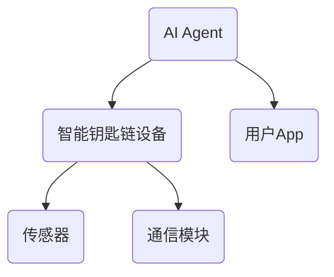
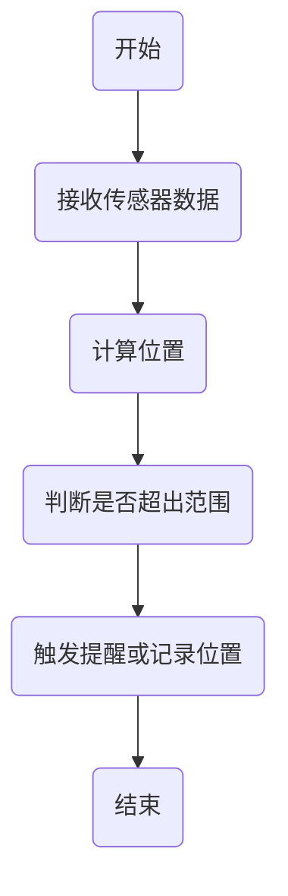
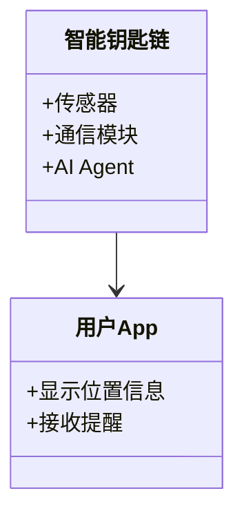
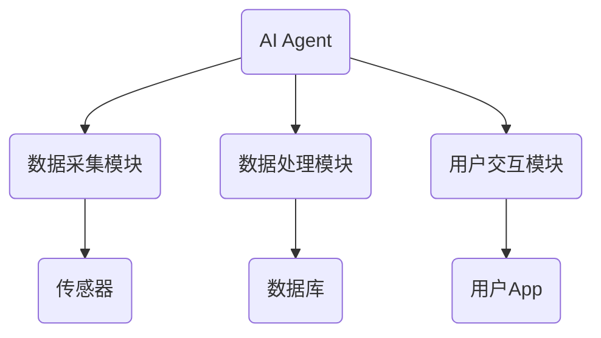
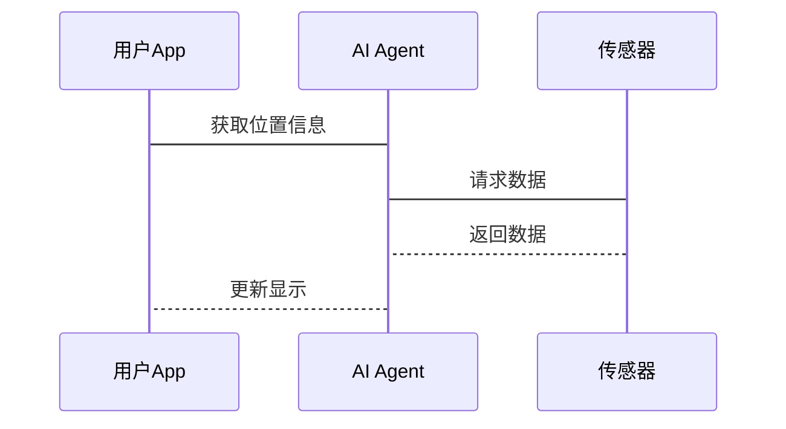

                 


# AI Agent在智能钥匙链中的物品追踪功能

## 关键词
AI Agent, 物品追踪, 智能钥匙链, 定位算法, 物联网, Python实现

## 摘要
本文详细探讨了AI Agent在智能钥匙链中的物品追踪功能，从背景介绍到系统架构，再到项目实战，全面解析了这一技术的应用与实现。文章首先介绍了AI Agent和智能钥匙链的基本概念，随后分析了定位算法的数学模型和实现流程，并提供了Python代码示例。接着，设计了系统的架构，包括功能模块、架构图和接口设计。最后，通过项目实战指导读者如何搭建环境、编写代码，并分析实际案例。本文为技术人员和开发者提供了深入的技术见解和实践指导。

---

# 第一部分: AI Agent在智能钥匙链中的物品追踪功能概述

# 第1章: AI Agent与智能钥匙链的背景介绍

## 1.1 问题背景与问题描述
### 1.1.1 物品追踪的现实需求
在现代生活中，物品丢失是一个常见的问题，尤其是在公共场所或繁忙的环境中。钥匙、钱包、手机等重要物品的丢失不仅会造成经济损失，还可能带来安全隐患。传统的解决方案依赖于物理标记或简单的寻物启事，效率低下且难以覆盖所有场景。

### 1.1.2 智能钥匙链的定义与特点
智能钥匙链是一种集成物联网（IoT）和人工智能（AI）技术的智能设备，能够通过传感器和通信模块实现对物品的实时定位和追踪。其特点包括：
- **实时定位**：通过GPS或蓝牙等技术，实时追踪物品的位置。
- **智能提醒**：当物品超出预设范围时，向用户发送提醒。
- **数据存储**：记录物品的历史位置和运动轨迹。

### 1.1.3 AI Agent在物品追踪中的作用
AI Agent（人工智能代理）是一种能够感知环境、自主决策并执行任务的智能实体。在智能钥匙链中，AI Agent负责处理传感器数据、分析位置信息，并与用户进行交互。其作用包括：
- **数据处理**：分析传感器数据，确定物品的位置。
- **决策制定**：根据位置信息，判断是否需要触发提醒。
- **用户交互**：通过App或语音助手向用户发送通知。

## 1.2 问题解决与边界分析
### 1.2.1 AI Agent如何解决物品追踪问题
AI Agent通过实时感知和分析数据，能够快速定位物品的位置，并在物品丢失或移动时及时通知用户。这种智能化的解决方案不仅提高了效率，还大大降低了丢失物品的风险。

### 1.2.2 系统边界与外延
智能钥匙链系统的边界包括：
- **硬件部分**：智能钥匙链设备、传感器、通信模块。
- **软件部分**：AI Agent、定位算法、用户App。
- **外部系统**：与用户的手机、电脑或其他设备的连接。

系统外延包括与其他智能设备的联动，例如智能家居、车载系统等。

### 1.2.3 核心概念与组成要素
智能钥匙链系统的核心概念包括：
- **AI Agent**：负责数据处理和决策。
- **定位技术**：如GPS、蓝牙、Wi-Fi等。
- **通信模块**：用于与用户设备的交互。
- **用户界面**：App或网页界面，展示追踪信息。

## 1.3 本章小结
本章介绍了AI Agent在智能钥匙链中的背景和作用，分析了系统的核心概念和边界。下一章将详细探讨AI Agent与物联网设备的核心概念及其关系。

---

# 第2章: AI Agent与物联网设备的核心概念

## 2.1 AI Agent的原理与特点
### 2.1.1 AI Agent的基本原理
AI Agent通过感知环境、分析数据、制定决策并执行任务来实现目标。在智能钥匙链中，AI Agent接收传感器数据，分析物品的位置，并根据预设规则进行提醒或触发其他操作。

### 2.1.2 AI Agent的核心特点
- **自主性**：能够自主决策，无需人工干预。
- **反应性**：实时感知环境变化并做出反应。
- **学习能力**：通过机器学习不断优化定位算法。

### 2.1.3 AI Agent与传统算法的对比
| 特性         | AI Agent             | 传统算法           |
|--------------|----------------------|--------------------|
| 数据处理     | 处理复杂数据         | 处理简单数据       |
| 学习能力     | 具备学习能力         | 无学习能力         |
| 决策能力     | 自主决策             | 需人工干预          |

## 2.2 物联网设备的原理与特点
### 2.2.1 物联网设备的基本原理
物联网设备通过传感器采集数据，并通过通信模块将数据传输到云端或用户设备。智能钥匙链中的传感器用于采集位置信息，通信模块用于与用户设备交互。

### 2.2.2 物联网设备的核心特点
- **实时性**：数据采集和传输实时进行。
- **低功耗**：设备通常采用低功耗设计。
- **联网能力**：支持多种通信方式，如蓝牙、Wi-Fi、GPS等。

### 2.2.3 物联网设备与AI Agent的结合
AI Agent与物联网设备的结合使得智能钥匙链能够实现智能化的物品追踪功能。AI Agent接收物联网设备的数据，分析位置信息，并根据预设规则进行提醒或触发其他操作。

## 2.3 AI Agent与物联网设备的实体关系图


本章总结了AI Agent与物联网设备的核心概念及其关系，为后续的算法设计和系统架构奠定了基础。

---

# 第3章: AI Agent的定位算法原理

## 3.1 定位算法的数学模型
### 3.1.1 基于距离的定位公式
$$d = \sqrt{(x_2 - x_1)^2 + (y_2 - y_1)^2}$$
其中，$d$表示两点之间的距离，$(x_1, y_1)$和$(x_2, y_2)$分别表示两个点的坐标。

### 3.1.2 基于信号强度的定位公式
$$r = -\alpha \log(p_r) + \beta$$
其中，$r$表示信号强度，$\alpha$和$\beta$是模型参数，$p_r$是接收的信号功率。

## 3.2 定位算法的实现流程
### 3.2.1 流程图的Mermaid展示


## 3.3 定位算法的Python实现
### 3.3.1 核心代码示例
```python
import math

def calculate_distance(x1, y1, x2, y2):
    return math.sqrt((x2 - x1)**2 + (y2 - y1)**2)

# 示例数据
x1, y1 = 0, 0
x2, y2 = 3, 4
distance = calculate_distance(x1, y1, x2, y2)
print(f"距离为: {distance}")
```

## 3.4 本章小结
本章详细讲解了定位算法的数学模型和实现流程，并提供了Python代码示例。下一章将从系统架构的角度进一步分析智能钥匙链的实现方案。

---

# 第4章: 系统分析与架构设计

## 4.1 问题场景介绍
智能钥匙链系统需要实现物品的实时定位、位置提醒和历史轨迹查询功能。

## 4.2 项目介绍
本项目旨在开发一款基于AI Agent的智能钥匙链，实现对物品的实时追踪和提醒功能。

## 4.3 系统功能设计
### 4.3.1 功能模块划分
| 模块名称     | 功能描述                   |
|--------------|---------------------------|
| 数据采集模块 | 采集物品的位置信息         |
| 数据处理模块 | 分析位置数据               |
| 决策模块     | 判断是否触发提醒           |
| 用户交互模块 | 与用户App进行数据交互       |

### 4.3.2 领域模型类图


## 4.4 系统架构设计
### 4.4.1 系统架构图


## 4.5 系统接口设计
### 4.5.1 接口描述
- **AI Agent接口**：接收传感器数据，处理后发送给用户App。
- **用户App接口**：显示位置信息，接收用户操作。

### 4.5.2 接口交互流程


## 4.6 本章小结
本章从系统架构的角度分析了智能钥匙链的实现方案，明确了各模块的功能和交互流程。下一章将通过项目实战进一步验证和实现这一方案。

---

# 第5章: 项目实战

## 5.1 环境搭建
### 5.1.1 开发环境
- **硬件**：智能钥匙链设备（含传感器和通信模块）。
- **软件**：Python开发环境，AI框架（如TensorFlow）。

## 5.2 核心实现
### 5.2.1 AI Agent的实现
```python
class AI-Agent:
    def __init__(self):
        self.sensor = Sensor()
        self.communication = Communication()
    
    def process_data(self, data):
        # 数据处理逻辑
        pass
```

### 5.2.2 定位算法的实现
```python
def process_location(data):
    # 数据分析逻辑
    pass
```

## 5.3 实际案例分析
### 5.3.1 案例描述
假设用户丢失钥匙，AI Agent通过传感器数据定位钥匙的位置，并通过用户App发送提醒。

### 5.3.2 代码解读
```python
# 示例代码
def send_notification(location):
    print(f"钥匙的位置是: {location}")
    
# 调用示例
location = "客厅"
send_notification(location)
```

## 5.4 本章小结
本章通过项目实战，详细讲解了智能钥匙链的实现过程，包括环境搭建、核心代码编写和实际案例分析。

---

# 第6章: 最佳实践与总结

## 6.1 小结
本文详细探讨了AI Agent在智能钥匙链中的物品追踪功能，从背景介绍到系统架构，再到项目实战，全面解析了这一技术的应用与实现。

## 6.2 注意事项
- 确保传感器数据的准确性。
- 保护用户隐私，避免数据泄露。
- 定期更新算法模型，提高定位精度。

## 6.3 拓展阅读
- **推荐书籍**：《人工智能：一种现代的方法》
- **推荐博客**：https://www.aiagent.com/blog

---

# 作者

作者：AI天才研究院/AI Genius Institute & 禅与计算机程序设计艺术/Zen And The Art of Computer Programming

---

以上是《AI Agent在智能钥匙链中的物品追踪功能》的完整目录和内容概要。每一章都详细涵盖了核心概念、算法原理、系统架构和项目实战，确保读者能够全面理解并掌握这一技术的应用与实现。

