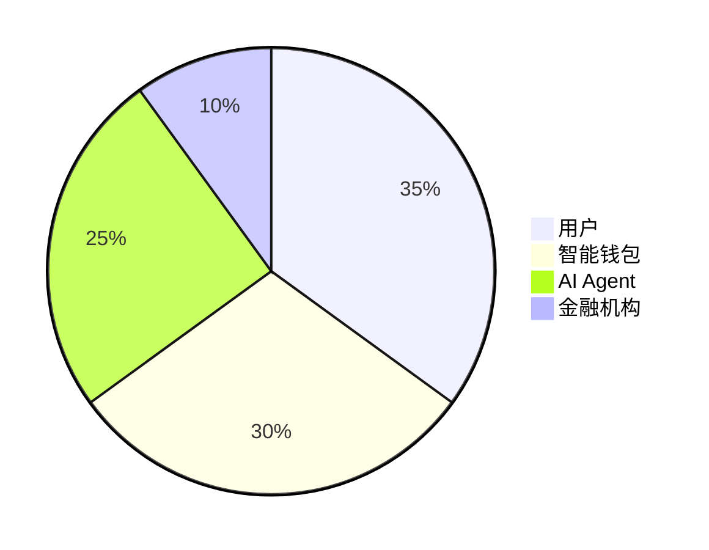
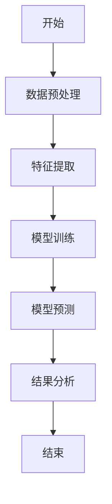
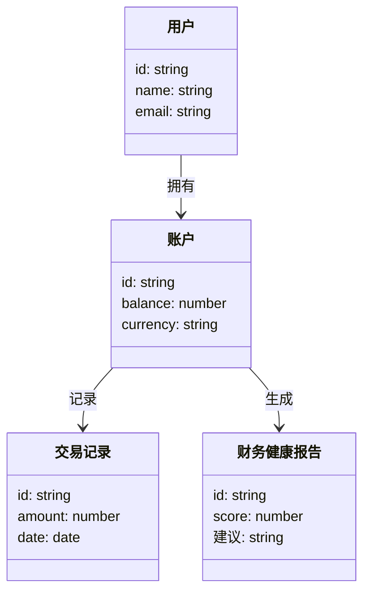
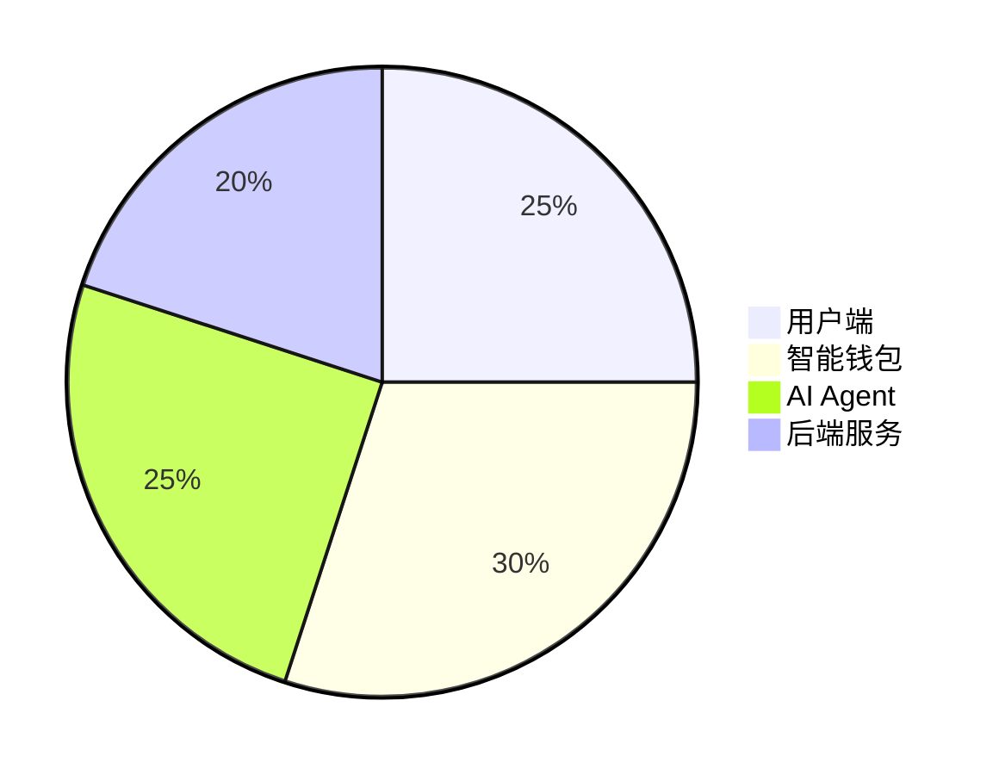

                 


# AI Agent在智能钱包中的个人财务健康顾问

**关键词**：AI Agent、智能钱包、个人财务健康顾问、算法原理、系统架构

**摘要**：本文探讨AI Agent在智能钱包中的应用，重点分析其作为个人财务健康顾问的功能与实现。通过背景介绍、核心概念、算法原理、系统架构设计、项目实战及最佳实践，全面解析AI Agent如何优化个人财务管理，提升财务健康水平。

---

# 第一部分: AI Agent与智能钱包的背景与概念

## 第1章: AI Agent与智能钱包的背景介绍

### 1.1 问题背景与描述

#### 1.1.1 传统个人财务管理的痛点
传统财务管理依赖手动记录和分析，效率低且容易出错。个人难以实时掌握收支状况，缺乏智能化的财务规划工具。

#### 1.1.2 AI技术在金融领域的应用潜力
AI技术在金融领域的应用日益广泛，从交易预测到风险评估，AI的强大数据处理能力为智能财务顾问提供了可能。

#### 1.1.3 智能钱包的概念与现状
智能钱包结合区块链技术，具备安全性和便捷性，支持多种支付方式和资产管理，为AI Agent提供了实现平台。

### 1.2 AI Agent在个人财务健康顾问中的作用

#### 1.2.1 AI Agent的核心功能与优势
AI Agent能够实时分析用户的财务数据，提供个性化建议，帮助用户优化支出结构，提升财务健康水平。

#### 1.2.2 智能钱包的定义与技术架构
智能钱包是一个结合区块链技术的数字资产管理工具，具备去中心化、安全性高等特点，支持多种支付方式和智能合约。

#### 1.2.3 财务健康顾问的边界与外延
财务健康顾问的范围包括收入支出分析、资产配置建议、风险预警等，通过AI技术提升服务的智能化水平。

### 1.3 核心概念与联系

#### 1.3.1 AI Agent的工作原理
AI Agent通过收集用户数据，利用机器学习算法进行分析，生成个性化财务建议。

#### 1.3.2 智能钱包的实体关系图（ER图）
```mermaid
er
    actor 用户 {
        id: string
        name: string
        email: string
    }
    actor 金融机构 {
        id: string
        name: string
        account_number: string
    }
    entity 账户 {
        id: string
        balance: number
        currency: string
        owner_id: string
    }
    entity 交易记录 {
        id: string
        amount: number
        date: date
        description: string
        account_id: string
    }
    entity 财务健康报告 {
        id: string
        score: number
        建议: string
        account_id: string
    }
```

#### 1.3.3 智能钱包的系统架构


---

# 第二部分: AI Agent的算法原理

## 第2章: AI Agent的算法与数学模型

### 2.1 数据采集与预处理

#### 2.1.1 数据来源
数据来源包括用户的交易记录、收入支出数据、市场行情等。

#### 2.1.2 数据清洗
数据清洗步骤包括去除异常值、填充缺失值等。

### 2.2 算法实现

#### 2.2.1 机器学习模型
使用随机森林或XGBoost进行分类和回归分析。

#### 2.2.2 算法流程


#### 2.2.3 算法代码示例
```python
import pandas as pd
from sklearn.ensemble import RandomForestClassifier
from sklearn.metrics import accuracy_score

# 数据加载与预处理
data = pd.read_csv('financial_data.csv')
data = data.dropna()

# 特征与目标变量分离
X = data.drop('label', axis=1)
y = data['label']

# 模型训练
model = RandomForestClassifier()
model.fit(X, y)

# 预测与评估
y_pred = model.predict(X)
print("准确率:", accuracy_score(y, y_pred))
```

### 2.3 数学模型

#### 2.3.1 财务健康评估模型
$$ \text{健康评分} = \alpha \cdot \text{收入} + \beta \cdot \text{支出} + \gamma \cdot \text{资产} $$

#### 2.3.2 财务健康指数计算
$$ \text{健康指数} = \frac{\sum (\text{支出} - \text{收入})}{\text{资产}} $$

---

# 第三部分: 系统分析与架构设计

## 第3章: 系统分析与架构设计

### 3.1 问题场景分析

#### 3.1.1 用户需求分析
用户需要实时的财务分析、支出建议、风险预警等服务。

### 3.2 项目介绍

#### 3.2.1 项目目标
开发一个基于AI的智能财务健康顾问系统，帮助用户优化财务管理。

### 3.3 系统功能设计

#### 3.3.1 领域模型


### 3.4 系统架构设计

#### 3.4.1 系统架构


### 3.5 系统接口设计

#### 3.5.1 接口定义
- 用户接口：提供数据提交和查询功能。
- AI Agent接口：提供财务分析和建议生成。

---

# 第四部分: 项目实战

## 第4章: 项目实战

### 4.1 环境安装

#### 4.1.1 安装依赖
安装Python、Pandas、Scikit-learn等库。

### 4.2 核心实现

#### 4.2.1 数据处理模块
```python
import pandas as pd

def data_cleaning(data):
    return data.dropna()
```

#### 4.2.2 模型训练模块
```python
from sklearn.ensemble import RandomForestClassifier

def train_model(X, y):
    model = RandomForestClassifier()
    model.fit(X, y)
    return model
```

### 4.3 案例分析

#### 4.3.1 案例分析
分析用户交易数据，生成财务健康报告，并提出优化建议。

### 4.4 项目总结

#### 4.4.1 小结
通过AI Agent和智能钱包的结合，实现个性化的财务健康顾问服务。

---

# 第五部分: 最佳实践与总结

## 第5章: 最佳实践与总结

### 5.1 最佳实践

#### 5.1.1 数据安全
确保用户数据的安全性，防止数据泄露。

#### 5.1.2 模型优化
定期更新模型，提升预测精度和用户体验。

### 5.2 小结

通过AI Agent在智能钱包中的应用，提升个人财务管理的智能化水平，帮助用户实现财务健康目标。

### 5.3 注意事项

- 数据隐私保护
- 模型的实时更新
- 系统的稳定性与安全性

### 5.4 拓展阅读

推荐相关书籍和论文，深入学习AI在金融领域的应用。

---

# 作者

作者：AI天才研究院/AI Genius Institute & 禅与计算机程序设计艺术 /Zen And The Art of Computer Programming

