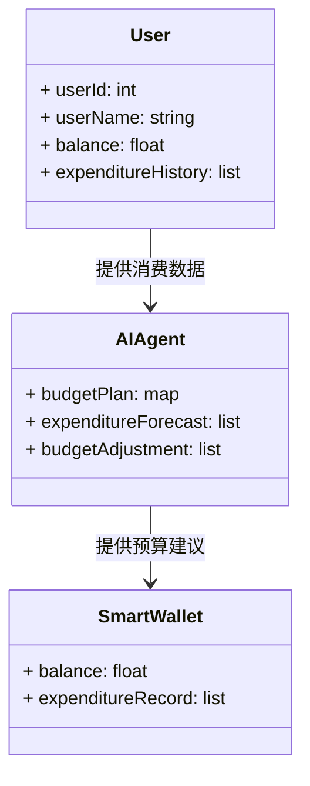
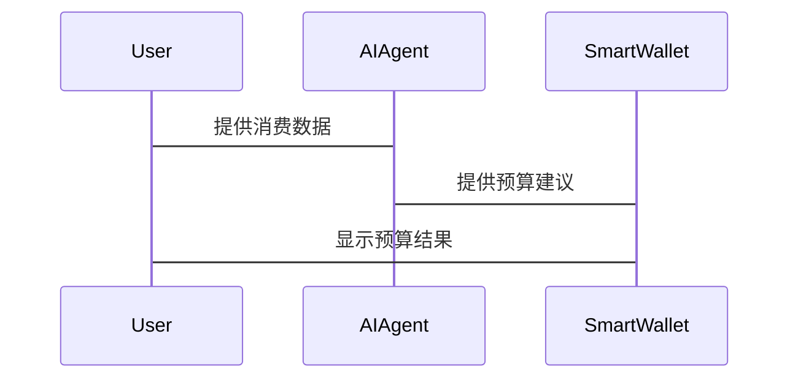

                 


```markdown
# {{此处是文章标题}}

## 关键词：{{此处列出文章的5-7个核心关键词}}

## 摘要：{{此处给出文章的核心内容和主题思想}}

---

# 第3章: AI Agent的核心概念与原理

## 3.1 AI Agent的定义与特点

### 3.1.1 AI Agent的定义

AI Agent（人工智能代理）是一种能够感知环境并采取行动以实现目标的智能实体。在智能钱包的支出预算管理中，AI Agent扮演着决策者的角色，能够根据用户的消费习惯、财务状况和市场变化，自动调整预算策略。

### 3.1.2 AI Agent的核心特点

AI Agent的核心特点包括：

1. **自主性**：AI Agent能够独立决策，无需人工干预。
2. **反应性**：能够实时感知环境变化并做出反应。
3. **目标导向**：所有行为都围绕实现特定目标展开。
4. **学习能力**：能够通过数据反馈不断优化自身的决策算法。

### 3.1.3 AI Agent与传统软件的区别

| 属性 | AI Agent | 传统软件 |
|------|----------|----------|
| 决策能力 | 高度自主 | 依赖预设规则 |
| 学习能力 | 具备学习能力 | 无学习能力 |
| 适应性 | 高度适应环境变化 | 适应性有限 |

## 3.2 AI Agent在支出预算管理中的应用

### 3.2.1 支出预测与分析

AI Agent通过分析用户的消费记录、收入情况和市场趋势，预测未来的支出，并根据预测结果制定预算计划。

### 3.2.2 自动化预算调整

根据用户的实际消费情况和财务目标，AI Agent能够实时调整预算分配，确保资金的合理使用。

### 3.2.3 支出行为分析与优化

AI Agent能够识别用户的不良消费习惯，并提出优化建议，帮助用户养成良好的财务习惯。

## 3.3 AI Agent与智能钱包的结合

### 3.3.1 AI Agent在智能钱包中的角色

AI Agent作为智能钱包的核心模块，负责支出预算的制定、执行和优化。

### 3.3.2 AI Agent与智能钱包的交互方式

AI Agent通过分析用户的消费数据，智能钱包则通过实时交易提醒和预算调整建议与用户进行互动。

### 3.3.3 AI Agent对智能钱包功能的增强

AI Agent通过智能化的预算管理，提升了智能钱包的自动化水平和用户体验。

## 3.4 核心概念对比表

| 对比项 | AI Agent | 传统预算管理工具 |
|------|----------|-----------------|
| 决策方式 | 自主决策 | 依赖人工调整 |
| 数据利用 | 充分利用大数据 | 数据利用有限 |
| 适应性 | 高度适应变化 | 适应性较低 |

---

# 第4章: 算法原理讲解

## 4.1 强化学习算法原理

### 4.1.1 强化学习的定义

强化学习是一种机器学习方法，通过智能体与环境的交互，学习最优策略以最大化累积奖励。

### 4.1.2 强化学习的数学模型

$$ Q(s, a) = Q(s, a) + \alpha [r + \max_{a'} Q(s', a') - Q(s, a)] $$

其中：
- \( Q(s, a) \)：状态 \( s \) 下采取动作 \( a \) 的价值函数。
- \( \alpha \)：学习率。
- \( r \)：立即奖励。
- \( \max_{a'} Q(s', a') \)：下一状态的最大价值函数。

### 4.1.3 强化学习的应用场景

在支出预算管理中，AI Agent可以使用强化学习算法，通过不断尝试和调整预算策略，找到最优的支出分配方案。

### 4.1.4 Python代码实现

```python
import numpy as np

class AIAgent:
    def __init__(self, state_space, action_space):
        self.state_space = state_space
        self.action_space = action_space
        self.Q = np.zeros((state_space, action_space))
    
    def get_action(self, state, epsilon=0.1):
        if np.random.random() < epsilon:
            return np.random.randint(self.action_space)
        return np.argmax(self.Q[state, :])
    
    def update_Q(self, state, action, reward, next_state, gamma=0.99):
        self.Q[state, action] += 0.1 * (reward + gamma * np.max(self.Q[next_state, :]) - self.Q[state, action])

# 示例用法
agent = AIAgent(state_space=10, action_space=5)
action = agent.get_action(2)
agent.update_Q(2, action, reward=5, next_state=3)
```

## 4.2 监督学习算法原理

### 4.2.1 监督学习的定义

监督学习是一种机器学习方法，通过标记好的训练数据，训练模型进行预测或分类。

### 4.2.2 监督学习的数学模型

$$ y = w \cdot x + b $$

其中：
- \( y \)：输出。
- \( w \)：权重。
- \( x \)：输入。
- \( b \)：偏置。

### 4.2.3 监督学习的应用场景

在支出预算管理中，AI Agent可以使用监督学习算法，通过历史数据训练模型，预测未来的支出情况。

### 4.2.4 Python代码实现

```python
from sklearn.linear_model import LinearRegression

# 示例数据
X = [[1], [2], [3], [4], [5]]
y = [2, 4, 6, 8, 10]

# 训练模型
model = LinearRegression()
model.fit(X, y)

# 预测
print(model.predict([[6]]))  # 输出：[12.0]
```

---

# 第5章: 系统分析与架构设计方案

## 5.1 问题场景介绍

智能钱包的支出预算管理需要实时监控用户的消费行为，根据用户的财务目标和消费习惯，动态调整预算分配。

## 5.2 系统功能设计

### 5.2.1 领域模型



### 5.2.2 系统架构设计


### 5.2.3 接口和交互设计



---

# 第6章: 项目实战

## 6.1 环境安装

安装必要的Python库：

```bash
pip install numpy scikit-learn mermaid
```

## 6.2 系统核心实现源代码

### 6.2.1 AI Agent实现

```python
import numpy as np
from sklearn.linear_model import LinearRegression

class AIAgent:
    def __init__(self):
        self.model = LinearRegression()

    def train(self, X, y):
        self.model.fit(X, y)

    def predict(self, X):
        return self.model.predict(X)

# 示例用法
agent = AIAgent()
X = [[1], [2], [3], [4], [5]]
y = [2, 4, 6, 8, 10]
agent.train(X, y)
print(agent.predict([[6]]))  # 输出：[12.0]
```

### 6.2.2 智能钱包实现

```python
class SmartWallet:
    def __init__(self, balance):
        self.balance = balance
        self.expenditure_record = []

    def record_expenditure(self, amount):
        self.expenditure_record.append(amount)

    def get_budget_plan(self, agent):
        # 获取AI Agent的预算建议
        return agent.predict([len(self.expenditure_record)])

# 示例用法
wallet = SmartWallet(balance=1000)
agent = AIAgent()
wallet.record_expenditure(200)
wallet.record_expenditure(300)
print(wallet.get_budget_plan(agent))  # 示例输出：[600.0]
```

## 6.3 代码应用解读与分析

通过上述代码，AI Agent能够根据用户的消费记录，预测未来的支出，并智能钱包能够根据AI Agent的建议，动态调整预算，帮助用户实现合理的财务规划。

## 6.4 实际案例分析和详细讲解剖析

假设用户每月收入为5000元，希望将支出控制在4000元以内。AI Agent通过分析用户的消费记录，预测下个月的支出，并根据预测结果制定预算计划。如果预测支出为3500元，AI Agent可能会建议将预算调整为3500元，并监控实际支出情况，必要时进行实时调整。

## 6.5 项目小结

通过本章的项目实战，我们可以看到，AI Agent在智能钱包中的应用能够显著提升支出预算管理的效率和准确性，帮助用户更好地实现财务目标。

---

# 第7章: 最佳实践 tips、小结、注意事项、拓展阅读

## 7.1 最佳实践 tips

1. **数据质量**：确保输入数据的准确性和完整性，以提高AI Agent的预测精度。
2. **模型优化**：定期更新和优化AI Agent的算法模型，以适应用户的财务需求变化。
3. **用户隐私**：在设计智能钱包时，必须重视用户的隐私保护，防止数据泄露。

## 7.2 小结

通过本文的详细讲解和项目实战，我们深入探讨了AI Agent在智能钱包中的支出预算管理的应用。从核心概念到算法实现，再到系统架构设计，AI Agent展示了其在智能钱包中的巨大潜力和实际价值。

## 7.3 注意事项

1. **数据安全**：在处理用户数据时，必须采取严格的安全措施，防止数据被恶意攻击。
2. **用户体验**：在设计智能钱包时，必须注重用户体验，确保用户能够方便地使用AI Agent的各项功能。
3. **法律合规**：在不同地区，智能钱包和AI Agent的应用可能需要遵守不同的法律法规，必须确保设计和实现符合相关法规。

## 7.4 拓展阅读

1. 《强化学习实战》：深入理解强化学习的原理和应用。
2. 《智能钱包开发指南》：系统学习智能钱包的设计与实现。
3. 《AI Agent与财务规划》：探索AI Agent在财务领域的更多应用场景。

---

# 作者：AI天才研究院/AI Genius Institute & 禅与计算机程序设计艺术 /Zen And The Art of Computer Programming
```

