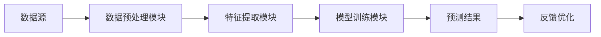

                 


# AI Agent在智能销售预测中的应用

## 关键词：AI Agent, 智能销售预测, 机器学习, 时间序列分析, 强化学习, 数据驱动

## 摘要：  
本文探讨了AI Agent在智能销售预测中的应用，详细分析了AI Agent的核心概念、算法原理、系统架构以及实际项目中的应用。通过对比传统销售预测方法与基于AI Agent的方法，本文揭示了AI Agent在提高预测准确性和效率方面的优势。文章还结合具体案例，展示了如何通过AI Agent实现智能化的销售预测，并提供了最佳实践和未来研究方向。

---

## 第一部分: AI Agent与智能销售预测的背景介绍

### 第1章: AI Agent的基本概念与应用背景

#### 1.1 AI Agent的定义与核心概念
##### 1.1.1 AI Agent的基本定义
AI Agent（人工智能代理）是指能够感知环境、自主决策并执行任务的智能实体。它可以是一个软件程序、机器人或其他智能系统，通过与环境交互来实现特定目标。AI Agent的核心在于其智能化的感知、推理和行动能力。

##### 1.1.2 AI Agent的核心属性与特征
- **自主性**：AI Agent能够自主决策，无需外部干预。
- **反应性**：能够实时感知环境并做出反应。
- **学习能力**：通过数据和经验不断优化自身性能。
- **目标导向**：所有行为都围绕实现特定目标展开。

##### 1.1.3 AI Agent的分类与应用场景
- **简单反射型代理**：基于规则执行任务，适用于简单的重复性任务。
- **基于模型的反射型代理**：利用内部模型进行推理和决策，适用于复杂场景。
- **目标驱动型代理**：以目标为导向，主动寻找最优解决方案。
- **效用驱动型代理**：通过最大化效用来优化决策，常用于资源分配和优化问题。

#### 1.2 智能销售预测的背景与挑战
##### 1.2.1 销售预测的传统方法与局限性
传统的销售预测方法主要包括统计分析（如线性回归、时间序列分析）和简单的机器学习模型（如随机森林、梯度提升树）。这些方法在处理小规模数据和简单场景时表现良好，但在面对复杂、动态的市场环境时往往力不从心。

##### 1.2.2 数据驱动销售预测的兴起
随着大数据技术的发展，企业积累了海量的销售数据，包括历史销售数据、市场趋势、客户行为数据等。基于这些数据，数据驱动的销售预测方法逐渐成为主流。

##### 1.2.3 AI Agent在销售预测中的潜力与优势
AI Agent能够实时分析数据、动态调整预测模型，并根据市场变化做出快速反应。与传统方法相比，AI Agent具有更高的灵活性和适应性，能够处理复杂场景下的销售预测问题。

### 第2章: AI Agent与销售预测的结合

#### 2.1 AI Agent在销售预测中的角色与功能
##### 2.1.1 数据收集与处理
AI Agent通过API、数据库或其他数据源实时收集销售数据，并进行清洗、特征提取和预处理。

##### 2.1.2 模型构建与优化
AI Agent利用机器学习算法（如LSTM、ARIMA）构建预测模型，并通过强化学习优化模型性能。

##### 2.1.3 预测结果的输出与反馈
AI Agent将预测结果输出，并根据实际销售数据反馈优化模型。

#### 2.2 AI Agent在智能销售预测中的核心流程
##### 2.2.1 数据预处理与特征提取
数据预处理包括去除噪声数据、填补缺失值等。特征提取则包括提取时间序列特征、客户行为特征等。

##### 2.2.2 模型训练与优化
AI Agent通过训练数据构建预测模型，并利用验证数据优化模型参数。

##### 2.2.3 结果分析与决策支持
AI Agent对预测结果进行分析，并提供决策支持，如库存管理、销售策略优化等。

---

## 第二部分: AI Agent在智能销售预测中的核心概念与联系

### 第3章: AI Agent与销售预测的核心概念原理

#### 3.1 AI Agent的核心原理
##### 3.1.1 代理的感知与决策机制
AI Agent通过传感器或API感知环境，利用内部模型进行推理，并基于推理结果做出决策。

##### 3.1.2 基于强化学习的代理行为优化
通过强化学习，AI Agent能够在复杂环境中优化其行为策略，以最大化效用函数。

##### 3.1.3 代理与环境的交互模型
AI Agent与环境之间的交互是通过动作和观察进行的，环境的状态变化驱动代理的决策过程。

#### 3.2 销售预测的核心原理
##### 3.2.1 时间序列分析的基本原理
时间序列分析通过分析历史数据的时序特征，预测未来的趋势和变化。常用方法包括ARIMA、GARCH等。

##### 3.2.2 机器学习在销售预测中的应用
机器学习模型（如随机森林、XGBoost）能够捕捉数据中的非线性关系，提高预测精度。

##### 3.2.3 深度学习在销售预测中的优势
深度学习模型（如LSTM、Transformer）能够处理复杂的时序数据，捕捉长距离依赖关系。

### 第4章: AI Agent与销售预测的核心概念对比

#### 4.1 AI Agent与传统销售预测方法的对比
##### 4.1.1 数据处理方式的对比
传统方法依赖于简单的统计分析，而AI Agent能够处理复杂的数据特征。

##### 4.1.2 模型构建方式的对比
传统方法依赖于人工选择模型，而AI Agent能够自动优化模型结构和参数。

##### 4.1.3 预测结果的对比
传统方法的预测结果较为静态，而AI Agent能够动态调整预测结果。

#### 4.2 AI Agent与机器学习模型的对比
##### 4.2.1 模型复杂度的对比
机器学习模型通常需要人工设计特征，而AI Agent能够自动提取特征。

##### 4.2.2 模型训练时间的对比
AI Agent的训练时间较长，但其预测精度更高。

##### 4.2.3 模型解释性的对比
传统机器学习模型通常具有较高的解释性，而深度学习模型解释性较差。

### 第5章: AI Agent与销售预测的实体关系图

#### 5.1 实体关系图的构建
##### 5.1.1 数据流的实体关系
- 数据源：包括销售数据、市场数据、客户数据等。
- 数据预处理模块：清洗、特征提取。
- 模型训练模块：构建预测模型。

##### 5.1.2 模型训练的实体关系
- 训练数据：用于模型训练。
- 模型参数：优化模型性能。

##### 5.1.3 预测结果的实体关系
- 预测结果：输出预测值。
- 反馈数据：优化模型。

#### 5.2 用mermaid绘制的实体关系图


---

## 第三部分: AI Agent在智能销售预测中的算法原理

### 第6章: AI Agent与销售预测的算法原理

#### 6.1 基于时间序列分析的销售预测算法
##### 6.1.1 ARIMA模型的原理与实现
ARIMA（自回归积分滑动平均模型）是一种常用的时间序列分析方法，适用于具有趋势和周期性的数据。

##### 6.1.2 LSTM模型的原理与实现
LSTM（长短期记忆网络）通过记忆单元捕捉长距离依赖关系，适合处理复杂的时序数据。

#### 6.2 基于机器学习的销售预测算法
##### 6.2.1 随机森林的原理与实现
随机森林通过集成学习提高预测精度，适用于高维数据。

##### 6.2.2 XGBoost的原理与实现
XGBoost通过梯度提升算法优化模型性能，适用于分类和回归问题。

#### 6.3 基于强化学习的销售预测算法
##### 6.3.1 强化学习的基本原理
强化学习通过代理与环境的交互，学习最优策略。

##### 6.3.2 Q-Learning算法在销售预测中的应用
Q-Learning通过状态-动作-奖励机制优化预测策略。

#### 6.4 算法的数学模型与公式
##### 6.4.1 ARIMA模型的数学公式
$$ ARIMA(p, d, q) $$
其中，p为自回归阶数，d为差分阶数，q为移动平均阶数。

##### 6.4.2 LSTM模型的数学公式
$$ f(t) = \text{LSTM}(x_t, f(t-1)) $$

---

## 第四部分: AI Agent在智能销售预测中的系统架构与实现

### 第7章: AI Agent与销售预测的系统架构设计

#### 7.1 系统功能设计
##### 7.1.1 数据采集模块
- 数据源：销售数据、市场数据、客户数据。
- 数据采集方式：实时采集、批量采集。

##### 7.1.2 数据处理模块
- 数据清洗：去除噪声数据。
- 特征提取：提取时间序列特征。

##### 7.1.3 模型训练模块
- 模型选择：ARIMA、LSTM、随机森林、XGBoost。
- 模型优化：超参数调优。

##### 7.1.4 预测结果模块
- 预测输出：预测值、置信区间。
- 反馈优化：根据实际数据优化模型。

#### 7.2 系统架构设计
##### 7.2.1 分层架构
- 数据层：数据存储与管理。
- 服务层：数据处理、模型训练。
- 应用层：预测结果展示、决策支持。

##### 7.2.2 微服务架构
- 数据采集服务：负责数据采集。
- 数据处理服务：负责数据清洗和特征提取。
- 模型训练服务：负责模型训练和优化。
- 预测服务：负责预测结果输出。

#### 7.3 系统接口设计
##### 7.3.1 数据接口
- 数据输入接口：接收外部数据。
- 数据输出接口：输出处理后的数据。

##### 7.3.2 模型接口
- 模型训练接口：训练模型。
- 模型预测接口：进行预测。

#### 7.4 系统交互流程
##### 7.4.1 数据采集流程
1. 数据采集模块接收外部数据。
2. 数据预处理模块清洗数据。
3. 特征提取模块提取特征。

##### 7.4.2 模型训练流程
1. 模型训练模块选择算法。
2. 数据处理模块提供处理后的数据。
3. 模型训练模块训练模型。

##### 7.4.3 预测流程
1. 预测模块接收输入数据。
2. 模型训练模块输出预测结果。
3. 反馈模块优化模型。

---

## 第五部分: AI Agent在智能销售预测中的项目实战

### 第8章: AI Agent与销售预测的项目实战

#### 8.1 环境安装与配置
##### 8.1.1 安装Python
- 安装Python 3.8以上版本。
- 安装Jupyter Notebook。

##### 8.1.2 安装依赖库
- 使用pip安装numpy、pandas、scikit-learn、xgboost、keras、tensorflow等库。

#### 8.2 核心代码实现
##### 8.2.1 数据预处理代码
```python
import pandas as pd
import numpy as np

# 数据加载
data = pd.read_csv('sales_data.csv')

# 数据清洗
data = data.dropna()
data = data.replace({np.nan: 0})

# 特征提取
data['date'] = pd.to_datetime(data['date'])
data.set_index('date', inplace=True)
```

##### 8.2.2 模型训练代码
```python
from sklearn.model_selection import train_test_split
from sklearn.ensemble import RandomForestRegressor
from xgboost import XGBRegressor
from tensorflow.keras.models import Sequential
from tensorflow.keras.layers import LSTM, Dense

# 数据划分
train_data, test_data = train_test_split(data, test_size=0.2)

# 随机森林模型训练
rf_model = RandomForestRegressor()
rf_model.fit(train_data.drop('target', axis=1), train_data['target'])

# XGBoost模型训练
xgb_model = XGBRegressor()
xgb_model.fit(train_data.drop('target', axis=1), train_data['target'])

# LSTM模型训练
model = Sequential()
model.add(LSTM(50, input_shape=(timesteps, features)))
model.add(Dense(1))
model.compile(loss='mean_squared_error', optimizer='adam')
model.fit(train_data, test_data, epochs=10, batch_size=32)
```

##### 8.2.3 预测与优化代码
```python
# 预测
rf_prediction = rf_model.predict(test_data.drop('target', axis=1))
xgb_prediction = xgb_model.predict(test_data.drop('target', axis=1))
lstm_prediction = model.predict(test_data)

# 反馈优化
from sklearn.metrics import mean_squared_error

rf_rmse = mean_squared_error(test_data['target'], rf_prediction)
xgb_rmse = mean_squared_error(test_data['target'], xgb_prediction)
lstm_rmse = mean_squared_error(test_data['target'], lstm_prediction)
```

#### 8.3 实际案例分析
##### 8.3.1 案例背景
某零售企业希望利用AI Agent进行销售预测，优化库存管理和销售策略。

##### 8.3.2 数据分析
- 数据来源：历史销售数据、市场趋势、客户行为数据。
- 数据特征：时间序列特征、客户特征、产品特征。

##### 8.3.3 模型选择与优化
- 选择LSTM模型进行预测，因为其在时间序列数据上表现优异。
- 通过网格搜索优化模型参数，提高预测精度。

#### 8.4 项目小结
通过AI Agent实现智能销售预测，企业能够显著提高预测精度，优化库存管理和销售策略。AI Agent的应用不仅提高了预测效率，还为企业带来了更大的竞争优势。

---

## 第六部分: AI Agent在智能销售预测中的最佳实践

### 第9章: AI Agent与销售预测的最佳实践

#### 9.1 数据预处理的注意事项
- 数据清洗要彻底，避免噪声数据影响模型。
- 特征提取要选择与销售预测相关性高的特征。

#### 9.2 模型选择的建议
- 根据数据类型和场景选择合适的模型。
- 对比不同模型的性能，选择最优模型。

#### 9.3 模型优化的技巧
- 使用交叉验证评估模型性能。
- 通过网格搜索优化模型参数。

#### 9.4 模型部署的注意事项
- 确保模型在生产环境中的稳定运行。
- 定期更新模型，适应数据变化。

#### 9.5 持续优化的建议
- 定期监控模型性能。
- 根据实际效果调整模型参数。
- 引入新的数据源，丰富模型特征。

---

## 结论

AI Agent在智能销售预测中的应用为企业带来了显著的优势，包括提高预测精度、优化库存管理、提升销售策略等。通过本文的详细讲解，读者可以深入了解AI Agent的核心概念、算法原理和系统架构，并通过实际案例掌握其在销售预测中的应用。未来，随着技术的不断发展，AI Agent在销售预测中的应用将更加广泛，为企业创造更大的价值。

---

## 参考文献

1. Hyndman, R. J., & Athanasopoulos, G. (2018). *Forecasting: principles and practice*.
2. LeCun, Y., Bengio, Y., & Hinton, G. (2015). *Deep learning*.
3. Sutton, R. S., & Barto, A. G. (2018). *Reinforcement learning: Theory and algorithms*.
4. 张志涌, & 李航. (2020). *机器学习实战*.

---

## 作者

**作者：AI天才研究院/AI Genius Institute & 禅与计算机程序设计艺术 /Zen And The Art of Computer Programming**

