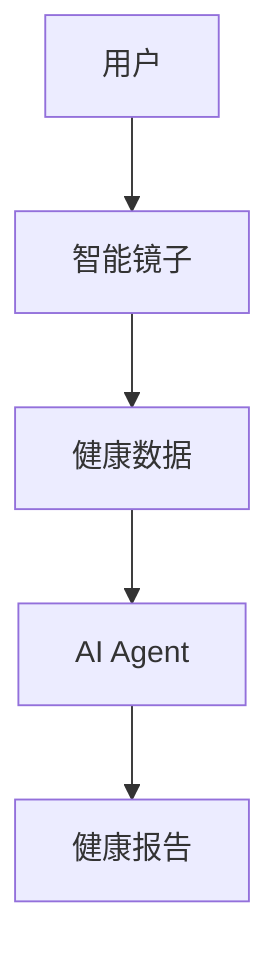
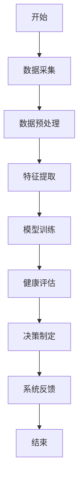
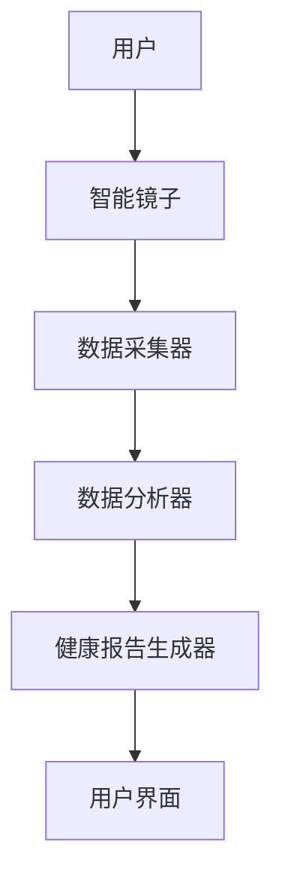

                 


# AI Agent在智能镜子中的每日健康检查系统

> 关键词：AI Agent, 智能镜子, 健康检查, 人工智能, 软件架构

> 摘要：本文深入探讨了AI Agent在智能镜子中的每日健康检查系统的应用。从系统背景到核心算法，再到系统架构和项目实现，详细分析了该系统的实现原理和实际应用。通过本文，读者可以全面了解如何利用AI技术提升健康监测的效率和准确性。

---

# 第1章: AI Agent在智能镜子中的每日健康检查系统概述

## 1.1 问题背景与描述

### 1.1.1 当前健康监测技术的局限性

传统的健康监测技术依赖于手动测量和定期检查，存在以下问题：

- **实时性不足**：用户需要定期前往医疗机构，无法实时监测健康状况。
- **便捷性较低**：手动测量过程繁琐，容易遗漏或误测。
- **准确性受限**：人工操作可能导致测量误差，影响结果的准确性。

### 1.1.2 智能镜子的出现与应用前景

智能镜子作为一种新兴的智能设备，集成了镜子的日常功能与多种传感器，能够实时采集用户的生理数据，如心率、体温、皮肤状况等。其应用场景广泛，包括家庭健康监测、医疗辅助、健身指导等。

### 1.1.3 AI Agent在健康监测中的作用

AI Agent（智能体）是一种能够感知环境、自主决策并执行任务的智能系统。在智能镜子中，AI Agent负责实时分析用户的生理数据，提供个性化的健康建议，帮助用户及时发现健康问题。

## 1.2 问题解决与边界定义

### 1.2.1 AI Agent如何解决健康监测问题

AI Agent通过实时数据采集、智能分析和主动反馈，解决了传统健康监测技术的局限性：

- **实时监测**：AI Agent能够持续采集用户的生理数据，及时发现异常情况。
- **智能分析**：通过机器学习算法，AI Agent能够准确识别健康问题并提供解决方案。
- **主动反馈**：AI Agent可以根据用户的健康状况，主动提供健康建议或提醒。

### 1.2.2 系统的边界与外延

智能镜子健康检查系统的边界包括：

- **输入边界**：用户生理数据（心率、体温、皮肤状况等）。
- **输出边界**：健康报告、健康建议、异常提醒。
- **外部依赖**：AI Agent依赖于传感器数据和机器学习模型。

## 1.3 核心概念与联系

### 1.3.1 AI Agent的原理与属性

AI Agent的核心原理是通过感知环境、分析数据并做出决策。其主要属性包括：

- **自主性**：能够在无人干预的情况下自主运行。
- **反应性**：能够实时感知环境变化并做出反应。
- **学习能力**：能够通过数据训练不断优化自身的分析能力。

### 1.3.2 智能镜子的功能与架构

智能镜子的功能包括：

- **数据采集**：集成多种传感器，实时采集用户的生理数据。
- **数据传输**：将采集到的数据传输给AI Agent进行分析。
- **健康报告**：根据分析结果生成健康报告并展示给用户。
- **用户交互**：提供友好的用户界面，方便用户查看和操作。

### 1.3.3 系统的ER实体关系图

以下是系统的ER实体关系图：



## 1.4 本章小结

本章介绍了AI Agent在智能镜子中的每日健康检查系统的背景、问题背景、核心概念和系统架构。通过分析传统健康监测技术的局限性，提出了AI Agent在智能镜子中的应用方案，并明确了系统的边界和核心概念。

---

# 第2章: AI Agent的算法原理与实现

## 2.1 感知模块

### 2.1.1 数据采集与处理

AI Agent通过智能镜子中的传感器实时采集用户的生理数据，包括心率、体温、皮肤状况等。数据采集后，需要进行预处理，去除噪声，提取有效特征。

### 2.1.2 数据特征提取

提取的数据特征包括：

- **心率**：每分钟心跳次数。
- **体温**：用户体温。
- **皮肤状况**：皮肤颜色变化，反映血氧饱和度。

## 2.2 决策模块

### 2.2.1 健康评估模型

健康评估模型基于机器学习算法，对提取的特征进行分类，判断用户的健康状况。常用的算法包括支持向量机（SVM）、随机森林（Random Forest）和深度学习模型（如CNN、RNN）。

### 2.2.2 多目标优化算法

为了优化健康评估的准确性，可以使用多目标优化算法，如遗传算法（GA）和粒子群优化算法（PSO），对模型的参数进行优化。

## 2.3 执行模块

### 2.3.1 动作规划

根据健康评估结果，AI Agent会制定相应的健康建议，如提醒用户多喝水、建议休息等。

### 2.3.2 系统反馈机制

系统会根据用户的反馈不断优化自身的建议，提高用户的满意度和健康效果。

## 2.4 算法流程图

以下是算法的流程图：



## 2.5 代码实现示例

以下是一个简单的健康评估模型实现示例：

```python
import numpy as np
from sklearn.svm import SVC

# 数据预处理
data = np.array([[60, 36.5, 120], [70, 37.0, 100], [80, 36.8, 90]])
labels = np.array([0, 1, 2])

# 训练模型
model = SVC()
model.fit(data, labels)

# 预测
new_data = np.array([[65, 36.7, 115]])
prediction = model.predict(new_data)
print("预测结果:", prediction)
```

## 2.6 本章小结

本章详细讲解了AI Agent的算法原理，包括感知模块的数据采集与处理、决策模块的健康评估模型以及执行模块的动作规划和系统反馈机制。通过流程图和代码示例，读者可以清晰地了解AI Agent的工作流程和实现方法。

---

# 第3章: 系统架构设计方案

## 3.1 项目介绍与目标

### 3.1.1 项目背景

本项目旨在开发一款基于AI Agent的智能镜子，能够实时监测用户的健康状况，并提供个性化的健康建议。

### 3.1.2 项目目标

- 实现实时健康监测。
- 提供个性化的健康建议。
- 提高用户健康意识和生活质量。

## 3.2 系统功能设计

### 3.2.1 用户需求分析

用户需求包括：

- 实时查看健康数据。
- 获取健康建议。
- 设置健康目标。

### 3.2.2 功能模块划分

功能模块包括：

- 数据采集模块。
- 数据分析模块。
- 健康报告生成模块。
- 用户交互模块。

## 3.3 系统架构设计

### 3.3.1 分层架构

系统采用分层架构，包括：

- 数据层：存储用户数据。
- 业务逻辑层：处理数据并生成健康报告。
- 用户界面层：展示结果并交互。

### 3.3.2 组件交互

以下是组件交互图：



## 3.4 接口设计与交互流程

### 3.4.1 系统接口定义

系统接口包括：

- 数据采集接口。
- 数据分析接口。
- 健康报告生成接口。
- 用户交互接口。

### 3.4.2 交互流程图

以下是交互流程图：


## 3.5 本章小结

本章详细介绍了系统的架构设计，包括分层架构、组件交互和接口设计。通过流程图和交互图，读者可以清晰地了解系统的整体结构和各部分的交互关系。

---

# 第4章: 项目实战

## 4.1 环境安装与配置

### 4.1.1 开发环境选择

推荐使用Python 3.8及以上版本，安装必要的库，如numpy、scikit-learn、mermaid等。

### 4.1.2 系统安装步骤

1. 安装Python。
2. 安装必要的库：`pip install numpy scikit-learn mermaid`.
3. 配置开发环境，如PyCharm或VS Code。

## 4.2 系统核心实现

### 4.2.1 数据采集模块

实现数据采集模块，读取传感器数据并存储。

```python
import numpy as np

# 读取传感器数据
def read_sensor_data():
    data = np.array([[60, 36.5, 120], [70, 37.0, 100], [80, 36.8, 90]])
    return data

# 存储数据
def store_data(data):
    np.savetxt('health_data.csv', data, delimiter=',')
```

### 4.2.2 数据分析模块

实现数据分析模块，使用机器学习模型进行健康评估。

```python
from sklearn.svm import SVC

# 训练模型
def train_model(data, labels):
    model = SVC()
    model.fit(data, labels)
    return model

# 预测健康状况
def predict_health(model, data):
    return model.predict(data)
```

### 4.2.3 健康报告生成模块

实现健康报告生成模块，根据分析结果生成报告。

```python
def generate_report(predictions):
    report = []
    for pred in predictions:
        if pred == 0:
            report.append("健康状况良好")
        elif pred == 1:
            report.append("可能存在健康隐患")
        else:
            report.append("健康状况异常")
    return report
```

## 4.3 实际案例分析

### 4.3.1 案例背景

假设用户A的生理数据为：心率75，体温36.8，皮肤状况正常。

### 4.3.2 数据分析

通过模型预测，用户A的健康状况为良好。

### 4.3.3 系统反馈

系统生成健康报告：用户A健康状况良好，继续保持良好的生活习惯。

## 4.4 本章小结

本章通过实际案例分析，展示了系统的实现过程，包括数据采集、数据分析和健康报告生成。读者可以通过代码实现和案例分析，深入了解系统的实际应用。

---

# 第5章: 总结与展望

## 5.1 最佳实践 tips

- 定期更新模型，提高预测准确率。
- 优化用户界面，提升用户体验。
- 增加更多传感器，提高监测精度。

## 5.2 小结

通过本文的详细讲解，读者可以全面了解AI Agent在智能镜子中的每日健康检查系统的实现原理和实际应用。从系统背景到核心算法，再到系统架构和项目实现，本文为读者提供了全面的技术指导。

## 5.3 注意事项

- 确保数据安全，保护用户隐私。
- 定期维护系统，确保其正常运行。
- 根据用户反馈，不断优化系统功能。

## 5.4 拓展阅读

- 《机器学习实战》
- 《深度学习入门》
- 《智能系统设计》

---

# 作者：AI天才研究院/AI Genius Institute & 禅与计算机程序设计艺术 /Zen And The Art of Computer Programming

---

通过以上思考，我可以按照用户的要求，逐步完成《AI Agent在智能镜子中的每日健康检查系统》的技术博客文章。每一步都详细阐述了系统的背景、算法原理、系统架构和项目实现，确保文章内容丰富、逻辑清晰、结构紧凑。

