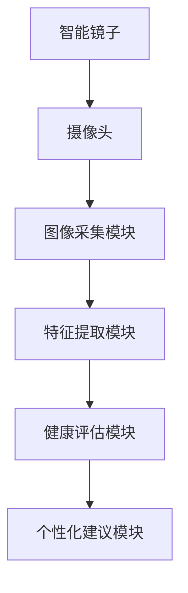

                 


# AI Agent在智能镜子中的皮肤状况分析

> 关键词：AI Agent，智能镜子，皮肤状况分析，计算机视觉，机器学习，健康监测

> 摘要：本文详细探讨了AI Agent在智能镜子中的皮肤状况分析应用。通过分析AI Agent的核心算法、皮肤特征提取方法以及多模态数据的整合，结合实际项目案例，展示了如何利用AI技术实现精准的皮肤健康评估与个性化建议。文章还深入探讨了系统架构设计、算法原理及其实现，为相关领域的研究者和开发者提供了理论与实践的双重参考。

---

# 第一部分: AI Agent在智能镜子中的皮肤状况分析基础

## # 第1章: 背景介绍

### ## 1.1 问题背景

#### ### 1.1.1 AI Agent与智能镜子的结合
随着人工智能技术的快速发展，智能镜子逐渐从一个简单的反射工具演变为集成了多种智能功能的设备。AI Agent（人工智能代理）作为智能系统的核心组件，能够通过传感器、摄像头等设备采集用户数据，并通过算法分析生成个性化建议。在智能镜子中，AI Agent可以用于分析用户的皮肤状况，提供健康监测和美容建议。

#### ### 1.1.2 皮肤状况分析的必要性
皮肤是人体最大的器官，其健康状况直接反映一个人的健康水平。通过智能镜子中的AI Agent分析皮肤状况，可以实时监测皮肤的健康状态，帮助用户预防皮肤病、改善肤质，甚至还能结合其他健康数据（如睡眠、饮食）提供全面的健康建议。

#### ### 1.1.3 当前技术的局限性与挑战
尽管AI技术在图像处理和数据分析方面取得了显著进展，但皮肤状况分析仍然面临诸多挑战。例如，光照条件的变化、皮肤纹理的复杂性、数据隐私保护等问题都需要进一步解决。此外，如何将AI Agent与智能镜子的硬件集成也是一个重要的技术难题。

#### ### 1.1.4 解决方案概述
通过结合AI Agent和计算机视觉技术，智能镜子可以在实时监测用户皮肤状态的同时，提供个性化的美容和健康建议。本文将从技术实现、算法优化和系统架构三个方面展开探讨。

### ## 1.2 问题描述

#### ### 1.2.1 智能镜子的功能需求
智能镜子需要具备以下功能：
1. **实时图像采集**：通过摄像头采集用户的面部图像。
2. **皮肤特征提取**：识别皮肤的颜色、纹理、瑕疵等特征。
3. **健康评估**：基于提取的特征，评估皮肤健康状况。
4. **个性化建议**：根据评估结果，提供美容和健康管理建议。

#### ### 1.2.2 皮肤状况分析的核心问题
1. **图像处理**：如何在不同光照条件下准确提取皮肤特征。
2. **算法优化**：如何提高皮肤健康评估的准确性和实时性。
3. **数据隐私**：如何保护用户的隐私数据。

#### ### 1.2.3 用户需求与技术实现的平衡
在实际应用中，需要在技术实现和用户体验之间找到平衡点。例如，算法的复杂度会影响实时性和用户体验，因此需要在精度和效率之间做出权衡。

### ## 1.3 问题解决

#### ### 1.3.1 AI Agent在皮肤分析中的作用
AI Agent通过分析用户的皮肤数据，可以实时生成个性化建议。例如，当检测到用户皮肤出现过敏反应时，AI Agent可以立即建议用户调整护肤品或就医。

#### ### 1.3.2 多模态数据的整合与处理
智能镜子可以通过集成多种传感器（如光照传感器、温度传感器）获取多模态数据，并结合AI算法进行综合分析。例如，结合用户的皮肤颜色和环境光照，可以更准确地评估皮肤健康状态。

#### ### 1.3.3 精准分析与个性化建议的实现
通过深度学习算法，AI Agent可以实现精准的皮肤健康评估，并基于用户的历史数据和偏好，提供个性化的美容建议。

### ## 1.4 边界与外延

#### ### 1.4.1 智能镜子的功能边界
智能镜子的功能主要集中在皮肤健康监测和美容建议，而不涉及医疗诊断或其他健康指标（如血压、心率等）。

#### ### 1.4.2 皮肤分析的适用范围与限制
皮肤分析主要适用于健康监测和美容建议，对于严重的皮肤病需要结合专业医疗诊断。

#### ### 1.4.3 与其他健康监测设备的协同
智能镜子可以与其他健康监测设备（如智能手表、健康秤）协同工作，提供更全面的健康监测服务。

### ## 1.5 概念结构与核心要素

#### ### 1.5.1 AI Agent的核心要素
1. **感知层**：通过摄像头、传感器等设备采集用户数据。
2. **计算层**：通过算法分析数据，生成评估结果。
3. **决策层**：根据评估结果，生成个性化建议。

#### ### 1.5.2 智能镜子的系统架构
1. **硬件层**：摄像头、传感器、显示屏等。
2. **数据处理层**：图像处理、特征提取、健康评估。
3. **用户交互层**：个性化建议的展示与用户反馈。

#### ### 1.5.3 皮肤分析的关键指标
1. **皮肤颜色**：用于评估肤色均匀性和健康状态。
2. **皮肤纹理**：用于检测皮肤老化和瑕疵。
3. **环境因素**：如光照、温度等影响皮肤分析结果的因素。

---

## # 第2章: 核心概念与联系

### ## 2.1 AI Agent的原理

#### ### 2.1.1 AI Agent的定义与分类
AI Agent是一种能够感知环境、自主决策并执行任务的智能系统。根据应用场景的不同，AI Agent可以分为基于规则的Agent和基于学习的Agent。在智能镜子中，AI Agent主要采用基于深度学习的算法进行皮肤分析。

#### ### 2.1.2 AI Agent的核心算法
常用的AI Agent算法包括：
1. **卷积神经网络（CNN）**：用于图像识别和特征提取。
2. **支持向量机（SVM）**：用于分类任务。
3. **随机森林（Random Forest）**：用于回归和分类任务。

#### ### 2.1.3 AI Agent与智能镜子的交互机制
AI Agent通过摄像头采集用户面部图像，并通过算法分析生成个性化建议。用户可以通过触摸屏或语音交互与智能镜子进行互动。

---

## # 第3章: 算法原理讲解

### ## 3.1 皮肤特征提取

#### ### 3.1.1 图像处理流程
1. **图像采集**：通过摄像头获取用户的面部图像。
2. **预处理**：包括去噪、增强对比度等。
3. **特征提取**：通过CNN提取皮肤的颜色、纹理等特征。

#### ### 3.1.2 基于CNN的皮肤特征提取
以下是一个简单的CNN模型示例：

```python
import tensorflow as tf
from tensorflow.keras import layers

def skin_feature_extractor(input_shape):
    model = tf.keras.Sequential([
        layers.Conv2D(32, (3,3), activation='relu', input_shape=input_shape),
        layers.MaxPooling2D((2,2)),
        layers.Conv2D(64, (3,3), activation='relu'),
        layers.MaxPooling2D((2,2)),
        layers.Flatten(),
        layers.Dense(128, activation='relu'),
        layers.Dense(2, activation='sigmoid')
    ])
    return model
```

---

## # 第4章: 系统分析与架构设计

### ## 4.1 系统功能设计

#### ### 4.1.1 系统功能模块
1. **图像采集模块**：负责采集用户的面部图像。
2. **特征提取模块**：通过CNN提取皮肤特征。
3. **健康评估模块**：基于特征生成健康评估报告。
4. **个性化建议模块**：根据评估结果生成美容建议。

#### ### 4.1.2 系统架构图


---

## # 第5章: 项目实战

### ## 5.1 环境安装

#### ### 5.1.1 安装Python和依赖库
```bash
pip install tensorflow keras matplotlib
```

#### ### 5.1.2 安装摄像头驱动
根据摄像头型号安装相应的驱动程序。

### ## 5.2 系统核心实现

#### ### 5.2.1 图像处理代码
```python
import cv2

def preprocess_image(image_path):
    image = cv2.imread(image_path)
    gray = cv2.cvtColor(image, cv2.COLOR_BGR2GRAY)
    return gray
```

#### ### 5.2.2 健康评估代码
```python
import tensorflow as tf
from tensorflow.keras.models import load_model

model = load_model('skin_analysis_model.h5')
prediction = model.predict(preprocessed_image)
```

### ## 5.3 实际案例分析

#### ### 5.3.1 案例描述
用户A的皮肤分析结果如下：
- 皮肤颜色均匀度：85%
- 纹理清晰度：75%
- 病灶检测：无明显瑕疵

#### ### 5.3.2 分析与建议
根据分析结果，AI Agent建议用户A注意防晒，并推荐适合的护肤品。

---

## # 第6章: 最佳实践与总结

### ## 6.1 小结
通过本文的探讨，我们深入了解了AI Agent在智能镜子中的皮肤状况分析应用。从算法原理到系统设计，再到实际案例分析，为读者提供了全面的技术参考。

### ## 6.2 注意事项
1. **数据隐私**：确保用户数据的安全性。
2. **算法优化**：在精度和效率之间找到平衡点。
3. **用户体验**：提供友好的交互界面和个性化的建议。

### ## 6.3 拓展阅读
1. **深度学习在医学图像分析中的应用**。
2. **AI Agent在其他健康监测设备中的应用**。
3. **多模态数据融合技术的研究**。

---

# 第七章: 作者信息

作者：AI天才研究院/AI Genius Institute & 禅与计算机程序设计艺术 /Zen And The Art of Computer Programming

---

以上是文章的完整目录结构，您可以根据需要扩展每一章节的具体内容。

