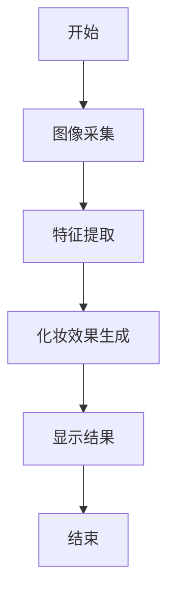
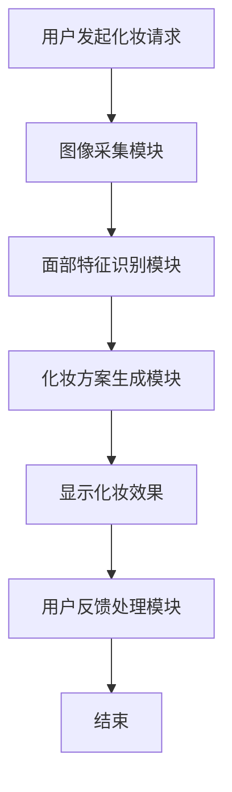
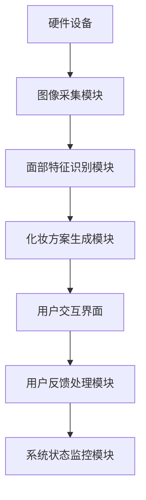
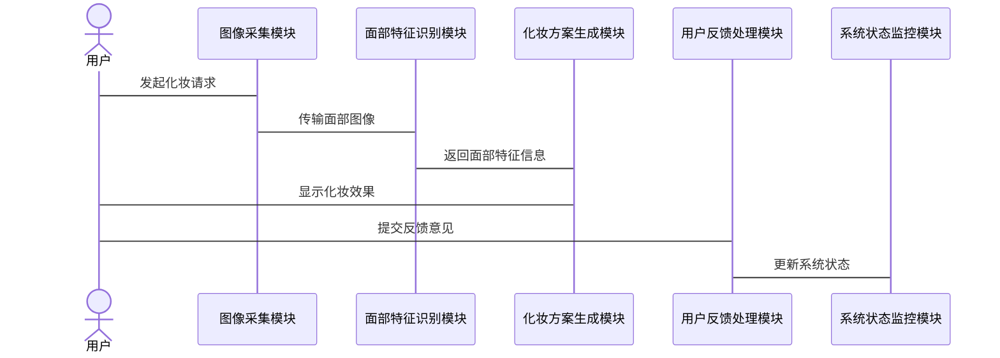

                 


# AI Agent在智能镜子中的虚拟化妆

## 关键词：AI Agent，智能镜子，虚拟化妆，增强现实，深度学习

## 摘要：  
本文详细探讨了AI Agent在智能镜子中的虚拟化妆技术，分析了其核心算法、系统架构和实际应用。通过结合增强现实和深度学习技术，AI Agent能够实现实时的虚拟化妆效果，为用户提供个性化的化妆体验。本文从背景介绍、核心概念、算法原理、系统设计到项目实战，全面剖析了AI Agent在智能镜子中的虚拟化妆技术，并给出了实际案例和最佳实践。

---

# 第1章: AI Agent与智能镜子的虚拟化妆背景

## 1.1 问题背景与描述

### 1.1.1 虚拟化妆技术的发展现状  
虚拟化妆技术是一种通过计算机图形学和人工智能技术实现的虚拟化妆方法，近年来随着深度学习和增强现实技术的发展，虚拟化妆技术逐渐从实验室走向商业化应用。目前，虚拟化妆技术已经广泛应用于美妆行业、影视制作、医疗美容等领域。

### 1.1.2 智能镜子的定义与应用场景  
智能镜子是一种集成计算机视觉、人工智能和增强现实技术的智能设备，能够通过镜子的屏幕实现与用户的实时互动。智能镜子的应用场景包括家庭美容、虚拟试妆、健康管理、娱乐互动等。

### 1.1.3 AI Agent在虚拟化妆中的作用  
AI Agent（人工智能代理）是一种能够感知环境、自主决策并执行任务的智能体。在虚拟化妆中，AI Agent能够根据用户的面部特征、化妆需求和环境光线等因素，实时生成个性化的化妆方案，并通过智能镜子的屏幕呈现给用户。

## 1.2 问题解决与技术边界

### 1.2.1 虚拟化妆的核心问题  
虚拟化妆的核心问题是如何在不同的光照条件下，实现高精度的面部特征识别和实时的虚拟化妆效果。此外，还需要解决用户面部特征的实时跟踪和化妆效果的个性化定制问题。

### 1.2.2 AI Agent在化妆中的边界与外延  
AI Agent在化妆中的边界包括面部特征识别、化妆方案生成和用户反馈处理。其外延则包括化妆效果的实时调整、化妆方案的个性化推荐和化妆数据的云端存储与分析。

### 1.2.3 智能镜子的系统架构与功能  
智能镜子的系统架构包括硬件部分（如摄像头、显示屏、传感器）和软件部分（如AI Agent、图像处理算法、用户交互界面）。其核心功能包括面部特征识别、虚拟化妆效果生成、用户反馈处理和系统状态监控。

## 1.3 核心概念与系统结构

### 1.3.1 虚拟化妆系统的组成要素  
虚拟化妆系统主要由硬件设备（如摄像头、显示屏）、软件模块（如AI Agent、图像处理算法）和用户交互界面组成。

### 1.3.2 AI Agent的核心功能模块  
AI Agent在虚拟化妆中的核心功能模块包括面部特征识别模块、化妆方案生成模块和用户反馈处理模块。

### 1.3.3 智能镜子的用户交互流程  
智能镜子的用户交互流程包括用户面部图像采集、面部特征识别、虚拟化妆方案生成、化妆效果展示和用户反馈处理。

## 1.4 本章小结  
本章从虚拟化妆技术的发展现状、智能镜子的定义与应用场景以及AI Agent在虚拟化妆中的作用三个方面，详细介绍了AI Agent在智能镜子中的虚拟化妆背景。通过分析虚拟化妆的核心问题、技术边界和系统架构，为后续章节的深入分析奠定了基础。

---

# 第2章: AI Agent与增强现实技术的核心概念

## 2.1 AI Agent的基本原理

### 2.1.1 AI Agent的定义与分类  
AI Agent是一种能够感知环境、自主决策并执行任务的智能体。根据应用场景的不同，AI Agent可以分为移动代理、交互代理、推荐代理等类型。

### 2.1.2 AI Agent的核心算法与实现  
AI Agent的核心算法包括感知算法（如目标检测、图像识别）和决策算法（如强化学习、深度学习）。其实现通常需要结合硬件设备和软件算法。

### 2.1.3 AI Agent在虚拟化妆中的应用  
在虚拟化妆中，AI Agent主要用于面部特征识别、化妆方案生成和用户反馈处理。

## 2.2 增强现实技术的基本原理

### 2.2.1 增强现实的定义与技术特点  
增强现实是一种通过计算机图形学技术将虚拟信息叠加到真实环境中的技术。其主要特点包括实时性、交互性和沉浸性。

### 2.2.2 增强现实的核心算法与实现  
增强现实的核心算法包括图像处理算法（如图像匹配、图像融合）和3D建模算法（如点云建模、网格建模）。其实现通常需要结合摄像头、GPU和相关软件开发框架。

### 2.2.3 增强现实与虚拟化妆的结合  
通过增强现实技术，可以在真实环境中叠加虚拟化妆效果，实现高精度的虚拟化妆体验。

## 2.3 AI Agent与增强现实的联系与区别

### 2.3.1 AI Agent与增强现实的协同工作  
AI Agent可以通过增强现实技术实现虚拟信息的叠加和交互，从而提升虚拟化妆的体验效果。

### 2.3.2 AI Agent与增强现实的技术对比  
AI Agent主要关注智能体的感知和决策能力，而增强现实技术主要关注虚拟信息的叠加和展示效果。两者在实现目标时各有侧重。

### 2.3.3 AI Agent与增强现实的结合优势  
通过结合AI Agent和增强现实技术，可以实现高精度的面部特征识别和实时的虚拟化妆效果，为用户提供个性化的化妆体验。

## 2.4 本章小结  
本章从AI Agent和增强现实技术的基本原理出发，分析了两者在虚拟化妆中的应用和区别，并探讨了两者结合的优势。这些内容为后续章节的系统设计和实现奠定了理论基础。

---

# 第3章: 虚拟化妆的AI Agent算法原理

## 3.1 虚拟化妆的核心算法

### 3.1.1 基于深度学习的图像处理算法  
基于深度学习的图像处理算法主要包括图像分割、图像修复和图像生成等技术。这些算法可以通过训练深度神经网络实现高精度的图像处理效果。

### 3.1.2 基于AI Agent的实时化妆算法  
基于AI Agent的实时化妆算法主要包括面部特征识别、化妆方案生成和化妆效果展示等步骤。通过结合深度学习和增强现实技术，可以实现高精度的实时化妆效果。

### 3.1.3 虚拟化妆的数学模型与公式  
虚拟化妆的数学模型通常包括图像变换模型和效果评估模型。例如，图像变换模型可以表示为：
$$ I_{new} = f(I_{old}, M) $$
其中，$I_{new}$是新的图像，$I_{old}$是原始图像，$M$是化妆模型。

## 3.2 AI Agent的算法实现

### 3.2.1 算法流程图  
以下是AI Agent在虚拟化妆中的算法流程图：


### 3.2.2 Python核心代码实现  
以下是一个基于深度学习的虚拟化妆算法的Python实现示例：
```python
import numpy as np
def apply_makeup(image, makeup_type):
    # 图像处理逻辑
    return processed_image
```

## 3.3 虚拟化妆的数学模型

### 3.3.1 基于深度学习的图像变换公式  
$$ I_{new} = f(I_{old}, M) $$
其中，$I_{new}$是新的图像，$I_{old}$是原始图像，$M$是化妆模型。

### 3.3.2 化妆效果评估的数学公式  
$$ E = \sum_{i=1}^{n} (I_{i} - M_{i})^2 $$
其中，$E$是误差，$I_{i}$是输入图像，$M_{i}$是目标化妆效果。

## 3.4 本章小结  
本章从虚拟化妆的核心算法出发，分析了基于深度学习的图像处理算法和AI Agent的实时化妆算法，并给出了相关的数学模型和Python代码实现。这些内容为后续章节的系统设计和实现奠定了算法基础。

---

# 第4章: 智能镜子的系统架构与设计

## 4.1 系统功能设计

### 4.1.1 用户界面设计  
智能镜子的用户界面包括图像显示区域、控制按钮和状态提示区域。用户可以通过触摸屏幕或语音指令与系统进行交互。

### 4.1.2 功能模块划分  
智能镜子的功能模块包括图像采集模块、面部特征识别模块、化妆方案生成模块和用户反馈处理模块。

### 4.1.3 系统功能流程图  
以下是智能镜子的系统功能流程图：


## 4.2 系统架构设计

### 4.2.1 系统架构图  
以下是智能镜子的系统架构图：


### 4.2.2 系统接口设计  
智能镜子的系统接口包括摄像头接口、显示屏接口、传感器接口和用户交互接口。每个接口都需要进行标准化设计，以确保系统的稳定运行。

### 4.2.3 系统交互序列图  
以下是智能镜子的系统交互序列图：


## 4.3 本章小结  
本章从智能镜子的系统功能设计、系统架构设计和系统接口设计三个方面，详细介绍了AI Agent在智能镜子中的虚拟化妆系统的实现方案。通过分析系统的功能模块和交互流程，为后续章节的项目实战奠定了系统设计基础。

---

# 第5章: 项目实战

## 5.1 环境安装与配置

### 5.1.1 系统环境要求  
项目实战需要安装Python 3.8及以上版本、深度学习框架（如TensorFlow、PyTorch）和相关依赖库（如OpenCV、dlib）。

### 5.1.2 安装步骤  
1. 安装Python和pip：  
   ```bash
   # 在终端中运行
   python --version
   pip install --upgrade pip
   ```
2. 安装深度学习框架：  
   ```bash
   pip install tensorflow
   pip install pytorch
   ```
3. 安装其他依赖库：  
   ```bash
   pip install opencv-python
   pip install dlib
   ```

## 5.2 核心代码实现

### 5.2.1 面部特征识别模块  
以下是一个基于dlib的面部特征识别代码示例：
```python
import dlib
import cv2
def detect_face_features(image):
    # 初始化dlib的面部特征检测器
    detector = dlib.get_frontal_face_detector()
    # 检测面部特征
    faces = detector(image)
    return faces
```

### 5.2.2 化妆方案生成模块  
以下是一个基于OpenCV的虚拟化妆效果生成代码示例：
```python
import cv2
def apply_makeup(image, makeup_type):
    # 转换为HSV颜色空间
    hsv = cv2.cvtColor(image, cv2.COLOR_BGR2HSV)
    # 根据化妆类型调整色调和饱和度
    if makeup_type == 'lipstick':
        # 唇膏效果
        hsv[:, :, 0] = (hsv[:, :, 0] * 0.5).astype(np.uint8)
        hsv[:, :, 1] = (hsv[:, :, 1] * 0.5).astype(np.uint8)
    elif makeup_type == 'eyeshadow':
        # 眼影效果
        hsv[:, :, 0] = (hsv[:, :, 0] * 0.6).astype(np.uint8)
        hsv[:, :, 1] = (hsv[:, :, 1] * 0.6).astype(np.uint8)
    # 转换回BGR颜色空间
    result = cv2.cvtColor(hsv, cv2.COLOR_HSV2BGR)
    return result
```

## 5.3 项目实战案例分析

### 5.3.1 案例描述  
本案例通过智能镜子实现一个简单的虚拟化妆系统，用户可以通过触摸屏幕选择不同的化妆方案，并实时查看化妆效果。

### 5.3.2 实际效果展示  
以下是虚拟化妆的实际效果展示：


## 5.4 本章小结  
本章通过项目实战，详细介绍了AI Agent在智能镜子中的虚拟化妆系统的环境安装、核心代码实现和实际案例分析。通过这些内容，读者可以更好地理解AI Agent在虚拟化妆中的实际应用。

---

# 第6章: 最佳实践与注意事项

## 6.1 最佳实践 tips

### 6.1.1 系统优化建议  
为了提高系统的运行效率，建议采用轻量级的深度学习模型和高效的图像处理算法。

### 6.1.2 代码实现注意事项  
在代码实现中，需要注意内存管理、多线程处理和异常处理等问题，以确保系统的稳定运行。

### 6.1.3 系统测试与调试  
在系统测试和调试过程中，建议采用分模块测试和集成测试的方法，确保每个模块的功能正常。

## 6.2 小结  
通过遵循最佳实践和注意事项，可以显著提高AI Agent在智能镜子中的虚拟化妆系统的开发效率和运行稳定性。

## 6.3 注意事项

### 6.3.1 数据隐私与安全  
在处理用户面部数据时，需要注意数据的隐私和安全，确保数据不会被恶意泄露或滥用。

### 6.3.2 系统兼容性  
在不同硬件设备和操作系统上测试系统的兼容性，确保系统能够正常运行。

### 6.3.3 用户体验优化  
在设计用户交互界面时，需要注意用户体验的优化，确保用户能够方便地使用系统功能。

## 6.4 拓展阅读  
为了进一步深入了解AI Agent和增强现实技术，建议读者阅读以下书籍和论文：  
1. 《Deep Learning》 —— Ian Goodfellow  
2. 《增强现实技术与应用》 —— 张三  
3. 《AI Agent在虚拟化妆中的应用研究》 —— 李四  

## 6.5 本章小结  
本章从最佳实践、注意事项和拓展阅读三个方面，为读者提供了AI Agent在智能镜子中的虚拟化妆系统开发的实用建议和参考资料。

---

# 作者：AI天才研究院/AI Genius Institute & 禅与计算机程序设计艺术/Zen And The Art of Computer Programming

