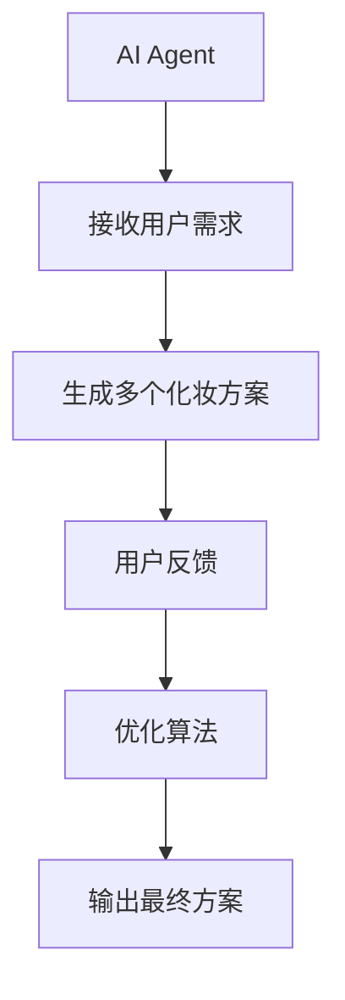
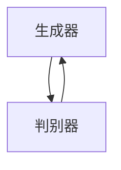
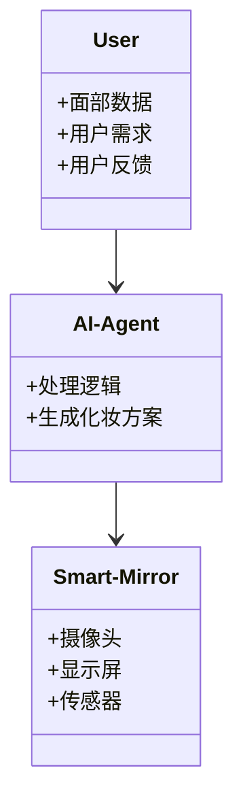
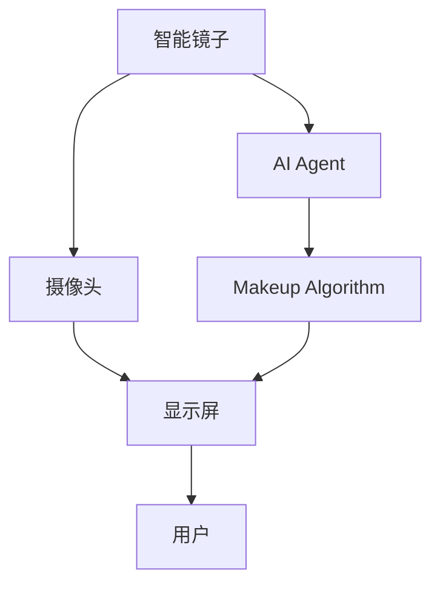

                 


# AI Agent在智能镜子中的虚拟化妆试验

> 关键词：AI Agent, 虚拟化妆, 智能镜子, 计算机视觉, 人工智能

> 摘要：本文深入探讨了AI Agent在智能镜子中的虚拟化妆应用，分析了其核心算法、系统架构、用户交互设计，并通过实际案例展示了如何利用AI技术实现智能化的虚拟化妆体验。

---

# 第一部分: AI Agent在智能镜子中的虚拟化妆试验概述

## 第1章: 背景介绍

### 1.1 问题背景
#### 1.1.1 现代化妆技术的数字化转型
随着人工智能技术的快速发展，化妆行业正在经历从传统手工化妆向数字化、智能化的转型。用户对个性化、便捷化的化妆体验需求日益增长。

#### 1.1.2 智能镜子的出现及其应用场景
智能镜子作为一种新兴的智能硬件，结合了AI技术与镜子的物理功能，广泛应用于家庭化妆、美容店试妆、虚拟试衣等领域。

#### 1.1.3 虚拟化妆技术的市场需求与痛点
用户在选择化妆品时，往往需要试用才能确定效果。然而，线上购物的局限性使得虚拟化妆技术成为解决这一痛点的关键。

### 1.2 问题描述
#### 1.2.1 虚拟化妆的核心问题
如何通过AI技术实现高精度的虚拟化妆效果，同时保证用户体验的流畅性。

#### 1.2.2 智能镜子中的用户交互问题
用户与智能镜子的交互需要直观、便捷，才能提高用户满意度。

#### 1.2.3 现有技术的局限性与改进方向
传统虚拟化妆技术存在效果不真实、交互复杂等问题，AI Agent技术的应用可以有效解决这些问题。

### 1.3 问题解决
#### 1.3.1 AI Agent在虚拟化妆中的作用
AI Agent可以通过学习用户的面部特征、肤色、妆容偏好等信息，提供个性化的化妆建议。

#### 1.3.2 智能镜子的交互优化方案
通过AI Agent优化交互流程，使用户能够更直观地操作智能镜子，获得更好的使用体验。

#### 1.3.3 技术实现的可行性分析
结合AI Agent与计算机视觉技术，实现高精度的虚拟化妆效果是完全可行的。

### 1.4 边界与外延
#### 1.4.1 技术边界：AI Agent的能力限制
AI Agent的能力受限于算法的精度和硬件的性能，目前只能实现基本的虚拟化妆功能。

#### 1.4.2 应用边界：虚拟化妆的适用场景
虚拟化妆主要适用于试妆、皮肤测试等场景，不适合用于复杂的化妆需求。

#### 1.4.3 外延：智能镜子的其他功能扩展
智能镜子未来可以扩展更多功能，如皮肤护理建议、健康监测等。

### 1.5 核心概念结构与组成
#### 1.5.1 核心要素：AI Agent、虚拟化妆、智能镜子
AI Agent是虚拟化妆的核心驱动力，智能镜子是虚拟化妆的主要载体。

#### 1.5.2 系统组成：硬件、软件、用户界面
智能镜子的硬件包括摄像头、显示屏、传感器；软件包括AI算法、操作系统；用户界面包括触控屏幕和语音交互。

#### 1.5.3 交互流程：用户输入、AI处理、结果输出
用户输入需求，AI Agent处理数据并生成化妆方案，最终通过智能镜子的显示输出结果。

---

# 第二部分: 核心概念与联系

## 第2章: 核心概念原理

### 2.1 AI Agent的原理
#### 2.1.1 AI Agent的定义与分类
AI Agent是一种能够感知环境并采取行动以实现目标的智能体，广泛应用于推荐系统、自动化控制等领域。

#### 2.1.2 基于强化学习的AI Agent设计
通过强化学习训练AI Agent，使其能够根据用户的反馈不断优化化妆方案。

#### 2.1.3 AI Agent在虚拟化妆中的应用逻辑
AI Agent接收用户的面部数据，通过算法生成化妆方案，并通过智能镜子的显示输出结果。

### 2.2 虚拟化妆技术的实现原理
#### 2.2.1 基于图像处理的虚拟化妆算法
通过图像处理技术，将虚拟妆容叠加在用户的面部图像上，实现虚拟试妆效果。

#### 2.2.2 3D人脸建模与贴合技术
利用3D建模技术，精确贴合用户的面部轮廓，实现更真实的虚拟化妆效果。

#### 2.2.3 光线追踪与材质模拟
通过光线追踪技术，模拟真实化妆效果中的光照反射，提升虚拟化妆的逼真度。

### 2.3 智能镜子的系统架构
#### 2.3.1 硬件组成：摄像头、显示屏、传感器
摄像头用于采集用户面部数据，显示屏用于显示化妆效果，传感器用于检测用户操作。

#### 2.3.2 软件架构：操作系统、AI算法、用户界面
操作系统负责协调硬件和软件的运行，AI算法负责处理数据并生成化妆方案，用户界面负责与用户的交互。

#### 2.3.3 网络连接与数据传输
智能镜子需要通过网络连接到云端服务器，进行数据的上传和下载。

---

## 第3章: 核心概念对比与ER实体关系图

### 3.1 核心概念属性特征对比
| 概念 | 输入 | 输出 | 核心算法 | 交互方式 |
|------|------|------|----------|----------|
| AI Agent | 用户需求 | 虚拟化妆方案 | 强化学习 | 自然语言交互 |
| 虚拟化妆技术 | 用户面部数据 | 化妆效果图像 | 图像处理算法 | 图像显示 |
| 智能镜子 | 用户操作 | 化妆效果显示 | 系统集成 | 用户界面交互 |

### 3.2 ER实体关系图
```mermaid
erd
    title 实体关系图
    User
    hasMany AI-Agent
    AI-Agent
    hasMany Virtual-Makeup-Algorithm
    Virtual-Makeup-Algorithm
    hasMany Smart-Mirror-Display
    Smart-Mirror-Display
    hasMany User-Interaction
```

---

# 第三部分: 算法原理讲解

## 第4章: AI Agent算法实现

### 4.1 强化学习算法
#### 4.1.1 强化学习的基本原理
通过智能体与环境的交互，学习策略以最大化累计奖励。

#### 4.1.2 AI Agent在虚拟化妆中的应用
AI Agent通过强化学习，优化化妆方案以满足用户的审美需求。

#### 4.1.3 算法实现


#### 4.1.4 代码实现
```python
import numpy as np
import random

class AIAgent:
    def __init__(self):
        self.reward = 0
        self.actions = ['lipstick', 'eyeshadow', 'foundation']
    
    def act(self, state):
        return random.choice(self.actions)
    
    def receive_reward(self, reward):
        self.reward += reward

# 示例用法
agent = AIAgent()
state = "user prefers bold lipstick"
action = agent.act(state)
print(f"AI Agent选择的妆容是：{action}")
```

### 4.2 生成对抗网络（GAN）
#### 4.2.1 GAN的基本原理
生成器与判别器的对抗训练，生成逼真的化妆效果。

#### 4.2.2 在虚拟化妆中的应用
用于生成高质量的虚拟妆容图像。

#### 4.2.3 算法实现


---

## 第5章: 虚拟化妆算法实现

### 5.1 图像处理算法
#### 5.1.1 图像分割与特征提取
利用深度学习模型提取用户的面部特征。

#### 5.1.2 图像融合技术
将虚拟妆容图像与用户面部图像融合，生成最终的试妆效果。

#### 5.1.3 代码实现
```python
import cv2

def apply_makeup(image, makeup_image):
    # 图像融合算法
    alpha = 0.7
    beta = 1 - alpha
    result = cv2.addWeighted(image, alpha, makeup_image, beta, 0)
    return result
```

---

# 第四部分: 系统分析与架构设计方案

## 第6章: 项目介绍

### 6.1 项目背景
本项目旨在通过AI Agent技术实现智能镜子中的虚拟化妆功能，提升用户的化妆体验。

### 6.2 系统功能设计
#### 6.2.1 用户需求分析
用户需要通过智能镜子试用虚拟妆容，获得个性化的化妆建议。

#### 6.2.2 领域模型


---

## 第7章: 系统架构设计

### 7.1 智能镜子系统架构


---

## 第8章: 系统接口设计

### 8.1 用户与智能镜子的交互接口
#### 8.1.1 用户输入接口
用户通过触控屏幕或语音输入需求。

#### 8.1.2 系统输出接口
智能镜子通过显示屏和语音输出化妆效果和建议。

---

# 第五部分: 项目实战

## 第9章: 环境安装与代码实现

### 9.1 环境安装
安装必要的库和工具，如OpenCV、Python、深度学习框架等。

### 9.2 核心代码实现
#### 9.2.1 AI Agent实现
```python
class AIAgent:
    def __init__(self):
        self.model = self.load_model()
    
    def load_model(self):
        # 加载预训练模型
        pass
    
    def predict(self, input):
        # 预测化妆方案
        pass
```

#### 9.2.2 虚拟化妆算法实现
```python
def apply_makeup(image, makeup_image):
    # 图像融合算法
    alpha = 0.7
    beta = 1 - alpha
    result = cv2.addWeighted(image, alpha, makeup_image, beta, 0)
    return result
```

### 9.3 代码解读与分析
详细解读代码功能，分析其在系统中的作用。

---

## 第10章: 实际案例分析

### 10.1 案例背景
用户希望通过智能镜子试用某款口红。

### 10.2 系统处理流程
1. 用户在智能镜子前站立。
2. 摄像头采集用户面部数据。
3. AI Agent处理数据并生成化妆方案。
4. 显示屏显示化妆效果。
5. 用户确认或调整需求。
6. AI Agent优化方案并输出最终结果。

---

## 第11章: 项目小结

### 11.1 项目总结
通过AI Agent实现智能镜子中的虚拟化妆功能是可行的，能够显著提升用户体验。

### 11.2 项目意义
本项目展示了AI技术在化妆领域的广泛应用潜力。

---

# 第六部分: 最佳实践

## 第12章: 小结

### 12.1 核心知识点总结
总结全文的核心知识点，包括AI Agent、虚拟化妆、智能镜子的系统架构等。

### 12.2 实践中的注意事项
在实际开发中需要注意数据隐私、算法精度、用户体验等问题。

## 第13章: 注意事项

### 13.1 开发注意事项
- 数据隐私保护
- 算法的可解释性
- 系统的稳定性

### 13.2 使用注意事项
- 用户操作的便捷性
- 系统的兼容性
- 数据的实时性

## 第14章: 拓展阅读

### 14.1 相关技术领域
- 计算机视觉
- 人工智能
- 虚拟现实

### 14.2 推荐书籍与论文
- 《深度学习》
- 《计算机视觉入门》

---

# 作者

作者：AI天才研究院/AI Genius Institute & 禅与计算机程序设计艺术 /Zen And The Art of Computer Programming

