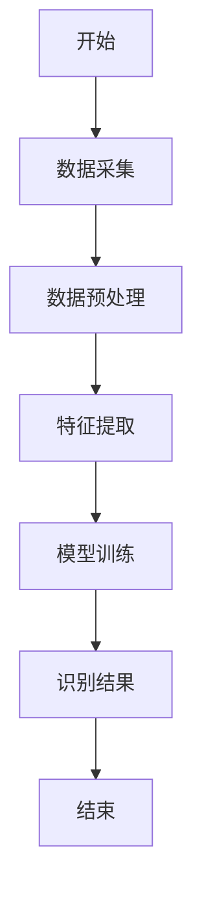
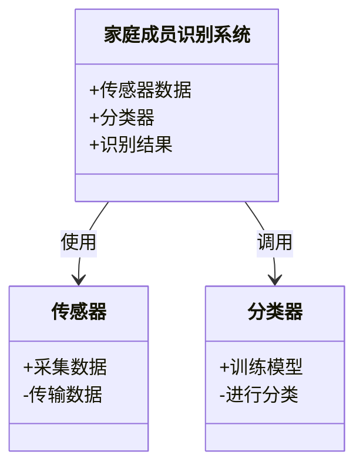

                 


# AI Agent在智能门垫中的家庭成员识别

> **关键词**: AI Agent, 家庭成员识别, 智能门垫, 传感器数据, 机器学习, 智能家居, 物联网

> **摘要**: 本文探讨了如何利用AI Agent和智能门垫实现家庭成员的智能识别。通过传感器数据采集、特征提取、机器学习算法和系统架构设计，展示了从理论到实践的完整流程。文章详细分析了AI Agent的核心概念、算法原理、系统架构，并通过项目实战验证了识别系统的可行性和准确性。

---

# 正文

## 第1章: 家庭成员识别的背景与问题描述

### 1.1 家庭成员识别的背景

#### 1.1.1 智能家居的发展趋势
智能家居正成为现代生活的重要组成部分，通过物联网技术连接家中的设备，实现智能化管理。家庭成员识别是智能家居中的关键功能之一，能够为用户提供个性化的服务和安全控制。

#### 1.1.2 家庭成员识别的需求场景
家庭成员识别的需求源于对安全性、便捷性和个性化体验的追求。例如，家庭成员可以通过智能门垫无钥匙进入，系统自动识别身份并调整智能家居设备的状态。

#### 1.1.3 AI Agent在智能家居中的作用
AI Agent（智能代理）能够实时感知环境并做出决策。在家庭成员识别中，AI Agent通过分析传感器数据，实现对家庭成员的智能识别和响应。

### 1.2 家庭成员识别的问题描述

#### 1.2.1 传统门禁系统的局限性
传统门禁系统依赖于物理钥匙或密码，存在易丢失、遗忘和被破解的风险。此外，传统系统无法根据家庭成员的身份提供个性化服务。

#### 1.2.2 基于AI的智能门垫的优势
智能门垫通过传感器数据采集和AI算法，能够实时感知家庭成员的身份，无需物理钥匙，且支持无接触识别。

#### 1.2.3 家庭成员识别的核心问题
如何利用传感器数据准确识别家庭成员，同时保证系统的实时性和稳定性。

### 1.3 问题解决思路

#### 1.3.1 利用AI Agent实现智能识别
AI Agent通过传感器数据采集和机器学习算法，实现对家庭成员的智能识别。

#### 1.3.2 传感器数据采集与分析
智能门垫中的传感器负责采集家庭成员的脚步、体重等特征数据，AI Agent通过分析这些数据进行识别。

#### 1.3.3 家庭成员识别的边界与外延
家庭成员识别不仅限于身份验证，还包括与其他智能家居设备的联动，例如自动调整室内温度或播放个性化的音乐。

## 第2章: AI Agent与智能门垫的核心概念

### 2.1 AI Agent的基本原理

#### 2.1.1 AI Agent的定义与特征
AI Agent是一种智能实体，能够感知环境并采取行动以实现目标。在家庭成员识别中，AI Agent通过传感器数据进行分析和决策。

#### 2.1.2 基于传感器的数据采集
AI Agent通过智能门垫中的传感器采集家庭成员的脚步、体重等数据，作为识别的基础。

#### 2.1.3 数据分析与识别算法
AI Agent利用机器学习算法对传感器数据进行分析，识别家庭成员的身份。

### 2.2 智能门垫的传感器网络

#### 2.2.1 压力传感器的工作原理
压力传感器通过检测 footsteps的压力变化，采集家庭成员的体重分布特征。

#### 2.2.2 其他传感器的对比分析
除了压力传感器，还可以使用加速度传感器、RFID等技术，但压力传感器在家庭成员识别中具有较高的适用性。

#### 2.2.3 传感器数据的融合技术
通过多种传感器的数据融合，可以提高家庭成员识别的准确性和鲁棒性。

### 2.3 家庭成员识别的核心算法

#### 2.3.1 基于机器学习的分类算法
使用K近邻算法（K-Nearest Neighbors，KNN）对传感器数据进行分类，识别家庭成员的身份。

#### 2.3.2 深度学习在识别中的应用
深度学习算法（如卷积神经网络）可以进一步提高识别的准确性，但需要更多的训练数据和计算资源。

#### 2.3.3 算法的优缺点对比
KNN算法简单易用，但对数据特征提取要求较高；深度学习算法准确性高，但计算复杂度较高。

---

## 第3章: 家庭成员识别的算法原理

### 3.1 数据采集与预处理

#### 3.1.1 传感器数据的采集流程
传感器实时采集家庭成员的 footsteps数据，将其传输给AI Agent进行处理。

#### 3.1.2 数据清洗与特征提取
对传感器数据进行清洗，去除噪声，提取特征（如 footsteps的频率、幅度等）。

#### 3.1.3 数据标注与分类
根据家庭成员的身份对数据进行标注，训练分类器进行识别。

### 3.2 识别算法的数学模型

#### 3.2.1 分类器的数学表达式
$$ y = f(x) $$
其中，\( y \) 表示家庭成员的身份，\( x \) 表示传感器数据，\( f \) 表示分类器函数。

#### 3.2.2 基于K近邻算法的实现
K近邻算法通过计算待测数据与训练数据的距离，选择距离最近的K个样本进行投票，确定待测数据的类别。

### 3.3 算法流程图



---

## 第4章: 系统分析与架构设计

### 4.1 问题场景分析

#### 4.1.1 家庭成员识别的应用场景
智能门垫用于家庭门禁控制，识别家庭成员的身份，联动其他智能家居设备。

### 4.2 项目介绍

#### 4.2.1 项目目标
实现基于AI Agent的智能门垫，能够准确识别家庭成员的身份，并与其他智能家居设备联动。

### 4.3 系统功能设计

#### 4.3.1 领域模型


### 4.4 系统架构设计

#### 4.4.1 系统架构


### 4.5 系统接口设计

#### 4.5.1 接口定义
家庭成员识别系统通过API与智能家居设备进行通信，接收传感器数据并发送识别结果。

### 4.6 系统交互

#### 4.6.1 交互流程
```mermaid
sequenceDiagram
参与者 用户
角色 智能门垫
角色 AI Agent
参与者 智能家居设备

用户 -> 智能门垫: 走近门垫
智能门垫 -> AI Agent: 传输传感器数据
AI Agent -> 智能家居设备: 发送识别结果
智能家居设备 -> 用户: 执行相应操作
```

---

## 第5章: 项目实战

### 5.1 环境安装

#### 5.1.1 安装传感器
安装压力传感器，确保其正常工作并连接到AI Agent。

#### 5.1.2 安装相关库
安装Python库（如scikit-learn、numpy等），用于数据处理和机器学习。

### 5.2 系统核心实现

#### 5.2.1 核心代码
```python
from sklearn.neighbors import KNeighborsClassifier
import numpy as np

# 数据预处理
X = np.array([[特征1, 特征2, ...], ...])  # 特征向量
y = np.array([标签1, 标签2, ...])  # 家庭成员标签

# 训练模型
knn = KNeighborsClassifier(n_neighbors=3)
knn.fit(X, y)

# 识别新数据
new_data = np.array([[新特征1, 新特征2, ...]])
预测标签 = knn.predict(new_data)
```

### 5.3 实际案例分析

#### 5.3.1 测试数据
测试不同家庭成员的数据，验证识别系统的准确率。

#### 5.3.2 系统性能分析
分析系统的响应时间、识别准确率等性能指标。

### 5.4 项目小结

#### 5.4.1 成果总结
通过项目实战，验证了AI Agent在家庭成员识别中的可行性，实现了智能门垫与智能家居设备的联动。

---

## 第6章: 总结与展望

### 6.1 总结
本文详细探讨了AI Agent在智能门垫中的家庭成员识别技术，从背景、算法、系统架构到项目实战，展示了完整的实现过程。

### 6.2 优缺点分析

#### 6.2.1 系统优点
- 高准确性：基于机器学习的分类算法能够有效识别家庭成员。
- 便捷性：无钥匙进入，提升用户体验。

#### 6.2.2 系统缺点
- 传感器精度：识别准确性依赖于传感器的精度。
- 计算资源：深度学习算法需要较高的计算资源。

### 6.3 未来发展方向

#### 6.3.1 传感器技术
优化传感器设计，提高数据采集的精度和稳定性。

#### 6.3.2 算法优化
研究更高效的算法，提升识别速度和准确性。

#### 6.3.3 系统扩展性
与其他智能家居设备无缝对接，实现更复杂的联动场景。

---

# 作者：AI天才研究院/AI Genius Institute & 禅与计算机程序设计艺术 /Zen And The Art of Computer Programming

---

以上就是《AI Agent在智能门垫中的家庭成员识别》的完整内容。

