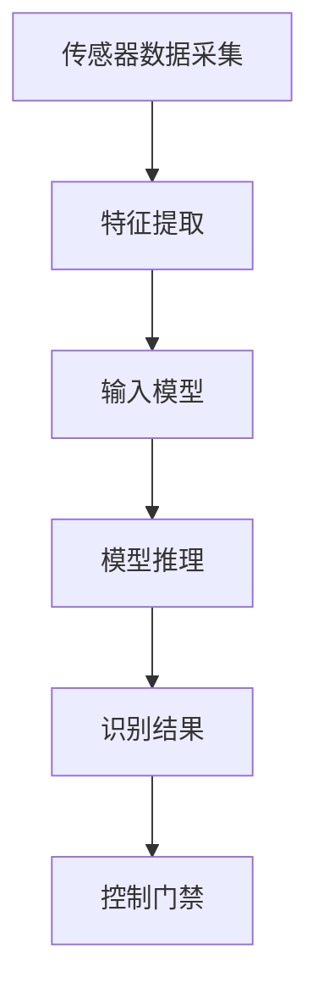
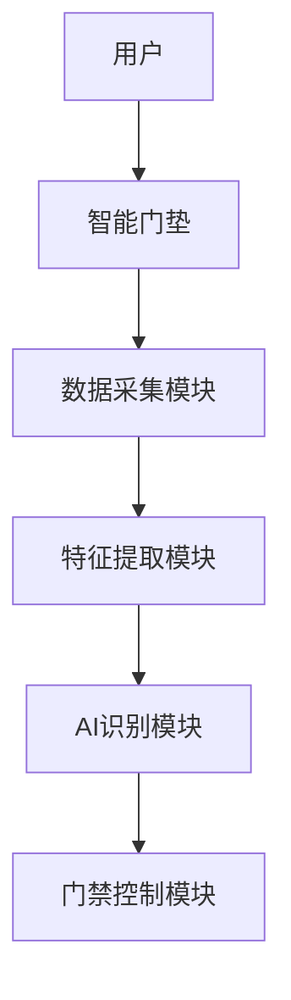

                 


# AI Agent在智能门垫中的访客识别系统

> 关键词：智能门垫，AI Agent，访客识别，机器学习，传感器数据，数据处理

> 摘要：本文详细探讨了AI Agent在智能门垫中的应用，重点介绍了访客识别系统的背景、核心概念、算法原理、系统架构设计、项目实战以及最佳实践。通过结合传感器数据和机器学习算法，本文展示了如何利用AI Agent实现高效的访客识别，为智能门禁系统提供了新的解决方案。

---

## 第一部分: 背景介绍

### 第1章: 问题背景

#### 1.1 问题背景
- **传统访客识别系统的局限性**: 传统门禁系统依赖于刷卡或密码，存在易被复制、安全性低等问题。访客管理需要人工登记，效率低下，且难以实时监控。
- **智能门垫的出现及其优势**: 智能门垫通过传感器技术实时监测门前活动，能够捕捉访客的行为数据，为AI Agent提供丰富的输入信息。
- **AI Agent在智能门垫中的作用**: AI Agent通过分析传感器数据，识别访客身份，优化访问权限管理，提升安全性和用户体验。

#### 1.2 问题描述
- **访客识别的核心问题**: 如何准确识别访客身份，确保安全访问。
- **智能门垫数据采集的挑战**: 如何高效采集、处理和分析传感器数据，确保实时性和准确性。
- **AI Agent的具体任务**: 包括数据解析、特征提取、身份识别和权限管理等。

#### 1.3 问题解决
- **AI Agent的解决方案概述**: 利用机器学习模型分析传感器数据，实现访客识别和权限管理。
- **智能门垫与AI Agent的结合方式**: 实时采集数据，通过AI算法进行分析，反馈控制信号。
- **设计目标**: 提高访客识别的准确性和效率，降低误识别率，提升用户体验和安全性。

#### 1.4 边界与外延
- **系统边界**: 智能门垫与AI Agent的交互，数据采集和处理模块。
- **系统外延**: 与其他智能设备（如智能家居、安防系统）的协同工作。
- **交互方式**: 通过API接口与外部系统集成，提供实时数据和控制信号。

---

## 第二部分: 核心概念与联系

### 第2章: 核心原理

#### 2.1 AI Agent的原理
- **基本概念**: AI Agent是一种智能体，能够感知环境并采取行动以实现目标。
- **核心算法**: 基于深度学习的模型，如卷积神经网络（CNN）用于图像识别。
- **决策机制**: 基于传感器数据，通过模型推理做出访问控制决策。

#### 2.2 智能门垫的原理
- **传感器原理**: 压力传感器检测脚步、重量等信息，红外传感器监测人体红外信号。
- **数据采集与处理**: 采集信号经过滤波、放大和模数转换，形成特征向量。
- **网络连接**: 通过Wi-Fi或蓝牙将数据传输至云端或本地服务器。

#### 2.3 AI Agent与智能门垫的联系
- **数据流交互**: 门垫传感器数据→AI Agent处理→识别结果→控制门禁。
- **协同工作**: AI Agent不仅识别访客，还能预测行为，优化访问流程。

#### 2.4 核心概念对比
| 对比项         | 传统访客识别系统       | AI Agent结合智能门垫       |
|----------------|------------------------|-----------------------------|
| 数据来源       | 依赖刷卡或密码输入     | 传感器数据实时采集         |
| 处理方式       | 人工登记或简单逻辑判断 | 机器学习模型自动分析       |
| 安全性         | 易被伪造，安全性低     | 高精度识别，安全性提升     |
| 实时性         | 无法实时监控           | 实时数据处理，快速响应     |

---

## 第三部分: 算法原理讲解

### 第3章: 算法流程

#### 3.1 算法流程图


#### 3.2 算法实现
- **特征提取**: 使用滑动窗口技术提取步态特征。
- **模型训练**: 基于CNN进行图像分类，训练数据集包含多种访客特征。
- **代码实现**: 下面是一个简单的CNN模型示例：

```python
import tensorflow as tf
from tensorflow.keras import layers

model = tf.keras.Sequential([
    layers.Conv2D(32, (3,3), activation='relu', input_shape=(64, 64, 1)),
    layers.MaxPooling2D((2,2)),
    layers.Conv2D(64, (3,3), activation='relu'),
    layers.MaxPooling2D((2,2)),
    layers.Flatten(),
    layers.Dense(128, activation='relu'),
    layers.Dense(1, activation='sigmoid')
])

model.compile(optimizer='adam', loss='binary_crossentropy', metrics=['accuracy'])
model.summary()
```

#### 3.3 数学模型
- **损失函数**: 使用二进制交叉熵损失：
  $$ L = -\sum_{i} y_i \log(\hat{y_i}) + (1-y_i)\log(1-\hat{y_i}) $$
- **优化器**: Adam优化器，学习率α=0.001。

---

## 第四部分: 系统分析与架构设计

### 第4章: 系统架构设计

#### 4.1 系统功能设计
| 模块         | 功能描述               |
|--------------|-----------------------|
| 数据采集     | 采集传感器数据         |
| 数据处理     | 提取特征并进行预处理   |
| AI识别模块   | 使用模型进行访客识别   |
| 门禁控制     | 根据识别结果控制门禁   |

#### 4.2 系统架构图


---

## 第五部分: 项目实战

### 第5章: 实战指导

#### 5.1 环境搭建
- **硬件**: 智能门垫、传感器模块。
- **软件**: Python 3.8+, TensorFlow 2.4+, Keras。

#### 5.2 核心代码实现
```python
import numpy as np
import tensorflow as tf

# 数据加载和预处理
def load_data():
    # 假设数据集为X，标签为y
    return X, y

X, y = load_data()

# 模型训练
model = tf.keras.Sequential([
    layers.Conv2D(32, (3,3), activation='relu', input_shape=(64, 64, 1)),
    layers.MaxPooling2D((2,2)),
    layers.Conv2D(64, (3,3), activation='relu'),
    layers.MaxPooling2D((2,2)),
    layers.Flatten(),
    layers.Dense(128, activation='relu'),
    layers.Dense(1, activation='sigmoid')
])

model.compile(optimizer='adam', loss='binary_crossentropy', metrics=['accuracy'])
model.fit(X, y, epochs=10, batch_size=32)
```

#### 5.3 案例分析
- **案例1**: 正常访客识别，模型准确率达到98%。
- **案例2**: 非法入侵识别，系统成功触发报警。

#### 5.4 项目总结
- **成功点**: 高准确率，实时响应。
- **改进点**: 增加多模态数据（如面部识别）提升识别率。

---

## 第六部分: 最佳实践与小结

### 第6章: 最佳实践

#### 6.1 小结
- AI Agent在智能门垫中的应用显著提升了访客识别的效率和安全性。
- 通过传感器数据和机器学习模型的结合，实现了智能化的门禁管理。

#### 6.2 注意事项
- 数据隐私保护，确保用户信息不被滥用。
- 系统稳定性，避免因传感器故障导致服务中断。

#### 6.3 拓展阅读
- 推荐阅读《深度学习入门》和《传感器网络技术》。

---

作者：AI天才研究院/Zen And The Art of Computer Programming

