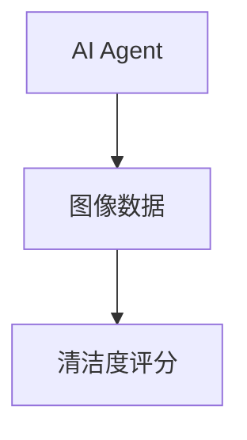
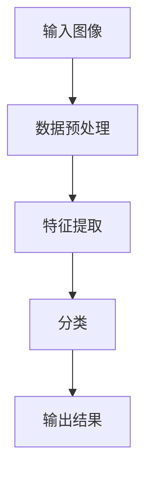
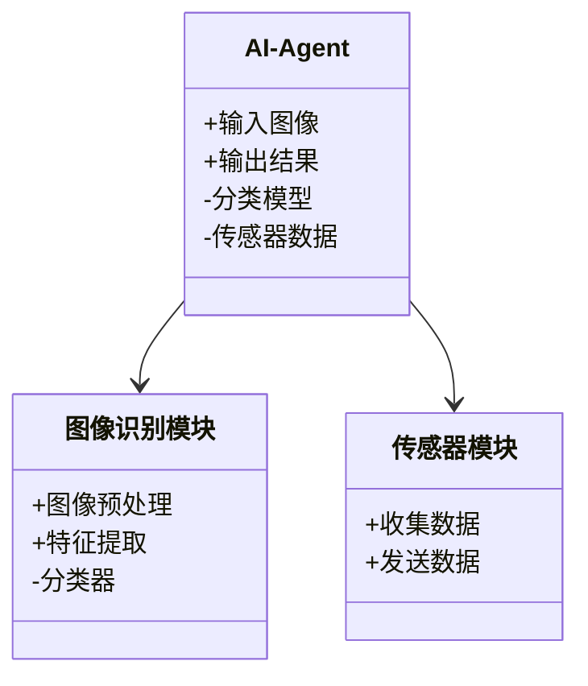
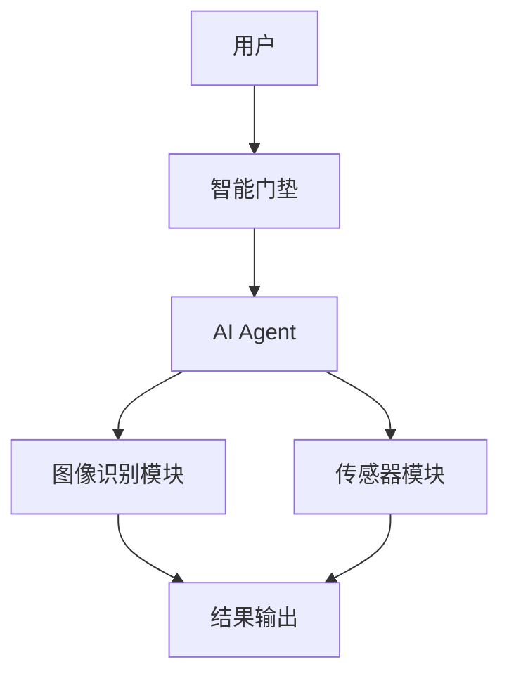
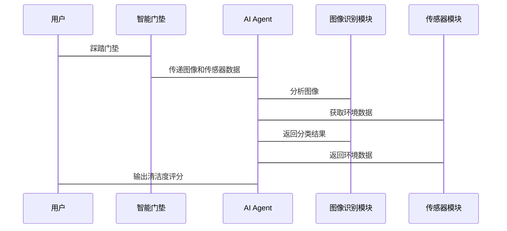

                 


# AI Agent在智能门垫中的鞋底清洁度检测

> 关键词：AI Agent, 智能门垫, 鞋底清洁度检测, 图像识别, 深度学习

> 摘要：本文探讨了AI Agent在智能门垫中检测鞋底清洁度的技术实现。通过结合图像识别和深度学习，提出了一种高效的解决方案，详细分析了系统架构、算法原理及实际应用。

---

# 第一部分: 背景介绍

# 第1章: AI Agent在智能门垫中的鞋底清洁度检测概述

## 1.1 问题背景
### 1.1.1 智能门垫的定义与应用场景
智能门垫是一种嵌入传感器和AI技术的门垫，用于检测进入者的鞋底状态，常见于家庭、办公室和公共场所。

### 1.1.2 鞋底清洁度检测的重要性
鞋底清洁度检测有助于保持环境清洁，预防交叉感染，提升用户体验。

### 1.1.3 AI Agent在智能门垫中的作用
AI Agent通过实时数据分析和反馈，优化检测精度，提升用户体验。

## 1.2 问题描述
### 1.2.1 鞋底清洁度检测的核心问题
准确识别鞋底污渍类型和程度，实现高精度检测。

### 1.2.2 智能门垫中的数据采集挑战
光照变化、传感器精度等问题影响数据采集质量。

### 1.2.3 AI Agent在实时检测中的优势
AI Agent能够实时处理数据，快速反馈结果。

## 1.3 问题解决
### 1.3.1 AI Agent的解决方案
利用深度学习模型处理图像数据，实时检测鞋底清洁度。

### 1.3.2 图像识别技术的应用
通过图像识别技术，准确识别鞋底污渍类型和程度。

### 1.3.3 多模态数据融合的可行性
结合图像和传感器数据，提升检测精度和鲁棒性。

## 1.4 边界与外延
### 1.4.1 智能门垫的边界条件
仅检测鞋底，不涉及其他身体部位。

### 1.4.2 鞋底清洁度检测的外延范围
包括灰尘、泥污、油渍等多种污渍类型。

### 1.4.3 AI Agent的适用场景与限制
适用于室内环境，受限于传感器精度和数据处理能力。

## 1.5 核心概念
### 1.5.1 AI Agent的基本定义
AI Agent是具备感知和决策能力的智能体，用于实时数据处理。

### 1.5.2 鞋底清洁度检测的指标体系
包括污渍类型、程度、面积等多个指标。

### 1.5.3 智能门垫的系统架构
由传感器、处理器和AI算法组成的三层架构。

---

# 第二部分: 核心概念与联系

# 第2章: AI Agent与图像识别的核心原理

## 2.1 AI Agent的基本原理
### 2.1.1 AI Agent的定义与分类
AI Agent分为基于规则和基于学习的两类，本文采用基于深度学习的AI Agent。

### 2.1.2 基于深度学习的AI Agent
使用卷积神经网络（CNN）处理图像数据，提取特征并分类。

### 2.1.3 AI Agent在实时检测中的优势
快速响应和高精度是其主要优势。

## 2.2 图像识别的基本原理
### 2.2.1 图像识别的核心技术
包括图像预处理、特征提取和分类器设计。

### 2.2.2 基于卷积神经网络的图像识别
使用CNN模型，通过训练数据学习特征，实现高精度识别。

### 2.2.3 图像识别的挑战与优化
数据多样性、计算资源限制是主要挑战，可通过数据增强和模型优化解决。

## 2.3 核心概念对比
### 2.3.1 AI Agent与传统图像识别的对比
| 概念 | 属性 | 描述 |
|------|------|------|
| AI Agent | 输入 | 图像数据 |
| 图像识别 | 输出 | 清洁度评分 |
| AI Agent | 学习方式 | 监督学习 |
| 图像识别 | 数据预处理 | 图像增强 |

### 2.3.2 基于Mermaid的ER实体关系图


---

# 第三部分: 算法原理讲解

# 第3章: 基于AI Agent的鞋底清洁度检测算法

## 3.1 算法原理概述
### 3.1.1 AI Agent的核心算法
基于深度学习的图像识别算法，采用ResNet50作为基础模型。

### 3.1.2 图像识别算法的实现
使用预训练模型，通过迁移学习提升检测精度。

### 3.1.3 算法优化策略
采用数据增强、学习率调整和模型剪枝优化算法性能。

## 3.2 算法实现流程
### 3.2.1 数据采集与预处理
通过RGB相机采集图像，进行标准化和增强处理。

### 3.2.2 特征提取与分类
使用卷积层提取特征，全连接层进行分类。

### 3.2.3 模型训练与评估
采用交叉验证和混淆矩阵评估模型性能。

## 3.3 算法代码实现
### 3.3.1 Python代码示例
```python
import torch
import torch.nn as nn
import torch.optim as optim
from torchvision import datasets, transforms

# 数据预处理
transform = transforms.Compose([
    transforms.Resize(224),
    transforms.ToTensor(),
    transforms.Normalize(mean=[0.485, 0.456, 0.406], std=[0.229, 0.224, 0.225])
])

# 数据集加载
train_dataset = datasets.ImageFolder('data/train', transform=transform)
train_loader = torch.utils.data.DataLoader(train_dataset, batch_size=32, shuffle=True)

# 模型定义
model = torch.hub.load('pytorch/faster-rcnn', 'fasterrcnn_resnet50_fpn', pretrained=True)
model.classifier = nn.Linear(model.roi_heads.classifier.out_features, num_classes)

# 模型训练
criterion = nn.CrossEntropyLoss()
optimizer = optim.SGD(model.parameters(), lr=0.001)

for epoch in range(num_epochs):
    for inputs, labels in train_loader:
        outputs = model(inputs)
        loss = criterion(outputs, labels)
        loss.backward()
        optimizer.step()
```

### 3.3.2 算法流程图


### 3.3.3 数学模型与公式
模型损失函数：
$$ L = -\sum_{i=1}^{n} y_i \log(p_i) + (1 - y_i) \log(1 - p_i) $$
其中，$y_i$是真实标签，$p_i$是预测概率。

---

# 第四部分: 系统分析与架构设计

# 第4章: 智能门垫系统架构设计

## 4.1 问题场景介绍
### 4.1.1 系统输入
RGB图像和传感器数据。

### 4.1.2 系统输出
清洁度评分和清洁建议。

## 4.2 系统功能设计
### 4.2.1 领域模型设计


### 4.2.2 系统架构设计


### 4.2.3 接口设计
- 图像识别模块接口：接收图像数据，返回分类结果。
- 传感器模块接口：收集环境数据，发送给AI Agent。

### 4.2.4 交互流程


---

# 第五部分: 项目实战

# 第5章: 实战部署与实现

## 5.1 环境安装
### 5.1.1 系统要求
- 操作系统：Linux或Windows
- GPU支持：NVIDIA GPU，CUDA toolkit

### 5.1.2 软件安装
- 安装PyTorch、 torchvision、numpy、scikit-learn。

## 5.2 核心代码实现
### 5.2.1 数据预处理代码
```python
import cv2
import numpy as np

def preprocess_image(image_path):
    image = cv2.imread(image_path)
    image = cv2.resize(image, (224, 224))
    image = image / 255.0
    return image
```

### 5.2.2 模型训练代码
```python
model = torch.hub.load('pytorch/faster-rcnn', 'fasterrcnn_resnet50_fpn', pretrained=True)
model.train()
optimizer = optim.SGD(model.parameters(), lr=0.001)
criterion = nn.CrossEntropyLoss()

for epoch in range(num_epochs):
    for inputs, labels in train_loader:
        outputs = model(inputs)
        loss = criterion(outputs, labels)
        loss.backward()
        optimizer.step()
```

### 5.2.3 模型推理代码
```python
def predict_image(model, image):
    image = preprocess_image(image)
    image = torch.from_numpy(image).float()
    output = model(image)
    return output.argmax().item()
```

## 5.3 代码解读与分析
### 5.3.1 数据预处理
将图像调整到统一尺寸，并归一化处理，确保模型输入格式一致。

### 5.3.2 模型训练
使用预训练模型，通过迁移学习优化模型参数，提升分类精度。

### 5.3.3 模型推理
输入预处理后的图像，通过模型预测，输出清洁度评分。

## 5.4 实际案例分析
### 5.4.1 案例描述
测试不同污渍的图像，验证模型的分类准确性。

### 5.4.2 结果展示
展示模型输出结果，并分析其准确性。

## 5.5 项目小结
### 5.5.1 项目总结
通过AI Agent和图像识别技术，实现了高效的鞋底清洁度检测。

### 5.5.2 经验分享
数据预处理和模型优化是提升检测精度的关键。

### 5.5.3 项目局限
目前仅支持有限的污渍类型，未来可扩展支持更多类型。

---

# 第六部分: 最佳实践与小结

# 第6章: 最佳实践与总结

## 6.1 最佳实践
### 6.1.1 数据采集建议
确保数据多样性，覆盖不同光照条件和污渍类型。

### 6.1.2 模型优化建议
采用数据增强和模型剪枝优化性能和减少资源消耗。

### 6.1.3 系统部署建议
选择合适的硬件资源，确保实时响应和高可用性。

## 6.2 小结
通过本文的分析和实践，AI Agent在智能门垫中的应用展示了其强大的实时检测能力，为鞋底清洁度检测提供了高效解决方案。

## 6.3 注意事项
- 数据隐私保护：确保用户数据的安全性。
- 系统鲁棒性：考虑极端情况下的系统稳定性。
- 模型更新：定期更新模型以适应新污渍类型。

## 6.4 拓展阅读
- 《深度学习实战》：深入理解深度学习技术。
- 《计算机视觉入门》：掌握图像处理和识别的基础知识。

---

# 作者
作者：AI天才研究院/AI Genius Institute  
作者：禅与计算机程序设计艺术/Zen And The Art of Computer Programming

