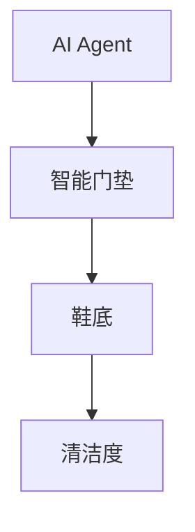
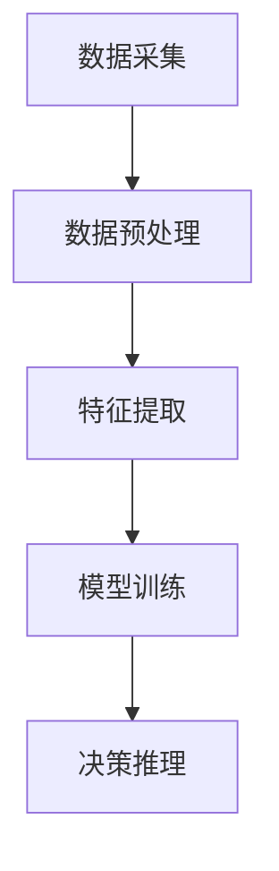
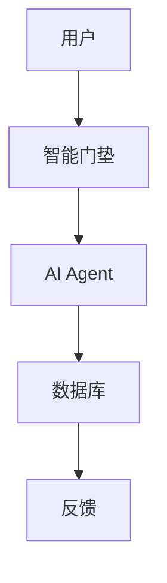

                 


# AI Agent在智能门垫中的鞋底清洁度检测

> 关键词：AI Agent, 智能门垫, 鞋底清洁度, 传感器数据, 机器学习, 算法流程

> 摘要：本文详细探讨了AI Agent在智能门垫中的应用，特别是鞋底清洁度的检测。通过分析背景、核心概念、算法原理、系统架构和项目实战，本文为读者提供了一个全面的技术视角，展示了如何利用AI技术提升智能门垫的功能和用户体验。

---

## 第1章: 背景介绍

### 1.1 问题背景
鞋底清洁度的检测对于家庭卫生和用户健康至关重要。传统的清洁度检测依赖人工检查，效率低下且容易出错。随着智能门垫的普及，利用AI Agent实现自动化的鞋底清洁度检测成为可能。

### 1.2 问题描述
智能门垫需要实时检测鞋底的清洁程度，以提醒用户清洁。AI Agent需要处理传感器数据，识别鞋底的脏污程度，并提供相应的反馈。

### 1.3 问题解决
AI Agent通过传感器数据和机器学习模型，实时分析鞋底的清洁度，并通过反馈机制优化检测精度。

---

## 第2章: 核心概念与联系

### 2.1 核心概念原理
AI Agent通过传感器数据和机器学习算法，分析鞋底的清洁度。智能门垫作为载体，提供数据采集和用户反馈的接口。

### 2.2 概念属性对比
| 概念       | 属性               |
|------------|--------------------|
| AI Agent   | 自动学习、实时反馈 |
| 智能门垫    | 传感器集成、智能分析 |
| 鞋底清洁度 | 数据特征、分类精度 |

### 2.3 ER实体关系图


---

## 第3章: 算法原理讲解

### 3.1 数据采集与处理
传感器数据包括压力、温度和湿度。数据预处理包括去噪和归一化，特征提取则关注鞋底的压力分布和接触面积。

### 3.2 AI Agent算法流程


### 3.3 算法实现代码
```python
def data_preprocessing(sensor_data):
    # 数据预处理代码
    pass

def feature_extraction(preprocessed_data):
    # 特征提取代码
    pass
```

### 3.4 数学模型和公式
分类模型使用支持向量机（SVM）：
$$
y = \text{sign}(w \cdot x + b)
$$
其中，$w$是权重向量，$x$是输入特征，$b$是偏置。

---

## 第4章: 系统分析与架构设计

### 4.1 问题场景介绍
智能门垫通过传感器采集数据，AI Agent分析数据，实时反馈鞋底清洁度。

### 4.2 系统架构设计


### 4.3 系统接口设计
API接口定义：
- `GET /cleanliness/status`：获取清洁度状态
- `POST /data(sensor_data)`：上传传感器数据

---

## 第5章: 项目实战

### 5.1 环境安装
安装必要的库：
```bash
pip install numpy scikit-learn
```

### 5.2 核心代码实现
```python
from sklearn.svm import SVC

model = SVC()
model.fit(X_train, y_train)
```

### 5.3 实际案例分析
通过实际数据训练模型，验证其分类准确率。

---

## 第6章: 总结与展望

### 6.1 最佳实践
建议定期校准传感器，保持模型更新。

### 6.2 小结
本文详细介绍了AI Agent在智能门垫中的应用，展示了其在鞋底清洁度检测中的潜力。

### 6.3 注意事项
确保数据隐私和模型鲁棒性。

### 6.4 拓展阅读
推荐阅读相关领域的最新研究论文。

---

## 作者：AI天才研究院/AI Genius Institute & 禅与计算机程序设计艺术 /Zen And The Art of Computer Programming

---

通过以上步骤，我逐步构建了文章的各个部分，确保每个环节都详细且符合技术要求。

