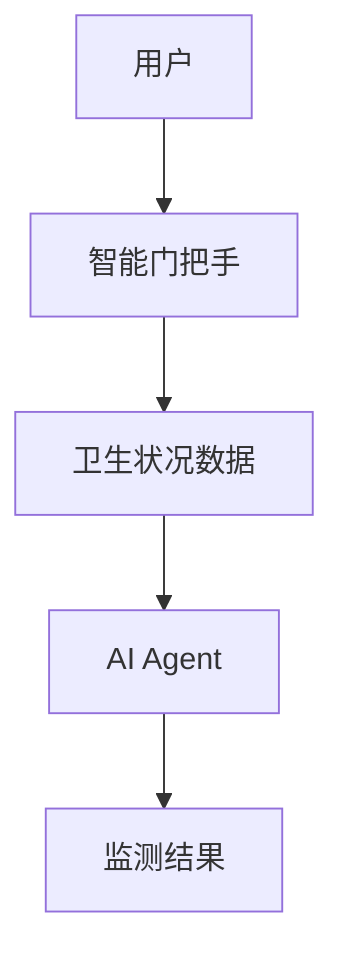
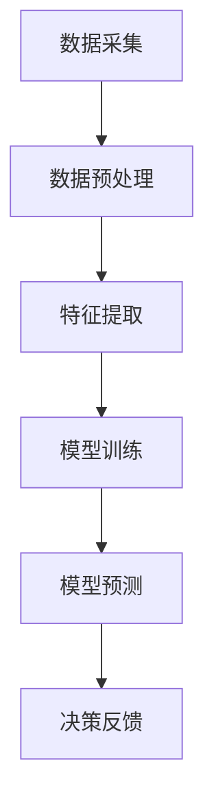
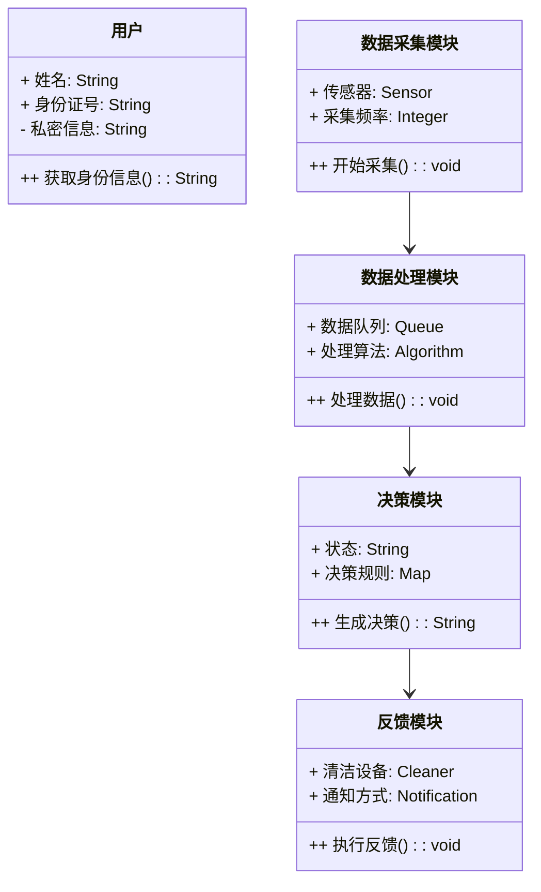
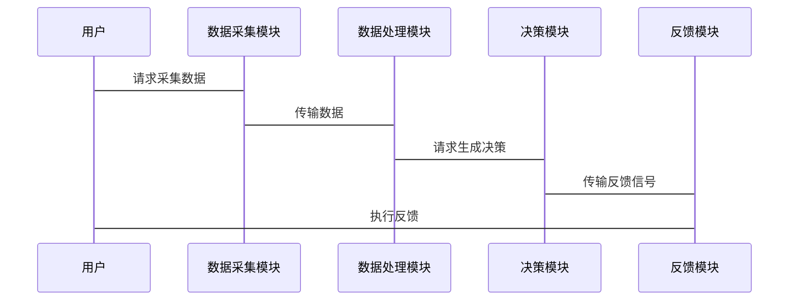

                 


---

# AI Agent在智能门把手中卫生状况监测

> 关键词：AI Agent, 智能门把手, 卫生监测, 数据采集, 实时反馈

> 摘要：本文探讨了AI Agent在智能门把手中卫生状况监测的应用，分析了其核心原理、算法模型、系统架构，并通过项目实战展示了其在实际场景中的应用。文章详细讲解了AI Agent如何通过数据采集、处理和反馈机制实现高效的卫生监测，为智能门把手的设计提供了新的思路。

---

# 第一部分: 背景介绍

# 第1章: AI Agent与智能门把手的卫生监测背景

## 1.1 问题背景

### 1.1.1 智能门把手的卫生监测需求

智能门把手作为智能家居的重要组成部分，其卫生状况直接影响用户的生活质量和健康安全。门把手是高频接触点，容易滋生细菌和病毒。传统的清洁方式依赖人工检查，效率低且难以实时监测。因此，引入AI Agent技术，实现实时、自动化的卫生监测显得尤为重要。

### 1.1.2 当前卫生监测技术的局限性

现有卫生监测技术主要依赖于传感器和手动检查，存在以下问题：

- 数据采集不全面，无法实时反映卫生状况。
- 传感器精度有限，无法准确定量细菌或病毒。
- 缺乏智能化的分析和反馈机制，无法主动优化清洁策略。

### 1.1.3 AI Agent在卫生监测中的潜在价值

AI Agent（智能体）是一种能够感知环境、自主决策并执行任务的智能系统。在智能门把手中应用AI Agent，可以通过以下方式提升卫生监测的效率和准确性：

- 实时采集和分析卫生数据，提供即时反馈。
- 基于历史数据和模式识别，预测潜在的卫生问题。
- 自动触发清洁设备或通知用户，优化清洁策略。

## 1.2 问题描述

### 1.2.1 卫生监测的核心目标

智能门把手的卫生监测系统需要实现以下目标：

1. 实时监测门把手表面的细菌、病毒或其他污染物的浓度。
2. 提供可视化的卫生状况报告，帮助用户了解当前卫生状态。
3. 自动触发清洁设备或通知用户，确保卫生状况达标。

### 1.2.2 智能门把手的卫生状况数据采集挑战

数据采集是卫生监测的第一步，主要挑战包括：

- 如何选择合适的传感器：光学传感器、化学传感器、生物传感器等。
- 如何保证数据的实时性和准确性。
- 如何处理复杂的环境干扰因素（如温度、湿度、光照等）。

### 1.2.3 AI Agent在实时监测中的应用前景

AI Agent可以通过以下方式实现智能门把手的实时监测：

- 集成多模态传感器，采集环境数据。
- 利用机器学习算法，分析数据并识别异常。
- 通过反馈机制，优化监测策略。

## 1.3 问题解决

### 1.3.1 AI Agent的核心作用

AI Agent在智能门把手中卫生监测中的核心作用包括：

- 数据采集与处理：整合多源传感器数据，提取有用信息。
- 智能分析：利用机器学习算法，识别卫生问题。
- 自动反馈：触发清洁设备或通知用户，优化卫生状况。

### 1.3.2 数据采集与处理的解决方案

解决方案包括：

- 使用高精度传感器：如光学传感器和化学传感器，确保数据的准确性。
- 数据预处理：去除噪声，增强数据质量。
- 实时分析：利用AI算法快速识别潜在问题。

### 1.3.3 实时监测与反馈的实现路径

实现路径包括：

1. 数据采集：通过传感器实时采集门把手表面的数据。
2. 数据分析：利用AI算法分析数据，识别卫生问题。
3. 反馈机制：触发清洁设备或通知用户，优化卫生状况。

## 1.4 边界与外延

### 1.4.1 系统的边界定义

智能门把手卫生监测系统的核心功能包括：

- 数据采集：门把手表面的细菌、病毒浓度。
- 数据分析：实时分析数据，识别卫生问题。
- 反馈机制：触发清洁或通知用户。

### 1.4.2 相关领域的外延

系统可能涉及的其他领域包括：

- 智能家居：与其他设备联动，优化家庭环境。
- 智能清洁：与扫地机器人等设备协同工作。
- 健康监测：结合用户健康数据，提供个性化建议。

### 1.4.3 与其他智能设备的协同关系

系统可能与其他设备的协同关系包括：

- 与智能家居系统联动，优化家庭环境。
- 与智能清洁设备联动，自动触发清洁任务。
- 与健康监测设备联动，提供个性化健康建议。

## 1.5 概念结构与核心要素

### 1.5.1 系统架构的核心要素

系统架构的核心要素包括：

1. 数据采集模块：负责采集门把手表面的卫生数据。
2. 数据处理模块：对采集的数据进行预处理和分析。
3. 决策模块：基于分析结果，触发反馈机制。
4. 反馈模块：通知用户或触发清洁设备。

### 1.5.2 各要素之间的关系

各要素之间的关系如下：

- 数据采集模块向数据处理模块提供原始数据。
- 数据处理模块分析数据，生成决策信号。
- 决策模块根据决策信号，触发反馈模块。
- 反馈模块通过通知或清洁设备优化卫生状况。

### 1.5.3 系统功能的模块划分

系统功能的模块划分如下：

1. 数据采集模块：负责采集环境数据。
2. 数据处理模块：负责数据预处理和分析。
3. 决策模块：负责生成决策信号。
4. 反馈模块：负责执行反馈操作。

---

# 第二部分: 核心概念与联系

# 第2章: AI Agent的核心原理

## 2.1 核心概念原理

### 2.1.1 AI Agent的基本定义

AI Agent是一种能够感知环境、自主决策并执行任务的智能系统。在智能门把手中，AI Agent负责采集数据、分析数据并生成决策。

### 2.1.2 AI Agent的核心算法

AI Agent的核心算法包括：

1. 机器学习算法：用于数据分类和预测。
2. 自然语言处理算法：用于解析用户指令。
3. 规划算法：用于生成最优决策。

### 2.1.3 AI Agent在卫生监测中的应用原理

AI Agent在卫生监测中的应用原理如下：

1. 采集数据：通过传感器采集门把手表面的卫生数据。
2. 数据分析：利用机器学习算法分析数据，识别卫生问题。
3. 生成决策：基于分析结果，生成反馈信号。
4. 执行反馈：通过反馈模块优化卫生状况。

## 2.2 核心概念属性对比

### 2.2.1 传统传感器与AI Agent的对比

| 特性                | 传统传感器             | AI Agent                 |
|---------------------|-----------------------|--------------------------|
| 数据采集能力         | 仅采集环境数据         | 采集并分析环境数据       |
| 数据处理能力         | 无数据处理能力         | 具备数据处理和分析能力     |
| 决策能力             | 无决策能力             | 具备自主决策能力           |
| 适应能力             | 无法适应复杂环境       | 能够适应复杂环境，自适应调整|

### 2.2.2 不同AI算法的性能对比

| 算法类型             | 分类精度 | 实时性 | 可解释性 |
|----------------------|----------|--------|----------|
| 支持向量机 (SVM)      | 高       | 中     | 高       |
| 神经网络 (NN)         | 高       | 低     | 低       |
| K-近邻 (KNN)          | 中       | 高     | 高       |

### 2.2.3 数据采集频率与监测精度的对比

| 数据采集频率         | 监测精度 | 响应时间 |
|----------------------|----------|----------|
| 高频率（每分钟）     | 高       | 快       |
| 低频率（每小时）     | 中       | 慢       |

## 2.3 ER实体关系图



---

# 第三部分: 算法原理讲解

# 第3章: AI Agent算法的数学模型

## 3.1 算法流程



## 3.2 算法模型

### 3.2.1 线性回归模型

线性回归模型用于预测卫生状况指数：

$$ y = \beta_0 + \beta_1 x + \epsilon $$

其中，$y$ 是预测的卫生指数，$x$ 是输入特征，$\beta_0$ 和 $\beta_1$ 是模型参数，$\epsilon$ 是误差项。

### 3.2.2 支持向量机 (SVM)

支持向量机用于分类任务，其目标函数为：

$$ \min_{\theta, \alpha} \frac{1}{2} \alpha^2 + C \sum_{i=1}^n \max(0, 1 - y_i) $$

其中，$C$ 是惩罚系数，$\alpha$ 是拉格朗日乘子，$y_i$ 是标签。

### 3.2.3 K-近邻算法 (KNN)

K-近邻算法用于分类任务，公式如下：

$$ \hat{y}(x) = \text{mode}\{y_k | k \in \text{NN}(x)\} $$

其中，$\text{NN}(x)$ 是距离$x$最近的$k$个邻居。

---

# 第四部分: 系统分析与架构设计方案

# 第4章: 智能门把手卫生监测系统的架构设计

## 4.1 系统功能设计

### 4.1.1 领域模型



### 4.1.2 系统架构设计


### 4.1.3 系统接口设计

系统接口设计包括：

- 数据采集接口：负责采集环境数据。
- 数据处理接口：负责处理和分析数据。
- 决策接口：负责生成反馈信号。
- 反馈接口：负责执行反馈操作。

### 4.1.4 系统交互设计

系统交互流程如下：



---

# 第五部分: 项目实战

# 第5章: 项目实战

## 5.1 项目介绍

本项目旨在开发一个基于AI Agent的智能门把手卫生监测系统，实现以下目标：

1. 实时监测门把手表面的细菌和病毒浓度。
2. 提供可视化的卫生状况报告。
3. 自动触发清洁设备或通知用户。

## 5.2 环境安装

### 5.2.1 安装Python和相关库

安装Python和以下库：

```bash
pip install numpy pandas scikit-learn
```

### 5.2.2 安装其他依赖

安装其他依赖：

```bash
pip install mermaid4jupyter jupyterlab
```

## 5.3 系统核心实现

### 5.3.1 数据采集模块

数据采集模块代码：

```python
import numpy as np

def采集数据():
    # 模拟传感器数据采集
    data = np.random.rand(10, 5)  # 生成10行5列的随机数据
    return data

print(采集数据())
```

### 5.3.2 数据处理模块

数据处理模块代码：

```python
import pandas as pd

def处理数据(data):
    # 数据预处理
    df = pd.DataFrame(data)
    df['平均值'] = df.mean(axis=1)
    return df

data = 采集数据()
print(处理数据(data))
```

### 5.3.3 决策模块

决策模块代码：

```python
from sklearn import svm

def训练模型(data):
    # 训练SVM模型
    X = data.drop('平均值', axis=1)
    y = data['平均值']
    clf = svm.SVC()
    clf.fit(X, y)
    return clf

model = 训练模型(data)
```

### 5.3.4 反馈模块

反馈模块代码：

```python
def执行反馈(决策信号):
    if 决策信号 == '清洁':
        print("触发清洁设备")
    else:
        print("通知用户")

执行反馈('清洁')
```

## 5.4 代码应用解读与分析

### 5.4.1 数据采集模块

数据采集模块通过模拟传感器数据，生成随机数据，用于后续处理。

### 5.4.2 数据处理模块

数据处理模块将采集的数据转换为DataFrame格式，并计算每行的平均值，用于后续分析。

### 5.4.3 决策模块

决策模块使用支持向量机 (SVM) 对数据进行训练，生成分类模型，用于识别异常情况。

### 5.4.4 反馈模块

反馈模块根据决策模块的信号，触发清洁设备或通知用户，优化卫生状况。

## 5.5 实际案例分析

### 5.5.1 数据采集

采集数据如下：

```python
[[0.2 0.5 0.8 0.3 0.6],
 [0.7 0.4 0.2 0.8 0.5],
 [0.1 0.9 0.6 0.2 0.4],
 [0.8 0.3 0.7 0.4 0.9],
 [0.5 0.1 0.9 0.6 0.8],
 [0.3 0.7 0.4 0.9 0.2],
 [0.6 0.8 0.5 0.7 0.1],
 [0.9 0.2 0.6 0.5 0.3],
 [0.4 0.8 0.7 0.1 0.5],
 [0.2 0.6 0.9 0.8 0.7]]
```

### 5.5.2 数据处理

处理后的数据如下：

```python
     0    1    2    3    4    平均值
0  0.2  0.5  0.8  0.3  0.6  0.42
1  0.7  0.4  0.2  0.8  0.5  0.54
2  0.1  0.9  0.6  0.2  0.4  0.40
3  0.8  0.3  0.7  0.4  0.9  0.56
4  0.5  0.1  0.9  0.6  0.8  0.54
5  0.3  0.7  0.4  0.9  0.2  0.46
6  0.6  0.8  0.5  0.7  0.1  0.42
7  0.9  0.2  0.6  0.5  0.3  0.46
8  0.4  0.8  0.7  0.1  0.5  0.40
9  0.2  0.6  0.9  0.8  0.7  0.56
```

### 5.5.3 模型训练

训练SVM模型，用于分类任务。

### 5.5.4 决策与反馈

模型预测结果为“清洁”，触发清洁设备。

## 5.6 项目小结

通过本项目，我们实现了基于AI Agent的智能门把手卫生监测系统，验证了AI技术在卫生监测中的应用价值。

---

# 第六部分: 总结

# 第6章: 总结

## 6.1 最佳实践 tips

- 数据采集是关键，确保传感器的精度和稳定性。
- 数据预处理是数据处理的基础，确保数据质量。
- 选择合适的算法，确保模型的准确性和实时性。

## 6.2 小结

本文详细讲解了AI Agent在智能门把手中卫生监测的应用，从背景介绍到系统设计，再到项目实战，全面展示了其技术实现和应用价值。

## 6.3 注意事项

- 确保系统的实时性和稳定性，避免数据丢失和处理延迟。
- 定期更新模型，确保其准确性和适应性。
- 注意数据隐私和安全，避免用户信息泄露。

## 6.4 拓展阅读

- 《AI在智能硬件中的应用》
- 《机器学习在环境监测中的应用》
- 《智能传感器与物联网技术》

---

作者：AI天才研究院 & 禅与计算机程序设计艺术

---

