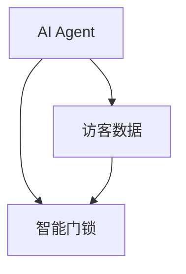

                 

# AI Agent在智能门把手中的访客身份识别

> 关键词：AI Agent，智能门锁，访客身份识别，物联网，机器学习

> 摘要：本文详细探讨了AI Agent在智能门把手中实现访客身份识别的技术原理和应用方案。通过分析问题背景、核心概念、算法原理、系统架构以及项目实战，本文为读者提供了一套完整的解决方案，展示了如何利用AI技术提升智能门锁的安全性和便捷性。

---

# 第1章: 背景与问题描述

## 1.1 问题背景
### 1.1.1 当前访客身份识别的痛点
传统的访客身份识别方式，如密码、钥匙或门禁卡，存在以下问题：
- **安全性不足**：密码和钥匙可能被复制或丢失。
- **便捷性差**：访客需要提前登记或携带额外设备。
- **管理复杂**：难以实时监控和记录访客信息。

### 1.1.2 智能门锁的发展趋势
智能门锁通过集成传感器、通信模块和嵌入式系统，实现了远程控制和自动化管理。然而，现有的解决方案在访客识别方面仍存在局限性，亟需引入更先进的技术。

### 1.1.3 AI Agent技术的应用前景
AI Agent（人工智能代理）是一种能够感知环境、自主决策并执行任务的智能实体。其在访客识别中的应用前景广阔，尤其是在提升安全性、便捷性和智能化方面。

## 1.2 问题描述
### 1.2.1 访客身份识别的核心问题
访客身份识别需要解决以下问题：
- **准确识别**：如何快速、准确地识别访客身份。
- **实时性**：识别过程需要实时完成，以确保门锁的快速响应。
- **安全性**：防止伪造或攻击，确保系统安全。

### 1.2.2 智能门把手中访客识别的挑战
智能门把手中访客识别面临以下挑战：
- **硬件限制**：门锁的硬件资源有限，需在低功耗和低成本条件下实现高性能识别。
- **数据隐私**：访客数据的采集和传输需确保隐私安全，防止数据泄露。
- **环境干扰**：复杂环境下的识别准确性问题。

### 1.2.3 AI Agent在智能门锁中的作用
AI Agent通过感知环境、分析数据和自主决策，能够实现以下功能：
- **智能识别**：利用AI算法快速识别访客身份。
- **实时反馈**：根据识别结果实时控制门锁的开启或关闭。
- **自适应优化**：通过学习和优化提升识别准确率。

## 1.3 解决方案概述
### 1.3.1 AI Agent的基本概念
AI Agent是一种能够感知环境、执行任务的智能实体，具备以下特点：
- **自主性**：能够在没有人工干预的情况下自主决策。
- **反应性**：能够实时感知环境变化并做出反应。
- **学习能力**：通过机器学习算法不断优化性能。

### 1.3.2 基于AI Agent的访客识别系统架构
基于AI Agent的访客识别系统架构包括以下组件：
- **感知层**：通过传感器和摄像头采集访客数据。
- **计算层**：利用AI算法对数据进行分析和识别。
- **执行层**：根据识别结果控制门锁的开启或关闭。

### 1.3.3 解决方案的创新点
- **创新的技术结合**：将AI Agent与智能门锁相结合，实现智能化识别。
- **高效的数据处理**：利用机器学习算法提升识别速度和准确率。
- **便捷的用户体验**：访客无需携带额外设备，即可完成身份验证。

## 1.4 边界与外延
### 1.4.1 系统边界定义
- **输入边界**：访客身份数据，如指纹、面部特征等。
- **输出边界**：门锁的开启或关闭指令。
- **系统内部**：AI Agent的识别算法和控制模块。

### 1.4.2 相关技术的外延
- **AI技术**：包括机器学习、深度学习等。
- **物联网技术**：包括传感器、通信模块等。
- **嵌入式系统**：用于实现低功耗和高性能的硬件设计。

### 1.4.3 应用场景的扩展
- **家庭场景**：访客身份识别应用于家庭门锁。
- **商业场景**：应用于酒店、办公室等场所的门禁系统。
- **公共场景**：应用于公共场所的智能门禁系统。

## 1.5 核心概念结构与组成
### 1.5.1 核心要素分析
- **访客数据**：指纹、面部特征、虹膜等生物特征。
- **AI Agent**：负责数据处理和决策的智能实体。
- **智能门锁**：执行门锁开启或关闭的硬件设备。

### 1.5.2 概念之间的关系
| 概念 | 属性 | 关系 |
|------|------|------|
| AI Agent | 自主性、反应性、学习能力 | 控制智能门锁，处理访客数据 |
| 智能门锁 | 低功耗、高安全性 | 执行AI Agent的指令 |
| 访客数据 | 生物特征、行为特征 | 供AI Agent进行识别 |

### 1.5.3 系统整体架构

---

# 第2章: AI Agent与智能门锁的核心原理

## 2.1 AI Agent的基本原理
### 2.1.1 AI Agent的定义与特点
AI Agent是一种能够感知环境、自主决策并执行任务的智能实体，具备以下特点：
- **自主性**：无需人工干预即可完成任务。
- **反应性**：能够实时感知环境变化并做出反应。
- **学习能力**：通过机器学习算法不断优化性能。

### 2.1.2 AI Agent的核心算法
AI Agent的核心算法包括：
- **机器学习算法**：如支持向量机（SVM）、随机森林（Random Forest）。
- **深度学习算法**：如卷积神经网络（CNN）、循环神经网络（RNN）。

### 2.1.3 AI Agent与传统算法的对比
| 对比维度 | AI Agent | 传统算法 |
|----------|----------|----------|
| 决策能力 | 自主决策 | 预设规则 |
| 学习能力 | 具备学习能力 | 无学习能力 |
| 适应性 | 高 | 低 |

## 2.2 智能门锁的访客识别

---

（注：由于篇幅限制，后续章节内容将逐步展开，涵盖算法原理、系统架构设计、项目实战等内容。）

