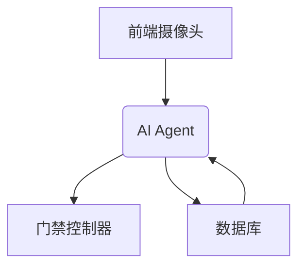

                 


# AI Agent在智能门禁中的异常行为检测

> 关键词：AI Agent，智能门禁，异常行为检测，计算机视觉，机器学习，深度学习，智能安防

> 摘要：本文探讨AI Agent在智能门禁系统中的应用，重点分析如何通过异常行为检测提升安全性。文章涵盖技术背景、核心算法、系统架构设计以及实际案例分析，旨在为读者提供从理论到实践的全面指导。

---

## 第一部分: AI Agent与智能门禁系统基础

### 第1章: AI Agent与智能门禁系统概述

#### 1.1 AI Agent的基本概念

##### 1.1.1 AI Agent的定义与特点

AI Agent（人工智能代理）是指能够感知环境、自主决策并执行任务的智能实体。其特点包括：

- **自主性**：无需外部干预，自主完成任务。
- **反应性**：能实时感知环境变化并做出反应。
- **学习能力**：通过数据和经验不断优化自身行为。
- **社交能力**：能够与其他系统或人类进行交互。

##### 1.1.2 AI Agent的核心功能与应用场景

AI Agent的核心功能包括：

- 数据采集与处理
- 智能决策与推理
- 自动执行任务
- 实时反馈与优化

应用场景广泛，如智能安防、智能家居、自动驾驶等。

##### 1.1.3 AI Agent与智能门禁系统的结合

智能门禁系统通过AI Agent实现智能化管理，AI Agent负责数据采集、行为分析和决策执行，提升系统的安全性、便捷性和智能化水平。

---

#### 1.2 智能门禁系统的工作原理

##### 1.2.1 智能门禁系统的组成与功能

智能门禁系统主要由前端设备（摄像头、传感器）、后端处理系统（AI Agent、数据库）和执行机构（门禁控制器）组成。

- **前端设备**：采集数据，如人脸、行为等。
- **后端系统**：处理数据，识别异常行为。
- **执行机构**：根据AI Agent的决策执行开门或报警。

##### 1.2.2 智能门禁系统的常见技术与挑战

常见技术包括计算机视觉、机器学习、物联网等。挑战主要集中在数据处理的实时性、异常行为的多样性以及系统的安全性。

##### 1.2.3 AI Agent在智能门禁系统中的角色

AI Agent作为系统的核心，负责异常行为的检测、识别和决策，提升系统的智能化水平。

---

## 第二部分: 异常行为检测的核心概念与技术

### 第2章: 异常行为检测的背景与意义

#### 2.1 异常行为检测的基本概念

##### 2.1.1 异常行为的定义与分类

异常行为是指与正常行为模式显著不同的行为。分类包括基于时间序列的异常、基于空间的异常等。

##### 2.1.2 异常行为检测的重要性

在智能门禁系统中，异常行为检测能够及时发现入侵、暴力行为等，提升安全性。

##### 2.1.3 异常行为检测在智能门禁中的应用价值

通过检测异常行为，智能门禁系统能够实现精准的门禁控制和安全预警。

---

## 第三部分: 算法原理与系统架构

### 第3章: 异常行为检测的算法原理

#### 3.1 基于规则的异常行为检测

##### 3.1.1 算法原理

基于规则的检测通过预定义规则匹配异常行为，适用于规则明确的场景。

##### 3.1.2 优缺点分析

优点是简单易实现，缺点是灵活性差，难以应对复杂多变的异常行为。

#### 3.2 基于统计学习的异常行为检测

##### 3.2.1 算法原理

通过统计模型学习正常行为，识别偏离正常的行为模式。

##### 3.2.2 优缺点分析

优点是灵活性高，缺点是计算复杂度较高。

---

### 第4章: 系统架构设计

#### 4.1 系统功能设计

- **数据采集**：通过摄像头采集视频流。
- **行为分析**：使用AI Agent分析视频流，识别异常行为。
- **决策与反馈**：根据分析结果，执行开门或报警。

#### 4.2 系统架构图



---

## 第四部分: 项目实战

### 第5章: 项目实现

#### 5.1 环境配置

- 操作系统：Linux
- 开发工具：Python、OpenCV
- 模型训练框架：TensorFlow

#### 5.2 核心代码实现

```python
import cv2
import numpy as np

def detect_anomaly(frame):
    # 图像预处理
    gray = cv2.cvtColor(frame, cv2.COLOR_BGR2GRAY)
    # 使用预训练模型进行行为检测
    model.predict(gray)
    return result
```

---

## 第五部分: 总结与展望

### 第6章: 总结与展望

#### 6.1 总结

本文详细介绍了AI Agent在智能门禁中的应用，重点讲解了异常行为检测的技术与实现。

#### 6.2 未来展望

未来，随着技术的发展，异常行为检测将更加智能化和精准化，结合边缘计算和物联网技术，实现更高效的智能门禁系统。

---

作者：AI天才研究院/AI Genius Institute & 禅与计算机程序设计艺术 /Zen And The Art of Computer Programming

