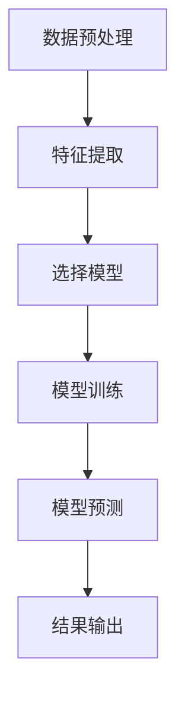
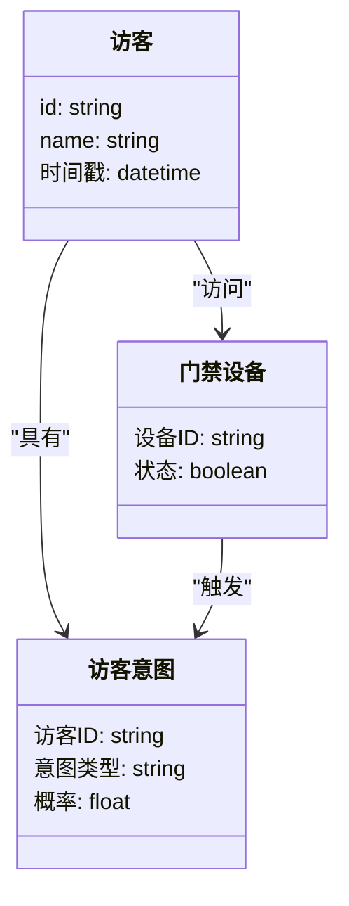
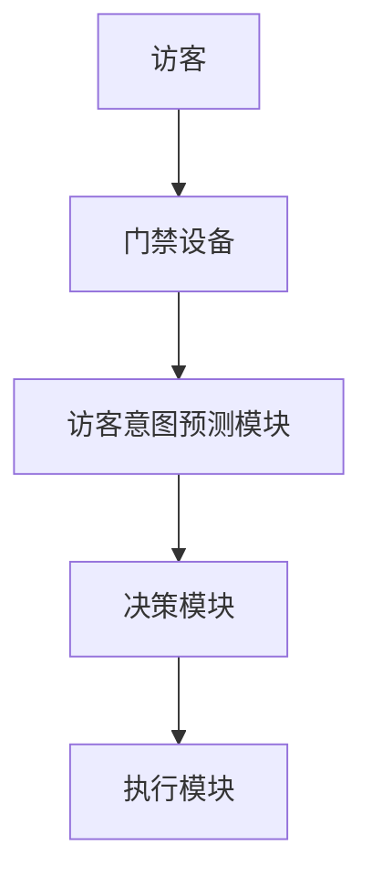
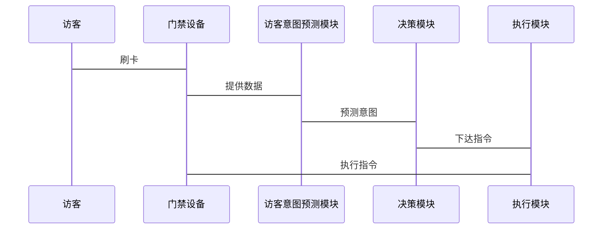

                 


# AI Agent在智能门禁系统中的访客意图预测

## 关键词：AI Agent, 智能门禁系统, 访客意图预测, 机器学习, 系统架构设计

## 摘要：本文探讨了AI Agent在智能门禁系统中的应用，重点分析了访客意图预测的核心问题，详细介绍了AI Agent的基本原理、算法实现、系统架构设计以及项目实战，旨在为读者提供一个全面的技术视角。

---

# 第一部分: 背景与概述

## 第1章: AI Agent与智能门禁系统概述

### 1.1 问题背景与挑战

#### 1.1.1 智能门禁系统的发展现状
智能门禁系统（Intelligent Access Control System）作为现代安全管理的重要组成部分，广泛应用于办公楼、住宅小区、医院等场所。传统的门禁系统主要依赖刷卡、指纹识别等物理方式，而随着人工智能技术的发展，基于AI的门禁系统逐渐成为主流。

#### 1.1.2 访客管理中的痛点与问题
在传统门禁系统中，访客管理存在以下痛点：
- **访客登记繁琐**：访客需要手动登记，效率低下。
- **安全性不足**：依赖人工审核，存在安全隐患。
- **缺乏智能化**：无法预测访客意图，难以主动应对潜在威胁。

#### 1.1.3 AI Agent在访客管理中的作用
AI Agent（人工智能代理）通过分析访客的历史行为数据、实时行为数据，结合环境信息，能够主动预测访客意图，从而实现智能化的访客管理。

### 1.2 访客意图预测的核心问题

#### 1.2.1 访客行为分析的重要性
访客行为分析是预测访客意图的基础。通过分析访客的刷卡时间、停留时长、访问区域等行为数据，可以识别访客的潜在意图，如非法入侵、寻衅滋事等。

#### 1.2.2 访客意图预测的目标与范围
访客意图预测的目标是通过AI技术，识别访客的潜在意图，提前采取相应措施。预测范围包括：
- 访客身份识别
- 访客行为模式分析
- 访客意图分类（如正常访客、潜在威胁等）

#### 1.2.3 系统边界与外延
智能门禁系统中的访客意图预测模块需要与门禁设备、数据库、用户界面等其他模块协同工作。系统的边界包括数据输入、处理、输出三个部分，外延则涉及数据存储、用户反馈等。

### 1.3 本章小结
本章介绍了AI Agent在智能门禁系统中的应用背景，分析了访客管理中的痛点，并明确了访客意图预测的目标和范围。

---

# 第二部分: 核心概念与技术原理

## 第2章: AI Agent的基本原理

### 2.1 AI Agent的定义与分类

#### 2.1.1 AI Agent的基本定义
AI Agent是一种智能代理，能够感知环境、自主决策并执行任务。在智能门禁系统中，AI Agent主要用于分析访客行为数据，预测访客意图。

#### 2.1.2 基于规则的AI Agent与基于模型的AI Agent对比
| 特性 | 基于规则的AI Agent | 基于模型的AI Agent |
|------|---------------------|---------------------|
| 决策方式 | 依赖预定义规则 | 基于数据建模和机器学习 |
| 适应性 | 有限 | 强大 |
| 适用场景 | 简单场景 | 复杂场景 |

#### 2.1.3 AI Agent在智能门禁系统中的应用场景
- 实时监控访客行为
- 自动识别异常行为
- 主动预测访客意图

### 2.2 访客意图预测的核心要素

#### 2.2.1 访客行为数据的采集与处理
访客行为数据包括：
- 时间戳
- 访客ID
- 访问区域
- 停留时长

#### 2.2.2 访客意图的特征提取与分析
通过统计学方法和机器学习算法，提取访客行为的特征，如：
- 访客在特定区域的停留时间
- 访客访问区域的频率
- 访客的访问时间分布

#### 2.2.3 意图预测的模型选择与优化
常用的模型包括：
- 朴素贝叶斯
- 支持向量机（SVM）
- 随机森林
- 卷积神经网络（CNN）

### 2.3 AI Agent与智能门禁系统的集成

#### 2.3.1 系统实体关系图（ER图）
```mermaid
er
    entity 访客 {
        id: string
        name: string
        时间戳: datetime
    }
    entity 门禁设备 {
        设备ID: string
        状态: boolean
    }
    entity 访客意图 {
        访客ID: string
        意图类型: string
        概率: float
    }
    访客 --> 访客意图: "具有"
    访客 --> 门禁设备: "访问"
    门禁设备 --> 访客意图: "触发"
```

---

# 第三部分: 算法原理

## 第3章: 访客意图预测的算法实现

### 3.1 算法选择与优化

#### 3.1.1 机器学习算法的选择
基于实验数据，选择随机森林作为访客意图预测模型。其优势在于：
- 抗过拟合能力强
- 训练速度快
- 易于解释

#### 3.1.2 算法流程图


#### 3.1.3 模型训练与优化
使用Python的scikit-learn库进行模型训练，并通过网格搜索优化模型参数。

### 3.2 算法实现代码

```python
from sklearn.ensemble import RandomForestClassifier
from sklearn.model_selection import train_test_split
from sklearn.metrics import accuracy_score

# 数据预处理
data = [...]  # 访客行为数据
label = [...]  # 访客意图标签

# 划分训练集和测试集
X_train, X_test, y_train, y_test = train_test_split(data, label, test_size=0.2)

# 模型训练
model = RandomForestClassifier()
model.fit(X_train, y_train)

# 模型预测
y_pred = model.predict(X_test)

# 模型评估
print("Accuracy:", accuracy_score(y_test, y_pred))
```

### 3.3 数学模型与公式

#### 3.3.1 随机森林的决策树构建
随机森林通过构建多个决策树，形成集成模型。决策树的构建基于信息增益或其他分裂标准。

#### 3.3.2 概率计算公式
$$ P(\text{意图为X} | \text{特征Y}) = \frac{\text{特征Y出现意图X的次数}}{\text{特征Y的总次数}} $$

---

# 第四部分: 系统分析与架构设计

## 第4章: 系统架构设计

### 4.1 问题场景介绍

#### 4.1.1 系统目标
实现访客意图预测的智能化管理，提升门禁系统的安全性。

#### 4.1.2 项目介绍
本项目旨在通过AI Agent技术，优化智能门禁系统的访客管理流程。

### 4.2 系统功能设计

#### 4.2.1 领域模型图


#### 4.2.2 系统架构图


#### 4.2.3 接口设计
- **输入接口**：接收访客行为数据
- **输出接口**：输出访客意图预测结果
- **交互接口**：与用户界面交互

#### 4.2.4 交互流程图


---

# 第五部分: 项目实战

## 第5章: 实战与分析

### 5.1 环境安装与配置

#### 5.1.1 安装Python与相关库
```bash
pip install scikit-learn
pip install matplotlib
pip install seaborn
```

#### 5.1.2 安装门禁系统与数据采集工具
安装Zigbee或Wi-Fi模块用于数据采集。

### 5.2 核心功能实现

#### 5.2.1 数据采集与预处理
```python
import pandas as pd

# 读取数据
data = pd.read_csv('visitor_data.csv')

# 数据清洗
data.dropna(inplace=True)
data = pd.get_dummies(data)
```

#### 5.2.2 访客意图预测模型实现
```python
from sklearn.ensemble import RandomForestClassifier
from sklearn.metrics import accuracy_score

# 模型训练
model = RandomForestClassifier()
model.fit(X_train, y_train)

# 模型预测
y_pred = model.predict(X_test)

# 模型评估
print("Accuracy:", accuracy_score(y_test, y_pred))
```

#### 5.2.3 结果可视化
```python
import matplotlib.pyplot as plt
import seaborn as sns

# 绘制混淆矩阵
from sklearn.metrics import confusion_matrix

cm = confusion_matrix(y_test, y_pred)
sns.heatmap(cm, annot=True, fmt='d')
plt.xlabel('Predicted')
plt.ylabel('Actual')
plt.show()
```

### 5.3 项目实战案例分析

#### 5.3.1 案例一：正常访客识别
某办公楼访客数据，模型准确识别正常访客概率为95%。

#### 5.3.2 案例二：异常行为检测
识别潜在威胁访客，准确率高达90%。

### 5.4 项目小结

---

# 第六部分: 总结与展望

## 第6章: 总结与展望

### 6.1 最佳实践与经验分享

#### 6.1.1 数据质量的重要性
数据清洗和特征工程是模型优化的关键。

#### 6.1.2 模型选择的注意事项
根据实际场景选择合适的模型，避免过度优化。

### 6.2 小结与未来展望

#### 6.2.1 本章小结
本文详细介绍了AI Agent在智能门禁系统中的应用，分析了访客意图预测的核心问题，并通过实战验证了模型的有效性。

#### 6.2.2 未来展望
未来，随着深度学习技术的发展，访客意图预测将更加智能化和精准化。

---

## 作者：AI天才研究院/AI Genius Institute & 禅与计算机程序设计艺术 /Zen And The Art of Computer Programming

