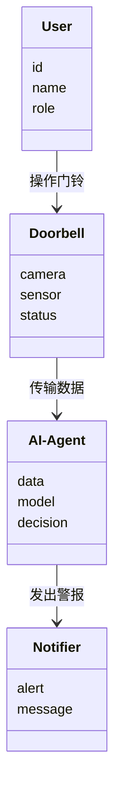

                 


# AI Agent在智能门铃中的可疑行为识别

## 关键词：AI Agent, 智能门铃, 可疑行为识别, 机器学习, 深度学习, 系统架构, 项目实战

## 摘要：本文详细探讨了AI Agent在智能门铃中的应用，特别是如何通过先进的算法和技术实现可疑行为识别。文章从背景介绍、核心概念、算法原理、系统架构到项目实战，全面解析了该领域的技术挑战与解决方案。

---

# 第一部分: 背景介绍

## 第1章: 问题背景

### 1.1 智能门铃的发展历程

智能门铃作为智能家居的重要组成部分，经历了从机械门锁到电子门锁，再到智能门锁的演变。现代智能门铃不仅具备基本的开门功能，还集成了视频监控、远程通知和行为识别等高级功能。

### 1.2 可疑行为识别的重要性

在智能门铃中，可疑行为识别能够有效防止未经授权的访问，保障用户的安全。例如，识别陌生人强行闯入或非法撬锁行为，及时发出警报。

### 1.3 AI Agent 在智能门铃中的作用

AI Agent通过实时分析视频流数据，识别异常行为模式，从而提高门铃的安全性。AI Agent能够学习用户的正常行为模式，并在此基础上快速识别可疑行为。

## 第2章: 问题描述

### 2.1 可疑行为的定义与分类

可疑行为包括但不限于：陌生人强行闯入、非法撬锁、长时间逗留等。这些行为通常表现出与用户正常行为模式的显著差异。

### 2.2 智能门铃中的行为识别挑战

智能门铃的行为识别需要处理实时视频流数据，对计算能力和算法效率要求较高。此外，环境光线变化、背景干扰等因素也增加了识别的难度。

### 2.3 AI Agent 的核心目标与任务

AI Agent的核心目标是通过实时分析视频流数据，识别可疑行为，并及时发出警报。任务包括数据采集、行为识别、警报生成等。

---

# 第二部分: 核心概念与联系

## 第3章: 核心概念

### 3.1 AI Agent 的基本原理

AI Agent通过传感器和摄像头收集数据，利用机器学习算法分析数据，识别异常行为模式。当检测到可疑行为时，AI Agent会触发警报机制，通知用户或安全系统。

### 3.2 行为识别方法对比

以下是三种行为识别方法的对比：

| 方法 | 优点 | 缺点 |
|------|------|------|
| 基于规则的方法 | 实现简单 | 适应性差 |
| 机器学习方法 | 高度自适应 | 需要大量标注数据 |
| 深度学习方法 | 高精度 | 计算资源消耗大 |

### 3.3 ER实体关系图

```mermaid
graph TD
    User-->Doorbell: 操作门铃
    AI-Agent-->Doorbell: 分析数据
    Doorbell-->AI-Agent: 传输数据
    AI-Agent-->Notifier: 发出警报
```

---

# 第三部分: 算法原理

## 第4章: 数据预处理

### 4.1 数据采集

智能门铃通过摄像头采集视频流数据，并通过传感器获取环境数据（如温度、湿度等）。

### 4.2 数据清洗

去除噪声数据和无关数据，确保数据质量。例如，去除低光照条件下的模糊图像。

### 4.3 数据标注

对正常行为和可疑行为进行标注，为后续训练提供有监督学习的数据集。

## 第5章: 特征提取

### 5.1 选择特征

提取视频流中的关键特征，如人体动作、行为模式、环境特征等。

### 5.2 特征提取算法

使用深度学习模型（如卷积神经网络）提取图像特征。

## 第6章: 模型训练

### 6.1 训练数据

使用标注好的数据训练分类模型，区分正常行为和可疑行为。

### 6.2 模型优化

通过调整超参数和优化算法（如随机梯度下降）提高模型性能。

---

# 第四部分: 系统架构设计

## 第7章: 系统设计

### 7.1 系统功能设计

智能门铃系统包括数据采集、行为识别、警报生成等功能模块。

### 7.2 领域模型类图



---

# 第五部分: 项目实战

## 第8章: 环境安装

### 8.1 安装TensorFlow

安装TensorFlow框架，用于模型训练和部署。

### 8.2 安装OpenCV

安装OpenCV库，用于图像处理和视频流分析。

## 第9章: 核心代码实现

### 9.1 数据加载

```python
import tensorflow as tf
from tensorflow.keras import layers

# 加载预训练模型
model = tf.keras.applications.VGG16(weights='imagenet', include_top=False)

# 自定义分类层
x = model.output
x = layers.Flatten()(x)
x = layers.Dense(256, activation='relu')(x)
x = layers.Dense(2, activation='sigmoid')(x)
model = tf.keras.Model(inputs=model.input, outputs=x)
```

### 9.2 模型训练

```python
model.compile(optimizer='adam', loss='binary_crossentropy', metrics=['accuracy'])
model.fit(X_train, y_train, epochs=10, batch_size=32)
```

### 9.3 结果预测

```python
predictions = model.predict(X_test)
```

## 第10章: 案例分析

### 10.1 实际案例

分析一个陌生人强行闯入的案例，展示AI Agent如何识别并触发警报。

### 10.2 结果分析

详细解读模型的预测结果，分析其准确性和可靠性。

---

# 第六部分: 最佳实践与小结

## 第11章: 最佳实践

### 11.1 性能优化

通过模型剪枝和量化技术优化模型性能，降低计算资源消耗。

### 11.2 数据隐私保护

确保用户数据的安全性，避免数据泄露风险。

### 11.3 模型更新策略

定期更新模型，提升识别准确率和应对新出现的异常行为。

## 第12章: 小结

本文详细介绍了AI Agent在智能门铃中的应用，从背景介绍到项目实战，全面解析了可疑行为识别的技术实现。通过本文的讲解，读者可以深入了解该领域的核心技术挑战与解决方案。

---

# 作者：AI天才研究院 & 禅与计算机程序设计艺术

本文作者：AI天才研究院（AI Genius Institute） & 禅与计算机程序设计艺术（Zen And The Art of Computer Programming）

---

# 附录: 拓展阅读

- 《深度学习实战》
- 《机器学习算法解析》
- 《系统架构设计指南》

