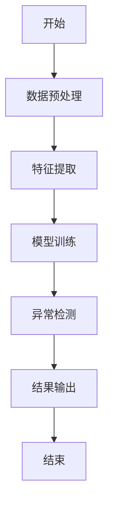
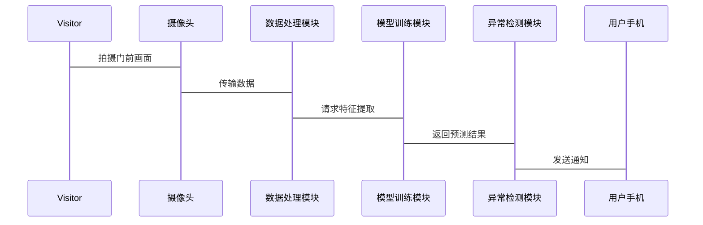

                 


# AI Agent在智能门铃中的可疑行为识别

## 关键词：AI Agent, 智能门铃, 可疑行为识别, 异常检测, 深度学习, 强化学习

## 摘要：  
本文探讨AI Agent在智能门铃中的应用，重点分析如何通过AI技术实现可疑行为的识别。文章从背景介绍、核心概念、算法原理、系统架构设计到项目实战，详细阐述了AI Agent在智能门铃中的技术实现与应用价值，为智能安防领域提供新的思路与解决方案。

---

# 第一部分：AI Agent在智能门铃中的可疑行为识别背景介绍

## 第1章：问题背景与应用价值

### 1.1 问题背景  
智能门铃作为智能家居的重要组成部分，承担着访客识别、安全监控等功能。然而，传统门铃系统在异常行为识别方面存在局限性，难以应对复杂的安全威胁。引入AI Agent（人工智能代理）可以显著提升门铃系统的智能化水平，实现对可疑行为的实时识别与预警。

### 1.2 问题描述  
智能门铃系统需要识别的可疑行为包括：陌生人长时间逗留、非法入侵尝试、破坏性行为等。这些行为通常具有复杂性和多样性，传统基于规则的检测方法难以覆盖所有场景。AI Agent通过学习和自适应，能够更准确地识别异常行为。

### 1.3 问题解决思路  
基于AI Agent的解决方案结合了数据驱动和模型驱动的优势，通过深度学习和强化学习技术，实现对可疑行为的实时检测和响应。同时，系统需要考虑数据隐私、计算效率和用户交互等问题。

### 1.4 核心要素与概念结构  
AI Agent的核心要素包括感知能力、决策能力、执行能力。智能门铃系统则由摄像头、传感器、数据处理模块和用户交互界面组成。可疑行为识别的系统架构需要整合这些要素，形成一个高效、可靠的智能安防系统。

---

## 第2章：AI Agent与智能门铃的核心概念

### 2.1 AI Agent的基本原理  
AI Agent通过感知环境、分析数据、做出决策并执行动作，实现智能化的行为识别。基于强化学习的AI Agent能够通过奖励机制优化行为策略。

### 2.2 智能门铃系统的技术特点  
智能门铃系统结合了计算机视觉和传感器数据，能够实时捕捉和分析门前的动态。基于深度学习的模型可以识别访客的面部特征、行为模式等信息。

### 2.3 可疑行为识别的核心概念  
可疑行为识别依赖于特征提取、异常检测和分类评估。基于AI的异常检测能够识别偏离正常模式的行为，从而实现高效的威胁预警。

---

## 第3章：可疑行为识别的算法原理

### 3.1 算法选择与原理  
基于时间序列的异常检测和深度学习模型（如LSTM）是实现可疑行为识别的关键技术。通过分析历史数据，模型能够识别出异常行为的模式。

### 3.2 算法流程图（Mermaid）  


### 3.3 算法实现代码  
```python
import numpy as np
from sklearn.metrics import accuracy_score

def detect_anomaly(data, model):
    # 数据预处理
    processed_data = preprocess(data)
    # 特征提取
    features = extract_features(processed_data)
    # 模型预测
    predictions = model.predict(features)
    # 计算准确率
    accuracy = accuracy_score(y_true, predictions)
    return accuracy
```

---

## 第4章：系统分析与架构设计

### 4.1 问题场景介绍  
智能门铃系统需要在复杂环境下实时检测可疑行为，确保用户安全。系统设计需要考虑数据采集、处理、分析和反馈的全流程。

### 4.2 系统功能设计  
系统功能包括实时监控、异常检测、用户通知和日志记录。基于领域模型的类图展示了各模块之间的关系。

### 4.3 系统架构设计（Mermaid）  


### 4.4 系统交互设计（Mermaid）  


---

## 第5章：项目实战

### 5.1 环境安装  
安装必要的库和工具，如TensorFlow、OpenCV等。配置开发环境，确保硬件支持（如GPU加速）。

### 5.2 核心代码实现  
```python
import tensorflow as tf
from tensorflow.keras.layers import LSTM, Dense, Dropout

model = tf.keras.Sequential([
    LSTM(64, return_sequences=True),
    Dropout(0.2),
    LSTM(32),
    Dense(1, activation='sigmoid')
])
model.compile(optimizer='adam', loss='binary_crossentropy')
```

### 5.3 代码解读与分析  
代码实现了一个基于LSTM的深度学习模型，用于时间序列数据的异常检测。模型通过训练学习到正常行为的特征，并预测新的数据点是否异常。

### 5.4 实际案例分析  
通过实际案例分析，展示模型在识别可疑行为中的表现。例如，检测陌生人非法入侵的过程。

### 5.5 项目小结  
总结项目实现的关键点，强调AI Agent在智能门铃中的应用价值和未来发展方向。

---

## 第6章：最佳实践

### 6.1 小结  
本文详细介绍了AI Agent在智能门铃中的应用，从理论到实践，展示了如何利用深度学习和强化学习技术实现可疑行为的识别。

### 6.2 注意事项  
在实际应用中，需注意数据隐私保护、模型泛化能力以及系统的实时性问题。

### 6.3 拓展阅读  
建议读者进一步学习深度学习和强化学习的相关知识，探索更多智能安防的应用场景。

---

# 作者：AI天才研究院 & 禅与计算机程序设计艺术

