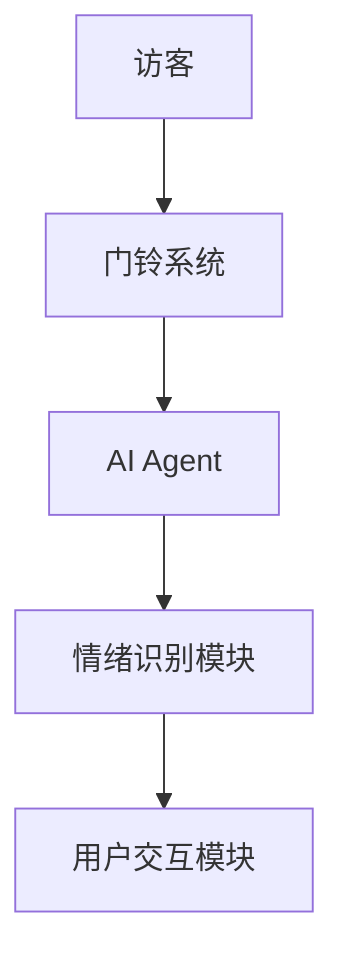
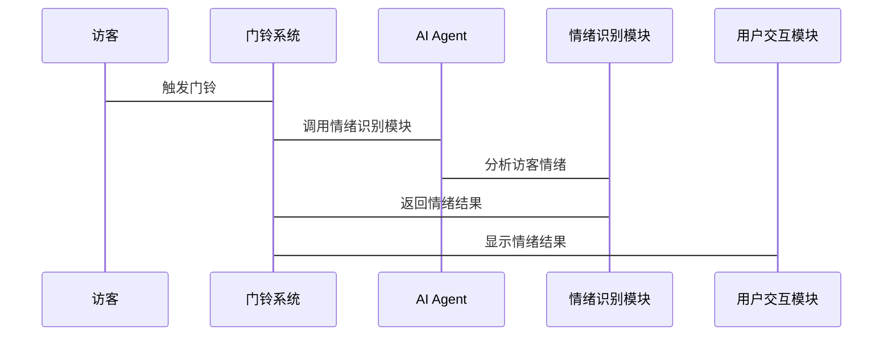

                 


# AI Agent在智能门铃中的访客情绪识别

> 关键词：AI Agent, 情绪识别, 智能门铃, 情感分析, 语音识别

> 摘要：本文深入探讨了AI Agent在智能门铃中的应用，重点分析了访客情绪识别的核心技术与实现方案。通过系统化的分析与设计，结合实际项目案例，展示了如何利用AI技术提升智能门铃的功能与用户体验。

---

# 第一部分: 背景与核心概念

## 第1章: AI Agent与智能门铃的背景介绍

### 1.1 问题背景与描述

#### 1.1.1 智能门铃的发展历程
智能门铃作为智能家居的重要组成部分，经历了从机械门铃到电子门铃，再到智能门铃的演变。早期的智能门铃主要实现远程通知功能，而现代智能门铃则结合了AI技术，能够实现访客识别、情绪分析、行为预测等多种功能。

#### 1.1.2 情绪识别在智能门铃中的需求
访客的情绪状态可以通过声音、语气和语调进行分析。在智能门铃中，情绪识别可以帮助用户判断访客的情绪状态，从而提供更个性化的服务，例如优先接待情绪稳定的访客或及时安抚情绪激动的访客。

#### 1.1.3 AI Agent在智能门铃中的应用价值
AI Agent（智能代理）能够实时分析访客的情绪，结合门铃的传感器数据，为用户提供智能化的访客管理解决方案。通过AI Agent，智能门铃能够实现从被动通知到主动服务的转变。

### 1.2 问题解决与边界

#### 1.2.1 情绪识别如何解决访客管理问题
情绪识别可以帮助智能门铃实现访客情绪的实时监测，避免因情绪激动引发的冲突，同时优化访客接待流程。

#### 1.2.2 情绪识别的边界与外延
情绪识别的边界主要集中在声音和语言分析，外延则包括结合其他传感器数据（如环境温度、光照）进行综合判断。

#### 1.2.3 情绪识别与智能门铃的结合方式
情绪识别通过语音分析模块与智能门铃的传感器数据相结合，实现访客情绪的实时监测与反馈。

### 1.3 核心概念与系统组成

#### 1.3.1 AI Agent的定义与特征
AI Agent是一种能够感知环境并主动执行任务的智能实体，具有自主性、反应性、目标导向性和学习能力。

#### 1.3.2 情绪识别的核心要素
情绪识别包括声音采集、语音分析、情感分类和结果反馈四个核心要素。

#### 1.3.3 系统组成与功能模块
智能门铃系统主要由AI Agent、声音采集模块、语音分析模块、传感器数据模块和用户交互模块组成。

## 第2章: 核心概念与联系

### 2.1 AI Agent与情绪识别原理

#### 2.1.1 AI Agent的基本原理
AI Agent通过感知环境数据，结合预设规则和学习模型，执行任务并反馈结果。

#### 2.1.2 情绪识别的核心原理
情绪识别基于语音特征提取和情感分类算法，通过分析声音的语调、语速和语气来判断情绪。

#### 2.1.3 两者结合的实现机制
AI Agent通过调用情绪识别模块，实时分析访客的情绪状态，并根据结果执行相应的操作。

### 2.2 核心概念对比与表格

#### 2.2.1 AI Agent与传统门铃的对比
| 特性       | AI Agent门铃   | 传统门铃     |
|------------|----------------|--------------|
| 功能       | 情绪识别、智能交互 | 远程通知      |
| 反应速度   | 实时            | 延迟          |
| 学习能力   | 有             | 无           |

#### 2.2.2 情绪识别与其他识别技术的对比
| 技术       | 基于语音的情绪识别 | 基于文本的情绪识别 | 基于面部的情绪识别 |
|------------|-------------------|-------------------|--------------------|
| 数据来源   | 语音             | 文本             | 面部图像           |
| 实时性     | 高               | 中               | 高                |
| 精度       | 中               | 低               | 高                |

#### 2.2.3 核心概念对比表格
| 实体       | 属性             | 关系             |
|------------|------------------|------------------|
| AI Agent   | 情绪识别模块     | 集成             |
| 门铃系统   | 传感器数据模块   | 数据来源         |

### 2.3 ER实体关系图

```mermaid
erDiagram
    访客: 访客信息
    门铃系统: 门铃设备
    AI Agent: 智能代理
    情绪识别模块: 情绪识别算法
    传感器数据: 环境数据
    用户交互模块: 用户界面

    访客 --> 门铃系统: 触发门铃
    门铃系统 --> AI Agent: 调用情绪识别模块
    AI Agent --> 情绪识别模块: 分析访客情绪
    门铃系统 --> 用户交互模块: 显示情绪结果
```

---

# 第3章: 算法原理与数学模型

## 第3章: 算法原理与数学模型

### 3.1 情绪识别算法原理

#### 3.1.1 基于文本的情感分析算法
情感分析算法通过分析文本中的关键词和语调，判断文本的情感倾向。

#### 3.1.2 基于语音的情绪识别算法
语音情绪识别通过分析声音的特征（如声调、语速、音量）来判断情绪。

#### 3.1.3 算法流程图（Mermaid）

```mermaid
flowchart TD
    A[开始] -> B[采集语音数据]
    B -> C[特征提取]
    C -> D[情感分类]
    D -> E[输出情绪结果]
    E -> F[结束]
```

### 3.2 数学模型与公式

#### 3.2.1 词袋模型的构建
词袋模型将文本表示为单词的集合，忽略单词顺序。

$$ \text{词袋模型} = \{ \text{单词} : \text{出现次数} \} $$

#### 3.2.2 TF-IDF特征提取
TF-IDF（Term Frequency-Inverse Document Frequency）用于衡量单词的重要性。

$$ \text{TF-IDF}(t, d) = \text{TF}(t, d) \times \text{IDF}(t) $$

#### 3.2.3 情感分类的数学公式
情感分类可以通过逻辑回归模型实现。

$$ P(y=1|x) = \frac{e^{\beta x}}{1 + e^{\beta x}} $$

### 3.3 算法实现与代码

#### 3.3.1 算法实现流程
1. 采集语音数据。
2. 提取语音特征。
3. 进行情感分类。
4. 输出情绪结果。

#### 3.3.2 Python代码实现

```python
import numpy as np
from sklearn.feature_extraction.text import TfidfVectorizer

# 示例文本数据
texts = ["I'm happy", "I'm sad"]

# 创建TF-IDF向量化器
vectorizer = TfidfVectorizer()

# 计算TF-IDF特征
tfidf_matrix = vectorizer.fit_transform(texts)

# 打印特征向量
print(tfidf_matrix.toarray())
```

#### 3.3.3 代码功能分析
上述代码通过TF-IDF向量化器将文本数据转换为特征向量，用于后续的情感分类。

---

# 第4章: 系统分析与架构设计

## 第4章: 系统分析与架构设计

### 4.1 项目场景与需求分析

#### 4.1.1 项目背景介绍
智能门铃系统需要实现访客情绪识别功能，提升用户体验。

#### 4.1.2 系统功能需求
- 采集访客语音数据。
- 实现情绪识别功能。
- 提供情绪识别结果反馈。

#### 4.1.3 系统性能需求
- 实时性要求高。
- 系统稳定性要求高。

### 4.2 系统功能设计

#### 4.2.1 领域模型设计（Mermaid类图）

```mermaid
classDiagram
    访客 <--- 访客信息
    门铃系统 <---- 情绪识别模块
    门铃系统 <---- 传感器数据模块
    门铃系统 <---- 用户交互模块
```

#### 4.2.2 功能模块划分
- 采集模块：采集访客语音数据。
- 分析模块：进行情绪识别。
- 反馈模块：输出情绪结果。

#### 4.2.3 功能交互流程
1. 访客触发门铃。
2. 系统采集语音数据。
3. 分析模块进行情绪识别。
4. 输出情绪结果。

### 4.3 系统架构设计

#### 4.3.1 系统架构图（Mermaid架构图）



#### 4.3.2 系统分层设计
- 数据采集层：采集访客语音数据。
- 数据处理层：进行情绪识别。
- 用户界面层：显示情绪结果。

#### 4.3.3 系统接口设计
- 采集模块接口：提供语音数据采集功能。
- 分析模块接口：提供情绪识别功能。

### 4.4 系统交互设计

#### 4.4.1 交互流程图（Mermaid序列图）



---

# 第5章: 项目实

