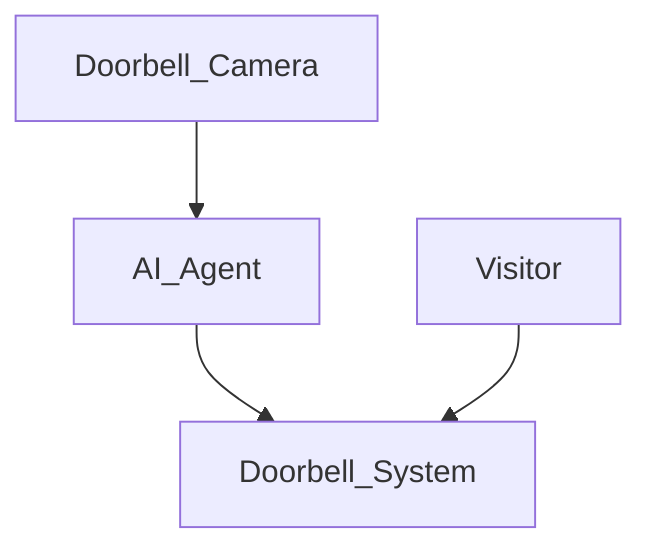
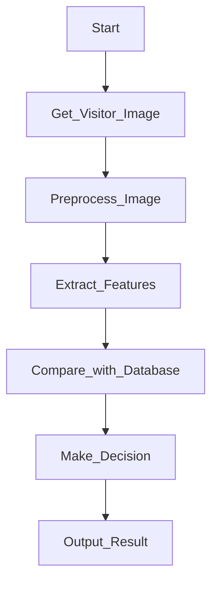
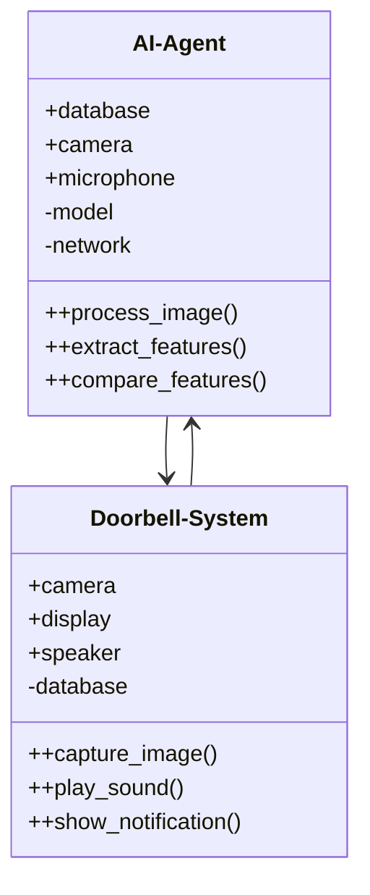
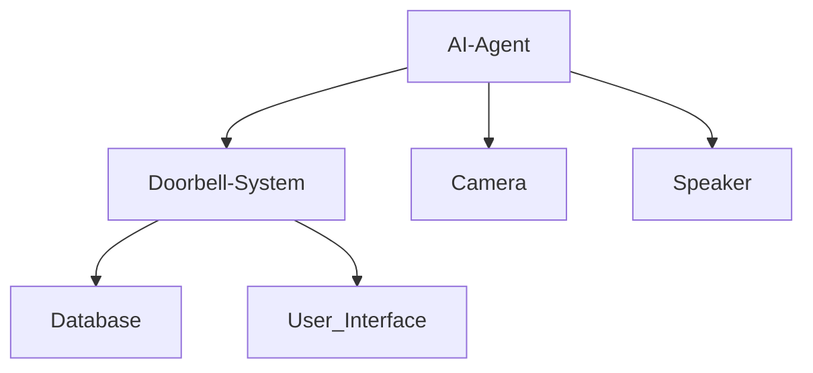
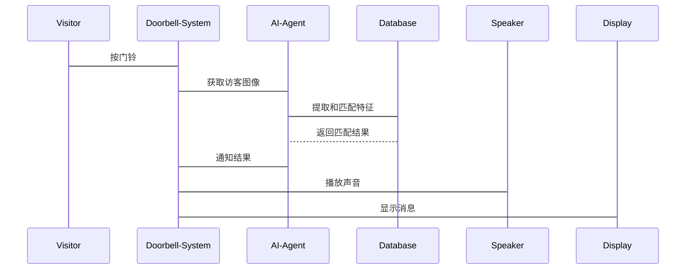

                 


# 目录大纲：AI Agent在智能门铃中的访客识别

## 第一部分：背景介绍

### 第1章：问题背景与描述

#### 1.1 问题背景
- 1.1.1 智能门铃的发展历程
- 1.1.2 当前访客识别的主要挑战
- 1.1.3 AI Agent在访客识别中的作用

#### 1.2 问题描述
- 1.2.1 访客识别的核心问题
- 1.2.2 智能门铃中的访客识别需求
- 1.2.3 AI Agent在访客识别中的目标

#### 1.3 问题解决与边界
- 1.3.1 AI Agent如何解决访客识别问题
- 1.3.2 访客识别的边界与限制
- 1.3.3 系统设计的外延与扩展

## 第二部分：核心概念与联系

### 第2章：AI Agent与智能门铃的核心概念

#### 2.1 AI Agent的基本原理
- 2.1.1 AI Agent的定义与特征
- 2.1.2 AI Agent的核心算法
- 2.1.3 AI Agent在智能门铃中的应用

#### 2.2 智能门铃的系统架构
- 2.2.1 智能门铃的功能模块
- 2.2.2 门铃系统的硬件与软件架构
- 2.2.3 智能门铃与AI Agent的结合

#### 2.3 核心概念对比表
- AI Agent与传统门铃的对比
- AI Agent与普通访客识别系统的对比

#### 2.4 实体关系图
- 使用mermaid绘制的AI Agent与智能门铃的实体关系图


## 第三部分：算法原理与数学模型

### 第3章：AI Agent的算法原理

#### 3.1 算法流程图
- 使用mermaid绘制的AI Agent算法流程图


#### 3.2 核心算法实现
- 基于Python的AI Agent实现代码示例
```python
import cv2
import numpy as np

def preprocess_image(image):
    # 图像预处理步骤
    return preprocessed_image

def extract_features(image):
    # 特征提取算法
    return features

def compare_with_database(features, database):
    # 比较算法
    match_score = 0.85
    return match_score

def make_decision(match_score):
    if match_score > 0.8:
        return "Recognized"
    else:
        return "Unknown"

# 主函数
def main():
    image = cv2.imread("visitor.jpg")
    preprocessed = preprocess_image(image)
    features = extract_features(preprocessed)
    decision = make_decision(compare_with_database(features, database))
    print(decision)

if __name__ == "__main__":
    main()
```

#### 3.3 数学模型与公式
- 特征提取的数学模型
  $$ \text{Feature} = f(\text{Image}) $$
- 匹配评分计算公式
  $$ \text{Score} = \sum_{i=1}^{n} (f_i - g_i)^2 $$
  其中，$f_i$ 是提取的特征，$g_i$ 是数据库中的特征。

## 第四部分：系统分析与架构设计

### 第4章：系统分析与架构设计

#### 4.1 问题场景介绍
- 智能门铃的使用场景
- 访客识别的核心需求
- AI Agent在系统中的角色

#### 4.2 系统功能设计
- 使用mermaid绘制的领域模型类图


#### 4.3 系统架构设计
- 使用mermaid绘制的系统架构图


#### 4.4 系统接口设计
- 接口1：AI-Agent与门铃系统的接口
- 接口2：数据库访问接口
- 接口3：用户界面交互接口

#### 4.5 系统交互流程
- 使用mermaid绘制的系统交互序列图


## 第五部分：项目实战

### 第5章：项目实战与实现

#### 5.1 环境安装与配置
- 安装Python、OpenCV、TensorFlow等工具
- 安装智能门铃硬件（如Raspberry Pi）
- 配置摄像头和网络连接

#### 5.2 核心功能实现
- 访客图像采集
- 图像预处理与特征提取
- 特征匹配与识别
- 结果通知与反馈

#### 5.3 代码实现与解读
- 采集图像并预处理
```python
import cv2

def capture_image(camera):
    ret, frame = camera.read()
    if not ret:
        raise Exception("Failed to capture image")
    return frame

captured_image = capture_image(camera)
cv2.imwrite("visitor.jpg", captured_image)
```

- 提取特征并进行匹配
```python
def extract_features(image):
    # 假设使用OpenCV的特征提取算法
    features = cv2.resize(image, (256, 256))
    features = features.flatten()
    return features

features = extract_features(captured_image)
```

- 匹配结果并通知系统
```python
def notify_system(result):
    if result == "Recognized":
        print("Welcome!")
        # 连接到扬声器并播放声音
        speaker.play("welcome.mp3")
    else:
        print("Unknown visitor")
        # 发送邮件或短信通知
        notification.send("Unknown visitor detected")

notify_system(decision)
```

#### 5.4 案例分析与实际应用
- 通过实际案例说明系统的工作流程
- 分析可能的错误情况及解决方案

## 第六部分：总结与展望

### 第6章：总结与展望

#### 6.1 最佳实践 tips
- 数据质量的重要性
- 模型训练的优化技巧
- 系统安全性的注意事项

#### 6.2 系统小结
- 系统实现的主要成果
- 系统设计的优缺点
- 系统性能的评估指标

#### 6.3 注意事项与建议
- 数据隐私保护的重要性
- 系统维护与更新的建议
- 进一步优化的方向

#### 6.4 拓展阅读
- 推荐相关技术书籍和论文
- 提供进一步学习的资源链接
- 展望AI Agent在其他领域的应用潜力

## 作者信息

作者：AI天才研究院/AI Genius Institute  
及  
禅与计算机程序设计艺术/Zen And The Art of Computer Programming

---

### 总结
这个大纲涵盖了从背景介绍到实际项目实现的各个方面，确保读者能够全面理解AI Agent在智能门铃中的访客识别技术。每一部分都详细展开了核心概念、算法原理、系统架构和项目实战，为读者提供了丰富的学习资源和实践指导。

