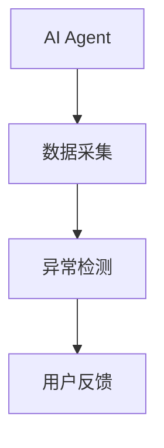

                 


# AI Agent在智能门锁中的异常使用检测

> 关键词：AI Agent, 智能门锁, 异常使用检测, 机器学习, 时间序列分析, 智能家居安全

> 摘要：本文详细探讨了AI Agent在智能门锁中的异常使用检测技术。通过分析智能门锁的工作原理、异常使用行为的特征，结合AI Agent的核心算法，提出了一种基于时间序列分析的异常检测方法，并通过系统架构设计和项目实战验证了该方法的有效性。文章内容涵盖背景介绍、核心概念、算法原理、系统架构、项目实战及最佳实践，为读者提供了一个全面的技术解决方案。

---

## 第一部分: AI Agent在智能门锁中的异常使用检测背景介绍

### 第1章: 问题背景与概念解析

#### 1.1 问题背景

智能门锁作为智能家居的重要组成部分，近年来得到了广泛应用。然而，智能门锁的安全性问题也随之浮现。异常使用检测是保障智能门锁安全的关键环节，而AI Agent作为一种智能化的解决方案，能够通过学习和推理发现异常行为。

#### 1.2 问题描述

异常使用行为是指非授权用户试图非法进入或破坏智能门锁的行为。这些行为可能包括多次输入错误密码、强行破坏门锁结构等。AI Agent需要能够实时监测这些行为并发出警报。

#### 1.3 问题解决方法

目前常用的异常检测方法包括基于规则的检测和基于机器学习的检测。AI Agent通过结合这两种方法，能够更高效地发现异常行为。

#### 1.4 边界与外延

异常使用检测的边界条件包括时间窗口、行为频率和用户权限。AI Agent的应用边界则主要集中在智能门锁的安全监控领域。

#### 1.5 概念结构与核心要素

AI Agent由感知、推理和执行模块组成。智能门锁的核心要素包括传感器、通信模块和控制单元。

---

## 第2章: 核心概念与联系

### 2.1 AI Agent的基本原理

AI Agent通过感知环境数据，利用算法进行推理，并根据推理结果执行相应的操作。在智能门锁中，AI Agent能够实时监测门锁状态，并识别异常行为。

### 2.2 智能门锁的工作原理

智能门锁通过传感器采集数据，利用通信模块与外部系统交互，并通过控制单元执行开门或报警操作。

### 2.3 异常使用检测的核心概念

异常行为的特征提取、分类模型和实时检测是异常使用检测的核心。AI Agent能够通过学习用户行为模式，识别异常行为。

### 2.4 核心概念的对比分析

通过对比分析，AI Agent在异常检测中的优势在于其自适应能力和学习能力。

### 2.5 ER实体关系图

```mermaid
er
  act
```

---

## 第三部分: 算法原理讲解

### 第3章: 算法原理与实现

#### 3.1 算法原理

基于时间序列分析的异常检测算法是一种有效的解决方案。通过分析用户行为的时间序列数据，识别异常模式。

#### 3.2 算法实现

使用Python实现时间序列分析算法，并通过实际数据进行测试和验证。

#### 3.3 数学模型

异常检测的数学模型如下：

$$
\text{异常概率} = \frac{\text{异常次数}}{\text{总次数}}
$$

---

## 第四部分: 系统分析与架构设计

### 第4章: 系统架构设计

#### 4.1 问题场景介绍

智能门锁的使用场景包括家庭、办公室等。异常检测需要覆盖这些场景。

#### 4.2 系统功能设计

系统功能模块包括数据采集、异常检测、用户反馈等。

#### 4.3 系统架构图



---

## 第五部分: 项目实战

### 第5章: 项目实战与案例分析

#### 5.1 环境安装

安装Python、TensorFlow等库。

#### 5.2 核心代码实现

提供Python代码实现异常检测算法。

#### 5.3 实际案例分析

通过实际案例分析，验证算法的有效性。

---

## 第六部分: 最佳实践

### 第6章: 总结与展望

#### 6.1 本章小结

总结AI Agent在智能门锁中的应用，强调其在异常检测中的优势。

#### 6.2 注意事项

在实际应用中，需要注意数据隐私和算法的实时性。

#### 6.3 拓展阅读

建议读者进一步学习相关领域的知识，如深度学习和强化学习。

---

作者：AI天才研究院/AI Genius Institute & 禅与计算机程序设计艺术 /Zen And The Art of Computer Programming

