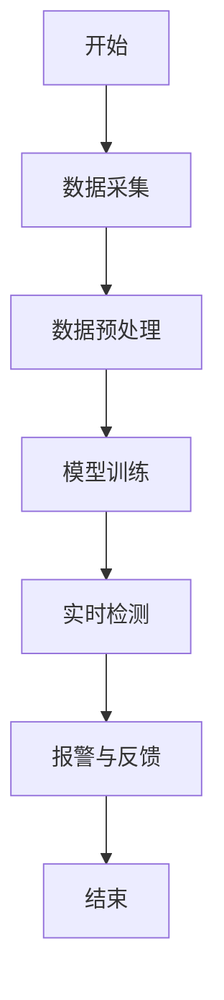
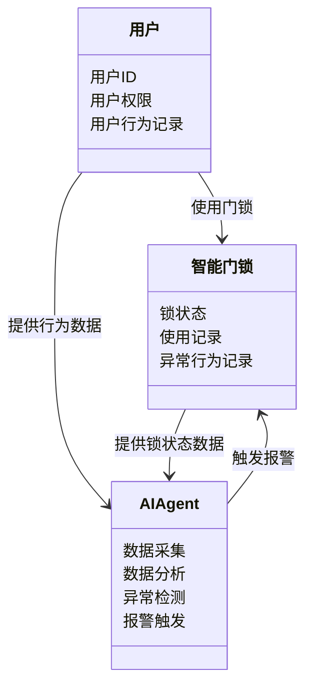
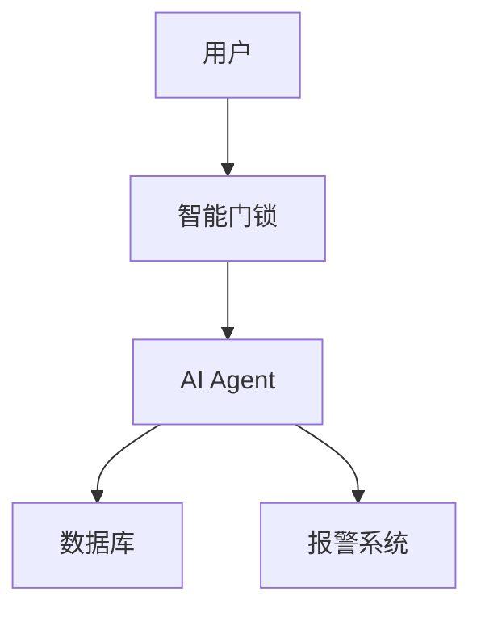

                 


# AI Agent在智能门锁中的异常行为检测

> 关键词：AI Agent, 智能门锁, 异常行为检测, 机器学习, 安全系统, 门禁系统

> 摘要：本文深入探讨了AI Agent在智能门锁中的应用，特别是如何通过异常行为检测技术提升门锁的安全性。文章从背景介绍、核心概念、算法原理、系统设计到项目实战，全面解析了AI Agent在智能门锁中的技术实现与实际应用。

---

# 第1章 背景介绍

## 1.1 问题背景
### 1.1.1 智能门锁的发展现状
智能门锁作为一种智能家居的核心设备，近年来得到了广泛应用。传统的机械门锁逐渐被电子门锁和智能门锁取代，用户可以通过指纹、密码、刷卡等多种方式开门。然而，随着智能门锁的普及，安全性问题也日益突出。非法入侵、未授权访问等问题频发，传统的安全机制已难以应对复杂的威胁。

### 1.1.2 异常行为检测的重要性
智能门锁的异常行为检测是指通过分析门锁的使用行为，识别是否存在未授权的访问尝试或非法操作。例如，多次输入错误密码、非法尝试开锁、非正常使用门锁等行为都可能表明存在安全隐患。通过及时检测这些异常行为，可以有效提升门锁的安全性，防止未经授权的访问。

### 1.1.3 AI Agent在智能门锁中的应用潜力
AI Agent（人工智能代理）是一种能够感知环境、自主决策并执行任务的智能实体。在智能门锁中，AI Agent可以通过分析门锁的使用数据，识别异常行为，并采取相应的措施（如触发报警、锁定门锁等）。AI Agent的引入使得智能门锁的安全性更加智能化、自动化。

## 1.2 问题描述
### 1.2.1 智能门锁异常行为的定义
异常行为是指在智能门锁的正常使用之外，存在未授权或非法的操作行为。例如：
- 多次尝试输入错误密码
- 非法尝试开锁
- 在非正常时间段进行开门操作
- 重复使用同一密码或指纹

### 1.2.2 异常行为检测的挑战与难点
智能门锁的异常行为检测面临以下挑战：
- 数据多样性：异常行为的表现形式多样，难以统一建模。
- 数据量有限：智能门锁的使用场景相对单一，异常行为的数据量有限，难以训练高性能的模型。
- 实时性要求高：异常行为检测需要在门锁使用过程中实时完成，不能事后处理。

### 1.2.3 AI Agent在检测中的作用
AI Agent可以通过以下方式提升智能门锁的异常行为检测能力：
- 实时监控：AI Agent可以实时监控门锁的使用行为，分析数据并识别异常。
- 自主决策：AI Agent可以根据检测结果自主采取措施，如触发报警、锁定门锁等。
- 自适应学习：AI Agent可以通过学习不断优化异常行为检测模型，提升检测准确率。

## 1.3 问题解决思路
### 1.3.1 异常行为检测的基本思路
智能门锁的异常行为检测可以分为以下步骤：
1. 数据采集：收集门锁的使用数据，包括开门时间、开门方式、输入的密码等。
2. 数据分析：对采集的数据进行分析，识别异常行为的特征。
3. 模型训练：基于历史数据训练异常行为检测模型。
4. 实时检测：在实际使用中，实时检测门锁的使用行为，判断是否存在异常行为。

### 1.3.2 AI Agent的核心作用
AI Agent在异常行为检测中的核心作用体现在以下几个方面：
- 数据处理：AI Agent可以对采集的数据进行清洗、归一化处理，为模型训练提供高质量的数据。
- 模型训练：AI Agent可以基于机器学习算法训练异常行为检测模型。
- 实时检测：AI Agent可以在门锁使用过程中实时分析数据，判断是否存在异常行为。

### 1.3.3 技术实现的总体框架
异常行为检测的总体框架包括以下几个部分：
1. 数据采集模块：负责采集门锁的使用数据。
2. 数据处理模块：对采集的数据进行预处理。
3. 模型训练模块：基于预处理后的数据训练异常行为检测模型。
4. 实时检测模块：在门锁使用过程中实时检测异常行为。
5. 报警与反馈模块：当检测到异常行为时，触发报警或采取其他措施。

## 1.4 边界与外延
### 1.4.1 异常行为检测的边界条件
异常行为检测的边界条件包括：
- 时间范围：检测的时间窗口长度。
- 数据类型：支持的门锁使用数据类型（如密码输入、指纹识别等）。
- 检测频率：检测的频率和实时性要求。

### 1.4.2 AI Agent的应用范围
AI Agent不仅可以应用于智能门锁的异常行为检测，还可以扩展到其他智能设备的安全检测，如智能摄像头、智能门禁系统等。

### 1.4.3 系统的扩展性与可维护性
系统的扩展性体现在以下几个方面：
- 支持多种门锁设备：系统可以支持不同品牌和类型的智能门锁。
- 支持多种检测算法：系统可以集成多种异常行为检测算法，灵活切换。
- 支持远程升级：系统可以通过远程升级优化模型和功能。

## 1.5 核心概念组成
### 1.5.1 AI Agent的基本概念
AI Agent是一种能够感知环境、自主决策并执行任务的智能实体。在智能门锁中，AI Agent可以实时监控门锁的使用行为，识别异常行为并采取相应的措施。

### 1.5.2 智能门锁的工作原理
智能门锁通过采集用户的输入（如密码、指纹、刷卡等）验证用户身份，验证通过后打开门锁。智能门锁还可以通过网络与云端服务器通信，实现远程开门和状态监控。

### 1.5.3 异常行为检测的系统构成
异常行为检测系统包括以下几个部分：
- 数据采集模块：负责采集门锁的使用数据。
- 数据处理模块：对采集的数据进行预处理。
- 模型训练模块：基于预处理后的数据训练异常行为检测模型。
- 实时检测模块：在门锁使用过程中实时检测异常行为。
- 报警与反馈模块：当检测到异常行为时，触发报警或采取其他措施。

---

# 第2章 核心概念与联系

## 2.1 AI Agent与智能门锁的关系
### 2.1.1 AI Agent在智能门锁中的角色
AI Agent在智能门锁中扮演以下几个角色：
- 监控者：实时监控门锁的使用行为。
- 分析者：分析门锁的使用数据，识别异常行为。
- 执行者：根据分析结果采取相应的措施，如触发报警、锁定门锁等。

### 2.1.2 智能门锁的硬件与软件架构
智能门锁的硬件架构包括：
- 门锁主体：包括机械结构和电子模块。
- 感知识别模块：如指纹识别模块、密码输入模块等。
- 通信模块：用于与云端服务器通信。

智能门锁的软件架构包括：
- 应用层：实现门锁的开门功能和用户管理。
- 数据层：存储门锁的使用数据和用户信息。
- 接口层：提供与其他系统的接口，如与智能家居系统的对接。

### 2.1.3 异常行为检测的系统模块划分
异常行为检测系统可以划分为以下几个模块：
- 数据采集模块：负责采集门锁的使用数据。
- 数据处理模块：对采集的数据进行预处理。
- 模型训练模块：基于预处理后的数据训练异常行为检测模型。
- 实时检测模块：在门锁使用过程中实时检测异常行为。
- 报警与反馈模块：当检测到异常行为时，触发报警或采取其他措施。

## 2.2 异常行为检测的原理
### 2.2.1 异常行为的特征提取
异常行为的特征提取是异常行为检测的关键步骤。常见的特征包括：
- 时间特征：如开门时间、尝试次数、时间段等。
- 行为特征：如输入方式、开门频率、指纹识别失败次数等。
- 用户特征：如用户身份、用户行为习惯等。

### 2.2.2 基于AI Agent的检测机制
基于AI Agent的检测机制包括以下几个步骤：
1. 数据采集：采集门锁的使用数据。
2. 数据分析：对采集的数据进行分析，提取异常行为的特征。
3. 模型训练：基于历史数据训练异常行为检测模型。
4. 实时检测：在门锁使用过程中实时检测异常行为。
5. 报警与反馈：当检测到异常行为时，触发报警或采取其他措施。

### 2.2.3 系统的实时性与准确性
系统的实时性体现在以下几个方面：
- 数据采集的实时性：数据采集模块需要实时采集门锁的使用数据。
- 数据处理的实时性：数据处理模块需要快速处理数据，保证实时检测。
- 检测的实时性：实时检测模块需要在门锁使用过程中快速识别异常行为。

系统的准确性体现在以下几个方面：
- 数据采集的准确性：数据采集模块需要准确采集门锁的使用数据。
- 数据分析的准确性：数据分析模块需要准确提取异常行为的特征。
- 模型训练的准确性：模型训练模块需要训练出高准确率的异常行为检测模型。

## 2.3 核心概念对比分析
### 2.3.1 AI Agent与传统算法的对比
AI Agent与传统算法的对比如下：
| 对比维度 | AI Agent | 传统算法 |
|----------|-----------|-----------|
| 学习能力 | 强大的学习能力，可以自适应优化模型 | 依赖人工设计的特征和规则 |
| 实时性   | 高实时性，能够实时处理数据 | 实时性较低，需要批量处理数据 |
| 精度     | 高精度，能够处理复杂的数据模式 | 精度有限，难以处理复杂的数据模式 |

### 2.3.2 异常行为检测与其他安全技术的对比
异常行为检测与其他安全技术的对比如下：
| 对比维度 | 异常行为检测 | 其他安全技术（如身份验证） |
|----------|--------------|-----------------------------|
| 目标     | 识别异常行为 | 验证用户身份 |
| 数据需求 | 需要大量历史数据 | 需要少量用户身份数据 |
| 实时性   | 高实时性 | 较低实时性 |
| 应用场景 | 主要应用于安全防护 | 主要应用于身份认证 |

### 2.3.3 系统性能指标的对比分析
系统性能指标的对比分析如下：
| 对比维度 | AI Agent驱动的异常检测系统 | 传统异常检测系统 |
|----------|-----------------------------|-------------------|
| 检测精度 | 高精度 | 低精度 |
| 实时性   | 高实时性 | 低实时性 |
| 可扩展性 | 高扩展性 | 低扩展性 |
| 维护成本 | 低维护成本 | 高维护成本 |

## 2.4 实体关系图
以下是智能门锁异常行为检测系统的核心实体关系图：

```mermaid
er
actor: 用户
agent: AI Agent
lock: 智能门锁
behavior: 异常行为
event: 事件
```

---

# 第3章 算法原理讲解

## 3.1 异常行为检测算法概述
### 3.1.1 基于AI Agent的异常检测流程
基于AI Agent的异常检测流程包括以下几个步骤：
1. 数据采集：采集智能门锁的使用数据。
2. 数据预处理：对采集的数据进行清洗和归一化处理。
3. 模型训练：基于预处理后的数据训练异常行为检测模型。
4. 实时检测：在门锁使用过程中实时检测异常行为。
5. 报警与反馈：当检测到异常行为时，触发报警或采取其他措施。

### 3.1.2 算法选择与原理
异常行为检测算法的选择与原理如下：
- 算法选择：基于机器学习的异常检测算法，如随机森林、XGBoost等。
- 算法原理：通过训练模型，学习正常行为的特征，识别与正常行为不符的异常行为。

## 3.2 算法实现细节
### 3.2.1 数据流式处理流程
数据流式处理流程如下：
1. 数据采集：实时采集门锁的使用数据。
2. 数据预处理：对采集的数据进行清洗和归一化处理。
3. 模型训练：基于预处理后的数据训练异常行为检测模型。
4. 实时检测：在门锁使用过程中实时检测异常行为。
5. 报警与反馈：当检测到异常行为时，触发报警或采取其他措施。

### 3.2.2 算法实现的数学模型
异常行为检测的数学模型如下：
$$ P(\text{异常行为}|x) = \frac{P(x|\text{异常行为})P(\text{异常行为})}{P(x)} $$
其中，$x$表示门锁的使用数据，$P(\text{异常行为}|x)$表示在数据$x$下出现异常行为的概率。

### 3.2.3 算法流程图
以下是异常行为检测算法的流程图：



## 3.3 算法实现代码
以下是异常行为检测算法的Python实现代码：

```python
import pandas as pd
from sklearn.ensemble import RandomForestClassifier
from sklearn.model_selection import train_test_split
from sklearn.metrics import accuracy_score

# 数据加载
data = pd.read_csv('lock_usage.csv')

# 数据预处理
X = data.drop('label', axis=1)
y = data['label']

# 数据分割
X_train, X_test, y_train, y_test = train_test_split(X, y, test_size=0.2)

# 模型训练
model = RandomForestClassifier()
model.fit(X_train, y_train)

# 模型预测
y_pred = model.predict(X_test)

# 模型评估
print('准确率:', accuracy_score(y_test, y_pred))
```

---

# 第4章 系统分析与架构设计方案

## 4.1 问题场景介绍
智能门锁异常行为检测系统需要解决以下问题：
- 如何实时检测智能门锁的异常行为？
- 如何设计高效的异常行为检测算法？
- 如何实现系统的高实时性和高准确性？

## 4.2 系统功能设计
### 4.2.1 领域模型图
以下是智能门锁异常行为检测系统的领域模型图：



### 4.2.2 系统架构设计
以下是智能门锁异常行为检测系统的架构设计图：



### 4.2.3 系统接口设计
系统接口设计如下：
- 用户接口：提供门锁的使用功能和异常行为检测的反馈。
- 数据接口：提供数据采集和数据存储的接口。
- 报警接口：提供报警触发和报警信息的通知接口。

### 4.2.4 系统交互序列图
以下是系统交互的序列图：

```mermaid
sequenceDiagram
    participant 用户
    participant 智能门锁
    participant AI Agent
    participant 数据库
    participant 报警系统
    用户 -> 智能门锁: 使用门锁
    智能门锁 -> AI Agent: 提供锁状态数据
    AI Agent -> 数据库: 查询历史数据
    AI Agent -> 智能门锁: 检测异常行为
    如果异常行为存在
        AI Agent -> 报警系统: 触发报警
    else
        AI Agent -> 用户: 提供反馈
```

---

# 第5章 项目实战

## 5.1 环境安装
### 5.1.1 系统环境
- 操作系统：Linux/Windows/MacOS
- Python版本：3.6+
- 依赖库：pandas、scikit-learn、mermaid等

### 5.1.2 安装依赖
```bash
pip install pandas scikit-learn mermaid
```

## 5.2 核心代码实现
### 5.2.1 数据采集与预处理
```python
import pandas as pd

# 数据加载
data = pd.read_csv('lock_usage.csv')

# 数据预处理
X = data.drop('label', axis=1)
y = data['label']
```

### 5.2.2 模型训练与预测
```python
from sklearn.ensemble import RandomForestClassifier
from sklearn.model_selection import train_test_split
from sklearn.metrics import accuracy_score

# 数据分割
X_train, X_test, y_train, y_test = train_test_split(X, y, test_size=0.2)

# 模型训练
model = RandomForest

