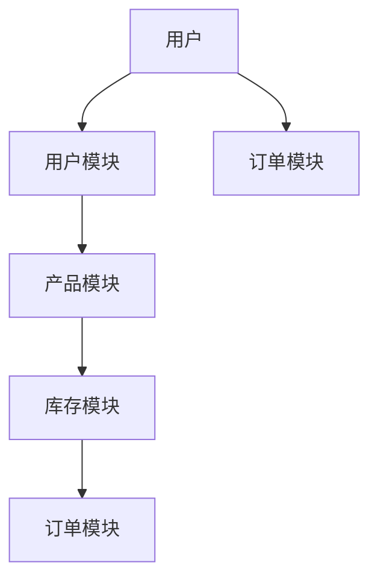
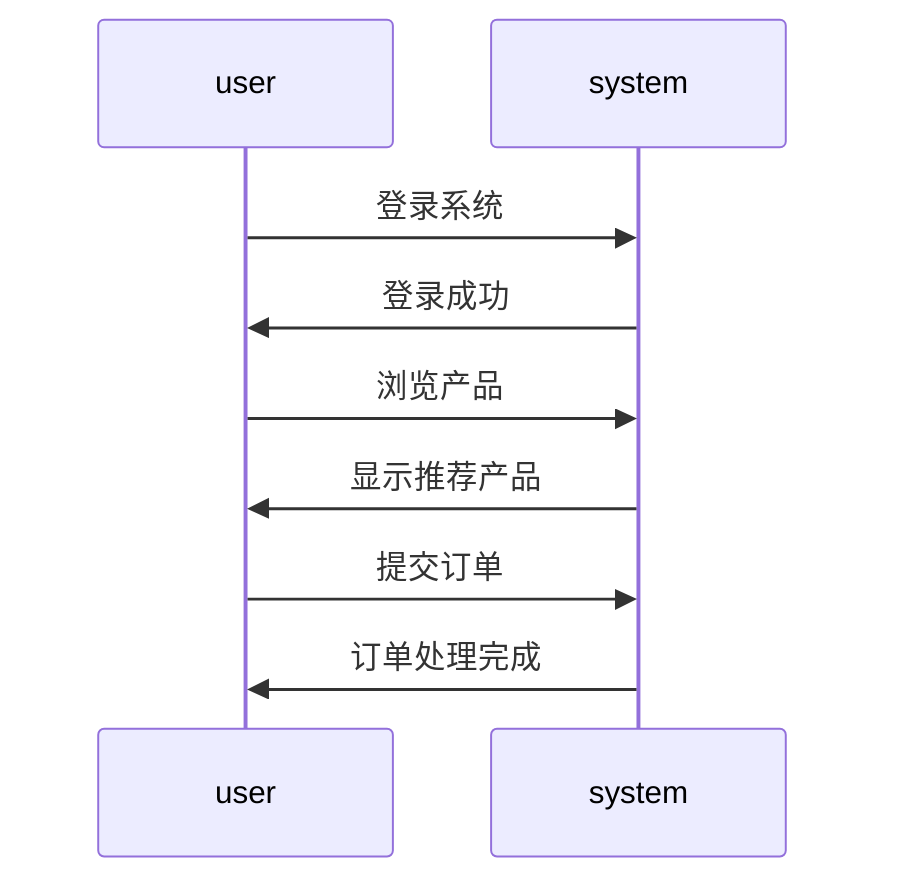

                 


# AI Agent在智能零售中的应用实践

---

## 关键词

AI Agent, 智能零售, 人工智能, 零售技术, 智能化应用

---

## 摘要

随着人工智能技术的飞速发展，AI Agent（人工智能代理）在智能零售中的应用日益广泛。本文将从AI Agent的基本概念、核心原理出发，深入探讨其在智能零售中的应用场景，包括智能推荐、客户行为分析、库存管理等。通过实际项目案例的分析，结合主流AI Agent框架，详细讲解系统的架构设计、接口设计和交互设计。最后，我们将总结AI Agent在智能零售中的最佳实践，并展望未来的发展趋势。

---

## 第1章: AI Agent与智能零售概述

### 1.1 AI Agent的基本概念

#### 1.1.1 AI Agent的定义与特点

AI Agent（人工智能代理）是一种能够感知环境、自主决策并执行任务的智能实体。它可以理解为一种软件或实体，通过传感器或数据输入获取信息，利用算法进行分析和推理，并通过执行器或输出模块采取行动。

- **定义**：AI Agent能够根据环境信息自主决策，执行任务以达到目标。
- **特点**：
  - **自主性**：无需外部干预，自主完成任务。
  - **反应性**：能够实时感知环境变化并做出反应。
  - **目标导向性**：所有行为都以实现特定目标为导向。

#### 1.1.2 智能零售的定义与特点

智能零售是利用人工智能、大数据、物联网等技术，提升零售行业的效率和用户体验的新型零售模式。

- **定义**：智能零售通过技术手段，实现零售过程的智能化、自动化和个性化。
- **特点**：
  - **数据驱动**：依赖数据进行决策。
  - **用户体验优化**：通过个性化推荐和互动提升用户体验。
  - **高效运营**：通过自动化技术降低成本，提高效率。

#### 1.1.3 AI Agent在智能零售中的作用

AI Agent在智能零售中扮演着关键角色，主要体现在以下几个方面：

- **智能推荐**：通过分析用户行为和偏好，提供个性化的产品推荐。
- **客户行为分析**：利用AI Agent分析客户的购买行为，优化营销策略。
- **库存管理**：通过实时监控库存信息，优化库存分配和补货策略。

---

### 1.2 AI Agent与智能零售的演进

#### 1.2.1 传统零售模式的局限性

传统零售模式主要依赖人工操作，存在以下问题：

- **效率低下**：人工操作耗时且容易出错。
- **用户体验单一**：无法提供个性化的购物体验。
- **数据利用率低**：难以充分利用数据进行决策。

#### 1.2.2 AI技术对零售行业的变革

人工智能技术的引入，为零售行业带来了颠覆性的变革：

- **数据驱动决策**：通过大数据分析，精准预测市场需求。
- **个性化服务**：利用AI技术提供个性化的购物体验。
- **自动化运营**：通过自动化技术降低成本，提高效率。

#### 1.2.3 AI Agent在智能零售中的演进路径

AI Agent在智能零售中的应用经历了以下几个阶段：

1. **单一任务代理**：AI Agent仅执行单一任务，如产品推荐。
2. **多任务协作**：AI Agent能够协同完成多个任务，如推荐、库存管理等。
3. **智能决策与优化**：AI Agent能够自主学习和优化，提高决策的准确性。

---

### 1.3 AI Agent在智能零售中的应用价值

#### 1.3.1 提升用户体验

AI Agent通过个性化推荐和智能互动，显著提升了用户的购物体验。

- **个性化推荐**：根据用户的历史行为和偏好，推荐相关产品。
- **智能互动**：通过自然语言处理技术，提供实时的客户服务。

#### 1.3.2 优化运营效率

AI Agent通过自动化和智能化的手段，优化了零售行业的运营效率。

- **自动化库存管理**：实时监控库存信息，优化库存分配。
- **智能供应链管理**：通过预测需求，优化供应链的运作。

#### 1.3.3 降低成本与资源浪费

AI Agent通过精准预测和优化资源配置，降低了成本和资源浪费。

- **精准预测需求**：减少库存积压和过剩。
- **优化人员配置**：通过自动化减少人工干预，降低人力成本。

---

## 第2章: AI Agent的核心原理与技术特点

### 2.1 AI Agent的基本原理

#### 2.1.1 知识表示与推理

知识表示是AI Agent理解世界的基础，常见的知识表示方法包括：

- **语义网络**：通过节点和边表示概念及其关系。
- **规则库**：通过一系列的规则来表示知识。
- **概率模型**：通过概率分布表示不确定性知识。

#### 2.1.2 行为决策与规划

行为决策是AI Agent的核心功能，主要包括以下几个步骤：

1. **目标设定**：明确AI Agent需要完成的目标。
2. **环境感知**：通过传感器或数据源获取环境信息。
3. **决策推理**：基于当前状态和目标，生成可行的行动计划。
4. **行动计划执行**：执行决策并反馈结果。

#### 2.1.3 人机交互与反馈机制

人机交互是AI Agent与用户或系统进行互动的桥梁，常见的交互方式包括：

- **自然语言处理（NLP）**：通过文本或语音进行交互。
- **图形用户界面（GUI）**：通过可视化界面进行交互。
- **反馈机制**：通过用户反馈优化AI Agent的行为。

---

### 2.2 AI Agent的核心技术特点

#### 2.2.1 多模态感知能力

多模态感知能力是指AI Agent能够同时处理多种类型的数据，如文本、图像、语音等。这种能力使得AI Agent能够更全面地感知环境，做出更准确的决策。

- **文本处理**：通过NLP技术理解用户的文本输入。
- **图像处理**：通过计算机视觉技术识别图像中的信息。
- **语音处理**：通过语音识别技术理解用户的语音指令。

#### 2.2.2 自适应学习能力

自适应学习能力是指AI Agent能够根据环境的变化和新的数据，不断优化自身的模型和策略。

- **监督学习**：通过标记数据进行训练，逐步优化模型。
- **无监督学习**：通过无标记数据进行聚类分析，发现数据中的模式。
- **强化学习**：通过与环境的互动，学习最优的决策策略。

#### 2.2.3 实时决策能力

实时决策能力是指AI Agent能够在极短的时间内，根据当前的环境信息做出决策并执行。

- **实时数据处理**：通过流数据处理技术，实时获取和处理数据。
- **快速推理**：通过高效的推理算法，快速生成决策结果。
- **即时反馈**：通过即时的反馈机制，优化决策过程。

---

### 2.3 AI Agent与传统AI的区别

#### 2.3.1 从规则驱动到数据驱动

传统AI主要依赖于预先设定的规则和逻辑，而AI Agent则更加依赖于数据驱动的决策。

- **规则驱动**：基于预设的规则进行决策，灵活性差。
- **数据驱动**：通过数据分析和机器学习，动态调整决策策略。

#### 2.3.2 从单一任务到多任务协作

传统AI通常专注于完成单一任务，而AI Agent能够同时处理多个任务，并通过协作完成复杂的任务。

- **单一任务**：仅执行一个特定的任务。
- **多任务协作**：通过任务分解和协作，完成复杂的综合性任务。

#### 2.3.3 从被动响应到主动决策

传统AI通常是对输入的被动响应，而AI Agent能够主动感知环境并发起行动。

- **被动响应**：仅对输入做出反应，不主动发起行动。
- **主动决策**：通过环境感知和目标导向，自主发起行动。

---

## 第3章: 主流AI Agent框架与工具

### 3.1 常见AI Agent框架介绍

#### 3.1.1 Rasa框架

Rasa是一个开源的AI Agent框架，主要用于构建对话式AI Agent。它支持多种输入形式，如文本、语音和图形界面，并能够通过机器学习模型进行训练和优化。

- **核心功能**：
  - 对话管理：通过对话树定义对话流程。
  - 自然语言处理：通过NLU（自然语言理解）模块理解用户输入。
  - 响应生成：通过NLG（自然语言生成）模块生成回复。

- **优势**：
  - 开源免费，支持社区协作。
  - 支持多种输入和输出形式，适用性强。

#### 3.1.2 Microsoft Bot Framework

微软Bot Framework是一个用于构建和部署AI Agent的平台，广泛应用于企业级应用。

- **核心功能**：
  - 聊天机器人开发：通过预定义的对话流程和模板快速构建聊天机器人。
  - 智能对话：通过集成Azure AI服务，提供智能的对话体验。
  - 多平台支持：支持多种聊天平台，如Slack、Teams等。

- **优势**：
  - 集成性强，支持微软生态。
  - 提供丰富的开发工具和文档支持。

#### 3.1.3 Apache Airflow

Apache Airflow是一个用于工作流和任务调度的开源平台，常用于构建AI Agent的工作流。

- **核心功能**：
  - 工作流定义：通过DAG（有向无环图）定义任务流程。
  - 任务调度：通过定时任务调度，自动化执行任务。
  - 日志与监控：提供任务日志和监控功能，便于调试和优化。

- **优势**：
  - 灵活性高，支持多种任务类型。
  - 开源免费，社区活跃，支持扩展。

---

### 3.2 AI Agent框架的特点对比

#### 3.2.1 功能对比

| 框架名称   | Rasa          | Microsoft Bot Framework | Apache Airflow |
|------------|---------------|-------------------------|----------------|
| 对话管理   | 强大           | 强大                   | 无             |
| 自然语言处理 | 支持           | 支持                   | 无             |
| 任务调度   | 无             | 无                     | 强大           |

#### 3.2.2 性能对比

| 框架名称   | Rasa          | Microsoft Bot Framework | Apache Airflow |
|------------|---------------|-------------------------|----------------|
| 响应速度   | 中等           | 中等                   | 高             |
| 并发能力   | 中等           | 中等                   | 高             |
| 可扩展性   | 高             | 中等                   | 高             |

#### 3.2.3 适用场景对比

| 框架名称   | Rasa          | Microsoft Bot Framework | Apache Airflow |
|------------|---------------|-------------------------|----------------|
| 对话机器人 | 优             | 优                     | 无             |
| 任务调度   | 无             | 无                     | 优             |
| 大规模部署 | 中等           | 中等                   | 优             |

---

### 3.3 AI Agent工具的优缺点分析

#### 3.3.1 开源工具的优势

- **成本低**：开源工具通常免费，降低企业的初始投入。
- **灵活性高**：可以根据需求进行定制化开发。
- **社区支持**：开源社区通常活跃，能够获得及时的技术支持和更新。

#### 3.3.2 商业化工具的劣势

- **成本高**：商业化工具通常需要购买许可证，增加了企业的成本。
- **灵活性低**：商业化工具通常功能固定，难以根据需求进行定制化开发。
- **依赖性高**：商业化工具通常依赖供应商的支持，一旦供应商出现问题，可能会影响企业的正常运营。

#### 3.3.3 自定义框架的灵活性

- **高度定制化**：可以根据具体需求进行定制化开发，满足企业的特殊需求。
- **性能优化**：可以根据具体场景进行优化，提高系统的性能和效率。
- **长期维护**：需要企业自身进行长期的技术支持和维护，增加了企业的技术负担。

---

## 第4章: 智能零售中的AI Agent应用场景

### 4.1 智能推荐

#### 4.1.1 智能推荐的基本原理

智能推荐是基于用户的购买历史、浏览行为、搜索记录等数据，通过机器学习算法，推荐相关的产品或服务。

- **协同过滤**：基于用户行为相似性，推荐相似产品。
- **基于内容的推荐**：基于产品属性和用户偏好，推荐相关产品。
- **混合推荐**：结合协同过滤和基于内容的推荐，提高推荐的准确性和多样性。

#### 4.1.2 智能推荐的实现步骤

1. **数据收集**：收集用户的行为数据，包括购买记录、浏览记录、搜索记录等。
2. **数据预处理**：对数据进行清洗、归一化和特征提取。
3. **模型训练**：选择合适的推荐算法，训练推荐模型。
4. **推荐生成**：根据用户的行为数据，生成推荐列表。
5. **结果输出**：将推荐结果输出到前端，供用户查看。

#### 4.1.3 智能推荐的实际案例

假设我们有一个在线购物平台，用户A经常购买电子产品，系统会基于用户的购买历史和浏览记录，推荐相关的电子产品、配件以及用户可能感兴趣的相关产品。

---

### 4.2 客户行为分析

#### 4.2.1 客户行为分析的基本原理

客户行为分析是通过分析客户在购物过程中的行为，预测客户的购买倾向和需求。

- **数据采集**：通过网站监控、传感器等技术，采集客户的行为数据。
- **数据分析**：通过数据挖掘和机器学习技术，分析客户的购买倾向和需求。
- **结果应用**：根据分析结果，优化营销策略和客户服务。

#### 4.2.2 客户行为分析的实现步骤

1. **数据收集**：收集客户的行为数据，包括点击流数据、浏览路径、停留时间等。
2. **数据预处理**：对数据进行清洗、归一化和特征提取。
3. **模型训练**：选择合适的行为分析算法，训练分析模型。
4. **行为预测**：根据模型预测客户的购买倾向和需求。
5. **结果应用**：根据预测结果，优化营销策略和客户服务。

#### 4.2.3 客户行为分析的实际案例

假设我们有一个超市，通过分析客户的购买记录和浏览行为，发现客户A经常购买牛奶和面包，预测客户A可能在下次购买时购买黄油。系统会自动推荐黄油给客户A，并提供相关的优惠信息。

---

### 4.3 库存管理

#### 4.3.1 库存管理的基本原理

库存管理是通过实时监控库存信息，优化库存分配和补货策略，减少库存积压和缺货。

- **库存监控**：通过传感器和数据采集系统，实时监控库存信息。
- **库存分析**：通过数据分析和预测模型，预测未来的需求。
- **库存优化**：根据预测结果，优化库存分配和补货策略。

#### 4.3.2 库存管理的实现步骤

1. **数据收集**：收集库存信息、销售记录、订单数据等。
2. **数据预处理**：对数据进行清洗、归一化和特征提取。
3. **模型训练**：选择合适的库存预测算法，训练预测模型。
4. **库存预测**：根据模型预测未来的需求和库存情况。
5. **库存优化**：根据预测结果，优化库存分配和补货策略。

#### 4.3.3 库存管理的实际案例

假设我们有一个连锁超市，通过分析各门店的销售数据和库存信息，预测未来的需求，优化库存分配，减少库存积压和缺货现象。

---

## 第5章: 算法原理与实现

### 5.1 智能推荐算法

#### 5.1.1 协同过滤算法

协同过滤是一种基于用户行为相似性推荐产品的算法。

- **基本原理**：通过计算用户之间的相似性，推荐相似用户的购买记录中的产品。
- **实现步骤**：
  1. **构建用户-物品矩阵**：记录用户对物品的评分或购买行为。
  2. **计算相似性**：通过余弦相似性或欧几里得距离计算用户之间的相似性。
  3. **生成推荐列表**：根据相似用户的购买记录，生成推荐列表。

#### 5.1.2 基于内容的推荐算法

基于内容的推荐算法是通过分析产品属性和用户偏好，推荐相关产品。

- **基本原理**：通过提取产品特征和用户偏好，计算产品与用户的相关性。
- **实现步骤**：
  1. **提取特征**：从产品描述中提取关键词或向量表示。
  2. **计算相关性**：通过余弦相似性或点积计算产品与用户的相关性。
  3. **生成推荐列表**：根据相关性排序，生成推荐列表。

#### 5.1.3 混合推荐算法

混合推荐算法是结合协同过滤和基于内容的推荐，提高推荐的准确性和多样性。

- **基本原理**：通过集成协同过滤和基于内容的推荐，生成综合推荐列表。
- **实现步骤**：
  1. **生成协同过滤推荐**：根据用户相似性生成推荐列表。
  2. **生成基于内容的推荐**：根据产品特征生成推荐列表。
  3. **综合推荐列表**：将两种推荐结果进行加权融合，生成最终推荐列表。

---

### 5.2 库存管理算法

#### 5.2.1 时间序列预测算法

时间序列预测是一种通过历史数据预测未来需求的算法。

- **基本原理**：通过历史数据建立时间序列模型，预测未来的需求。
- **实现步骤**：
  1. **数据预处理**：对时间序列数据进行平稳化处理。
  2. **模型训练**：选择合适的时间序列模型，如ARIMA、LSTM等。
  3. **需求预测**：根据模型预测未来的需求。

#### 5.2.2 基于机器学习的库存优化算法

基于机器学习的库存优化算法是通过机器学习模型优化库存分配和补货策略。

- **基本原理**：通过机器学习模型预测需求，优化库存分配和补货策略。
- **实现步骤**：
  1. **数据收集**：收集销售数据、库存数据、订单数据等。
  2. **数据预处理**：对数据进行清洗、归一化和特征提取。
  3. **模型训练**：选择合适的机器学习模型，训练预测模型。
  4. **库存优化**：根据预测结果，优化库存分配和补货策略。

---

## 第6章: 系统设计与实现

### 6.1 系统架构设计

#### 6.1.1 系统功能模块

- **用户模块**：用户注册、登录、浏览、购买。
- **产品模块**：产品信息管理、产品推荐。
- **库存模块**：库存监控、库存预测、库存优化。
- **订单模块**：订单管理、订单处理、订单查询。

#### 6.1.2 系统架构图



---

### 6.2 系统接口设计

#### 6.2.1 API接口设计

- **用户模块接口**：
  - `/api/register`：用户注册。
  - `/api/login`：用户登录。
  - `/api/profile`：获取用户信息。

- **产品模块接口**：
  - `/api/products`：获取产品列表。
  - `/api/recommend`：获取推荐产品。

- **库存模块接口**：
  - `/api/stock`：获取库存信息。
  - `/api/stock预测`：获取库存预测结果。

- **订单模块接口**：
  - `/api/order`：提交订单。
  - `/api/order查询`：查询订单状态。

#### 6.2.2 接口交互流程

1. 用户登录系统。
2. 系统通过用户模块验证用户身份。
3. 用户浏览产品列表。
4. 系统通过产品模块推荐相关产品。
5. 用户提交订单。
6. 系统通过订单模块处理订单。

---

### 6.3 系统交互设计

#### 6.3.1 交互流程图



---

## 第7章: 项目实战

### 7.1 环境安装

#### 7.1.1 安装Python

```bash
# 安装Python
sudo apt-get install python3
```

#### 7.1.2 安装依赖库

```bash
# 安装依赖库
pip install numpy
pip install pandas
pip install scikit-learn
pip install rasa
```

---

### 7.2 系统核心实现

#### 7.2.1 推荐系统实现

```python
from sklearn.metrics.pairwise import cosine_similarity

# 定义协同过滤算法
def collaborative_filtering(user_matrix):
    similarity = cosine_similarity(user_matrix)
    return similarity

# 定义基于内容的推荐算法
def content_based_recommendation(product_features):
    similarity = cosine_similarity(product_features)
    return similarity

# 定义混合推荐算法
def hybrid_recommendation(user_matrix, product_features):
    # 加权融合协同过滤和基于内容的推荐
    weight_cf = 0.5
    weight_cb = 0.5
    similarity = weight_cf * collaborative_filtering(user_matrix) + weight_cb * content_based_recommendation(product_features)
    return similarity
```

#### 7.2.2 库存管理实现

```python
from statsmodels.tsa.arima_model import ARIMA

# 定义时间序列预测模型
def time_series_forecast(data):
    model = ARIMA(data, order=(1, 1, 1))
    model_fit = model.fit(disp=0)
    forecast = model_fit.forecast(steps=30)
    return forecast

# 定义库存优化策略
def inventory_optimization(predicted_demand, current_stock):
    safety_stock = current_stock * 0.1
    reorder_point = predicted_demand + safety_stock
    return reorder_point
```

---

### 7.3 实际案例分析

#### 7.3.1 案例背景

假设我们有一个在线购物平台，需要通过AI Agent实现智能推荐和库存管理。

#### 7.3.2 数据准备

1. **用户数据**：包括用户ID、购买记录、浏览记录、搜索记录。
2. **产品数据**：包括产品ID、产品名称、产品描述、产品类别。
3. **销售数据**：包括订单ID、订单时间、订单金额、订单数量。

#### 7.3.3 系统实现

1. **推荐系统实现**：
   - 通过协同过滤算法推荐相似用户的购买记录。
   - 通过基于内容的推荐算法推荐相关产品。
   - 通过混合推荐算法生成综合推荐列表。

2. **库存管理实现**：
   - 通过时间序列预测模型预测未来需求。
   - 通过库存优化策略优化库存分配和补货策略。

---

## 第8章: 最佳实践与未来展望

### 8.1 项目经验总结

- **数据质量**：数据质量直接影响推荐的准确性和库存预测的准确性。
- **模型选择**：选择合适的算法和模型，能够提高系统的性能和效率。
- **系统设计**：合理的设计系统架构和接口，能够提高系统的可扩展性和可维护性。

### 8.2 未来展望

随着人工智能技术的不断进步，AI Agent在智能零售中的应用将更加广泛和深入。

- **多模态交互**：未来的AI Agent将支持更多的交互方式，如语音、图像、手势等。
- **自适应学习**：未来的AI Agent将具有更强的自适应学习能力，能够根据环境的变化动态调整策略。
- **边缘计算**：未来的AI Agent将结合边缘计算技术，实现更快速、更高效的决策和执行。

---

## 作者

作者：AI天才研究院/AI Genius Institute & 禅与计算机程序设计艺术 /Zen And The Art of Computer Programming

