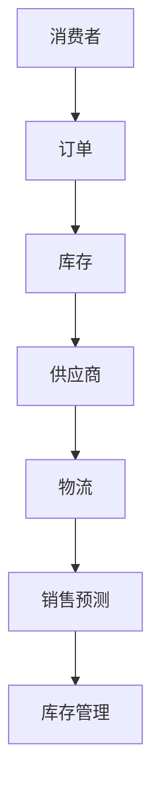
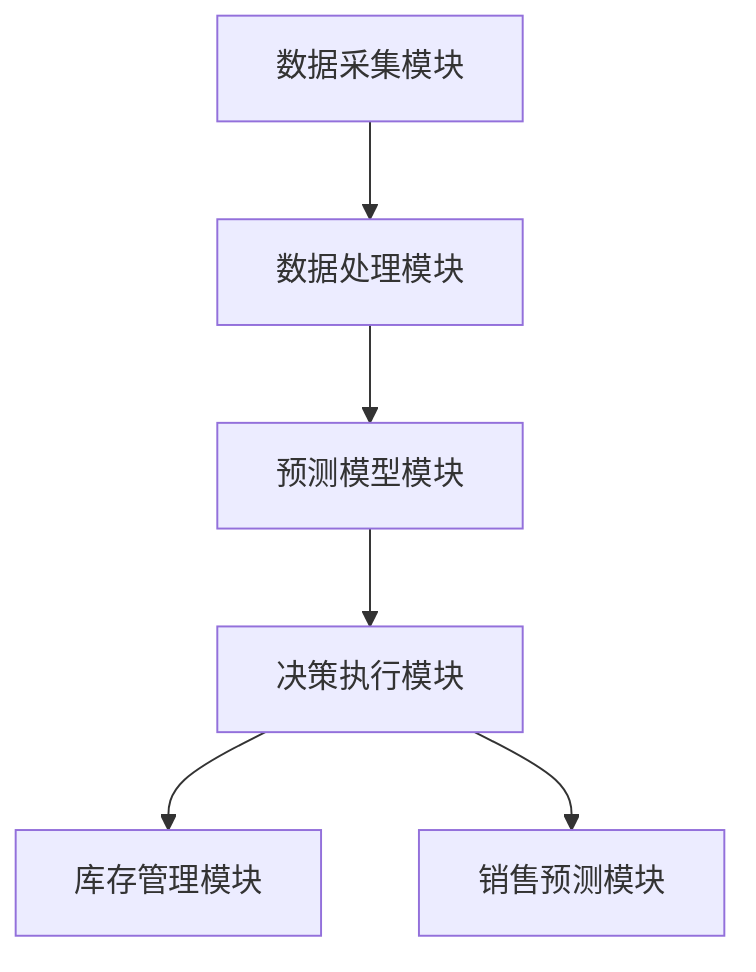
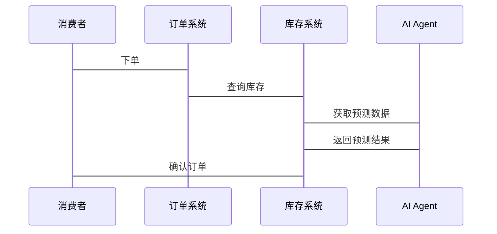

                 


# AI Agent在智能零售中的应用：库存管理与销售预测

## 关键词：AI Agent, 智能零售, 库存管理, 销售预测, 机器学习, 深度学习, 知识图谱

## 摘要：  
随着人工智能技术的飞速发展，AI Agent（人工智能代理）在智能零售中的应用日益广泛。本文深入探讨了AI Agent在库存管理和销售预测中的具体应用，结合实际案例和算法原理，分析了其在智能零售中的优势和挑战。文章从AI Agent的基本概念、算法原理、系统架构到项目实战，全面解析了其在智能零售中的应用，并提出了未来的发展方向和最佳实践建议。

---

## 第一章：AI Agent与智能零售的背景介绍

### 1.1 AI Agent的基本概念  
AI Agent是一种能够感知环境、自主决策并执行任务的智能体。它具备以下核心属性：  
- **自主性**：能够在没有外部干预的情况下自主运行。  
- **反应性**：能够实时感知环境变化并做出响应。  
- **目标导向**：以特定目标为导向，优化决策过程。  

### 1.2 智能零售的定义与特点  
智能零售是通过大数据、人工智能、物联网等技术，实现零售过程的智能化、自动化和个性化。其特点包括：  
- **数据驱动**：利用数据进行决策。  
- **实时响应**：能够快速响应客户需求和市场变化。  
- **个性化服务**：基于客户行为数据分析，提供个性化的产品推荐和营销策略。  

### 1.3 AI Agent在智能零售中的应用背景  
随着零售行业的快速发展，传统库存管理和销售预测方法逐渐暴露出效率低、精准度差等问题。AI Agent通过实时数据处理和智能决策，能够有效解决这些问题，提高零售企业的竞争力。  

### 1.4 本章小结  
本章介绍了AI Agent的基本概念和智能零售的定义与特点，并重点阐述了AI Agent在智能零售中的应用背景，为后续内容奠定了基础。

---

## 第二章：AI Agent的核心概念与原理

### 2.1 AI Agent的任务分解  
AI Agent在智能零售中的任务可以分解为以下几个步骤：  
1. **数据收集**：从传感器、数据库等来源获取实时数据。  
2. **数据处理**：对收集到的数据进行清洗、转换和分析。  
3. **决策制定**：基于分析结果，制定最优决策。  
4. **任务执行**：根据决策结果执行相关操作（如调整库存、优化销售策略）。  

### 2.2 AI Agent的知识表示  
知识表示是AI Agent进行推理和决策的基础。常用的知识表示方法包括：  
- **知识图谱**：通过图结构表示实体及其关系。  
- **规则引擎**：基于逻辑规则进行推理。  
- **神经网络**：通过深度学习模型提取隐含知识。  

### 2.3 AI Agent的推理机制  
推理机制是AI Agent的核心功能之一，主要包括：  
- **逻辑推理**：基于逻辑规则进行推理。  
- **概率推理**：基于概率论进行不确定性推理。  
- **强化学习**：通过试错机制优化决策策略。  

### 2.4 AI Agent的学习与优化  
AI Agent通过机器学习和深度学习算法不断优化自身的决策能力。常用算法包括：  
- **监督学习**：基于标记数据进行分类或回归。  
- **无监督学习**：基于无标记数据进行聚类或降维。  
- **强化学习**：通过奖励机制优化决策策略。  

### 2.5 AI Agent与智能零售的实体关系图  
以下是一个简单的实体关系图：  


### 2.6 本章小结  
本章详细阐述了AI Agent的核心概念与原理，包括任务分解、知识表示、推理机制和学习优化，并通过实体关系图展示了AI Agent在智能零售中的应用架构。

---

## 第三章：AI Agent的算法原理与数学模型

### 3.1 基于强化学习的销售预测算法  
强化学习是一种通过试错机制优化决策的算法。其基本流程如下：  
1. **状态定义**：定义系统当前的状态（如库存量、销售量）。  
2. **动作选择**：基于当前状态选择一个动作（如调整价格、促销）。  
3. **奖励机制**：根据动作的结果给予奖励或惩罚。  
4. **策略优化**：通过不断调整策略以最大化累计奖励。  

### 3.2 基于时间序列分析的库存管理算法  
时间序列分析是一种常用的库存预测方法。其核心公式为：  
$$ \hat{y}_t = a \cdot y_{t-1} + b \cdot t + c $$  
其中，$\hat{y}_t$ 是预测值，$y_{t-1}$ 是前一时刻的观测值，$t$ 是时间，$a$、$b$、$c$ 是模型参数。  

### 3.3 算法实现示例  
以下是一个基于强化学习的库存管理算法的Python代码示例：  
```python
import numpy as np
from collections import deque

class InventoryAgent:
    def __init__(self, state_size, action_size):
        self.state_size = state_size
        self.action_size = action_size
        self.memory = deque(maxlen=1000)
        self.gamma = 0.95
        self.epsilon = 1.0
        self.epsilon_min = 0.01
        self.epsilon_decay = 0.995
        self.model = self._build_model()

    def _build_model(self):
        # 构建神经网络模型
        pass

    def act(self, state):
        if np.random.random() < self.epsilon:
            return np.random.randint(0, self.action_size)
        return self.model.predict(state)[0]

    def remember(self, state, action, reward, next_state):
        self.memory.append((state, action, reward, next_state))

    def replay(self, batch_size):
        # 回放记忆并训练模型
        pass
```

### 3.4 本章小结  
本章重点介绍了AI Agent在智能零售中的算法原理与数学模型，包括强化学习和时间序列分析，并通过代码示例展示了算法的实现过程。

---

## 第四章：AI Agent的系统分析与架构设计

### 4.1 系统功能设计  
智能零售系统的功能模块包括：  
- **数据采集模块**：采集销售数据、库存数据等。  
- **数据处理模块**：对数据进行清洗和转换。  
- **预测模型模块**：基于历史数据进行销售预测和库存优化。  
- **决策执行模块**：根据预测结果执行相关操作（如补货、调价）。  

### 4.2 系统架构设计  
以下是系统的架构图：  


### 4.3 系统交互设计  
以下是系统交互流程图：  


### 4.4 本章小结  
本章详细分析了AI Agent在智能零售系统中的功能设计、架构设计和交互设计，并通过图表展示了系统的整体架构。

---

## 第五章：AI Agent的项目实战

### 5.1 环境安装与配置  
首先，安装所需的Python库：  
```bash
pip install numpy pandas scikit-learn tensorflow
```

### 5.2 核心代码实现  
以下是一个基于强化学习的库存管理代码示例：  
```python
import numpy as np
import pandas as pd
from sklearn.preprocessing import MinMaxScaler
from tensorflow.keras import Sequential
from tensorflow.keras.layers import Dense, LSTM

# 数据预处理
data = pd.read_csv('inventory.csv')
data = data['inventory'].values
data = data.reshape(-1, 1)
scaler = MinMaxScaler()
data_scaled = scaler.fit_transform(data)

# 模型构建
model = Sequential()
model.add(LSTM(50, input_shape=(1, 1)))
model.add(Dense(1))
model.compile(loss='mean_squared_error', optimizer='adam')

# 模型训练
model.fit(data_scaled[:-100], data_scaled[100:], epochs=100, batch_size=32)

# 模型预测
test_data = data_scaled[-100:]
predicted = model.predict(test_data)
```

### 5.3 实际案例分析  
通过上述代码，我们可以实现对库存数据的预测和优化。例如，假设我们有100天的库存数据，可以使用LSTM模型预测未来100天的库存需求。  

### 5.4 本章小结  
本章通过实际案例展示了AI Agent在智能零售中的应用，详细介绍了环境配置、代码实现和案例分析。

---

## 第六章：AI Agent的最佳实践与注意事项

### 6.1 数据质量的重要性  
数据质量直接影响AI Agent的性能。需要确保数据的完整性、准确性和及时性。  

### 6.2 模型调优技巧  
- **参数优化**：通过网格搜索或随机搜索优化模型参数。  
- **模型评估**：使用交叉验证评估模型性能。  
- **持续学习**：定期更新模型以适应数据变化。  

### 6.3 安全性和隐私保护  
在实际应用中，需要特别注意数据的安全性和隐私保护，避免数据泄露和滥用。  

### 6.4 未来技术趋势  
随着技术的发展，AI Agent在智能零售中的应用将更加广泛和深入，例如结合区块链技术实现更加透明和安全的供应链管理。

### 6.5 本章小结  
本章总结了AI Agent在智能零售中的最佳实践和注意事项，并展望了未来的技术发展趋势。

---

## 作者：AI天才研究院/AI Genius Institute & 禅与计算机程序设计艺术 /Zen And The Art of Computer Programming  

---

**本文版权归作者所有，转载请注明出处。**

