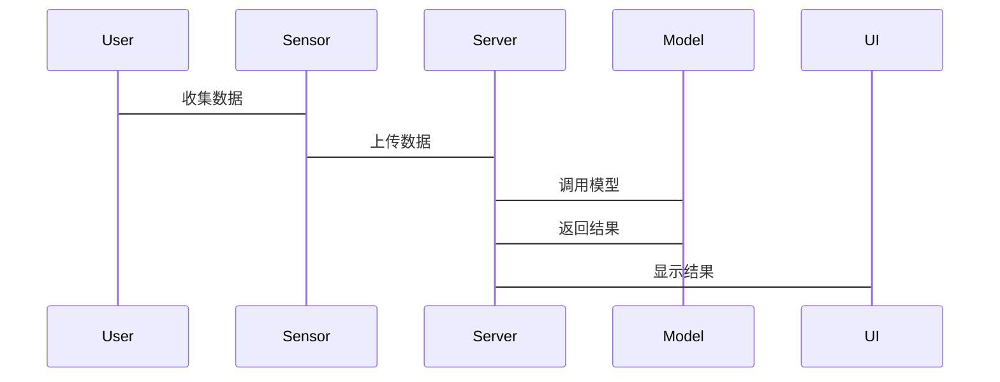

                 


# AI Agent在智能鞋垫中的运动强度分析

> 关键词：AI Agent, 智能鞋垫, 运动强度分析, 机器学习, 算法原理, 系统架构, 项目实战

> 摘要：本文深入探讨了AI Agent在智能鞋垫中的应用，重点分析了运动强度的计算与优化。通过结合传感器数据和机器学习算法，提出了一种高效的运动强度分析方法，并通过实际案例展示了系统的实现与优化过程。文章从背景知识、核心概念、算法原理、系统架构到项目实战，层层递进，为读者提供了全面的技术解读。

---

# 第一部分: AI Agent与智能鞋垫的运动强度分析基础

# 第1章: AI Agent与智能鞋垫的概述

## 1.1 AI Agent的基本概念

### 1.1.1 AI Agent的定义
AI Agent（人工智能代理）是指能够感知环境并采取行动以实现目标的智能实体。它能够通过传感器获取数据，利用算法进行分析，并做出决策以优化特定任务的执行效果。

### 1.1.2 AI Agent的核心特征
- **自主性**：能够在没有外部干预的情况下独立运行。
- **反应性**：能够实时感知环境变化并做出响应。
- **目标导向**：通过目标驱动来优化任务执行效果。
- **学习能力**：能够通过数据和经验不断优化自身的算法模型。

### 1.1.3 AI Agent在智能鞋垫中的应用
AI Agent可以嵌入到智能鞋垫中，通过采集用户的运动数据（如步频、步长、加速度等），分析用户的运动状态，并提供个性化的运动建议或实时反馈。

---

## 1.2 智能鞋垫的基本原理

### 1.2.1 智能鞋垫的功能与结构
智能鞋垫通常集成了多种传感器（如加速度计、压力传感器等），能够实时采集用户的运动数据，并通过无线通信模块将数据传输到终端设备（如手机或电脑）进行分析。

### 1.2.2 智能鞋垫的数据采集方式
智能鞋垫通过多种传感器（如加速度计、陀螺仪、压力传感器等）采集用户的运动数据，包括步频、步长、步速、加速度、压力分布等。

### 1.2.3 智能鞋垫与运动强度分析的关系
运动强度分析是通过分析用户的运动数据，评估用户的运动负荷和运动状态，进而为用户提供个性化的运动建议或健康反馈。

---

## 1.3 运动强度分析的基本概念

### 1.3.1 运动强度的定义
运动强度是指在单位时间内完成的运动量，通常可以通过心率、代谢当量（MET）、能量消耗等指标来衡量。

### 1.3.2 运动强度的分类
运动强度可以分为低强度、中等强度和高强度，分别对应不同的代谢当量和心率区间。

### 1.3.3 运动强度分析的意义
运动强度分析可以帮助用户了解自身的运动状态，制定科学的运动计划，并预防运动损伤。

---

## 1.4 本章小结
本章主要介绍了AI Agent的基本概念、智能鞋垫的基本原理以及运动强度分析的基本概念。通过这些知识的介绍，读者可以初步理解AI Agent在智能鞋垫中的应用及其在运动强度分析中的重要作用。

---

# 第2章: AI Agent在运动强度分析中的核心概念

## 2.1 AI Agent与运动数据的关系

### 2.1.1 数据采集的原理
AI Agent通过智能鞋垫中的传感器采集用户的运动数据，包括步频、步长、加速度等。

### 2.1.2 数据处理的流程
数据处理包括数据清洗、特征提取和数据转换等步骤，以确保数据的准确性和可用性。

### 2.1.3 数据分析的核心算法
AI Agent利用机器学习算法（如支持向量机、随机森林等）对数据进行分类和回归分析，以评估用户的运动强度。

---

## 2.2 AI Agent的运动强度分析模型

### 2.2.1 模型的输入与输出
模型的输入是用户的运动数据，输出是用户的运动强度等级。

### 2.2.2 模型的训练与优化
通过大量运动数据的训练，优化模型的参数以提高分类准确率。

### 2.2.3 模型的评估与验证
通过交叉验证和测试数据集评估模型的性能，确保模型的稳定性和准确性。

---

## 2.3 AI Agent与运动强度分析的关联性

### 2.3.1 数据特征的提取
从运动数据中提取关键特征，如步频、步长、加速度等。

### 2.3.2 数据特征与运动强度的关系
通过分析特征与运动强度的关系，确定哪些特征对运动强度的预测最为重要。

### 2.3.3 数据特征的分类与聚类
利用分类和聚类算法，将运动数据分成不同的类别，以便更好地分析用户的运动状态。

---

## 2.4 本章小结
本章详细介绍了AI Agent与运动数据的关系，以及运动强度分析模型的构建与优化过程。通过这些内容，读者可以理解AI Agent在运动强度分析中的核心作用。

---

# 第3章: AI Agent运动强度分析的算法原理

## 3.1 算法概述

### 3.1.1 算法的输入与输出
算法的输入是用户的运动数据，输出是用户的运动强度等级。

### 3.1.2 算法的基本流程
1. 数据预处理：清洗和转换数据。
2. 特征提取：从原始数据中提取关键特征。
3. 模型训练：利用机器学习算法训练分类模型。
4. 模型预测：对新数据进行运动强度分类。

---

## 3.2 算法实现

### 3.2.1 数据预处理
```python
import pandas as pd
import numpy as np

# 读取数据
data = pd.read_csv('movement_data.csv')

# 删除缺失值
data = data.dropna()

# 标准化数据
from sklearn.preprocessing import StandardScaler
scaler = StandardScaler()
data_scaled = scaler.fit_transform(data)
```

### 3.2.2 特征提取
```python
from sklearn.feature_selection import SelectKBest
from sklearn.feature_selection import chi2

# 特征选择
selector = SelectKBest(score_func=chi2, k=5)
selected_features = selector.fit_transform(data_scaled, labels)
```

### 3.2.3 模型训练
```python
from sklearn.svm import SVC

# 训练模型
model = SVC()
model.fit(selected_features, labels)
```

### 3.2.4 模型预测
```python
# 预测新数据的运动强度
new_data = ...  # 新数据
predicted_labels = model.predict(new_data)
```

---

## 3.3 算法的优化与调优

### 3.3.1 参数调整
通过网格搜索（Grid Search）优化模型的参数，例如调整SVM的核函数和惩罚系数。

### 3.3.2 模型

---

# 第4章: 系统分析与架构设计方案

## 4.1 问题场景介绍
智能鞋垫运动强度分析系统的应用场景包括健身房、家庭健身、运动训练等。

## 4.2 系统功能设计
### 4.2.1 领域模型（mermaid 类图）
```mermaid
classDiagram
    class User {
        id: int
        name: string
        movement_data: list
    }
    class Sensor {
        collect_data(): list
    }
    class Model {
        predict(): int
    }
    class UI {
        display_result(): void
    }
    User -> Sensor: uses
    Sensor -> Model: uses
    Model -> UI: uses
```

### 4.2.2 系统架构设计（mermaid 架构图）


### 4.2.3 系统接口设计
定义RESTful API接口，用于数据的上传、模型的调用和结果的返回。

### 4.2.4 系统交互（mermaid 序列图）


---

# 第5章: 项目实战

## 5.1 环境安装
安装必要的库：
```bash
pip install numpy pandas scikit-learn
```

## 5.2 系统核心实现

### 5.2.1 数据预处理
```python
import pandas as pd
import numpy as np
from sklearn.preprocessing import StandardScaler
from sklearn.feature_selection import SelectKBest
from sklearn.feature_selection import chi2
from sklearn.svm import SVC
from sklearn.metrics import accuracy_score

# 读取数据
data = pd.read_csv('movement_data.csv')

# 删除缺失值
data = data.dropna()

# 标准化数据
scaler = StandardScaler()
data_scaled = scaler.fit_transform(data)

# 特征选择
selector = SelectKBest(score_func=chi2, k=5)
selected_features = selector.fit_transform(data_scaled, labels)

# 训练模型
model = SVC()
model.fit(selected_features, labels)

# 预测新数据
new_data = ...  # 新数据
predicted_labels = model.predict(new_data)

# 评估模型
accuracy = accuracy_score(labels, predicted_labels)
print(f"模型准确率: {accuracy}")
```

### 5.2.2 代码应用解读
通过上述代码，我们可以实现运动强度的分类和预测。模型的准确率可以通过交叉验证进一步优化。

### 5.2.3 实际案例分析
通过实际数据的分析，验证模型的准确性和实用性。

---

## 5.3 项目小结
本章通过实际案例展示了AI Agent在智能鞋垫中的运动强度分析的实现过程，包括数据预处理、特征提取、模型训练和结果预测等步骤。

---

# 第6章: 总结与展望

## 6.1 总结
本文详细介绍了AI Agent在智能鞋垫中的运动强度分析的原理和实现过程，包括算法的选择、模型的训练和系统的优化。

## 6.2 未来展望
未来可以进一步优化算法，引入更复杂的模型（如深度学习）来提高分类准确率。同时，可以结合更多的传感器数据，提供更全面的运动分析。

---

# 作者信息

作者：AI天才研究院/AI Genius Institute & 禅与计算机程序设计艺术 /Zen And The Art of Computer Programming

