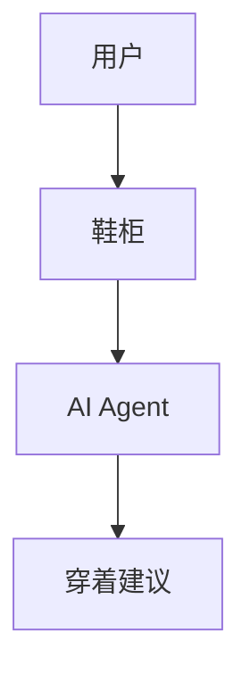
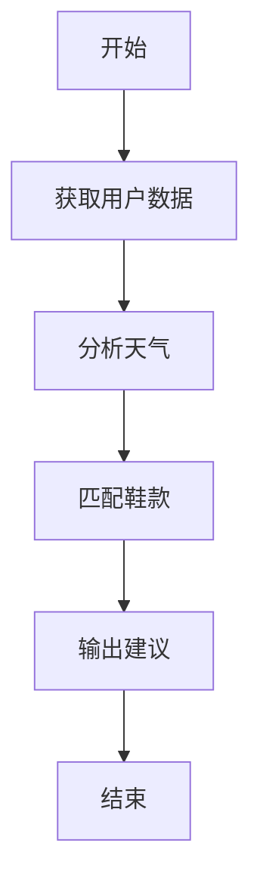
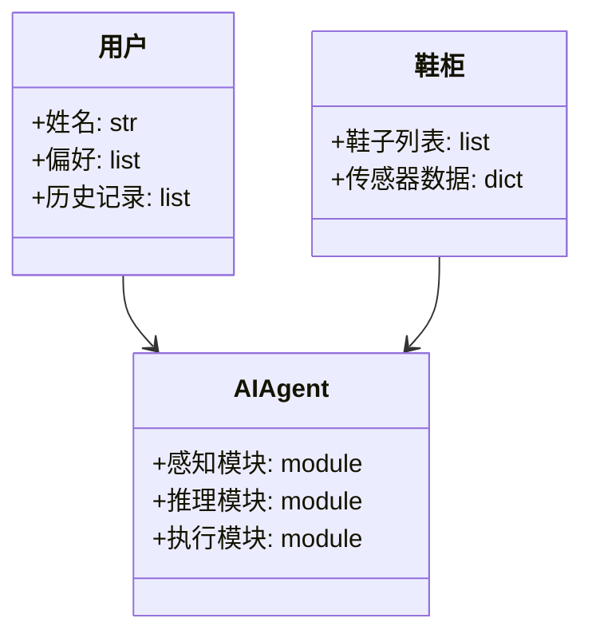
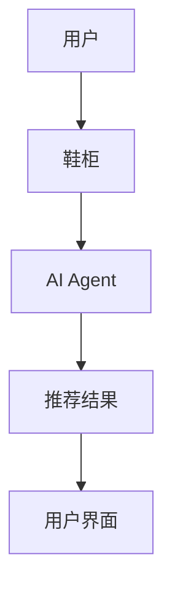
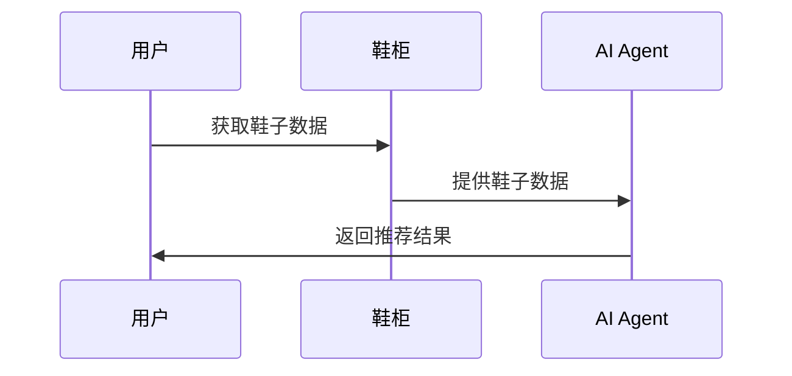

                 


# AI Agent在智能鞋柜中的穿着建议

## 关键词：AI Agent，智能鞋柜，穿着建议，系统架构，算法原理，时尚科技

## 摘要：  
本文详细探讨了AI Agent在智能鞋柜中的应用，重点分析了AI Agent如何通过感知、推理和执行模块为用户提供个性化的穿着建议。文章从背景介绍、核心概念、算法原理、系统架构到项目实战，层层深入，展示了AI技术在时尚科技领域的创新应用。通过实际案例分析，本文为读者提供了从理论到实践的全面指导，帮助用户更好地理解AI Agent在智能鞋柜中的工作原理和实际价值。

---

# 第1章: 背景介绍

## 1.1 问题背景与描述  
### 1.1.1 穿着建议的痛点分析  
在现代生活中，穿衣搭配已成为许多人日常生活中的重要决策。然而，面对复杂的天气变化、个人风格偏好和场合需求，用户往往难以快速找到合适的穿着建议。尤其是在鞋柜管理中，如何高效地为用户推荐合适的鞋子，成为一个亟待解决的问题。  

### 1.1.2 智能鞋柜的应用场景  
智能鞋柜通过物联网技术，能够实时监测鞋子的状态（如清洁度、磨损情况）并提供存储建议。然而，其功能还局限于存储和提醒，未能真正解决用户的穿衣搭配问题。  

### 1.1.3 AI Agent在鞋柜中的作用  
AI Agent（人工智能代理）能够通过分析用户的历史数据、天气预报和当前场合需求，为用户提供个性化的鞋子选择建议，从而优化用户的穿衣体验。  

## 1.2 问题解决与边界  
### 1.2.1 穿着建议的核心问题  
AI Agent需要解决的核心问题是：如何基于用户需求、环境数据和历史行为，提供精准的鞋子推荐。  

### 1.2.2 AI Agent的解决方案  
通过整合天气数据、用户偏好和鞋子属性（如材质、颜色、适用场合），AI Agent能够生成个性化的鞋子推荐。  

### 1.2.3 边界与外延  
AI Agent的功能边界包括鞋子推荐和存储管理，而其外延则可能延伸至服装搭配和时尚咨询等领域。  

## 1.3 核心概念与结构  
### 1.3.1 AI Agent的定义与组成  
AI Agent由感知模块、推理模块和执行模块组成，能够通过数据输入生成相应的输出建议。  

### 1.3.2 智能鞋柜的功能模块  
智能鞋柜的功能模块包括鞋子存储、数据采集、用户交互和AI Agent推荐系统。  

### 1.3.3 穿着建议的实现流程  
AI Agent通过数据采集、特征提取、模型推理和结果输出，为用户提供鞋子推荐服务。  

---

# 第2章: 核心概念与联系

## 2.1 AI Agent的原理  
### 2.1.1 感知模块  
感知模块通过传感器和用户输入获取环境数据和用户需求。  

### 2.1.2 推理模块  
推理模块基于感知数据和历史数据，利用机器学习算法生成推荐结果。  

### 2.1.3 执行模块  
执行模块将推荐结果输出给用户，并通过反馈优化推荐算法。  

## 2.2 核心概念对比表  
| 概念       | AI Agent         | 传统算法         |
|------------|------------------|------------------|
| 核心特点    | 自适应、动态调整 | 静态、固定规则    |
| 优势       | 高度个性化        | 简单、易实现      |
| 适用场景    | 复杂决策问题      | 简单分类问题      |

## 2.3 ER实体关系图  


---

# 第3章: 算法原理讲解

## 3.1 算法流程图  


## 3.2 Python实现代码  
```python
import numpy as np
from sklearn.neighbors import NearestNeighbors

def get_recommendations(user_input, data):
    # 数据预处理
    data = np.array(data)
    user_input = np.array(user_input).reshape(1, -1)
    
    # 模型训练
    model = NearestNeighbors(n_neighbors=3).fit(data)
    
    # 推荐结果
    distances, indices = model.kneighbors(user_input)
    recommendations = data[indices[0]]
    
    return recommendations

# 示例数据
data = [
    [1, 2, 3],
    [4, 5, 6],
    [7, 8, 9]
]

user_input = [2, 3, 4]
print(get_recommendations(user_input, data))
```

## 3.3 数学模型与公式  
### 3.3.1 概率模型  
$$ P(A|B) = \frac{P(B|A)P(A)}{P(B)} $$  

### 3.3.2 推荐算法  
$$ R(i,j) = \theta_i + \theta_j + b_i + b_j $$  

---

# 第4章: 系统分析与架构设计

## 4.1 问题场景介绍  
### 4.1.1 用户需求分析  
用户需要通过智能鞋柜快速获取鞋子推荐，以应对不同的场合需求。  

### 4.1.2 系统目标设定  
系统目标包括实现鞋子推荐功能、优化用户体验和提高推荐准确率。  

### 4.1.3 功能模块划分  
系统功能模块包括数据采集、用户交互、AI Agent推荐和结果输出。  

## 4.2 系统架构设计  
### 4.2.1 领域模型类图  


### 4.2.2 系统架构图  


## 4.3 系统接口设计  
### 4.3.1 接口定义  
API接口定义如下：  
```python
def get_recommendations(shoe_data, user_input):
    # 返回推荐结果
    pass
```

### 4.3.2 交互流程图  


---

# 第5章: 项目实战

## 5.1 环境安装  
安装Python和相关库：  
```bash
pip install numpy scikit-learn
```

## 5.2 系统核心实现  
```python
def main():
    # 数据加载
    data = load_data()
    # 用户输入
    user_input = get_user_input()
    # 调用推荐算法
    recommendations = get_recommendations(user_input, data)
    # 输出结果
    print("推荐鞋款：", recommendations)

if __name__ == "__main__":
    main()
```

## 5.3 实际案例分析  
以用户输入为“下雨天”为例，AI Agent会推荐防水鞋子。  

## 5.4 项目小结  
通过本章的实战，读者可以理解AI Agent在智能鞋柜中的具体实现过程，并掌握如何将理论应用于实践。

---

# 第6章: 总结与展望

## 6.1 最佳实践 tips  
- 数据质量是关键，确保数据准确性和完整性。  
- 定期更新模型，以适应用户偏好变化。  

## 6.2 小结  
本文从背景、原理、架构到实战，全面解析了AI Agent在智能鞋柜中的应用。  

## 6.3 注意事项  
- 保护用户隐私，避免数据泄露。  
- 确保系统稳定性和响应速度。  

## 6.4 拓展阅读  
- 《机器学习实战》  
- 《人工智能: 理论与实践》  

---

作者：AI天才研究院/AI Genius Institute & 禅与计算机程序设计艺术 /Zen And The Art of Computer Programming

