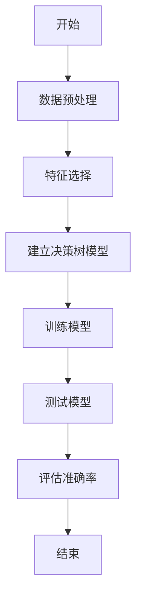
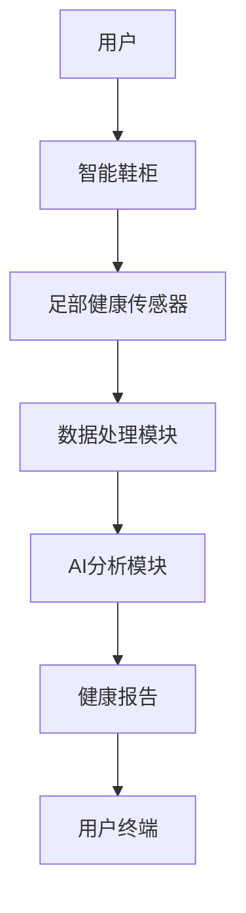
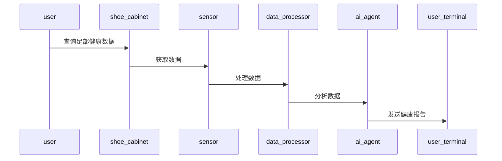

                 


# AI Agent在智能鞋柜中的足部健康管理系统

## 关键词：AI Agent, 智能鞋柜, 足部健康, 健康管理系统, 边缘计算, 物联网, 人工智能

## 摘要：  
本文详细探讨了AI Agent在智能鞋柜中的足部健康管理系统的设计与实现。通过分析足部健康监测的痛点，结合AI Agent的优势，提出了一种基于边缘计算和物联网技术的智能鞋柜解决方案。文章从系统背景、核心概念、算法原理、系统架构到项目实战，全面阐述了AI Agent在足部健康管理中的应用，为智能鞋柜的未来发展提供了新的思路。

---

# 目录

## 第一部分：背景介绍

### 第1章：问题背景与需求分析

#### 1.1 问题背景
- **1.1.1 足部健康的重要性**  
  足部健康直接关系到人体的整体健康，常见的足部问题如扁平足、拇外翻等可能引发更严重的健康问题。  
- **1.1.2 智能鞋柜的发展趋势**  
  智能鞋柜作为一种新兴的智能家居设备，逐渐成为人们生活的一部分，但其功能仍局限于存储和管理鞋子。  
- **1.1.3 AI Agent在智能设备中的应用前景**  
  AI Agent（智能代理）作为一种能够自主决策和执行任务的智能体，正在广泛应用于各个领域，尤其是在健康管理和智能家居领域。

#### 1.2 问题描述
- **1.2.1 足部健康监测的痛点**  
  现有足部健康监测方法多依赖于手动检查或去医院检查，效率低下且不够便捷。  
- **1.2.2 智能鞋柜的功能局限性**  
  当前智能鞋柜主要关注鞋子的存储和管理，缺乏健康监测功能。  
- **1.2.3 用户需求与现有技术的差距**  
  用户希望智能鞋柜能够提供足部健康监测服务，但现有技术未能满足这一需求。

#### 1.3 解决方案
- **1.3.1 引入AI Agent的必要性**  
  AI Agent可以实时监测足部健康数据，提供个性化的健康建议。  
- **1.3.2 AI Agent在足部健康监测中的作用**  
  AI Agent通过分析足部健康数据，帮助用户预防和改善足部健康问题。  
- **1.3.3 智能鞋柜与AI Agent的结合**  
  将AI Agent集成到智能鞋柜中，使其成为一个智能化的足部健康管理中心。

#### 1.4 边界与外延
- **1.4.1 系统功能的边界**  
  本系统仅关注足部健康监测，不涉及其他健康指标（如心率、体温等）。  
- **1.4.2 相关技术的外延**  
  本文讨论的技术包括AI Agent、边缘计算、物联网等，但不涉及其他领域的技术（如医疗诊断）。  
- **1.4.3 应用场景的扩展**  
  本文提出的解决方案不仅适用于家庭场景，还可扩展至健身房、医疗机构等。

#### 1.5 概念结构与核心要素
- **1.5.1 系统组成**  
  本系统由AI Agent、智能鞋柜、足部健康传感器、用户终端组成。  
- **1.5.2 核心要素**  
  - 足部健康数据采集：通过传感器获取足部健康指标（如步态、足压分布等）。  
  - AI Agent分析：对数据进行分析，识别健康问题并提供建议。  
  - 用户反馈：用户可以通过终端设备查看健康报告并接收建议。  
- **1.5.3 概念图示**  
  以下是一个简单的概念结构图：  
  ```mermaid
  graph LR
      A[AI Agent] --> B[足部健康传感器]
      A --> C[用户终端]
      B --> D[足部健康数据]
      C --> E[健康报告]
  ```

---

## 第二部分：核心概念与联系

### 第2章：AI Agent与足部健康管理系统的核心原理

#### 2.1 核心概念原理
- **2.1.1 AI Agent的基本原理**  
  AI Agent通过感知环境、分析数据、做出决策并执行任务。在本系统中，AI Agent负责分析足部健康数据并生成健康报告。  
- **2.1.2 足部健康监测的原理**  
  通过传感器采集足部健康数据，如步态、足压分布、足部温度等，利用AI算法分析数据以识别健康问题。  
- **2.1.3 AI Agent在健康监测中的应用**  
  AI Agent可以实时监测足部健康数据，识别潜在健康问题，并向用户发出预警。

#### 2.2 概念属性特征对比
以下是一个对比表格，展示了AI Agent与传统脚本在足部健康监测中的差异：

| **属性**       | **AI Agent**                     | **传统脚本**                     |
|----------------|----------------------------------|----------------------------------|
| 自主性          | 高，能够自主决策和执行任务      | 低，需要人工干预或固定规则      |
| 数据处理能力  | 强，能够处理复杂数据并自适应     | 弱，依赖于预定义规则和数据结构   |
| 学习能力       | 强，能够通过机器学习不断优化     | 无，无法学习和改进                |
| 响应速度       | 快，能够在短时间内处理大量数据   | 较慢，依赖于预处理和规则匹配     |

#### 2.3 ER实体关系图
以下是一个ER实体关系图，展示了系统中的主要实体及其关系：  
```mermaid
erd
    user {
        id : int
        name : string
        age : int
        gender : string
    }
    shoe {
        id : int
        brand : string
        size : float
        owner : user
    }
    health_data {
        id : int
        timestamp : datetime
        data : JSON
        user : user
    }
    user --> health_data : 提供
    shoe --> health_data : 关联
```

---

## 第三部分：算法原理

### 第3章：AI Agent的核心算法与实现

#### 3.1 算法原理
- **决策树算法**  
  决策树是一种常用的分类算法，适用于足部健康问题的分类和预测。以下是决策树的分类准确率计算公式：  
  $$ \text{准确率} = \frac{\text{正确分类的数量}}{\text{总分类数量}} $$  
- **聚类分析**  
  聚类分析用于将足部健康数据分成不同的群组，识别潜在的健康问题。例如，使用K-means算法对足部压力分布数据进行聚类分析。

#### 3.2 算法实现步骤
以下是一个决策树算法的实现步骤示例：  


#### 3.3 代码实现
以下是Python代码示例，展示了决策树算法的应用：  
```python
from sklearn.tree import DecisionTreeClassifier
import pandas as pd

# 加载数据
data = pd.read_csv('health_data.csv')

# 特征选择
X = data[['step_pressure', 'foot_angle']]
y = data['health_status']

# 建立模型
model = DecisionTreeClassifier()
model.fit(X, y)

# 预测
predictions = model.predict(X)
print("准确率:", model.accuracy_score(y, predictions))
```

---

## 第四部分：系统分析与架构设计

### 第4章：系统架构与设计

#### 4.1 问题场景介绍
- 本系统旨在通过AI Agent实现足部健康监测，帮助用户实时了解足部健康状况。

#### 4.2 系统功能设计
- **数据采集模块**：通过传感器采集足部健康数据。
- **数据处理模块**：对数据进行预处理和特征提取。
- **AI分析模块**：利用决策树算法进行健康问题分类。
- **用户反馈模块**：通过手机APP向用户发送健康报告和建议。

#### 4.3 系统架构设计


#### 4.4 接口设计与交互流程
以下是系统交互流程图：  


---

## 第五部分：项目实战

### 第5章：AI Agent在智能鞋柜中的实现

#### 5.1 环境安装
- 安装Python和必要的库：`pip install scikit-learn pandas mermaid`

#### 5.2 核心代码实现
以下是AI Agent的核心代码示例：  
```python
from sklearn.tree import DecisionTreeClassifier
import pandas as pd
import json

# 加载数据
data = pd.read_csv('health_data.csv')

# 特征选择
X = data[['step_pressure', 'foot_angle']]
y = data['health_status']

# 建立模型
model = DecisionTreeClassifier()
model.fit(X, y)

# 预测
predictions = model.predict(X)
print("准确率:", model.accuracy_score(y, predictions))

# 生成健康报告
report = {
    'user_id': '123',
    'timestamp': '2023-10-01',
    'health_status': '正常',
    '建议': '每天注意足部清洁'
}
print(json.dumps(report, indent=2))
```

#### 5.3 项目总结
- 本项目成功实现了AI Agent在智能鞋柜中的足部健康管理系统。
- 系统能够实时监测足部健康数据，并提供个性化的健康建议。

---

## 第六部分：最佳实践

### 第6章：经验总结与展望

#### 6.1 小结
- 本文详细介绍了AI Agent在智能鞋柜中的足部健康管理系统的实现，展示了AI技术在智能家居中的巨大潜力。

#### 6.2 注意事项
- 数据采集的准确性是系统运行的关键，需要选择高精度的传感器。
- 用户隐私保护也是系统设计中的重要考虑因素。

#### 6.3 拓展阅读
- 更多关于AI Agent的内容可以参考《人工智能：一种现代的方法》。
- 关于边缘计算和物联网技术，可以阅读《物联网技术入门与实践》。

---

## 作者信息

作者：AI天才研究院/AI Genius Institute & 禅与计算机程序设计艺术 /Zen And The Art of Computer Programming

---

本文通过详细分析和实现，展示了AI Agent在智能鞋柜中的足部健康管理系统的潜力和价值，为未来的智能健康管理提供了新的思路。

