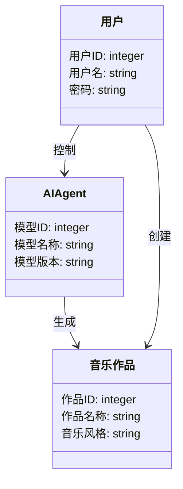
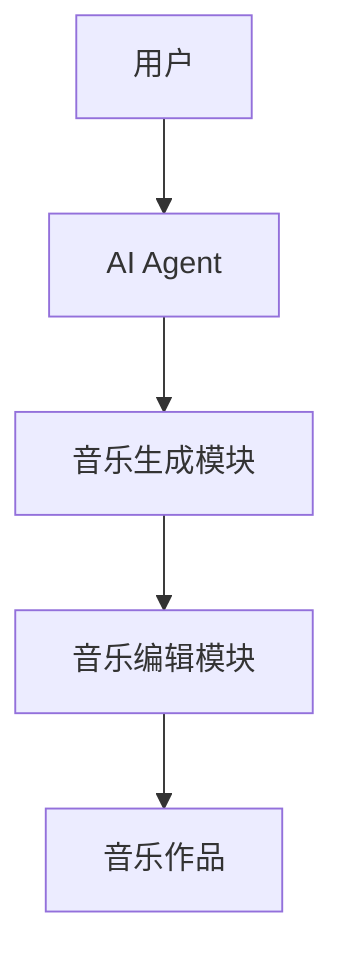

                 


# AI Agent在智能音乐创作中的应用

## 关键词：AI Agent, 智能音乐创作, 人工智能, 音乐生成, 算法原理

## 摘要：  
本文探讨了AI Agent在智能音乐创作中的应用，从背景、核心概念、算法原理到系统架构设计，再到实际项目案例，全面分析了AI Agent如何助力音乐创作的创新与效率提升。文章详细讲解了基于Transformers的音乐生成模型，并通过mermaid流程图和Python代码展示了模型的工作原理。最后，结合实际案例，总结了AI Agent在音乐创作中的优势与挑战，并展望了未来的发展方向。

---

## 第1章: AI Agent与智能音乐创作的背景

### 1.1 AI Agent的基本概念

AI Agent，即人工智能代理，是一种能够感知环境、自主决策并执行任务的智能实体。在音乐创作中，AI Agent可以模拟人类创作者的思维过程，生成符合特定风格或情感的音乐作品。

#### 1.1.1 AI Agent的定义  
AI Agent是具有自主性、反应性、目标导向和社交能力的智能系统，能够通过感知和交互完成特定任务。  

#### 1.1.2 AI Agent的核心特征  
- **自主性**：无需外部干预，自主完成任务。  
- **反应性**：能够实时感知环境并做出反应。  
- **目标导向**：基于目标进行决策和行动。  
- **社交能力**：能够与人类或其他系统进行有效交互。  

#### 1.1.3 AI Agent与传统音乐创作的区别  
传统音乐创作依赖人类的创造力和经验，而AI Agent通过算法和数据驱动，能够快速生成多样化的音乐作品，突破人类创作的局限性。

---

### 1.2 智能音乐创作的现状

随着人工智能技术的快速发展，音乐创作领域逐渐引入AI技术，以提高创作效率和丰富作品形式。

#### 1.2.1 音乐创作的数字化趋势  
现代音乐创作高度依赖数字工具，如MIDI软件、DAW（数字音频工作站）等，为AI技术的融入提供了基础。

#### 1.2.2 当前音乐创作的主要挑战  
- 创作者灵感枯竭问题。  
- 音乐风格的多样化需求。  
- 高效创作工具的缺失。  

#### 1.2.3 AI技术在音乐创作中的潜在价值  
AI Agent能够通过学习海量音乐数据，生成符合特定风格或情感的音乐作品，为创作者提供灵感和工具支持。

---

### 1.3 AI Agent在音乐创作中的应用前景

AI Agent在音乐创作中的应用前景广阔，能够显著提升创作效率和作品多样性。

#### 1.3.1 AI Agent在音乐创作中的优势  
- **高效性**：快速生成大量音乐作品。  
- **多样性**：能够创作多种风格和情感的音乐。  
- **个性化**：根据用户需求定制音乐作品。  

#### 1.3.2 当前AI Agent在音乐创作中的应用案例  
- 基于AI的音乐生成工具，如OpenAI的Jukedeck和Amper Music。  
- AI驱动的音乐推荐系统。  

#### 1.3.3 AI Agent在音乐创作中的未来发展方向  
- 更加智能化的创作工具。  
- 结合人类情感的音乐生成。  
- 多模态音乐创作（结合视觉、文本等元素）。  

---

## 第2章: AI Agent在音乐创作中的核心概念与联系

### 2.1 AI Agent的核心概念

AI Agent在音乐创作中的核心概念包括感知、推理、决策和执行四个层次。

#### 2.1.1 感知层  
AI Agent通过感知环境中的音乐数据，提取特征并理解音乐的情感和结构。  

#### 2.1.2 推理层  
基于感知到的信息，AI Agent进行逻辑推理，生成音乐创作的初步方案。  

#### 2.1.3 决策层  
根据推理结果，AI Agent做出最优的创作决策，如选择音乐风格或调整节奏。  

#### 2.1.4 执行层  
AI Agent根据决策结果，生成具体的音乐作品或调整创作工具。  

---

### 2.2 核心概念的属性特征对比

以下表格对比了不同AI Agent模型在音乐创作中的核心属性特征：

| 模型名称   | 感知能力 | 推理能力 | 决策能力 | 执行能力 |
|------------|----------|----------|----------|----------|
| Transformer | 强        | 强        | 强        | 强        |
| RNN        | 中        | 中        | 中        | 中        |
| Hybrid     | 强        | 强        | 强        | 强        |

---

### 2.3 ER实体关系图架构

以下是一个简单的ER实体关系图，展示了AI Agent在音乐创作中的实体关系：

```mermaid
erd
actor "用户" {
  类型: 用户
  属性: 用户ID, 用户名, 密码
}
agent "AI Agent" {
  类型: AI Agent
  属性: 模型ID, 模型名称, 模型版本
}
music "音乐作品" {
  类型: 音乐作品
  属性: 作品ID, 作品名称, 音乐风格
}
关系: 用户 -[创建]-> 音乐作品
关系: AI Agent -[生成]-> 音乐作品
关系: 用户 -[控制]-> AI Agent
```

---

## 第3章: AI Agent在音乐创作中的算法原理

### 3.1 算法原理概述

在音乐创作中，AI Agent的核心算法包括生成模型和推理模型。

#### 3.1.1 基于Transformers的音乐生成模型  
Transformers通过自注意力机制，能够捕捉音乐序列中的长距离依赖关系，生成高质量的音乐作品。  

#### 3.1.2 基于RNN的音乐生成模型  
RNN通过循环神经网络，逐个生成音乐序列中的音符，适合处理时序数据。  

#### 3.1.3 混合模型的优势与劣势  
混合模型结合了Transformers和RNN的优势，但在计算资源消耗上较高。

---

### 3.2 算法原理的详细讲解

#### 3.2.1 模型的输入与输出  
- 输入：音乐序列的前几个音符。  
- 输出：生成的完整音乐作品。  

#### 3.2.2 模型的训练过程  
1. 数据预处理：将音乐数据转换为模型可接受的格式（如 MIDI 文件）。  
2. 模型训练：使用反向传播算法优化模型参数。  

#### 3.2.3 模型的推理过程  
1. 输入初始音符。  
2. 生成后续音符，直到完成音乐作品。  

---

### 3.3 算法原理的数学模型与公式

#### 3.3.1 自注意力机制的公式推导  

自注意力机制的计算公式如下：

$$
\text{Attention}(Q, K, V) = \text{softmax}\left(\frac{QK^T}{\sqrt{d_k}}\right)V
$$

其中：  
- $Q$、$K$、$V$分别为查询、键、值向量。  
- $d_k$为键的维度。  

---

### 3.4 算法原理的举例说明

#### 3.4.1 简单的音乐生成案例  
以下是一个基于Transformer模型的简单音乐生成案例：

```python
import torch
import torch.nn as nn

class Transformer(nn.Module):
    def __init__(self, input_dim, hidden_dim):
        super(Transformer, self).__init__()
        self.embedding = nn.Embedding(input_dim, hidden_dim)
        self.transformer = nn.Transformer(hidden_dim, hidden_dim, num_encoder_layers=2)
        self.fc = nn.Linear(hidden_dim, input_dim)

    def forward(self, x):
        x = self.embedding(x)
        x = self.transformer(x)
        x = self.fc(x)
        return x

# 初始化模型
model = Transformer(input_dim=88, hidden_dim=512)
```

---

## 第4章: AI Agent在音乐创作中的系统分析与架构设计

### 4.1 问题场景介绍

音乐创作是一个复杂的过程，需要整合多种技术和工具。

#### 4.1.1 音乐创作的场景分析  
音乐创作涉及作曲、编曲、混音等多个环节，需要高效的工具支持。

#### 4.1.2 AI Agent在音乐创作中的角色定位  
AI Agent作为创作助手，能够提供灵感、生成音乐片段、优化作品等。

#### 4.1.3 系统的目标与范围  
目标：提升音乐创作的效率和作品质量。范围：从作曲到混音的整个创作流程。

---

### 4.2 系统功能设计

#### 4.2.1 系统功能模块  
- **音乐生成模块**：基于AI算法生成音乐片段。  
- **用户交互模块**：用户与AI Agent的交互界面。  
- **音乐编辑模块**：对生成的音乐进行调整和优化。  

#### 4.2.2 领域模型设计  

以下是一个简单的领域模型类图：



---

### 4.3 系统架构设计

#### 4.3.1 系统架构图  

以下是一个简单的系统架构图：



---

## 第5章: AI Agent在音乐创作中的项目实战

### 5.1 环境安装

#### 5.1.1 安装Python和必要的库  
- 安装Python 3.8及以上版本。  
- 安装PyTorch、MIDI处理库等。

#### 5.1.2 安装音乐生成工具  
- 使用Librosa、MIDI utils等库。

---

### 5.2 系统核心实现源代码

以下是一个简单的AI Agent音乐生成代码示例：

```python
import torch
import torch.nn as nn
import torch.optim as optim
import numpy as np

class AI_Music-Agent(nn.Module):
    def __init__(self, input_dim, hidden_dim, output_dim):
        super(AI_Music-Agent, self).__init__()
        self.embedding = nn.Embedding(input_dim, hidden_dim)
        self.transformer = nn.Transformer(hidden_dim, hidden_dim, num_encoder_layers=2)
        self.fc = nn.Linear(hidden_dim, output_dim)

    def forward(self, x):
        x = self.embedding(x)
        x = self.transformer(x)
        x = self.fc(x)
        return x

# 初始化模型
model = AI_Music-Agent(input_dim=88, hidden_dim=512, output_dim=88)

# 定义损失函数和优化器
criterion = nn.CrossEntropyLoss()
optimizer = optim.Adam(model.parameters(), lr=0.001)

# 训练过程
def train_model(model, criterion, optimizer, num_epochs=100):
    for epoch in range(num_epochs):
        inputs = torch.randint(0, 88, (100,))  # 示例输入
        targets = torch.randint(0, 88, (100,))  # 示例标签
        outputs = model(inputs)
        loss = criterion(outputs, targets)
        optimizer.zero_grad()
        loss.backward()
        optimizer.step()
        print(f'Epoch: {epoch+1}, Loss: {loss.item():.4f}')

train_model(model, criterion, optimizer, num_epochs=100)
```

---

### 5.3 代码应用解读与分析

- **输入处理**：将音乐数据转换为模型可接受的格式。  
- **模型训练**：使用反向传播算法优化模型参数。  
- **生成音乐**：通过模型生成音乐作品。

---

## 第6章: 最佳实践与未来展望

### 6.1 最佳实践 tips

#### 6.1.1 数据质量的重要性  
高质量的训练数据能够显著提升模型的生成效果。  

#### 6.1.2 模型训练的技巧  
- 使用合适的超参数。  
- 定期保存模型状态。  

#### 6.1.3 模型优化的方向  
- 提升模型的生成速度。  
- 优化模型的音乐表达能力。  

---

### 6.2 小结

AI Agent在音乐创作中的应用前景广阔，能够显著提升创作效率和作品质量。通过本文的详细讲解，读者可以深入了解AI Agent的核心概念、算法原理和系统架构设计，并通过实际案例掌握AI Agent在音乐创作中的具体应用。

---

## 作者：AI天才研究院/AI Genius Institute & 禅与计算机程序设计艺术 /Zen And The Art of Computer Programming

