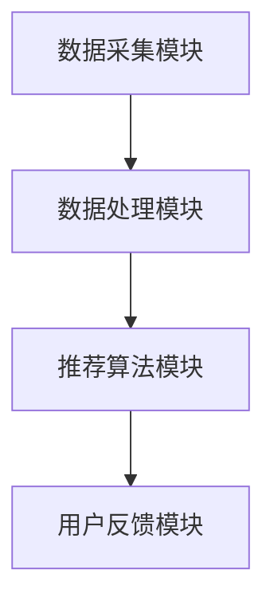
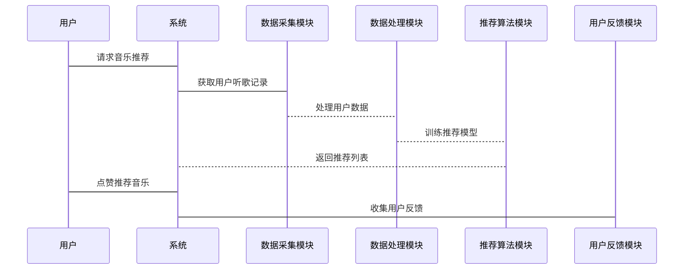

                 


# AI Agent在智能音乐推荐中的应用

## 关键词：AI Agent, 智能音乐推荐, 个性化推荐, 机器学习, 算法优化

## 摘要：  
随着人工智能技术的快速发展，AI Agent（智能体）在智能音乐推荐系统中的应用越来越广泛。本文将从AI Agent的核心原理出发，结合智能音乐推荐的背景与需求，详细分析AI Agent在音乐推荐中的具体应用。通过算法原理、系统架构设计、项目实战等多个维度，深入探讨如何利用AI Agent提升音乐推荐的准确性和用户体验。文章最后还将总结当前技术的局限性，并展望未来的发展方向。

---

## 第一部分：AI Agent与智能音乐推荐的背景

### 第1章：AI Agent与智能音乐推荐概述

#### 1.1 AI Agent的基本概念
AI Agent（智能体）是指能够感知环境、做出决策并采取行动的智能系统。它具备以下核心特点：
- **自主性**：能够自主决策，无需外部干预。
- **反应性**：能够实时感知环境变化并做出反应。
- **目标导向性**：以特定目标为导向，优化行动策略。

AI Agent的应用场景非常广泛，包括自然语言处理、机器人控制、推荐系统等。在音乐推荐领域，AI Agent可以通过分析用户行为和音乐特征，提供个性化的音乐推荐服务。

#### 1.2 智能音乐推荐的背景与意义
音乐推荐系统的目标是根据用户的听歌历史、偏好和当前行为，推荐符合用户喜好的音乐作品。传统的音乐推荐系统主要依赖协同过滤和基于内容的推荐算法，但存在以下问题：
- 数据稀疏性：用户行为数据不足导致推荐准确性降低。
- 鲁棒性差：难以应对用户偏好变化和音乐数据的动态更新。

AI Agent的引入为音乐推荐系统带来了新的解决方案。通过AI Agent的强大计算能力和智能决策能力，音乐推荐系统能够更精准地捕捉用户需求，提供个性化的推荐服务。

#### 1.3 AI Agent在音乐推荐中的结合
AI Agent与音乐推荐的结合主要体现在以下几个方面：
1. **用户行为分析**：AI Agent能够实时感知用户的听歌行为，分析用户的偏好变化。
2. **音乐特征提取**：通过自然语言处理和音频特征提取技术，AI Agent能够提取音乐的语义和音效特征。
3. **动态推荐**：AI Agent可以根据用户实时行为和音乐特征，动态调整推荐策略，提供更精准的推荐结果。

---

## 第二部分：AI Agent与音乐推荐的核心概念

### 第2章：AI Agent的核心原理

#### 2.1 AI Agent的基本原理
AI Agent的核心原理包括以下几个步骤：
1. **感知环境**：通过传感器或数据接口获取环境信息。
2. **信息处理**：对获取的信息进行分析和处理，提取有用特征。
3. **决策制定**：基于处理后的信息，制定行动决策。
4. **行动执行**：根据决策结果执行相应动作。

在音乐推荐系统中，AI Agent的感知环境可以是用户的听歌记录、收藏列表和播放列表。信息处理则涉及对音乐特征的提取和用户偏好的建模。决策制定则是根据用户需求和音乐特征，生成推荐列表。行动执行则是将推荐结果返回给用户。

#### 2.2 音乐推荐系统的核心原理
音乐推荐系统主要基于以下两种算法：
1. **协同过滤算法**：通过分析用户行为，找到与目标用户相似的用户群体，推荐相似用户喜欢的音乐作品。
2. **基于内容的推荐**：通过分析音乐的特征（如歌词、旋律、节奏等），推荐与目标用户喜欢的音乐风格相似的作品。

协同过滤算法和基于内容的推荐各有优缺点。协同过滤算法能够捕捉用户的社交网络特征，但容易受到数据稀疏性的影响。基于内容的推荐能够提供更精准的音乐推荐，但需要大量音乐特征数据的支持。

#### 2.3 AI Agent与音乐推荐的结合原理
AI Agent与音乐推荐的结合主要体现在以下几个方面：
1. **实时反馈机制**：AI Agent能够实时感知用户的听歌行为，并根据反馈调整推荐策略。
2. **动态特征提取**：AI Agent可以根据用户实时行为动态提取音乐特征，提高推荐的精准度。
3. **多模态数据融合**：AI Agent可以整合用户的听歌历史、收藏列表、社交网络数据等多种数据源，提供更全面的音乐推荐。

---

## 第三部分：算法原理与数学模型

### 第3章：基于AI Agent的音乐推荐算法

#### 3.1 算法概述
基于AI Agent的音乐推荐算法主要包括以下几个步骤：
1. **用户行为数据采集**：通过日志采集系统获取用户的听歌记录、收藏、点赞等行为数据。
2. **音乐特征提取**：通过自然语言处理和音频特征提取技术，提取音乐的语义和音效特征。
3. **推荐模型训练**：基于用户行为数据和音乐特征，训练推荐模型。
4. **推荐结果生成**：根据训练好的模型，生成推荐列表。

#### 3.2 算法的数学模型
音乐推荐的数学模型可以分为以下几个部分：

##### 3.2.1 用户表示模型
用户表示模型的目标是将用户的听歌行为转化为向量表示。常用的用户表示模型包括：
- **协同过滤模型**：通过矩阵分解技术将用户表示为低维向量。
- **深度学习模型**：通过神经网络提取用户的高层次特征。

##### 3.2.2 音乐表示模型
音乐表示模型的目标是将音乐作品转化为向量表示。常用的音乐表示模型包括：
- **基于内容的特征提取**：通过MFCC（Mel-Frequency Cepstral Coefficients）提取音乐的音效特征。
- **基于歌词的特征提取**：通过词袋模型提取音乐的语义特征。

##### 3.2.3 推荐评分模型
推荐评分模型的目标是预测用户对音乐作品的评分。常用的推荐评分模型包括：
- **矩阵分解模型**：通过矩阵分解技术预测用户的评分。
- **神经网络模型**：通过深度学习模型预测用户的评分。

##### 3.2.4 混合推荐模型
混合推荐模型结合了协同过滤和基于内容的推荐方法，能够充分利用用户行为数据和音乐特征数据。混合推荐模型的数学表达式如下：

$$
\hat{r}_{u,i} = \lambda \cdot \text{协同过滤预测} + (1-\lambda) \cdot \text{内容推荐预测}
$$

其中，$\lambda$ 是协同过滤和内容推荐的权重系数。

#### 3.3 算法实现的详细步骤
基于AI Agent的音乐推荐算法的实现步骤如下：
1. **数据预处理**：对用户行为数据和音乐特征数据进行清洗和归一化处理。
2. **模型训练**：基于预处理后的数据，训练推荐模型。
3. **推荐结果生成**：根据训练好的模型，生成推荐列表。

---

## 第四部分：系统架构与设计

### 第4章：系统架构设计方案

#### 4.1 系统功能模块划分
基于AI Agent的音乐推荐系统主要包括以下几个功能模块：
1. **数据采集模块**：负责采集用户的听歌记录、收藏列表等行为数据。
2. **数据处理模块**：对采集到的数据进行清洗和归一化处理。
3. **推荐算法模块**：基于处理后的数据，训练推荐模型，并生成推荐列表。
4. **用户反馈模块**：收集用户的反馈信息，并根据反馈调整推荐策略。

#### 4.2 系统架构图
使用mermaid绘制系统架构图如下：



#### 4.3 系统接口设计
系统主要接口包括：
- **数据采集接口**：用于采集用户的听歌记录和收藏列表。
- **推荐接口**：用于根据用户ID返回推荐音乐列表。
- **反馈接口**：用于收集用户的听歌反馈信息。

#### 4.4 系统交互流程
使用mermaid序列图展示系统交互流程如下：



---

## 第五部分：项目实战与案例分析

### 第5章：项目实战

#### 5.1 环境搭建
项目实战需要以下环境：
- **开发工具**：Python 3.8及以上版本、Jupyter Notebook。
- **数据集**：公开的音乐数据集（如Last.fm数据集）。
- **库和框架**：Pandas、NumPy、Scikit-learn、Keras、TensorFlow。

#### 5.2 核心代码实现
以下是核心代码实现示例：

##### 5.2.1 数据预处理代码
```python
import pandas as pd
import numpy as np

# 读取数据
df = pd.read_csv('music_data.csv')

# 数据清洗
df.dropna(inplace=True)
df['user_id'] = df['user_id'].astype(int)
df['item_id'] = df['item_id'].astype(int)
df['rating'] = df['rating'].astype(int)
```

##### 5.2.2 模型训练代码
```python
from sklearn.model_selection import train_test_split
from sklearn.metrics import mean_squared_error
from keras.layers import Dense, Dropout
from keras.models import Sequential

# 划分训练集和测试集
train_data, test_data = train_test_split(df, test_size=0.2)

# 构建神经网络模型
model = Sequential()
model.add(Dense(64, activation='relu', input_dim=2))
model.add(Dropout(0.5))
model.add(Dense(1, activation='linear'))

# 编译模型
model.compile(optimizer='adam', loss='mse', metrics=['mae'])

# 训练模型
model.fit(train_data[['user_id', 'item_id']], train_data['rating'], epochs=10, batch_size=32)

# 评估模型
y_pred = model.predict(test_data[['user_id', 'item_id']])
print(mean_squared_error(y_pred, test_data['rating']))
```

##### 5.2.3 推荐结果生成代码
```python
# 定义推荐函数
def recommend_music(user_id):
    user_id = int(user_id)
    # 预测推荐评分
    ratings = model.predict([[user_id, item_id for item_id in range(1, 1000)]])
    # 排序推荐结果
    sorted_ratings = sorted(ratings, reverse=True)
    # 返回Top-10推荐
    top_10 = sorted_ratings[:10]
    return top_10

# 调用推荐函数
recommend_music(1)
```

#### 5.3 案例分析
通过上述代码实现的音乐推荐系统，可以实现以下功能：
1. 根据用户的听歌记录，推荐相似的音乐作品。
2. 实时更新推荐结果，动态调整推荐策略。

---

## 第六部分：高级主题与未来展望

### 第6章：个性化推荐的前沿技术

#### 6.1 基于强化学习的音乐推荐
强化学习是一种通过试错机制优化推荐结果的方法。在音乐推荐系统中，强化学习可以通过以下步骤实现：
1. **状态空间定义**：定义推荐状态，如用户偏好、音乐特征等。
2. **动作空间定义**：定义推荐动作，如推荐特定音乐作品。
3. **奖励机制设计**：设计奖励函数，根据用户反馈调整推荐策略。

#### 6.2 基于多模态数据的音乐推荐
多模态数据推荐是一种结合多种数据类型（如文本、音频、图像）的推荐方法。在音乐推荐系统中，可以通过多模态数据推荐技术实现更精准的推荐结果。

#### 6.3 基于深度学习的音乐推荐
深度学习是一种基于神经网络的推荐方法。通过深度学习技术，可以提取音乐的高层次特征，提高推荐的精准度。

---

## 第七部分：总结与展望

### 第7章：总结与展望

#### 7.1 总结
本文详细介绍了AI Agent在智能音乐推荐中的应用。通过分析AI Agent的核心原理、算法模型和系统架构，展示了如何利用AI Agent提升音乐推荐的准确性和用户体验。

#### 7.2 展望
未来，随着人工智能技术的不断发展，AI Agent在音乐推荐中的应用将更加广泛。通过引入强化学习、多模态数据推荐和深度学习等新技术，音乐推荐系统将能够实现更精准、更个性化的推荐服务。

---

## 作者：AI天才研究院/AI Genius Institute & 禅与计算机程序设计艺术 /Zen And The Art of Computer Programming

