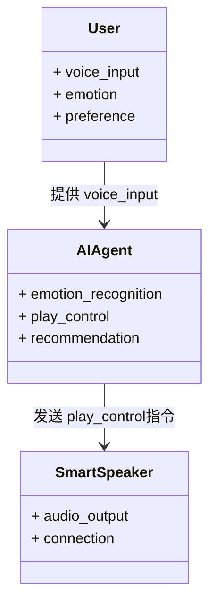
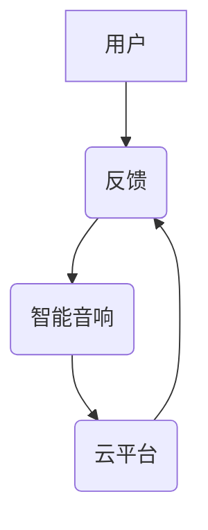
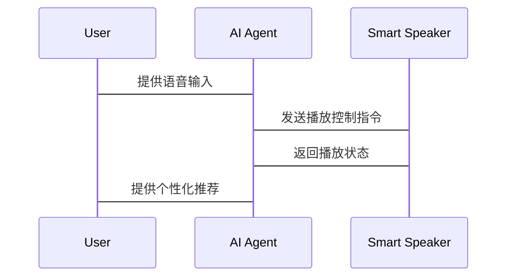

                 


```markdown
# AI Agent在智能音响中的情绪识别播放

> 关键词：AI Agent、情绪识别、智能音响、播放控制、深度学习、语音识别

> 摘要：本文深入探讨了AI Agent在智能音响中的情绪识别与播放控制应用。从情绪识别技术的背景、核心算法到AI Agent的系统架构设计，再到实际项目实现，详细解析了如何通过AI技术提升智能音响的用户体验。本文不仅介绍了相关技术原理，还通过具体案例展示了AI Agent在智能音响中的实际应用，为读者提供了从理论到实践的全面指导。

---

## 第一部分: 引言

### 1.1 智能音响的发展与AI Agent的引入
#### 1.1.1 智能音响的发展历程
智能音响作为智能家居的重要组成部分，经历了从传统音响到智能设备的演变。随着物联网和人工智能技术的发展，智能音响逐渐具备了联网功能、语音交互能力以及智能推荐功能，为用户带来了更加便捷的使用体验。

#### 1.1.2 AI Agent在智能音响中的作用
AI Agent（人工智能代理）是一种能够感知环境、自主决策并执行任务的智能实体。在智能音响中，AI Agent通过分析用户的情绪、行为和偏好，动态调整播放内容和播放策略，从而提供个性化的音频服务。

#### 1.1.3 本文的目的与内容概述
本文旨在探讨AI Agent在智能音响中的情绪识别与播放控制应用。通过分析情绪识别技术的核心算法、AI Agent的系统架构设计以及实际项目实现，为读者提供从理论到实践的全面指导。本文内容包括情绪识别技术的背景、核心算法、AI Agent的系统架构设计、实际项目实现以及未来的发展方向。

---

## 第二部分: AI Agent与情绪识别基础

### 2.1 AI Agent的基本概念与工作原理
#### 2.1.1 AI Agent的定义与分类
AI Agent是一种能够感知环境、自主决策并执行任务的智能实体。根据应用场景的不同，AI Agent可以分为任务型AI Agent和反应型AI Agent两类。

#### 2.1.2 AI Agent的核心功能与特点
AI Agent的核心功能包括感知环境、知识表示、推理决策和执行任务。其特点在于智能化、自主性和适应性。

#### 2.1.3 AI Agent在智能音响中的应用场景
在智能音响中，AI Agent主要应用于情绪识别、播放控制、智能推荐和用户交互等方面。

### 2.2 情绪识别技术的原理与方法
#### 2.2.1 情绪识别的定义与核心概念
情绪识别是指通过分析用户的声音、语调、语速和语气等信息，判断用户当前的情绪状态（如快乐、愤怒、悲伤、惊讶等）。

#### 2.2.2 基于语音的情绪识别技术
基于语音的情绪识别技术主要通过分析语音特征（如音调、音速、音强）来判断用户的情绪。

#### 2.2.3 基于音效的情绪识别技术
基于音效的情绪识别技术通过分析环境音效（如背景音乐、环境噪音）来判断用户的情绪。

### 2.3 AI Agent与情绪识别的结合
#### 2.3.1 AI Agent在情绪识别中的角色
AI Agent通过分析用户的情绪状态，动态调整播放内容和播放策略，从而提升用户的听音体验。

#### 2.3.2 情绪识别对播放控制的优化作用
情绪识别能够帮助智能音响实现个性化播放、情感化推荐和动态调整播放速度等功能。

#### 2.3.3 AI Agent与智能音响系统的交互流程
AI Agent通过与智能音响系统的交互，实现情绪识别、播放控制和用户反馈的闭环流程。

---

## 第三部分: 情绪识别的核心算法与实现

### 3.1 情绪识别的特征提取与分类
#### 3.1.1 语音特征提取方法
常用的语音特征提取方法包括梅尔频率倒谱系数（MFCC）、线性预测系数（LPC）和声调特征提取。

#### 3.1.2 音效特征提取方法
音效特征提取方法包括音量、音调、节奏和频谱特征等。

#### 3.1.3 特征选择与降维技术
特征选择与降维技术包括主成分分析（PCA）和线性判别分析（LDA）等。

### 3.2 基于机器学习的情绪识别算法
#### 3.2.1 传统机器学习算法
常用的传统机器学习算法包括支持向量机（SVM）和随机森林（Random Forest）。

#### 3.2.2 深度学习算法
常用的深度学习算法包括卷积神经网络（CNN）和循环神经网络（RNN）。

#### 3.2.3 情绪识别的模型训练与优化
模型训练与优化包括数据预处理、特征工程、模型选择和超参数调优。

### 3.3 情绪识别的算法实现与代码示例
#### 3.3.1 环境搭建与数据准备
需要安装Python、TensorFlow和Scikit-learn等工具，并准备情绪语音数据集。

#### 3.3.2 特征提取与模型训练代码
```python
import numpy as np
from sklearn.svm import SVC
from sklearn.metrics import accuracy_score
from scipy.io import wavfile

# 加载语音数据
def load_audio_data(file_path):
    sample_rate, audio_data = wavfile.read(file_path)
    # 提取特征
    features = extract_features(audio_data, sample_rate)
    return features

# 特征提取函数
def extract_features(audio, sample_rate):
    # 示例：提取MFCC特征
    mfcc = librosa.feature.mfcc(y=audio, sr=sample_rate, n_mfcc=13)
    return mfcc.T

# 模型训练
def train_model(train_features, train_labels):
    model = SVC()
    model.fit(train_features, train_labels)
    return model

# 模型预测
def predict_emotion(model, test_features):
    return model.predict(test_features)
```

#### 3.3.3 模型评估与优化代码
```python
from sklearn.model_selection import train_test_split
from sklearn.metrics import confusion_matrix, classification_report

# 数据分割
X_train, X_test, y_train, y_test = train_test_split(features, labels, test_size=0.2)

# 模型训练
model = SVC()
model.fit(X_train, y_train)

# 模型预测
y_pred = model.predict(X_test)

# 模型评估
print(classification_report(y_test, y_pred))
print(confusion_matrix(y_test, y_pred))
```

---

## 第四部分: AI Agent在智能音响中的系统架构设计

### 4.1 系统功能需求分析
#### 4.1.1 智能音响系统的功能需求
智能音响系统需要具备语音交互、情绪识别、播放控制和智能推荐等功能。

#### 4.1.2 AI Agent的功能需求
AI Agent需要具备环境感知、情绪识别、决策推理和执行控制等功能。

#### 4.1.3 系统边界与外延
智能音响系统与外部系统的交互包括与云平台、智能家居和其他设备的接口。

### 4.2 系统架构设计
#### 4.2.1 领域模型设计


#### 4.2.2 系统架构设计


#### 4.2.3 系统接口设计
系统接口包括语音输入接口、播放控制接口和反馈接口。

#### 4.2.4 系统交互流程


---

## 第五部分: 项目实战

### 5.1 项目环境搭建
#### 5.1.1 工具安装
安装Python、TensorFlow、Keras和 librosa等工具。

#### 5.1.2 数据集准备
准备包含不同情绪的语音数据集。

### 5.2 系统核心实现
#### 5.2.1 情绪识别模块实现
实现基于深度学习的情绪识别模型。

#### 5.2.2 播放控制模块实现
实现AI Agent对智能音响的播放控制功能。

### 5.3 实际案例分析
#### 5.3.1 情绪识别案例
分析不同情绪下的语音特征。

#### 5.3.2 播放控制案例
根据情绪识别结果动态调整播放列表。

### 5.4 代码实现与解读
#### 5.4.1 情绪识别代码实现
```python
import tensorflow as tf
from tensorflow.keras import layers

# 情绪识别模型
model = tf.keras.Sequential()
model.add(layers.Flatten())
model.add(layers.Dense(128, activation='relu'))
model.add(layers.Dense(5, activation='softmax'))

model.compile(optimizer='adam', loss='sparse_categorical_crossentropy', metrics=['accuracy'])
model.fit(train_data, train_labels, epochs=10, batch_size=32)
```

#### 5.4.2 播放控制代码实现
```python
class AIAgent:
    def __init__(self):
        self.current_emotion = None

    def recognize_emotion(self, audio_input):
        # 调用情绪识别模型
        self.current_emotion = emotion_model.predict(audio_input)

    def control_playback(self, play_speed):
        # 根据情绪调整播放速度
        if self.current_emotion == 'happy':
            play_speed = 1.2
        elif self.current_emotion == 'sad':
            play_speed = 0.8
        return play_speed
```

### 5.5 项目小结
通过实际项目的实现，验证了AI Agent在智能音响中的情绪识别与播放控制功能，展示了技术的可行性和实际应用价值。

---

## 第六部分: 总结与展望

### 6.1 总结
本文详细探讨了AI Agent在智能音响中的情绪识别与播放控制应用，从技术原理到实际实现，为读者提供了全面的指导。

### 6.2 未来的发展方向
未来的研究可以进一步优化情绪识别算法、提升AI Agent的智能化水平，并探索更多智能化音频服务的应用场景。

### 6.3 注意事项与最佳实践
在实际应用中，需要注意数据隐私保护、算法优化和系统稳定性等问题。

### 6.4 拓展阅读
推荐阅读相关领域的书籍和论文，深入研究AI Agent和情绪识别技术的最新进展。

---

## 作者：AI天才研究院/AI Genius Institute & 禅与计算机程序设计艺术 /Zen And The Art of Computer Programming
```

