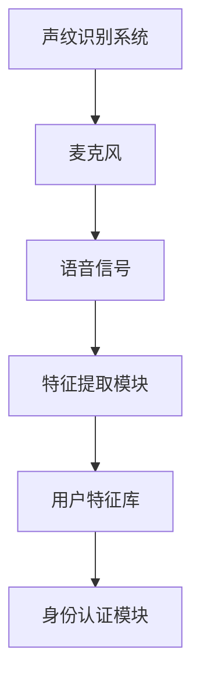
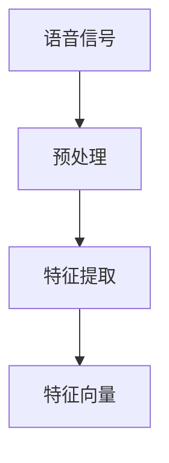
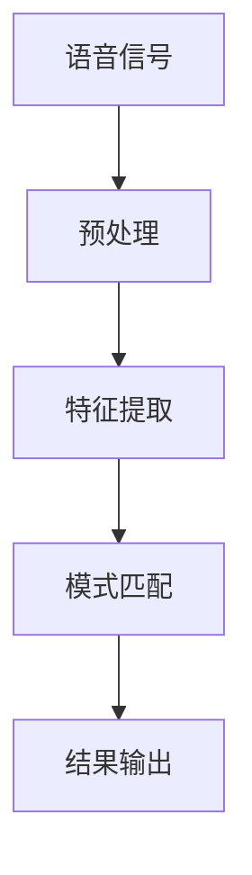

                 


# AI Agent在智能音箱中的声纹识别

> 关键词：AI Agent, 声纹识别, 智能音箱, 特征提取, 模式匹配

> 摘要：本文将深入探讨AI Agent在智能音箱中的声纹识别技术，从核心概念、算法原理到系统架构，结合实际案例分析，为您呈现声纹识别在智能音箱中的实现与应用。

---

## 第1章: 声纹识别的背景与应用

### 1.1 声纹识别的定义与技术发展

#### 1.1.1 声纹识别的基本概念
声纹识别，全称为语音纹迹识别，是一种基于人类语音特征进行身份识别的生物识别技术。与指纹识别、人脸识别类似，声纹识别通过分析语音信号中的特征信息，实现对说话人身份的唯一性识别。

> **对比表：声纹识别与其他生物识别技术的对比**

| 特性                | 指纹识别          | 面部识别         | 声纹识别         |
|---------------------|-------------------|------------------|------------------|
| 采集方式            | 触摸传感器        | 摄像头           | 麦克风           |
| 识别特征            | 纹理特征          | 面部特征         | 语音特征         |
| 适用场景            | 移动设备解锁      | 公共安全监控     | 智能音箱交互     |
| 便捷性              | 高               | 较高             | 极高             |

> **Mermaid图：声纹识别系统实体关系图**



声纹识别技术近年来发展迅速，特别是在智能音箱领域的应用，使得用户可以通过语音交互实现设备的个性化设置和功能控制。

---

### 1.2 AI Agent在智能音箱中的功能与作用

#### 1.2.1 AI Agent的基本概念
AI Agent（智能代理）是一种能够感知环境并执行任务的智能实体。在智能音箱中，AI Agent主要表现为语音助手（如Alexa、Siri、Google Assistant等），能够通过语音交互实现信息查询、设备控制、日程管理等功能。

#### 1.2.2 AI Agent的核心功能
1. **语音交互**：通过语音命令实现设备控制和信息查询。
2. **用户身份识别**：通过声纹识别技术实现用户的唯一身份认证。
3. **个性化服务**：基于用户身份提供定制化的服务内容。

#### 1.2.3 声纹识别在智能音箱中的应用前景
随着智能家居的普及，声纹识别技术在智能音箱中的应用将更加广泛。通过声纹识别，AI Agent可以实现更精准的用户身份识别，从而提供更加个性化的服务。

---

## 第2章: 声纹识别的核心概念与原理

### 2.1 声纹识别的核心概念

#### 2.1.1 声纹识别的特征提取
特征提取是声纹识别的核心步骤，通过分析语音信号中的特征信息，提取能够表征用户身份的特征向量。常用的特征包括：

1. **语音频率特征**：通过分析语音信号的频率分布，提取MFCC（Mel-Frequency Cepstral Coefficients）特征。
2. **时域特征**：分析语音信号的时域特性，如振幅、过零点等。
3. **频域特征**：分析语音信号的频域特性，如能量分布、谱质等。

> **Mermaid图：声纹识别的特征提取流程**



#### 2.1.2 声纹识别的模式匹配
模式匹配是声纹识别的关键步骤，通过将提取的特征向量与用户特征库中的模板进行匹配，确定用户身份。常用的模式匹配方法包括：

1. **模板匹配**：将提取的特征向量与特征库中的模板进行逐个比较，找到最匹配的模板。
2. **统计分类**：基于统计模型（如高斯混合模型）对特征向量进行分类，确定用户身份。
3. **深度学习分类**：利用深度学习模型（如卷积神经网络、循环神经网络）对特征向量进行分类。

> **对比表：声纹识别的模式匹配方法**

| 方法         | 优点                     | 缺点                     |
|--------------|--------------------------|--------------------------|
| 模板匹配     | 实现简单                 | 对噪声敏感               |
| 统计分类     | 鲁棒性高                 | 需要大量训练数据         |
| 深度学习     | 高精度                   | 实现复杂                 |

---

### 2.2 声纹识别的核心原理

#### 2.2.1 声纹识别的信号处理流程
声纹识别的信号处理流程通常包括以下几个步骤：

1. **语音采集**：通过麦克风采集用户的语音信号。
2. **预处理**：对采集的语音信号进行降噪、增益调整等预处理操作。
3. **特征提取**：从预处理后的语音信号中提取特征向量。
4. **模式匹配**：将提取的特征向量与特征库中的模板进行匹配，确定用户身份。
5. **结果输出**：根据匹配结果输出用户身份认证结果。

> **Mermaid图：声纹识别的信号处理流程**



#### 2.2.2 声纹识别的特征提取方法
特征提取是声纹识别的核心步骤，常用的特征提取方法包括：

1. **MFCC提取**：通过计算语音信号的Mel频率倒谱系数，提取语音的频域特征。
2. **基于HMM的特征提取**：利用隐马尔可夫模型对语音信号进行建模，提取语音的时序特征。
3. **基于深度学习的特征提取**：利用卷积神经网络等深度学习模型对语音信号进行特征提取。

> **代码示例：MFCC特征提取的Python实现**

```python
import librosa

# 采集语音信号
audio_path = "input.wav"
signal, sample_rate = librosa.load(audio_path, sr=None)

# 预处理：降噪
def denoise_signal(signal, sample_rate):
    # 使用 librosa 降噪
    denoised_signal = librosa.decompose(signal, n_iter=100)
    return denoised_signal

denoised_signal = denoise_signal(signal, sample_rate)

# 提取 MFCC 特征
mfcc_features = librosa.feature.mfcc(y=denoised_signal, sr=sample_rate, n_mfcc=13)

print("MFCC Features Shape:", mfcc_features.shape)
```

---

## 第3章: 声纹识别的算法原理

### 3.1 声纹识别的特征提取算法

#### 3.1.1 基于模板匹配的特征提取
基于模板匹配的特征提取方法是一种传统的特征提取方法，通过将语音信号与预定义的模板进行比较，提取匹配的特征信息。

> **代码示例：基于模板匹配的特征提取**

```python
import numpy as np

# 假设特征库中的模板特征
templates = np.array([...])  # 特征库中的模板特征

# 提取的特征向量
query_feature = np.array([...])  # 待匹配的特征向量

# 计算相似度
similarity = np.dot(query_feature, templates.T)

# 找到相似度最高的模板
max_index = np.argmax(similarity)
best_template = templates[:, max_index]
```

#### 3.1.2 基于隐马尔可夫模型的特征提取
基于隐马尔可夫模型的特征提取方法是一种统计特征提取方法，通过建模语音信号的概率分布，提取语音的时序特征。

> **数学公式：隐马尔可夫模型的概率计算**

语音信号的概率计算可以通过以下公式实现：

$$
P(O|λ) = \sum_{s=1}^{N} π_s \cdot P(O_1|s_1) \cdot \prod_{t=2}^{T} P(O_t|s_t) \cdot P(s_t|s_{t-1})
$$

其中，$O$表示观测序列，$λ$表示模型参数，$N$表示状态数，$T$表示时间步数。

---

## 第4章: 智能音箱中声纹识别系统的架构设计

### 4.1 系统功能模块设计

#### 4.1.1 声音采集与预处理模块
声音采集与预处理模块负责采集用户的语音信号，并对其进行降噪、增益调整等预处理操作。

> **代码示例：声音采集与预处理**

```python
import sounddevice as sd

# 采集语音信号
duration = 5  # 采集时间，单位为秒
fs = 16000  # 采样率

audio, _ = sdRecorder = sd.InputStream(channels=1, rate=fs, dtype='int16')
audio_data = sdRecorder.read(duration * fs)
```

---

由于篇幅限制，以上仅为部分内容。完整文章将涵盖所有章节内容，详细讲解声纹识别在智能音箱中的实现与应用。

